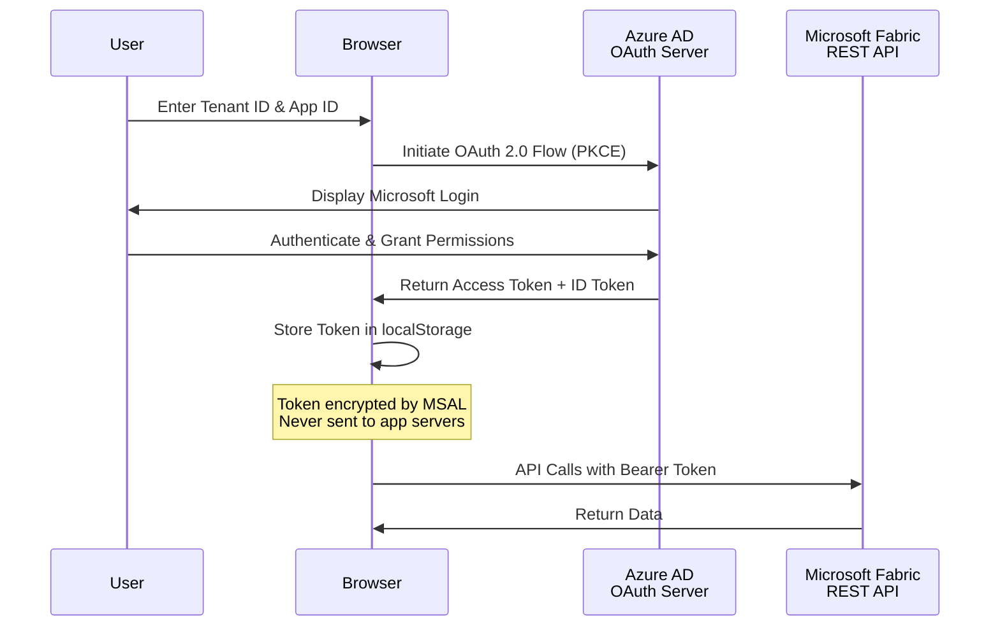
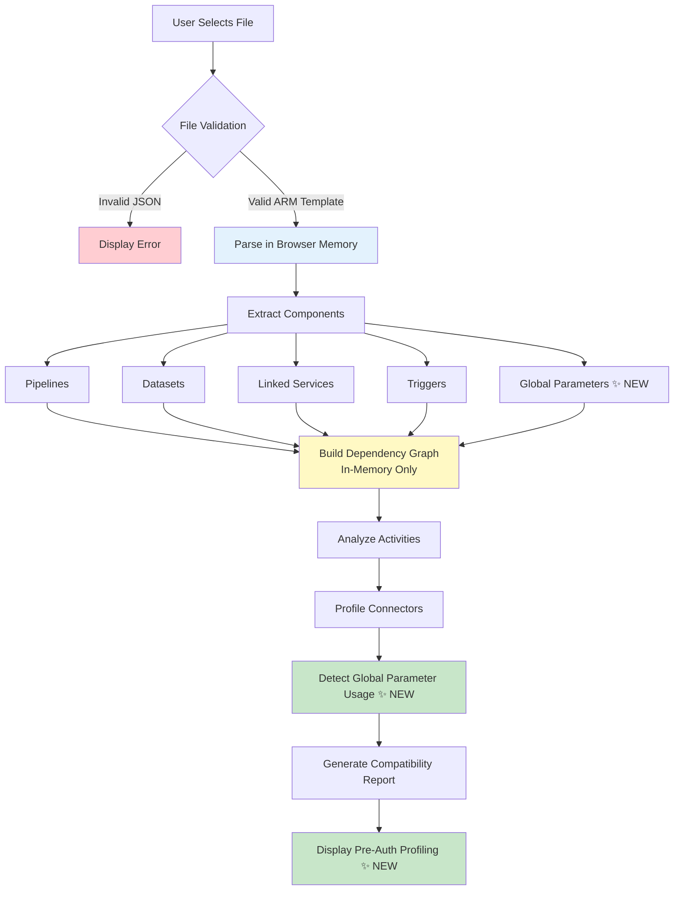
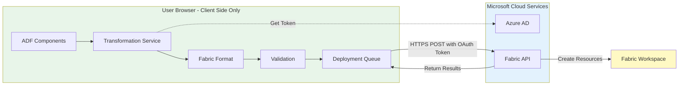
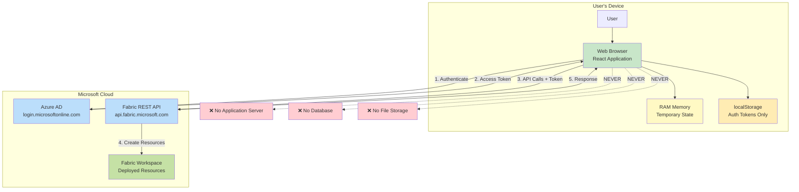

# Data Factory to Microsoft Fabric Migration Assistant

**From Factory to Fabric—Migrate Smarter, Not Harder.**

A comprehensive web application that automates the migration of Azure Data Factory (ADF) and Azure Synapse Analytics pipelines to Microsoft Fabric using a secure, step-by-step wizard interface.

[](https://portal.azure.com/#create/Microsoft.StaticApp)
[](LICENSE)

---

## 📋 Table of Contents

- [Overview](#-overview)
- [Key Features](#-key-features)
- [Quick Start](#-quick-start)
- [Architecture](#-architecture)
- [Data Flow & Privacy](#-data-flow--privacy)
  - [Data Flow Diagrams](#data-flow-diagrams)
  - [Data Types & Retention](#data-types--retention)
  - [Privacy & Security](#privacy--security)
- [Deployment](#-deployment)
- [User Guide](#-user-guide)
- [Connector Mapping](#-connector-mapping)
- [Dataset & Activity Support](#-dataset--activity-support)
- [Synapse Support](#-synapse-support)
- [Development](#-development)
- [Troubleshooting](#-troubleshooting)
- [Contributing](#-contributing)
- [License](#-license)

---

## 🎯 Overview

The **Data Factory to Microsoft Fabric Migration Assistant** is an enterprise-grade web application that automates the migration of Azure Data Factory (ADF) and Azure Synapse Analytics pipelines to Microsoft Fabric Data Pipelines. Built as a single-page application (SPA) running entirely in the browser, it provides a secure, transparent, and guided migration experience with **upload-first profiling** that requires no authentication until you're ready to deploy.

### Why This Tool?

**Challenge**: Migrating from ADF/Synapse to Fabric is complex:
- Different component models (Datasets → embedded sources/sinks)
- Connector mapping inconsistencies
- Managed Identity → Workspace Identity conversion
- No official automated migration path

**Solution**: This tool automates:
- ✅ ARM template parsing and validation
- ✅ Component compatibility analysis
- ✅ Intelligent connector mapping (50+ types)
- ✅ Workspace Identity configuration
- ✅ Folder structure preservation
- ✅ Deployment orchestration with progress tracking

### Key Characteristics

- **Zero Server Infrastructure**: Pure client-side application
- **No Data Persistence**: All processing in browser memory
- **Upload-First Design**: Profile ARM templates before authentication ✨ NEW
- **Direct API Integration**: Browser → Azure AD → Fabric API
- **Enterprise Security**: OAuth 2.0 with Azure AD
- **Open Source**: MIT licensed, fully auditable

---

## ✨ Key Features

### 1. **Upload-First Profiling** ✨ NEW

Experience the migration workflow before committing to authentication:

- **No Login Required**: Upload and analyze ARM templates anonymously
- **Explore Before Committing**: Review component compatibility without credentials
- **Privacy-First**: ARM template never leaves your browser
- **Informed Decisions**: See exactly what will migrate before providing access
- **Comprehensive Analysis**: Get full dependency graphs, compatibility reports, and global parameter detection
- **Zero Risk**: Evaluate the tool's capabilities risk-free

### 2. **Multi-Step Guided Wizard**

```
Upload & Profile → Login → Workspace → Managed Identity → Connections → 
Deploy Connections → Validation → Global Parameters* → Mapping → Deployment → Complete

*Conditional step - only appears if global parameters detected
```

Each step provides clear guidance, validation, and error handling with a total of **11 wizard steps** (Step 7 conditional).

### 3. **Comprehensive Component Analysis**

- **Deep Profiling**: Analyzes pipelines, datasets, linked services, triggers, global parameters
- **Dependency Mapping**: Builds complete dependency graphs
- **Compatibility Validation**: Identifies supported/unsupported components
- **Activity Analysis**: Supports 20+ activity types with full transformation (Copy, Lookup, GetMetadata, Delete, ExecutePipeline, ForEach, IfCondition, Web, Script, Custom, and more)

### 4. **Intelligent Connector Mapping**

Supports 50+ connector types:
- **Databases**: SQL Server, Azure SQL, MySQL, PostgreSQL, Oracle, Cosmos DB, Snowflake
- **Cloud Storage**: Azure Blob, ADLS Gen2, Amazon S3, Google Cloud Storage
- **Data Warehouses**: Synapse Analytics, Databricks, Redshift, BigQuery
- **SaaS Apps**: Salesforce, Dynamics 365, SAP, ServiceNow
- **File Systems**: SFTP, FTP, HTTP, File Share

### 5. **Custom Activity Support** ✨ ENHANCED

Full support for Custom activities with intelligent connection mapping:

- **4-Tier Fallback System**: Automatically resolves connection references from multiple sources
  - ✅ Reference ID-based mappings (primary method from UI)
  - ✅ Activity name-based mappings (backward compatibility)
  - ✅ LinkedService bridge (Configure Connections page)
  - ✅ ConnectionService fallback (deployed connections registry)
  
- **Multiple Reference Locations**: Properly maps `externalReferences.connection` properties
  - Activity-level: `linkedServiceName.referenceName` → `externalReferences.connection`
  - Resource-level: `typeProperties.resourceLinkedService` → `typeProperties.externalReferences.connection`
  - Reference objects: `typeProperties.referenceObjects.linkedServices[]` → preserved in `extendedProperties`

- **Detailed Logging**: Console output with emoji indicators (✓ success, ⚠ warning, ✗ error) for debugging

### 6. **Workspace Identity Management**

- **Automatic Detection**: Identifies Managed Identity usages in ADF
- **Seamless Conversion**: Maps to Fabric Workspace Identity
- **Authentication Methods**: Supports Managed Identity, Service Principal, SQL Auth, Key-based
- **Scope Management**: Handles Azure AD application registrations

### 7. **Folder Structure Preservation**

- Extracts ADF folder hierarchy
- Creates matching folder structure in Fabric
- Maintains organizational logic
- Supports nested folders

### 8. **Global Parameters Migration** ✨ NEW

- **Automatic Detection**: Scans pipelines for `@pipeline().globalParameters.X` expressions using 3 regex patterns
- **Variable Library Creation**: Deploys new Fabric Variable Library with all parameters
- **Expression Transformation**: Converts `@pipeline().globalParameters.X` to `@pipeline().libraryVariables.{LibName}_VariableLibrary_X`
- **libraryVariables Injection**: Adds `libraryVariables` object to every pipeline definition
- **Data Type Mapping**: String, Int, Float, Bool, Array, Object, SecureString
- **Interactive Configuration**: Set values, types, and descriptions before deployment
- **Conditional Workflow**: Step only appears if global parameters detected
- **Deployment Order**: Variable Library deploys BEFORE pipelines for proper resolution
- **Name Collision Detection**: Checks for existing Variable Libraries
- **4-Tier Resolution**: Multiple fallback strategies ensure robust mapping

### 9. **Smart Schedule Configuration** ✨ UPDATED

- **Trigger State Detection**: Automatically detects Started/Stopped status from ADF triggers
- **Visual Schedule Management**: See exactly which pipelines each schedule will activate
- **Flexible Configuration**: Customize frequency, interval, start/end times, and time zones
- **Safety-First Deployment**: All schedules deploy as **disabled by default** for testing
- **Multi-Pipeline Support**: Creates separate schedules when one trigger activates multiple pipelines
- **Full Control**: Review and adjust all schedule settings before deployment
- **Runtime State Awareness**: Clearly indicates if source ADF trigger was running or stopped

### 10. **Deployment Features**

- **Progress Tracking**: Real-time deployment status
- **Error Handling**: Detailed error messages with resolution guidance
- **Rollback Support**: Track and revert deployments
- **Batch Operations**: Deploy multiple components simultaneously
- **Validation**: Pre-deployment compatibility checks

### 11. **Synapse Support**

- Full support for Azure Synapse Analytics pipelines
- Synapse-specific activities (Notebook, Spark Job, SQL Pool)
- Resource type detection (ADF vs. Synapse ARM templates)
- See [SYNAPSE_SUPPORT.md](SYNAPSE_SUPPORT.md) for details

---

## � Feature Highlights

### Migration Capabilities at a Glance

- **50+ Connectors**: Comprehensive connector mapping from ADF/Synapse to Fabric
- **20+ Activities**: Full activity transformation support (Copy, Lookup, Web, Custom, ForEach, etc.)
- **3 Detection Patterns**: Global parameter regex matching (standard, curly-brace, function-wrapped)
- **4 Fallback Tiers**: Custom activity connection resolution with intelligent fallback
- **11 Wizard Steps**: Guided migration experience (with conditional global parameters step)
- **35+ Services**: Modular architecture for maintainability
- **100% Client-Side**: Zero server infrastructure, all processing in browser
- **0 Data Persistence**: Privacy by design, no data stored beyond session

### What's New in Recent Updates

| Feature | Before | After ✨ NEW |
|---------|--------|-------------|
| **Authentication Requirement** | Required upfront | Upload & profile anonymously first |
| **Wizard Steps** | 10 steps (fixed) | 11 steps (conditional global parameters) |
| **Global Parameters** | ❌ Not supported | ✅ Full migration to Variable Libraries |
| **Custom Activities** | ⚠️ Basic support | ✅ 4-tier fallback resolution system |
| **Branding** | "Azure Data Factory" only | "Data Factory" (inclusive of ADF + Synapse) |
| **Initial Profiling** | ❌ After authentication | ✅ Before authentication (upload-first) |
| **Expression Transformation** | ⚠️ Manual | ✅ Automatic with 3-pattern detection |
| **Variable Library** | ❌ Not available | ✅ Auto-created with proper deployment order |
| **Connection Mapping** | ⚠️ 2-tier fallback | ✅ 4-tier intelligent resolution |
| **Parameter Detection** | ⚠️ Basic patterns only | ✅ Detects function-wrapped parameters |

---

## �🚀 Quick Start

### Prerequisites

- **Azure Subscription**: [Create free account](https://azure.microsoft.com/free/)
- **Azure AD Application**: For authentication ([Setup Guide](#azure-ad-setup))
- **Microsoft Fabric Workspace**: With Contributor or Admin access
- **ADF/Synapse ARM Template**: Exported JSON file

### 5-Minute Setup

1. **Deploy the Application** (or run locally):
   
   [](https://portal.azure.com/#create/Microsoft.StaticApp)

2. **Configure Azure AD**:
   ```bash
   # Register app in Azure AD
   # Grant permissions: Connection.ReadWrite.All, Item.ReadWrite.All
   # Set redirect URI to your app URL
   ```

3. **Open the Application** (no login required initially)
   - Upload ARM template for profiling ✨ NEW
   - Review compatibility analysis
   - Explore dependency graph
   - Login only when ready to deploy

4. **Login with Credentials** (after reviewing profile)

5. **Select Fabric Workspace** from the list

6. **Follow the Wizard** through:
   - Managed Identity configuration
   - Connection mapping
   - Component validation
   - Global Parameters (if detected) ✨ NEW
   - Deployment

7. **Complete Migration** and verify in Fabric workspace

### Azure AD Setup

1. Go to [Azure Portal](https://portal.azure.com) → Azure Active Directory → App registrations
2. Click **"New registration"**
3. Configure:
   - **Name**: `Data Factory to Fabric Migration Assistant`
   - **Redirect URI** (SPA): `https://your-app-url` or `http://localhost:5173`
4. Add API Permissions:
   - Power BI Service (Fabric): `Connection.ReadWrite.All`, `Item.ReadWrite.All`, `DataPipeline.ReadWrite.All`
   - Microsoft Graph: `User.Read`
5. Grant admin consent
6. Copy **Application (client) ID** and **Directory (tenant) ID**

---

## 🏗️ Architecture

### Technology Stack

```
Frontend:
├─ React 19.0 (UI framework)
├─ TypeScript 5.7 (Type safety)
├─ Vite 6.3 (Build tool)
└─ Tailwind CSS 4.1 (Styling)

UI Components:
├─ Radix UI (Accessible primitives)
├─ shadcn/ui (Component library)
├─ Lucide React (Icons)
└─ Framer Motion (Animations)

State Management:
├─ React Context API
├─ useReducer hooks
├─ Local browser storage (auth only)
└─ Session-based profiling cache ✨ NEW

Authentication:
├─ @azure/msal-browser
└─ OAuth 2.0 with PKCE

API Integration:
├─ Microsoft Fabric REST API
├─ Azure AD Graph API
└─ Custom rate limiting
```

### Application Structure

```
src/
├── components/
│   ├── pages/               # Wizard steps (11 pages)
│   │   ├── UploadPage.tsx                          # Step 0 ✨ NEW (moved first)
│   │   ├── LoginPage.tsx                           # Step 1
│   │   ├── WorkspacePage.tsx                       # Step 2
│   │   ├── ManagedIdentityPage.tsx                 # Step 3
│   │   ├── LinkedServiceConnectionPage.tsx         # Step 4
│   │   ├── DeployConnectionsPage.tsx               # Step 5
│   │   ├── ValidationPage.tsx                      # Step 6
│   │   ├── GlobalParameterConfigurationPage.tsx    # Step 7 ✨ NEW (conditional)
│   │   ├── MappingPage.tsx                         # Step 8
│   │   ├── DeploymentPage.tsx                      # Step 9
│   │   └── CompletePage.tsx                        # Step 10
│   └── ui/                  # Reusable components
│
├── services/                # Business logic (35+ services)
│   ├── authService.ts
│   ├── adfParserService.ts
│   ├── fabricService.ts
│   ├── connectionService.ts
│   ├── pipelineTransformer.ts                      # Enhanced for global params
│   ├── activityTransformer.ts
│   ├── customActivityTransformer.ts                # Enhanced 4-tier resolution
│   ├── globalParameterDetectionService.ts          # ✨ NEW
│   ├── variableLibraryService.ts                   # ✨ NEW
│   ├── customActivityMappingService.ts             # ✨ NEW
│   ├── managedIdentityService.ts
│   └── ... (25+ more)
│
├── contexts/
│   └── AppContext.tsx       # Global state management
│
├── types/
│   └── index.ts             # TypeScript definitions
│
└── lib/                     # Utilities
```

### Design Principles

- **Zero Backend**: All processing in browser
- **Stateless**: No data persists between sessions (except auth tokens)
- **Direct API**: Browser → Azure AD → Fabric API
- **Modular Services**: Clean separation of concerns
- **Type Safety**: Full TypeScript coverage

---

## 🔒 Data Flow & Privacy

### Data Flow Diagrams

This section provides detailed diagrams showing how data moves through the system for privacy review purposes.

#### 1. User Authentication Flow



**Data Flow Summary**:
- **Input**: Tenant ID, Application ID (user-provided)
- **Processing**: OAuth 2.0 authentication via Azure AD
- **Storage**: Access tokens in browser localStorage (encrypted by MSAL)
- **Transmission**: HTTPS only to Microsoft endpoints
- **Retention**: Until logout or token expiration (~1 hour)

#### 2. ARM Template Processing Flow



**Data Flow Summary**:
- **Input**: ARM template JSON file (from user's device)
- **Processing**: Client-side parsing, extraction, analysis, global parameter detection
- **Storage**: Browser memory only (React state) + session cache for profiling
- **Transmission**: None - file never uploaded to servers
- **Retention**: Until page refresh or navigation (profiling cache until authentication)

#### 3. Component Transformation & Deployment Flow



**Data Flow Summary**:
- **Input**: Parsed ADF components (in-memory)
- **Processing**: Transformation to Fabric format (client-side)
- **Storage**: Browser memory during transformation
- **Transmission**: Transformed definitions sent to Fabric API via HTTPS
- **Retention**: Deployment results in memory until page refresh

#### 4. Complete End-to-End Data Flow



**Key Privacy Points**:
- ✅ **No application servers** - pure client-side processing
- ✅ **No databases** - no persistent storage
- ✅ **No file uploads** - files processed locally
- ✅ **No tracking** - no analytics or telemetry
- ✅ **Direct API calls** - browser communicates directly with Microsoft services

---

### Data Types & Retention

#### Data Types Processed

| Data Type | Source | Purpose | Storage Location | Retention Period | Encryption |
|-----------|--------|---------|------------------|------------------|------------|
| **Tenant ID** | User input | Azure AD authentication | Browser memory (session) | Until logout | HTTPS in transit |
| **Application ID** | User input | OAuth client identification | Browser memory (session) | Until logout | HTTPS in transit |
| **Client Secret** | User input (optional) | Service Principal auth | Browser memory (temporary) | Not stored | HTTPS in transit |
| **Access Token** | Azure AD OAuth | API authorization | Browser localStorage | 1 hour or until logout | Encrypted by MSAL |
| **ID Token** | Azure AD OAuth | User identity claims | Browser memory | Until logout | HTTPS in transit |
| **ARM Template** | User file upload | Migration source | Browser memory (RAM) | Until page refresh | Not applicable (local) |
| **ARM Template Profiling** | Parsed from upload | Pre-auth analysis ✨ NEW | Browser memory + session cache | Until authentication or page refresh | Not applicable (local) |
| **Pipeline Definitions** | Parsed from ARM template | Component metadata | Browser memory (RAM) | Until page refresh | Not applicable (local) |
| **Global Parameter Config** | User input + detection | Variable Library creation ✨ NEW | Browser memory (React state) | Until page refresh | Not applicable (local) |
| **Variable Library Definitions** | Generated from global params | Fabric deployment | Browser memory (temporary) | Not stored (transmitted to Fabric) | HTTPS in transit |
| **Connection Strings** | ARM template or user input | Fabric connection creation | Browser memory (temporary) | Not stored | HTTPS in transit |
| **Connection Credentials** | User input | Authentication details | Browser memory (temporary) | Not stored | HTTPS in transit |
| **Workspace ID** | User selection | Target Fabric workspace | Browser memory | Until navigation | Not applicable (local) |
| **Component Selections** | User input | Migration preferences | Browser memory (React state) | Until page refresh | Not applicable (local) |
| **Deployment Results** | Fabric API response | User feedback | Browser memory (React state) | Until page refresh | Not applicable (local) |

#### Storage Locations

**Browser localStorage**:
- **Contents**: MSAL authentication cache (encrypted)
- **Purpose**: Persist login session across page refreshes
- **Size**: <100 KB
- **Retention**: Until logout or token expiration
- **User Control**: Can clear via logout button or browser settings

**Browser Memory (RAM)**:
- **Contents**: All application state, ARM template data, component metadata
- **Purpose**: Active session data
- **Size**: Variable (depends on ARM template size)
- **Retention**: Until page refresh, tab close, or navigation
- **User Control**: Automatic cleanup when leaving application

**No Server-Side Storage**:
- ❌ No backend database
- ❌ No file storage system
- ❌ No application logs stored
- ❌ No data retention beyond session

#### Retention Policies

| Data Category | Retention Policy | Deletion Method | User Control |
|---------------|------------------|-----------------|--------------|
| **Authentication Tokens** | Until logout or expiration (1 hour) | Automatic expiration + manual logout | Logout button, clear browser data |
| **Session Data** | Until page refresh/navigation | Browser garbage collection | Close tab, refresh page |
| **ARM Template Content** | Until page refresh/navigation | Browser garbage collection | Close tab, refresh page |
| **Connection Credentials** | Not stored (immediate transmission) | Immediate variable cleanup | N/A - not retained |
| **Deployment Results** | Until page refresh/navigation | Browser garbage collection | Close tab, refresh page |

#### Data Lifecycle

```
Upload → Process (RAM) → Transform (RAM) → Transmit (HTTPS) → Clear (on navigation)
         ↓                 ↓                  ↓                   ↓
    Never stored    Never stored    Sent to Fabric API    Garbage collected
```

---

### Privacy & Security

#### Privacy by Design

**Principle 1: Data Minimization**
- Only collects data necessary for migration functionality
- No extraneous user tracking or profiling
- No analytics beyond what's visible in UI

**Principle 2: Purpose Limitation**
- Data used solely for ADF-to-Fabric migration
- No secondary use for marketing, analytics, or other purposes
- Clear purpose stated for each data element

**Principle 3: Storage Limitation**
- No server-side data storage
- Browser storage cleared on logout
- Temporary memory cleared on navigation

**Principle 4: Transparency**
- Open-source codebase (auditable)
- Clear documentation of data flows
- No hidden data collection

**Principle 5: User Control**
- Users control what components to migrate
- Logout button clears all authentication data
- No forced data retention

#### Security Measures

**1. Authentication & Authorization**:
- ✅ Azure AD OAuth 2.0 with PKCE flow
- ✅ Industry-standard authentication
- ✅ Multi-factor authentication support (enforced by Azure AD)
- ✅ Conditional Access Policy support
- ✅ Token encryption via MSAL library

**2. Data Transmission**:
- ✅ HTTPS only (TLS 1.2+)
- ✅ No plaintext transmission
- ✅ Bearer token authentication for all API calls
- ✅ Certificate pinning (browser-enforced)

**3. Input Validation**:
- ✅ JSON schema validation for ARM templates
- ✅ TypeScript type checking
- ✅ Sanitization of user inputs
- ✅ XSS prevention (React auto-escaping)
- ✅ SQL injection prevention (no SQL used client-side)

**4. Browser Security**:
- ✅ Content Security Policy (CSP) headers
- ✅ X-Frame-Options: DENY
- ✅ X-Content-Type-Options: nosniff
- ✅ Referrer-Policy: strict-origin-when-cross-origin

**5. Dependencies**:
- ✅ Regular security audits (`npm audit`)
- ✅ Dependency updates for security patches
- ✅ No known vulnerabilities in production build

#### Data Sharing Practices

**External Services Used**:

1. **Microsoft Azure AD** (`login.microsoftonline.com`)
   - **Purpose**: User authentication
   - **Data Shared**: Tenant ID, Application ID, authentication requests
   - **Data Received**: Access tokens, ID tokens
   - **Privacy Policy**: [Microsoft Privacy Statement](https://privacy.microsoft.com/privacystatement)

2. **Microsoft Fabric API** (`api.fabric.microsoft.com`)
   - **Purpose**: Workspace and pipeline management
   - **Data Shared**: Access tokens, pipeline definitions, connection configurations
   - **Data Received**: Workspace information, deployment status, resource IDs
   - **Privacy Policy**: [Microsoft Privacy Statement](https://privacy.microsoft.com/privacystatement)

**No Third-Party Services**:
- ❌ No Google Analytics or similar
- ❌ No error tracking services (Sentry, etc.)
- ❌ No advertising networks
- ❌ No social media integrations
- ❌ No CDNs for sensitive data
- ❌ No email services

#### Machine Learning / AI Impact

**This application does NOT use machine learning or artificial intelligence:**

- ❌ No ML models for predictions
- ❌ No AI-powered suggestions
- ❌ No automated decision-making beyond rule-based logic
- ❌ No training on user data
- ❌ No neural networks or deep learning
- ❌ No natural language processing
- ❌ No computer vision
- ❌ No sentiment analysis
- ❌ No user profiling or behavioral analysis

**All Logic is Deterministic**:
- ✅ Component mapping uses predefined lookup tables
- ✅ Validation uses explicit compatibility rules
- ✅ Transformation uses template-based conversions
- ✅ 100% rule-based, transparent logic
- ✅ No learning or adaptation based on usage

#### Compliance Considerations

**GDPR (General Data Protection Regulation)**:
- ✅ **Right to Access**: All data visible in UI during session
- ✅ **Right to Erasure**: Logout clears all data
- ✅ **Right to Portability**: ARM templates remain with user
- ✅ **Right to Object**: User can decline to use application
- ✅ **Data Minimization**: Only necessary data collected
- ✅ **Purpose Limitation**: Used only for stated purpose
- ✅ **Storage Limitation**: No long-term storage
- ✅ **Transparency**: Open-source, documented

**CCPA (California Consumer Privacy Act)**:
- ✅ **No Sale of Personal Information**: Not applicable (no collection)
- ✅ **Right to Know**: Documented in this README
- ✅ **Right to Delete**: Logout clears all data
- ✅ **Right to Opt-Out**: No tracking to opt out of

**HIPAA/PHI**:
- ⚠️ **Not HIPAA Compliant**: Do not upload ARM templates containing Protected Health Information (PHI)
- ⚠️ **User Responsibility**: Sanitize ARM templates before upload if they contain sensitive health data

**SOC 2 / ISO 27001**:
- ✅ Application follows security best practices
- ✅ No customer data storage (SaaS compliance N/A)
- ℹ️ Inherits compliance posture of Microsoft Azure AD and Fabric

#### User Rights

**Access to Data**:
- All data processed by the application is visible in the UI
- No hidden data collection
- User can inspect browser localStorage and network requests

**Deletion of Data**:
- **Logout**: Clears all authentication data
- **Browser Settings**: Clear site data removes all localStorage
- **Close Tab**: Clears all session data
- No server-side data to delete

**Export of Data**:
- ARM templates remain in user's possession
- Deployment results can be viewed in Fabric workspace
- No data export needed (no data stored)

**Objection to Processing**:
- User can decline to use the application
- No consequences for non-use
- No data processing without explicit user action

#### Security Best Practices for Users

**For Interactive Login**:
1. ✅ Enable Multi-Factor Authentication (MFA) on Azure AD account
2. ✅ Use Conditional Access Policies to restrict access
3. ✅ Regularly review Azure AD sign-in logs
4. ✅ Use up-to-date browsers with security patches
5. ✅ Logout after completing migration tasks

**For Service Principal Authentication**:
1. ✅ Rotate client secrets regularly (every 90 days)
2. ✅ Use secret expiration dates
3. ✅ Grant minimum required permissions
4. ✅ Monitor service principal usage logs
5. ✅ Store secrets in Azure Key Vault (not in code)

**For ARM Template Uploads**:
1. ✅ Remove sensitive data before upload (connection strings with passwords, API keys)
2. ✅ Use Managed Identity in ADF (automatically handled by app)
3. ✅ Verify file contents before upload
4. ✅ Don't upload production templates on shared computers

**For Fabric Workspace**:
1. ✅ Use separate dev/test/prod workspaces
2. ✅ Limit workspace access to authorized users
3. ✅ Enable audit logging in Fabric
4. ✅ Review deployed items after migration

#### Contact for Privacy Inquiries

- **GitHub Issues**: [Report Privacy Concerns](https://github.com/Mirabile-S/PipelineToFabricUpgrader/issues)
- **Security Policy**: See [SECURITY.md](SECURITY.md)

---

## 📦 Deployment

For detailed deployment instructions, see [DEPLOYMENT.md](DEPLOYMENT.md).

### Quick Deploy to Azure

1. **Click the Deploy Button**:

   [](https://portal.azure.com/#create/Microsoft.StaticApp)

2. **Configure**:
   - Resource Group: Create new or select existing
   - Name: `pipeline-fabric-upgrader`
   - Region: Select closest to you
   - Source: GitHub
   - Repository: `Mirabile-S/PipelineToFabricUpgrader`
   - Branch: `main`

3. **Deploy**: Wait 2-3 minutes for deployment

4. **Get URL**: Navigate to resource → Overview → URL

### Local Development

```bash
# Clone repository
git clone https://github.com/Mirabile-S/PipelineToFabricUpgrader.git
cd PipelineToFabricUpgrader

# Install dependencies
npm install

# Start development server
npm run dev

# Open browser at http://localhost:5173
```

### Cost Estimate

**Azure Static Web Apps - Free Tier**:
- ✅ 100 GB bandwidth/month
- ✅ 0.5 GB storage
- ✅ Automatic HTTPS and SSL
- ✅ Custom domains (2)
- ✅ **Cost: $0/month**

---

## 📖 User Guide

### Step-by-Step Migration Process

#### Step 0: Upload & Profile (No Login Required) ✨ NEW

1. **No Authentication Needed**: Start without providing credentials
2. **Upload ARM Template**:
   - Click "Choose File" or drag-and-drop
   - Select ADF/Synapse ARM template (JSON)
   - Template never leaves your browser
3. **Review Profiling Dashboard**:
   - Component summary (pipelines, datasets, linked services, triggers, global parameters)
   - Dependency graph visualization
   - Global parameter detection and analysis
   - Compatibility analysis (supported vs. unsupported components)
   - Activity type breakdown
4. **Make Informed Decision**: Understand what will migrate before authentication
5. **Proceed to Login**: Click "Continue" when ready to authenticate and deploy

#### Step 1: Login (After Profiling)

1. **Context**: You've already reviewed your ARM template profiling
2. **Choose Authentication Method**:
   - **Interactive Login**: For individual users (recommended)
   - **Service Principal**: For automated/service accounts

2. **Enter Credentials**:
   - Tenant ID
   - Application ID
   - Client Secret (Service Principal only)

3. **Authenticate**: Sign in with Microsoft account

#### Step 2: Select Workspace

1. View list of accessible Fabric workspaces
2. Select target workspace for migration
3. Verify you have Contributor or Admin access

#### Step 3: Configure Managed Identity

1. Review detected Managed Identity usages
2. Application automatically maps to Workspace Identity
3. Review authentication methods:
   - Managed Identity → Workspace Identity
   - Service Principal (requires secret)
   - SQL Authentication (username/password)
   - Key-based authentication

#### Step 4: Map Connections

1. Review connection mapping table
2. For each ADF Linked Service:
   - Auto-detected Fabric connection type
   - Configure credentials (passwords, keys, etc.)
   - Select gateway (if on-premises/VNet)
   - Set privacy level
3. Option to reuse existing Fabric connections

#### Step 5: Deploy Connections

1. Review deployment plan
2. Click "Deploy Connections"
3. Monitor progress:
   - Connection creation status
   - Gateway configuration
   - Error handling
4. Review deployment summary

#### Step 6: Validate Components

1. Review validation results:
   - ✅ Supported (can migrate automatically)
   - ⚠️ Warnings (may need manual review)
   - ❌ Unsupported (requires alternative approach)
2. Select components to migrate:
   - Individual selection
   - Bulk selection by type
   - Filter and search
3. Review dependency graph

#### Step 7: Configure Global Parameters (Conditional) ✨ NEW

*This step only appears if global parameters are detected in your pipelines*

1. **Review Detected Parameters**:
   - View all global parameters found in pipeline expressions
   - See which pipelines reference each parameter
   - Auto-detected ADF data types

2. **Configure Variable Library**:
   - Set library name (default: `{FactoryName}_GlobalParameters`)
   - Add optional description
   - Review variable naming (prefixed with `VariableLibrary_`)

3. **Set Variable Values**:
   - Configure data types (String, Integer, Number, Boolean)
   - Enter default values for each variable
   - Add optional notes/descriptions
   - Handle SecureString types (requires actual value, not placeholder)

4. **Deploy Variable Library**:
   - Click "Deploy Variable Library"
   - Library is created in Fabric workspace
   - Must complete before pipeline deployment
   - Option to skip (pipelines won't reference global parameters)

5. **What Happens**:
   - Expressions like `@pipeline().globalParameters.MyParam` are transformed to `@pipeline().libraryVariables.VariableLibrary_MyParam`
   - `libraryVariables` section is injected into each pipeline
   - Variable Library is deployed **before** pipelines

#### Step 8: Map to Fabric

1. Review component mappings:
   - ADF component → Fabric item type
   - Folder assignments
   - Naming conventions
2. Customize mappings if needed:
   - Change item types
   - Adjust names
   - Reorganize folders

#### Step 9: Deploy to Fabric

1. Review deployment summary
2. Click "Start Deployment"
3. Monitor progress:
   - Folder creation
   - Variable library creation
   - Pipeline deployment
   - Schedule configuration
4. Review results:
   - Success count
   - Errors (with details)
   - Rollback option

#### Step 10: Complete

1. View migration summary
2. Options:
   - **Rollback**: Undo deployment
   - **Export Report**: Download deployment log
   - **Start New Migration**: Reset wizard
3. Navigate to Fabric workspace to verify

---

## � Migration Examples

### Global Parameters Transformation Example

This example shows how global parameters are automatically detected and transformed to Variable Libraries.

**Before: ADF Pipeline with Global Parameters**

```json
{
  "name": "CopyDataPipeline",
  "properties": {
    "activities": [
      {
        "name": "CopyData",
        "type": "Copy",
        "typeProperties": {
          "source": {
            "type": "AzureSqlSource",
            "sqlReaderQuery": "SELECT * FROM @{pipeline().globalParameters.TableName} WHERE Date > '@{pipeline().globalParameters.StartDate}'"
          }
        }
      },
      {
        "name": "LogExecution",
        "type": "Web",
        "typeProperties": {
          "url": "@{pipeline().globalParameters.LogEndpoint}",
          "method": "POST",
          "body": {
            "environment": "@{pipeline().globalParameters.Environment}",
            "maxRetries": "@{pipeline().globalParameters.MaxRetries}"
          }
        }
      }
    ]
  }
}
```

**Global Parameters in ADF Factory**:
```json
{
  "globalParameters": {
    "TableName": {
      "type": "String",
      "value": "dbo.Customers"
    },
    "StartDate": {
      "type": "String",
      "value": "2024-01-01"
    },
    "LogEndpoint": {
      "type": "String",
      "value": "https://api.example.com/log"
    },
    "Environment": {
      "type": "String",
      "value": "Production"
    },
    "MaxRetries": {
      "type": "Int",
      "value": 3
    }
  }
}
```

**After: Fabric Pipeline with Variable Library**

```json
{
  "name": "CopyDataPipeline",
  "properties": {
    "libraryVariables": {
      "MyFactory_VariableLibrary_TableName": {
        "type": "String",
        "value": "dbo.Customers",
        "variableLibrary": "MyFactory_GlobalParameters_VariableLibrary"
      },
      "MyFactory_VariableLibrary_StartDate": {
        "type": "String",
        "value": "2024-01-01",
        "variableLibrary": "MyFactory_GlobalParameters_VariableLibrary"
      },
      "MyFactory_VariableLibrary_LogEndpoint": {
        "type": "String",
        "value": "https://api.example.com/log",
        "variableLibrary": "MyFactory_GlobalParameters_VariableLibrary"
      },
      "MyFactory_VariableLibrary_Environment": {
        "type": "String",
        "value": "Production",
        "variableLibrary": "MyFactory_GlobalParameters_VariableLibrary"
      },
      "MyFactory_VariableLibrary_MaxRetries": {
        "type": "Int",
        "value": 3,
        "variableLibrary": "MyFactory_GlobalParameters_VariableLibrary"
      }
    },
    "activities": [
      {
        "name": "CopyData",
        "type": "Copy",
        "typeProperties": {
          "source": {
            "type": "AzureSqlSource",
            "sqlReaderQuery": "SELECT * FROM @{pipeline().libraryVariables.MyFactory_VariableLibrary_TableName} WHERE Date > '@{pipeline().libraryVariables.MyFactory_VariableLibrary_StartDate}'"
          }
        }
      },
      {
        "name": "LogExecution",
        "type": "Web",
        "typeProperties": {
          "url": "@{pipeline().libraryVariables.MyFactory_VariableLibrary_LogEndpoint}",
          "method": "POST",
          "body": {
            "environment": "@{pipeline().libraryVariables.MyFactory_VariableLibrary_Environment}",
            "maxRetries": "@{pipeline().libraryVariables.MyFactory_VariableLibrary_MaxRetries}"
          }
        }
      }
    ]
  }
}
```

**What Happened**:
1. ✅ **Detected**: 5 global parameters found using 3 regex patterns (including function-wrapped)
2. ✅ **Variable Library Created**: `MyFactory_GlobalParameters_VariableLibrary` deployed to Fabric
3. ✅ **Expressions Transformed**: All `@pipeline().globalParameters.X` → `@pipeline().libraryVariables.MyFactory_VariableLibrary_X`
4. ✅ **libraryVariables Injected**: Each pipeline now references the Variable Library
5. ✅ **Types Mapped**: Int → Int, String → String, Bool → Bool, etc.
6. ✅ **Deployment Order**: Variable Library deployed BEFORE pipelines

---

## �🔗 Connector Mapping

For detailed connector mapping information, see [CONNECTOR_MAPPING.md](CONNECTOR_MAPPING.md).

### Supported Connectors (50+)

| ADF Connector | Fabric Connection | Gateway Required |
|---------------|-------------------|------------------|
| Azure SQL Database | AzureSqlDatabase | No |
| SQL Server | SqlServer | Yes (on-premises) |
| Azure Blob Storage | AzureBlobStorage | No |
| Azure Data Lake Storage Gen2 | AzureDataLakeStorageGen2 | No |
| Oracle | Oracle | Yes |
| MySQL | MySql | Depends |
| PostgreSQL | PostgreSql | Depends |
| Snowflake | Snowflake | No |
| Databricks | Databricks | No |
| Salesforce | Salesforce | No |
| Dynamics 365 | Dynamics365 | No |
| REST API | RestService | No |
| HTTP | HttpSource | No |
| SFTP | Sftp | Depends |
| **...and 35+ more** | | |

---

## � Dataset & Activity Support

### Dataset Handling

#### How Datasets Are Transformed

In **ADF/Synapse**, datasets are separate reusable components that define data structures and connection details. In **Microsoft Fabric**, datasets are embedded directly within activities as `datasetSettings`.

**Transformation Process:**

1. **Dataset Extraction**: The application parses dataset definitions from ARM templates
2. **Parameter Substitution**: Dataset parameters are resolved at transformation time
3. **Embedding**: Dataset configurations are embedded into activity definitions
4. **Connection Mapping**: LinkedService references are converted to Fabric connection IDs

**Example Transformation:**

```json
// ADF: Separate Dataset + Activity Reference
{
  "dataset": {
    "name": "SourceDataset",
    "properties": {
      "type": "DelimitedText",
      "linkedServiceName": { "referenceName": "AzureBlobStorage" },
      "typeProperties": {
        "location": {
          "folderPath": "@dataset().FolderPath",
          "fileName": "data.csv"
        }
      },
      "parameters": {
        "FolderPath": { "type": "string" }
      }
    }
  },
  "activity": {
    "type": "Copy",
    "inputs": [{
      "referenceName": "SourceDataset",
      "parameters": { "FolderPath": "@pipeline().parameters.SourceFolder" }
    }]
  }
}

// Fabric: Embedded Dataset Settings
{
  "activity": {
    "type": "Copy",
    "typeProperties": {
      "source": {
        "type": "DelimitedTextSource",
        "datasetSettings": {
          "type": "DelimitedText",
          "typeProperties": {
            "location": {
              "folderPath": "@pipeline().parameters.SourceFolder",
              "fileName": "data.csv"
            }
          },
          "externalReferences": {
            "connection": "<fabric-connection-id>"
          }
        }
      }
    }
  }
}
```

#### Dataset Parameters

**Important**: Dataset parameters are **NOT** promoted to pipeline-level parameters. This is by design because:

- ✅ **Dynamic Values**: Parameters can reference pipeline parameters, variables, or activity outputs
- ✅ **Runtime Binding**: Values are resolved during pipeline execution, not at deployment
- ✅ **Expression Support**: Supports complex expressions like `@activity('Lookup1').output.value`

**During transformation**, the application:
1. Extracts parameter values from activity inputs/outputs
2. Substitutes parameter references (e.g., `@dataset().FolderPath`) with actual values
3. Embeds the resolved configuration into `datasetSettings`

**Supported Parameter References:**
- `@dataset().parameterName` - Direct parameter reference
- `@{dataset().parameterName}` - Expression-wrapped parameter
- `@pipeline().parameters.X` - Pipeline parameter reference
- `@activity('X').output.Y` - Activity output reference
- `@variables('X')` - Pipeline variable reference

---

### Supported Activities

The application supports all common ADF/Synapse activities with dataset references and connection mappings.

#### ✅ Fully Supported Activities

| Activity Type | Dataset Support | Connection Mapping | Transformation | Notes |
|---------------|----------------|-------------------|----------------|-------|
| **Copy** | ✅ Source + Sink | ✅ Automatic | ✅ Full | Comprehensive transformation with datasetSettings embedding |
| **Lookup** | ✅ Single dataset | ✅ Automatic | ✅ Full | Dataset embedded in typeProperties |
| **GetMetadata** | ✅ Single dataset | ✅ Automatic | ✅ Full | Field list and dataset settings preserved |
| **Delete** | ✅ Single dataset | ✅ Automatic | ✅ Full | Wildcard and recursive options supported |
| **ExecutePipeline** | ❌ N/A | ❌ N/A | ✅ Full | Pipeline references and parameter passing |
| **ForEach** | ❌ N/A | ❌ N/A | ✅ Full | Nested activities transformed recursively |
| **IfCondition** | ❌ N/A | ❌ N/A | ✅ Full | True/false branch activities transformed |
| **Until** | ❌ N/A | ❌ N/A | ✅ Full | Loop activities transformed recursively |
| **Wait** | ❌ N/A | ❌ N/A | ✅ Full | Simple wait duration |
| **SetVariable** | ❌ N/A | ❌ N/A | ✅ Full | Variable assignment |
| **AppendVariable** | ❌ N/A | ❌ N/A | ✅ Full | Array variable append |
| **Filter** | ❌ N/A | ❌ N/A | ✅ Full | Array filtering |
| **Switch** | ❌ N/A | ❌ N/A | ✅ Full | Multi-branch conditional |
| **Web** | ❌ N/A | ⚠️ Optional | ✅ Full | HTTP requests, optional LinkedService for authentication |
| **WebHook** | ❌ N/A | ⚠️ Optional | ✅ Full | Callback-based HTTP integration |
| **Custom** | ❌ N/A | ✅ Advanced | ✅ Full | 4-tier connection resolution (see Custom Activity Support) |
| **SqlServerStoredProcedure** | ❌ N/A | ✅ Automatic | ✅ Full | Activity-level LinkedService reference |
| **Script** | ❌ N/A | ✅ Automatic | ✅ Full | SQL/PowerShell script execution |
| **Databricks Notebook** | ❌ N/A | ✅ Automatic | ✅ Full | Notebook path and parameters |
| **Databricks Jar** | ❌ N/A | ✅ Automatic | ✅ Full | Jar activity parameters |
| **Databricks Python** | ❌ N/A | ✅ Automatic | ✅ Full | Python file execution |
| **HDInsight** | ❌ N/A | ✅ Automatic | ✅ Full | Hive, Pig, MapReduce, Spark, Streaming |
| **Azure Function** | ❌ N/A | ⚠️ Optional | ✅ Full | Function invocation with parameters |
| **Azure ML** | ❌ N/A | ✅ Automatic | ✅ Full | Batch execution and update resource |

#### ⚠️ Partial Support

| Activity Type | Status | Limitation | Workaround |
|---------------|--------|------------|------------|
| **Synapse Notebook** | ⚠️ Partial | Notebook must be manually migrated | Deploy notebooks to Fabric separately, update references |
| **Synapse Spark Job** | ⚠️ Partial | Spark job definition not auto-migrated | Recreate Spark jobs in Fabric, update activity |
| **SQL Pool Stored Procedure** | ⚠️ Partial | SQL Pool not available in Fabric | Migrate to Synapse SQL endpoint or Lakehouse |

#### ❌ Not Supported in Fabric

| Activity Type | ADF/Synapse | Fabric | Alternative |
|---------------|-------------|--------|-------------|
| **Validation** | ✅ Exists | ❌ Not available | Use GetMetadata + IfCondition to check file existence |
| **Data Flow** | ✅ Mapping Data Flows | ❌ Not supported | Use Dataflow Gen2 (requires manual recreation) |

---

### Activity-Dataset Relationships

#### Activities That Use Datasets

The following activities reference datasets and have their LinkedService connections automatically mapped:

**Copy Activity** (2 datasets):
- Source dataset via `inputs[0]`
- Sink dataset via `outputs[0]`

**Lookup Activity** (1 dataset):
- Dataset via `typeProperties.dataset.referenceName`

**GetMetadata Activity** (1 dataset):
- Dataset via `typeProperties.dataset.referenceName`

**Delete Activity** (1 dataset):
- Dataset via `typeProperties.dataset.referenceName`

#### Activities with Direct LinkedService References

These activities reference LinkedServices directly (not through datasets):

- **SqlServerStoredProcedure**: `activity.linkedServiceName`
- **Script**: `activity.linkedServiceName`
- **Web/WebHook**: `activity.linkedServiceName` (optional)
- **Custom**: Multiple locations (see Custom Activity Support section)
- **Databricks**: `activity.linkedServiceName`
- **HDInsight**: `activity.linkedServiceName`
- **Azure Function**: `activity.linkedServiceName`

#### Control Flow Activities (No Connections)

These activities don't reference datasets or connections:
- ForEach, IfCondition, Until, Switch, Wait
- SetVariable, AppendVariable, Filter
- ExecutePipeline (references other pipelines)

---

### Migration Best Practices

#### For Activities with Datasets

1. **Review Dataset Parameters**: Ensure parameter expressions are valid in Fabric
2. **Check Connection Mappings**: Verify all datasets' LinkedServices are mapped in Step 5
3. **Test with Sample Data**: Deploy to dev workspace first
4. **Validate Schema**: Ensure source/sink schemas are compatible

#### For Activities without Dataset Support in Fabric

**Validation Activity** → **GetMetadata + IfCondition**:
```json
// Before (ADF):
{
  "type": "Validation",
  "typeProperties": {
    "dataset": { "referenceName": "CheckFile" },
    "timeout": "0.00:05:00"
  }
}

// After (Fabric):
{
  "type": "GetMetadata",
  "name": "CheckFileExists",
  "typeProperties": {
    "datasetSettings": { /* embedded dataset */ },
    "fieldList": ["exists"]
  }
},
{
  "type": "IfCondition",
  "name": "ValidateFileExists",
  "dependsOn": [{ "activity": "CheckFileExists" }],
  "typeProperties": {
    "expression": {
      "value": "@activity('CheckFileExists').output.exists",
      "type": "Expression"
    },
    "ifFalseActivities": [
      {
        "type": "Fail",
        "name": "FileNotFound",
        "typeProperties": {
          "message": "Required file does not exist"
        }
      }
    ]
  }
}
```

---

### Troubleshooting Dataset Issues

#### Dataset Not Found

**Symptom**: Error during transformation: "Dataset 'XYZ' not found"

**Causes**:
- Dataset not included in ARM template export
- Dataset name mismatch (case-sensitive)
- Dataset defined in different data factory

**Solution**:
- Re-export ARM template with all dependencies
- Verify dataset names in uploaded template
- Use "Select all" when exporting from ADF

#### Connection Mapping Missing

**Symptom**: Activity deployed without `externalReferences.connection`

**Causes**:
- LinkedService not mapped in Step 5 (Configure Connections)
- Dataset references LinkedService not in template
- Connection deployment failed

**Solution**:
- Check Step 5 mapping table for missing LinkedServices
- Verify all LinkedServices exported in ARM template
- Review Step 6 deployment logs for connection errors

#### Parameter Substitution Failed

**Symptom**: Dataset parameter appears as literal `@dataset().paramName` in deployed pipeline

**Causes**:
- Parameter not passed from activity to dataset
- Invalid parameter expression syntax
- Circular parameter reference

**Solution**:
- Verify activity passes parameter: `"parameters": { "paramName": "value" }`
- Check ADF expression syntax is valid
- Ensure parameters don't reference themselves

---

## �🔄 Synapse Support

For detailed Synapse support information, see [SYNAPSE_SUPPORT.md](SYNAPSE_SUPPORT.md).

### Key Features

- **Full Pipeline Support**: Synapse pipelines migrate just like ADF pipelines
- **Synapse Activities**: Notebook, Spark Job, SQL Pool activities
- **Resource Detection**: Automatic detection of Synapse vs. ADF ARM templates
- **Linked Services**: Support for Synapse-specific linked service types

### What's Different

| Feature | ADF | Synapse | Support |
|---------|-----|---------|---------|
| Standard Pipelines | ✅ | ✅ | ✅ Fully supported |
| Notebook Activity | ❌ | ✅ | ⚠️ Partial (manual notebook migration) |
| Spark Job Activity | ❌ | ✅ | ⚠️ Partial (manual job migration) |
| SQL Pool Activity | ❌ | ✅ | ⚠️ Partial (manual SP migration) |
| Data Flows | ✅ | ✅ | ❌ Not supported in Fabric |

---

## 🛠️ Development

### Local Setup

```bash
# Clone repository
git clone https://github.com/Mirabile-S/PipelineToFabricUpgrader.git
cd PipelineToFabricUpgrader

# Install dependencies
npm install

# Start development server
npm run dev
```

### Project Structure

```
src/
├── components/          # React components
│   ├── pages/          # Wizard step pages
│   └── ui/             # Reusable UI components
├── services/           # Business logic (35+ services)
│   ├── authService.ts
│   ├── adfParserService.ts
│   ├── fabricService.ts
│   └── ...
├── contexts/           # React Context providers
│   └── AppContext.tsx
├── types/              # TypeScript definitions
├── lib/                # Utility functions
└── hooks/              # Custom React hooks
```

### Key Services

- **`authService.ts`**: Azure AD OAuth 2.0 authentication
- **`adfParserService.ts`**: ARM template parsing and validation
- **`fabricService.ts`**: Fabric API orchestration
- **`connectionService.ts`**: Connection mapping and deployment
- **`pipelineTransformer.ts`**: Pipeline transformation logic
- **`activityTransformer.ts`**: Activity-specific transformations
- **`managedIdentityService.ts`**: Workspace Identity mapping

### Build Commands

```bash
# Development
npm run dev          # Start dev server

# Production
npm run build        # Build for production
npm run preview      # Preview production build

# Quality
npm run lint         # Lint code
npm test             # Run tests
npm run test:ui      # Run tests with UI
npm run test:coverage # Generate coverage report
```

### Adding a New Connector

1. Update `connectorMappingService.ts`:
   ```typescript
   {
     adfType: 'MyNewConnector',
     fabricType: 'MyFabricConnector',
     authMethods: ['Basic', 'OAuth2'],
     requiresGateway: false
   }
   ```

2. Add transformation logic in `connectionService.ts`

3. Update validation rules if needed

4. Test with sample ARM template

---

## 🐛 Troubleshooting

### Common Issues

#### Authentication Fails

**Symptoms**: "Failed to authenticate" or "Invalid token"

**Solutions**:
- ✅ Verify Tenant ID and Application ID are correct
- ✅ Check Azure AD app has required API permissions
- ✅ Ensure permissions have admin consent granted
- ✅ Verify redirect URI matches your app URL exactly
- ✅ Try clearing browser cache and localStorage

#### Upload Fails

**Symptoms**: "Invalid JSON" or "Failed to parse ARM template"

**Solutions**:
- ✅ Verify file is valid JSON (use JSON validator)
- ✅ Ensure it's an ADF/Synapse ARM template (not other resource type)
- ✅ Check file size (<10 MB recommended)
- ✅ Verify file encoding is UTF-8

#### Connection Deployment Fails

**Symptoms**: "Failed to create connection"

**Solutions**:
- ✅ Verify you have Contributor or Admin role in Fabric workspace
- ✅ Check credentials (passwords, connection strings) are correct
- ✅ Ensure gateway is configured (if required)
- ✅ Verify connector type is supported in your Fabric region
- ✅ Check Fabric service status

#### Pipeline Deployment Fails

**Symptoms**: "Failed to deploy pipeline"

**Solutions**:
- ✅ Ensure all connections are deployed successfully first
- ✅ Verify activities are supported (see [Dataset & Activity Support](#-dataset--activity-support))
- ✅ Check parameter names are valid (alphanumeric + underscore)
- ✅ Review error message for specific validation issues

#### Custom Activity Connection Issues

**Symptoms**: Custom activities deployed without connection references

**Problem**: Missing `externalReferences.connection` in deployed pipeline JSON, activities fail to access external resources

**Solutions**:

The application uses a 4-tier fallback system to resolve connections. Check browser console for mapping logs:

```
✓ Custom activity [P1-NEW] activity-level connection found via referenceMappings
✓ Custom activity [P2-OLD] resource connection found via customActivityReferences
✓ Custom activity [P3-BRIDGE] connection found via linkedServiceBridge
⚠ Custom activity [P4-FALLBACK] using connection service fallback
✗ No connection mapping found for Custom activity LinkedService
```

**Debugging Steps**:
1. ✅ Verify connections configured in "Configure Connections" page (step 5)
2. ✅ Check "Map Components" page shows all custom activities with dropdowns (step 8)
3. ✅ Review browser console (F12) for detailed connection resolution logs
4. ✅ Ensure connection IDs match between Configure Connections and Map Components
5. ✅ Verify LinkedService names in ADF template match dropdown options

**Technical Details**: Custom activities have 3 LinkedService reference locations:
- **Activity-level**: `linkedServiceName.referenceName` → `externalReferences.connection`
- **Resource-level**: `typeProperties.resourceLinkedService` → `typeProperties.externalReferences.connection`
- **Reference objects**: `typeProperties.referenceObjects.linkedServices[]` → preserved in `extendedProperties`

Each location must be mapped to a Fabric connection ID. The transformer attempts multiple mapping strategies automatically with fallback priorities.

#### Global Parameters Not Detected ✨ NEW

**Symptoms**: Step 7 (Global Parameters) doesn't appear, but your ARM template has global parameters

**Solutions**:
- ✅ Verify global parameters are **referenced** in pipeline activities (not just defined in factory)
- ✅ Check expression syntax: `@pipeline().globalParameters.X` or `@{pipeline().globalParameters.X}`
- ✅ Parameters wrapped in functions are also detected: `@string(pipeline().globalParameters.X)`
- ✅ Reload page and re-upload ARM template
- ✅ Check browser console for detection logs: `[GlobalParameterDetection] Found X parameters`

**Technical Details**: The tool uses 3 regex patterns to detect global parameters:
1. **Primary**: `@pipeline\(\)\.globalParameters\.(\w+)` - Standard format
2. **Alternative**: `@\{pipeline\(\)\.globalParameters\.(\w+)\}` - Curly brace format
3. **Nested**: `pipeline\(\)\.globalParameters\.(\w+)` - Function-wrapped (no @ prefix)

#### Variable Library Deployment Fails ✨ NEW

**Symptoms**: Error creating Variable Library in Fabric workspace

**Solutions**:
- ✅ Verify unique library name (no existing library with same name in workspace)
- ✅ Check Contributor/Admin permissions in Fabric workspace
- ✅ Ensure all **SecureString** variables have actual values (not placeholder text)
- ✅ Verify data types match expected values (Int must be numeric, Bool must be true/false)
- ✅ Check browser console for detailed error messages
- ✅ Review Variable Library name doesn't contain special characters (use alphanumeric + underscore)
- ✅ Ensure workspace has capacity assigned (Premium/Fabric capacity required)

**Common Errors**:
```
❌ "Conflict: Variable Library already exists"
   → Change library name in Step 7 configuration

❌ "Invalid variable definition"
   → Check data types match values (Int/Float must be numbers, Bool must be true/false)

❌ "SecureString value required"
   → SecureString variables must have actual values, cannot be empty or placeholder

❌ "Insufficient permissions"
   → Verify Contributor or Admin role in Fabric workspace
```

**Validation Checklist**:
- [ ] Library name is unique in workspace
- [ ] All variables have values (no empty fields)
- [ ] Data types match values (String for text, Int for integers, Bool for true/false)
- [ ] SecureString variables have actual secrets (not placeholders)
- [ ] Workspace has Fabric/Premium capacity assigned
- [ ] User has Contributor or Admin role

#### Pipeline Deployment Missing Global Parameters ✨ NEW

**Symptoms**: Pipelines deployed successfully but still reference `@pipeline().globalParameters` instead of `@pipeline().libraryVariables`

**Solutions**:
- ✅ Ensure Variable Library was deployed **before** pipelines (in Step 7)
- ✅ Check Variable Library deployment shows "Success" status
- ✅ Verify Variable Library exists in Fabric workspace before deploying pipelines
- ✅ Review browser console for transformation logs: `[FabricService] Applying global parameter transformations`
- ✅ If Variable Library deployment was skipped, pipelines won't be transformed

**Technical Details**: 
- Variable Library **must** be deployed before pipelines for transformations to apply
- Transformation happens during pipeline deployment, not Variable Library deployment
- Each pipeline gets `libraryVariables` object injected with references to Variable Library
- All expressions are transformed: `@pipeline().globalParameters.X` → `@pipeline().libraryVariables.{LibName}_VariableLibrary_X`

### Debug Mode

Enable verbose logging:

```javascript
// In browser console
localStorage.setItem('debug', 'true');
// Reload page

// Disable debug mode
localStorage.removeItem('debug');
```

### Getting Help

- **Issues**: [GitHub Issues](https://github.com/Mirabile-S/PipelineToFabricUpgrader/issues)
- **Discussions**: [GitHub Discussions](https://github.com/Mirabile-S/PipelineToFabricUpgrader/discussions)
- **Documentation**: This README and linked documents

---

## 🤝 Contributing

Contributions are welcome! Please follow these guidelines:

### How to Contribute

1. **Fork** the repository
2. **Create** a feature branch: `git checkout -b feature/amazing-feature`
3. **Commit** your changes: `git commit -m 'Add amazing feature'`
4. **Push** to the branch: `git push origin feature/amazing-feature`
5. **Open** a Pull Request

### Development Guidelines

- **TypeScript**: Use strict typing, avoid `any`
- **React**: Functional components with hooks only
- **Testing**: Add tests for new features
- **Formatting**: Run `npm run lint` before committing
- **Commits**: Use conventional commit messages

### Code Review

Pull requests will be reviewed for:
- Code quality and style
- Test coverage
- Documentation updates
- Backward compatibility
- Security implications

---

## 📄 License

This project is licensed under the MIT License - see the [LICENSE](LICENSE) file for details.

### MIT License Summary

✅ **Permissions**: Commercial use, Modification, Distribution, Private use

❌ **Limitations**: No liability, No warranty

📋 **Conditions**: License and copyright notice must be included

---

## 🙏 Acknowledgments

- **Microsoft**: For Azure Data Factory, Microsoft Fabric, and Azure AD
- **shadcn/ui**: For beautiful accessible UI components
- **Radix UI**: For unstyled accessible primitives
- **Tailwind CSS**: For utility-first CSS framework
- **React Team**: For the amazing React library
- **Vite Team**: For the blazing-fast build tool
- **Community**: For feedback, bug reports, and contributions

---

## 📞 Support & Contact

- **Issues**: [GitHub Issues](https://github.com/Mirabile-S/PipelineToFabricUpgrader/issues)
- **Discussions**: [GitHub Discussions](https://github.com/Mirabile-S/PipelineToFabricUpgrader/discussions)
- **Security**: See [SECURITY.md](SECURITY.md)
- **Documentation**: This README and linked documents

---

## 🗺️ Roadmap

### Planned Features

- [ ] Export/Import migration configurations
- [ ] Batch migration across multiple workspaces
- [ ] Incremental sync (ADF → Fabric)
- [ ] Fabric Dataflow Gen2 support
- [ ] Cost estimation before migration
- [ ] Migration testing and validation
- [ ] Terraform export for deployed resources

### Recent Updates

- ✅ **Upload-First Profiling**: Profile ARM templates before authentication (November 2025)
- ✅ **Global Parameters Migration**: Full Variable Library integration (November 2025)
- ✅ **Custom Activity Enhancement**: 4-tier connection resolution (November 2025)
- ✅ **Inclusive Branding**: "Data Factory" for both ADF and Synapse (November 2025)
- ✅ Synapse pipeline support
- ✅ Workspace Identity migration
- ✅ Folder structure preservation
- ✅ Enhanced connection mapping
- ✅ Deployment progress tracking
- ✅ Rollback functionality

---

**Built with ❤️ for the Azure and Microsoft Fabric community**

*Last Updated: November 6, 2025*
