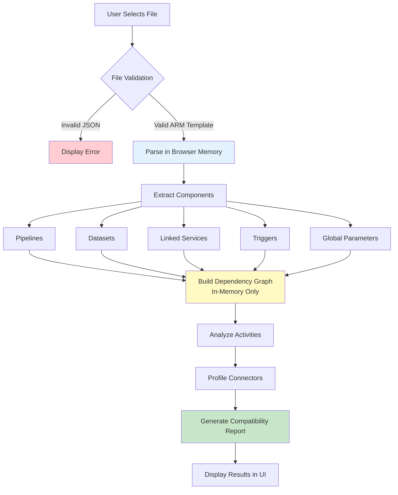

# Azure Data Factory to Microsoft Fabric Migration Assistant

A comprehensive web application that automates the migration of Azure Data Factory (ADF) and Azure Synapse pipelines to Microsoft Fabric using a secure, step-by-step wizard interface.

[](https://portal.azure.com/#create/Microsoft.StaticApp)
[](LICENSE)

---

## 📋 Table of Contents

- [Overview](#-overview)
- [Key Features](#-key-features)
- [Quick Start](#-quick-start)
- [Architecture](#-architecture)
- [Data Flow & Privacy](#-data-flow--privacy)
  - [Data Flow Diagrams](#data-flow-diagrams)
  - [Data Types & Retention](#data-types--retention)
  - [Privacy & Security](#privacy--security)
- [Deployment](#-deployment)
- [User Guide](#-user-guide)
- [Connector Mapping](#-connector-mapping)
- [Synapse Support](#-synapse-support)
- [Development](#-development)
- [Troubleshooting](#-troubleshooting)
- [Contributing](#-contributing)
- [License](#-license)

---

## 🎯 Overview

The **Pipeline to Fabric Upgrader** is an enterprise-grade web application that automates the migration of Azure Data Factory (ADF) and Azure Synapse Analytics pipelines to Microsoft Fabric Data Pipelines. Built as a single-page application (SPA) running entirely in the browser, it provides a secure, transparent, and guided migration experience.

### Why This Tool?

**Challenge**: Migrating from ADF/Synapse to Fabric is complex:
- Different component models (Datasets → embedded sources/sinks)
- Connector mapping inconsistencies
- Managed Identity → Workspace Identity conversion
- No official automated migration path

**Solution**: This tool automates:
- ✅ ARM template parsing and validation
- ✅ Component compatibility analysis
- ✅ Intelligent connector mapping (50+ types)
- ✅ Workspace Identity configuration
- ✅ Folder structure preservation
- ✅ Deployment orchestration with progress tracking

### Key Characteristics

- **Zero Server Infrastructure**: Pure client-side application
- **No Data Persistence**: All processing in browser memory
- **Direct API Integration**: Browser → Azure AD → Fabric API
- **Enterprise Security**: OAuth 2.0 with Azure AD
- **Open Source**: MIT licensed, fully auditable

---

## ✨ Key Features

### 1. **Multi-Step Guided Wizard**

```
Login → Workspace → Upload → Managed Identity → Connections → 
Deploy Connections → Validation → Mapping → Deployment → Complete
```

Each step provides clear guidance, validation, and error handling.

### 2. **Comprehensive Component Analysis**

- **Deep Profiling**: Analyzes pipelines, datasets, linked services, triggers, global parameters
- **Dependency Mapping**: Builds complete dependency graphs
- **Compatibility Validation**: Identifies supported/unsupported components
- **Activity Analysis**: Supports 30+ activity types (Copy, Execute Pipeline, ForEach, If Condition, Web, Lookup, etc.)

### 3. **Intelligent Connector Mapping**

Supports 50+ connector types:
- **Databases**: SQL Server, Azure SQL, MySQL, PostgreSQL, Oracle, Cosmos DB, Snowflake
- **Cloud Storage**: Azure Blob, ADLS Gen2, Amazon S3, Google Cloud Storage
- **Data Warehouses**: Synapse Analytics, Databricks, Redshift, BigQuery
- **SaaS Apps**: Salesforce, Dynamics 365, SAP, ServiceNow
- **File Systems**: SFTP, FTP, HTTP, File Share

### 4. **Workspace Identity Management**

- **Automatic Detection**: Identifies Managed Identity usages in ADF
- **Seamless Conversion**: Maps to Fabric Workspace Identity
- **Authentication Methods**: Supports Managed Identity, Service Principal, SQL Auth, Key-based
- **Scope Management**: Handles Azure AD application registrations

### 5. **Folder Structure Preservation**

- Extracts ADF folder hierarchy
- Creates matching folder structure in Fabric
- Maintains organizational logic
- Supports nested folders

### 6. **Smart Schedule Configuration** ✨ NEW

- **Trigger State Detection**: Automatically detects Started/Stopped status from ADF triggers
- **Visual Schedule Management**: See exactly which pipelines each schedule will activate
- **Flexible Configuration**: Customize frequency, interval, start/end times, and time zones
- **Safety-First Deployment**: All schedules deploy as **disabled by default** for testing
- **Multi-Pipeline Support**: Creates separate schedules when one trigger activates multiple pipelines
- **Full Control**: Review and adjust all schedule settings before deployment
- **Runtime State Awareness**: Clearly indicates if source ADF trigger was running or stopped

### 7. **Deployment Features**

- **Progress Tracking**: Real-time deployment status
- **Error Handling**: Detailed error messages with resolution guidance
- **Rollback Support**: Track and revert deployments
- **Batch Operations**: Deploy multiple components simultaneously
- **Validation**: Pre-deployment compatibility checks

### 8. **Synapse Support**

- Full support for Azure Synapse Analytics pipelines
- Synapse-specific activities (Notebook, Spark Job, SQL Pool)
- Resource type detection (ADF vs. Synapse ARM templates)
- See [SYNAPSE_SUPPORT.md](SYNAPSE_SUPPORT.md) for details

---

## 🚀 Quick Start

### Prerequisites

- **Azure Subscription**: [Create free account](https://azure.microsoft.com/free/)
- **Azure AD Application**: For authentication ([Setup Guide](#azure-ad-setup))
- **Microsoft Fabric Workspace**: With Contributor or Admin access
- **ADF/Synapse ARM Template**: Exported JSON file

### 5-Minute Setup

1. **Deploy the Application** (or run locally):
   
   [](https://portal.azure.com/#create/Microsoft.StaticApp)

2. **Configure Azure AD**:
   ```bash
   # Register app in Azure AD
   # Grant permissions: Connection.ReadWrite.All, Item.ReadWrite.All
   # Set redirect URI to your app URL
   ```

3. **Open the Application** and login with your credentials

4. **Select Fabric Workspace** from the list

5. **Upload ADF ARM Template** (JSON file)

6. **Follow the Wizard** through:
   - Managed Identity configuration
   - Connection mapping
   - Component validation
   - Deployment

7. **Complete Migration** and verify in Fabric workspace

### Azure AD Setup

1. Go to [Azure Portal](https://portal.azure.com) → Azure Active Directory → App registrations
2. Click **"New registration"**
3. Configure:
   - **Name**: `Pipeline to Fabric Upgrader`
   - **Redirect URI** (SPA): `https://your-app-url` or `http://localhost:5173`
4. Add API Permissions:
   - Power BI Service (Fabric): `Connection.ReadWrite.All`, `Item.ReadWrite.All`, `DataPipeline.ReadWrite.All`
   - Microsoft Graph: `User.Read`
5. Grant admin consent
6. Copy **Application (client) ID** and **Directory (tenant) ID**

---

## 🏗️ Architecture

### Technology Stack

```
Frontend:
├─ React 19.0 (UI framework)
├─ TypeScript 5.7 (Type safety)
├─ Vite 6.3 (Build tool)
└─ Tailwind CSS 4.1 (Styling)

UI Components:
├─ Radix UI (Accessible primitives)
├─ shadcn/ui (Component library)
├─ Lucide React (Icons)
└─ Framer Motion (Animations)

State Management:
├─ React Context API
├─ useReducer hooks
└─ Local browser storage (auth only)

Authentication:
├─ @azure/msal-browser
└─ OAuth 2.0 with PKCE

API Integration:
├─ Microsoft Fabric REST API
├─ Azure AD Graph API
└─ Custom rate limiting
```

### Application Structure

```
src/
├── components/
│   ├── pages/               # Wizard steps (10 pages)
│   │   ├── LoginPage.tsx
│   │   ├── WorkspacePage.tsx
│   │   ├── UploadPage.tsx
│   │   ├── ManagedIdentityPage.tsx
│   │   ├── LinkedServiceConnectionPage.tsx
│   │   ├── DeployConnectionsPage.tsx
│   │   ├── ValidationPage.tsx
│   │   ├── MappingPage.tsx
│   │   ├── DeploymentPage.tsx
│   │   └── CompletePage.tsx
│   └── ui/                  # Reusable components
│
├── services/                # Business logic (30+ services)
│   ├── authService.ts
│   ├── adfParserService.ts
│   ├── fabricService.ts
│   ├── connectionService.ts
│   ├── pipelineTransformer.ts
│   ├── activityTransformer.ts
│   ├── managedIdentityService.ts
│   └── ... (25+ more)
│
├── contexts/
│   └── AppContext.tsx       # Global state management
│
├── types/
│   └── index.ts             # TypeScript definitions
│
└── lib/                     # Utilities
```

### Design Principles

- **Zero Backend**: All processing in browser
- **Stateless**: No data persists between sessions (except auth tokens)
- **Direct API**: Browser → Azure AD → Fabric API
- **Modular Services**: Clean separation of concerns
- **Type Safety**: Full TypeScript coverage

---

## 🔒 Data Flow & Privacy

### Data Flow Diagrams

This section provides detailed diagrams showing how data moves through the system for privacy review purposes.

#### 1. User Authentication Flow


**Data Flow Summary**:
- **Input**: Tenant ID, Application ID (user-provided)
- **Processing**: OAuth 2.0 authentication via Azure AD
- **Storage**: Access tokens in browser localStorage (encrypted by MSAL)
- **Transmission**: HTTPS only to Microsoft endpoints
- **Retention**: Until logout or token expiration (~1 hour)

#### 2. ARM Template Processing Flow



**Data Flow Summary**:
- **Input**: ARM template JSON file (from user's device)
- **Processing**: Client-side parsing, extraction, analysis
- **Storage**: Browser memory only (React state)
- **Transmission**: None - file never uploaded to servers
- **Retention**: Until page refresh or navigation

#### 3. Component Transformation & Deployment Flow


**Data Flow Summary**:
- **Input**: Parsed ADF components (in-memory)
- **Processing**: Transformation to Fabric format (client-side)
- **Storage**: Browser memory during transformation
- **Transmission**: Transformed definitions sent to Fabric API via HTTPS
- **Retention**: Deployment results in memory until page refresh

#### 4. Complete End-to-End Data Flow

```mermaid
flowchart TB
    subgraph UserDevice[User's Device]
        User[User] --> Browser[Web Browser<br/>React Application]
        Browser --> Memory[RAM Memory<br/>Temporary State]
        Browser --> LocalStorage[localStorage<br/>Auth Tokens Only]
    end
    
    subgraph Microsoft[Microsoft Cloud]
        AzureAD[Azure AD<br/>login.microsoftonline.com]
        FabricAPI[Fabric REST API<br/>api.fabric.microsoft.com]
        Workspace[Fabric Workspace<br/>Deployed Resources]
    end
    
    Browser -->|1. Authenticate| AzureAD
    AzureAD -->|2. Access Token| Browser
    Browser -->|3. API Calls + Token| FabricAPI
    FabricAPI -->|4. Create Resources| Workspace
    FabricAPI -->|5. Response| Browser
    
    Browser -.->|NEVER| NoServer[❌ No Application Server]
    Browser -.->|NEVER| NoDatabase[❌ No Database]
    Browser -.->|NEVER| NoStorage[❌ No File Storage]
    
    style Browser fill:#c8e6c9
    style Memory fill:#fff9c4
    style LocalStorage fill:#ffecb3
    style AzureAD fill:#bbdefb
    style FabricAPI fill:#bbdefb
    style Workspace fill:#c5e1a5
    style NoServer fill:#ffcdd2
    style NoDatabase fill:#ffcdd2
    style NoStorage fill:#ffcdd2
```



**Key Privacy Points**:
- ✅ **No application servers** - pure client-side processing
- ✅ **No databases** - no persistent storage
- ✅ **No file uploads** - files processed locally
- ✅ **No tracking** - no analytics or telemetry
- ✅ **Direct API calls** - browser communicates directly with Microsoft services

---

### Data Types & Retention

#### Data Types Processed

| Data Type | Source | Purpose | Storage Location | Retention Period | Encryption |
|-----------|--------|---------|------------------|------------------|------------|
| **Tenant ID** | User input | Azure AD authentication | Browser memory (session) | Until logout | HTTPS in transit |
| **Application ID** | User input | OAuth client identification | Browser memory (session) | Until logout | HTTPS in transit |
| **Client Secret** | User input (optional) | Service Principal auth | Browser memory (temporary) | Not stored | HTTPS in transit |
| **Access Token** | Azure AD OAuth | API authorization | Browser localStorage | 1 hour or until logout | Encrypted by MSAL |
| **ID Token** | Azure AD OAuth | User identity claims | Browser memory | Until logout | HTTPS in transit |
| **ARM Template** | User file upload | Migration source | Browser memory (RAM) | Until page refresh | Not applicable (local) |
| **Pipeline Definitions** | Parsed from ARM template | Component metadata | Browser memory (RAM) | Until page refresh | Not applicable (local) |
| **Connection Strings** | ARM template or user input | Fabric connection creation | Browser memory (temporary) | Not stored | HTTPS in transit |
| **Connection Credentials** | User input | Authentication details | Browser memory (temporary) | Not stored | HTTPS in transit |
| **Workspace ID** | User selection | Target Fabric workspace | Browser memory | Until navigation | Not applicable (local) |
| **Component Selections** | User input | Migration preferences | Browser memory (React state) | Until page refresh | Not applicable (local) |
| **Deployment Results** | Fabric API response | User feedback | Browser memory (React state) | Until page refresh | Not applicable (local) |

#### Storage Locations

**Browser localStorage**:
- **Contents**: MSAL authentication cache (encrypted)
- **Purpose**: Persist login session across page refreshes
- **Size**: <100 KB
- **Retention**: Until logout or token expiration
- **User Control**: Can clear via logout button or browser settings

**Browser Memory (RAM)**:
- **Contents**: All application state, ARM template data, component metadata
- **Purpose**: Active session data
- **Size**: Variable (depends on ARM template size)
- **Retention**: Until page refresh, tab close, or navigation
- **User Control**: Automatic cleanup when leaving application

**No Server-Side Storage**:
- ❌ No backend database
- ❌ No file storage system
- ❌ No application logs stored
- ❌ No data retention beyond session

#### Retention Policies

| Data Category | Retention Policy | Deletion Method | User Control |
|---------------|------------------|-----------------|--------------|
| **Authentication Tokens** | Until logout or expiration (1 hour) | Automatic expiration + manual logout | Logout button, clear browser data |
| **Session Data** | Until page refresh/navigation | Browser garbage collection | Close tab, refresh page |
| **ARM Template Content** | Until page refresh/navigation | Browser garbage collection | Close tab, refresh page |
| **Connection Credentials** | Not stored (immediate transmission) | Immediate variable cleanup | N/A - not retained |
| **Deployment Results** | Until page refresh/navigation | Browser garbage collection | Close tab, refresh page |

#### Data Lifecycle

```
Upload → Process (RAM) → Transform (RAM) → Transmit (HTTPS) → Clear (on navigation)
         ↓                 ↓                  ↓                   ↓
    Never stored    Never stored    Sent to Fabric API    Garbage collected
```

---

### Privacy & Security

#### Privacy by Design

**Principle 1: Data Minimization**
- Only collects data necessary for migration functionality
- No extraneous user tracking or profiling
- No analytics beyond what's visible in UI

**Principle 2: Purpose Limitation**
- Data used solely for ADF-to-Fabric migration
- No secondary use for marketing, analytics, or other purposes
- Clear purpose stated for each data element

**Principle 3: Storage Limitation**
- No server-side data storage
- Browser storage cleared on logout
- Temporary memory cleared on navigation

**Principle 4: Transparency**
- Open-source codebase (auditable)
- Clear documentation of data flows
- No hidden data collection

**Principle 5: User Control**
- Users control what components to migrate
- Logout button clears all authentication data
- No forced data retention

#### Security Measures

**1. Authentication & Authorization**:
- ✅ Azure AD OAuth 2.0 with PKCE flow
- ✅ Industry-standard authentication
- ✅ Multi-factor authentication support (enforced by Azure AD)
- ✅ Conditional Access Policy support
- ✅ Token encryption via MSAL library

**2. Data Transmission**:
- ✅ HTTPS only (TLS 1.2+)
- ✅ No plaintext transmission
- ✅ Bearer token authentication for all API calls
- ✅ Certificate pinning (browser-enforced)

**3. Input Validation**:
- ✅ JSON schema validation for ARM templates
- ✅ TypeScript type checking
- ✅ Sanitization of user inputs
- ✅ XSS prevention (React auto-escaping)
- ✅ SQL injection prevention (no SQL used client-side)

**4. Browser Security**:
- ✅ Content Security Policy (CSP) headers
- ✅ X-Frame-Options: DENY
- ✅ X-Content-Type-Options: nosniff
- ✅ Referrer-Policy: strict-origin-when-cross-origin

**5. Dependencies**:
- ✅ Regular security audits (`npm audit`)
- ✅ Dependency updates for security patches
- ✅ No known vulnerabilities in production build

#### Data Sharing Practices

**External Services Used**:

1. **Microsoft Azure AD** (`login.microsoftonline.com`)
   - **Purpose**: User authentication
   - **Data Shared**: Tenant ID, Application ID, authentication requests
   - **Data Received**: Access tokens, ID tokens
   - **Privacy Policy**: [Microsoft Privacy Statement](https://privacy.microsoft.com/privacystatement)

2. **Microsoft Fabric API** (`api.fabric.microsoft.com`)
   - **Purpose**: Workspace and pipeline management
   - **Data Shared**: Access tokens, pipeline definitions, connection configurations
   - **Data Received**: Workspace information, deployment status, resource IDs
   - **Privacy Policy**: [Microsoft Privacy Statement](https://privacy.microsoft.com/privacystatement)

**No Third-Party Services**:
- ❌ No Google Analytics or similar
- ❌ No error tracking services (Sentry, etc.)
- ❌ No advertising networks
- ❌ No social media integrations
- ❌ No CDNs for sensitive data
- ❌ No email services

#### Machine Learning / AI Impact

**This application does NOT use machine learning or artificial intelligence:**

- ❌ No ML models for predictions
- ❌ No AI-powered suggestions
- ❌ No automated decision-making beyond rule-based logic
- ❌ No training on user data
- ❌ No neural networks or deep learning
- ❌ No natural language processing
- ❌ No computer vision
- ❌ No sentiment analysis
- ❌ No user profiling or behavioral analysis

**All Logic is Deterministic**:
- ✅ Component mapping uses predefined lookup tables
- ✅ Validation uses explicit compatibility rules
- ✅ Transformation uses template-based conversions
- ✅ 100% rule-based, transparent logic
- ✅ No learning or adaptation based on usage

#### Compliance Considerations

**GDPR (General Data Protection Regulation)**:
- ✅ **Right to Access**: All data visible in UI during session
- ✅ **Right to Erasure**: Logout clears all data
- ✅ **Right to Portability**: ARM templates remain with user
- ✅ **Right to Object**: User can decline to use application
- ✅ **Data Minimization**: Only necessary data collected
- ✅ **Purpose Limitation**: Used only for stated purpose
- ✅ **Storage Limitation**: No long-term storage
- ✅ **Transparency**: Open-source, documented

**CCPA (California Consumer Privacy Act)**:
- ✅ **No Sale of Personal Information**: Not applicable (no collection)
- ✅ **Right to Know**: Documented in this README
- ✅ **Right to Delete**: Logout clears all data
- ✅ **Right to Opt-Out**: No tracking to opt out of

**HIPAA/PHI**:
- ⚠️ **Not HIPAA Compliant**: Do not upload ARM templates containing Protected Health Information (PHI)
- ⚠️ **User Responsibility**: Sanitize ARM templates before upload if they contain sensitive health data

**SOC 2 / ISO 27001**:
- ✅ Application follows security best practices
- ✅ No customer data storage (SaaS compliance N/A)
- ℹ️ Inherits compliance posture of Microsoft Azure AD and Fabric

#### User Rights

**Access to Data**:
- All data processed by the application is visible in the UI
- No hidden data collection
- User can inspect browser localStorage and network requests

**Deletion of Data**:
- **Logout**: Clears all authentication data
- **Browser Settings**: Clear site data removes all localStorage
- **Close Tab**: Clears all session data
- No server-side data to delete

**Export of Data**:
- ARM templates remain in user's possession
- Deployment results can be viewed in Fabric workspace
- No data export needed (no data stored)

**Objection to Processing**:
- User can decline to use the application
- No consequences for non-use
- No data processing without explicit user action

#### Security Best Practices for Users

**For Interactive Login**:
1. ✅ Enable Multi-Factor Authentication (MFA) on Azure AD account
2. ✅ Use Conditional Access Policies to restrict access
3. ✅ Regularly review Azure AD sign-in logs
4. ✅ Use up-to-date browsers with security patches
5. ✅ Logout after completing migration tasks

**For Service Principal Authentication**:
1. ✅ Rotate client secrets regularly (every 90 days)
2. ✅ Use secret expiration dates
3. ✅ Grant minimum required permissions
4. ✅ Monitor service principal usage logs
5. ✅ Store secrets in Azure Key Vault (not in code)

**For ARM Template Uploads**:
1. ✅ Remove sensitive data before upload (connection strings with passwords, API keys)
2. ✅ Use Managed Identity in ADF (automatically handled by app)
3. ✅ Verify file contents before upload
4. ✅ Don't upload production templates on shared computers

**For Fabric Workspace**:
1. ✅ Use separate dev/test/prod workspaces
2. ✅ Limit workspace access to authorized users
3. ✅ Enable audit logging in Fabric
4. ✅ Review deployed items after migration

#### Contact for Privacy Inquiries

- **GitHub Issues**: [Report Privacy Concerns](https://github.com/Mirabile-S/PipelineToFabricUpgrader/issues)
- **Security Policy**: See [SECURITY.md](SECURITY.md)

---

## 📦 Deployment

For detailed deployment instructions, see [DEPLOYMENT.md](DEPLOYMENT.md).

### Quick Deploy to Azure

1. **Click the Deploy Button**:

   [](https://portal.azure.com/#create/Microsoft.StaticApp)

2. **Configure**:
   - Resource Group: Create new or select existing
   - Name: `pipeline-fabric-upgrader`
   - Region: Select closest to you
   - Source: GitHub
   - Repository: `Mirabile-S/PipelineToFabricUpgrader`
   - Branch: `main`

3. **Deploy**: Wait 2-3 minutes for deployment

4. **Get URL**: Navigate to resource → Overview → URL

### Local Development

```bash
# Clone repository
git clone https://github.com/Mirabile-S/PipelineToFabricUpgrader.git
cd PipelineToFabricUpgrader

# Install dependencies
npm install

# Start development server
npm run dev

# Open browser at http://localhost:5173
```

### Cost Estimate

**Azure Static Web Apps - Free Tier**:
- ✅ 100 GB bandwidth/month
- ✅ 0.5 GB storage
- ✅ Automatic HTTPS and SSL
- ✅ Custom domains (2)
- ✅ **Cost: $0/month**

---

## 📖 User Guide

### Step-by-Step Migration Process

#### Step 1: Login

1. **Choose Authentication Method**:
   - **Interactive Login**: For individual users (recommended)
   - **Service Principal**: For automated/service accounts

2. **Enter Credentials**:
   - Tenant ID
   - Application ID
   - Client Secret (Service Principal only)

3. **Authenticate**: Sign in with Microsoft account

#### Step 2: Select Workspace

1. View list of accessible Fabric workspaces
2. Select target workspace for migration
3. Verify you have Contributor or Admin access

#### Step 3: Upload ARM Template

1. Click "Choose File" or drag-and-drop
2. Select ADF/Synapse ARM template (JSON)
3. Wait for parsing and validation
4. Review component summary:
   - Total components found
   - Breakdown by type
   - Compatibility warnings

#### Step 4: Configure Managed Identity

1. Review detected Managed Identity usages
2. Application automatically maps to Workspace Identity
3. Review authentication methods:
   - Managed Identity → Workspace Identity
   - Service Principal (requires secret)
   - SQL Authentication (username/password)
   - Key-based authentication

#### Step 5: Map Connections

1. Review connection mapping table
2. For each ADF Linked Service:
   - Auto-detected Fabric connection type
   - Configure credentials (passwords, keys, etc.)
   - Select gateway (if on-premises/VNet)
   - Set privacy level
3. Option to reuse existing Fabric connections

#### Step 6: Deploy Connections

1. Review deployment plan
2. Click "Deploy Connections"
3. Monitor progress:
   - Connection creation status
   - Gateway configuration
   - Error handling
4. Review deployment summary

#### Step 7: Validate Components

1. Review validation results:
   - ✅ Supported (can migrate automatically)
   - ⚠️ Warnings (may need manual review)
   - ❌ Unsupported (requires alternative approach)
2. Select components to migrate:
   - Individual selection
   - Bulk selection by type
   - Filter and search
3. Review dependency graph

#### Step 8: Map to Fabric

1. Review component mappings:
   - ADF component → Fabric item type
   - Folder assignments
   - Naming conventions
2. Customize mappings if needed:
   - Change item types
   - Adjust names
   - Reorganize folders

#### Step 9: Deploy to Fabric

1. Review deployment summary
2. Click "Start Deployment"
3. Monitor progress:
   - Folder creation
   - Variable library creation
   - Pipeline deployment
   - Schedule configuration
4. Review results:
   - Success count
   - Errors (with details)
   - Rollback option

#### Step 10: Complete

1. View migration summary
2. Options:
   - **Rollback**: Undo deployment
   - **Export Report**: Download deployment log
   - **Start New Migration**: Reset wizard
3. Navigate to Fabric workspace to verify

---

## 🔗 Connector Mapping

For detailed connector mapping information, see [CONNECTOR_MAPPING.md](CONNECTOR_MAPPING.md).

### Supported Connectors (50+)

| ADF Connector | Fabric Connection | Gateway Required |
|---------------|-------------------|------------------|
| Azure SQL Database | AzureSqlDatabase | No |
| SQL Server | SqlServer | Yes (on-premises) |
| Azure Blob Storage | AzureBlobStorage | No |
| Azure Data Lake Storage Gen2 | AzureDataLakeStorageGen2 | No |
| Oracle | Oracle | Yes |
| MySQL | MySql | Depends |
| PostgreSQL | PostgreSql | Depends |
| Snowflake | Snowflake | No |
| Databricks | Databricks | No |
| Salesforce | Salesforce | No |
| Dynamics 365 | Dynamics365 | No |
| REST API | RestService | No |
| HTTP | HttpSource | No |
| SFTP | Sftp | Depends |
| **...and 35+ more** | | |

---

## 🔄 Synapse Support

For detailed Synapse support information, see [SYNAPSE_SUPPORT.md](SYNAPSE_SUPPORT.md).

### Key Features

- **Full Pipeline Support**: Synapse pipelines migrate just like ADF pipelines
- **Synapse Activities**: Notebook, Spark Job, SQL Pool activities
- **Resource Detection**: Automatic detection of Synapse vs. ADF ARM templates
- **Linked Services**: Support for Synapse-specific linked service types

### What's Different

| Feature | ADF | Synapse | Support |
|---------|-----|---------|---------|
| Standard Pipelines | ✅ | ✅ | ✅ Fully supported |
| Notebook Activity | ❌ | ✅ | ⚠️ Partial (manual notebook migration) |
| Spark Job Activity | ❌ | ✅ | ⚠️ Partial (manual job migration) |
| SQL Pool Activity | ❌ | ✅ | ⚠️ Partial (manual SP migration) |
| Data Flows | ✅ | ✅ | ❌ Not supported in Fabric |

---

## 🛠️ Development

### Local Setup

```bash
# Clone repository
git clone https://github.com/Mirabile-S/PipelineToFabricUpgrader.git
cd PipelineToFabricUpgrader

# Install dependencies
npm install

# Start development server
npm run dev
```

### Project Structure

```
src/
├── components/          # React components
│   ├── pages/          # Wizard step pages
│   └── ui/             # Reusable UI components
├── services/           # Business logic (30+ services)
│   ├── authService.ts
│   ├── adfParserService.ts
│   ├── fabricService.ts
│   └── ...
├── contexts/           # React Context providers
│   └── AppContext.tsx
├── types/              # TypeScript definitions
├── lib/                # Utility functions
└── hooks/              # Custom React hooks
```

### Key Services

- **`authService.ts`**: Azure AD OAuth 2.0 authentication
- **`adfParserService.ts`**: ARM template parsing and validation
- **`fabricService.ts`**: Fabric API orchestration
- **`connectionService.ts`**: Connection mapping and deployment
- **`pipelineTransformer.ts`**: Pipeline transformation logic
- **`activityTransformer.ts`**: Activity-specific transformations
- **`managedIdentityService.ts`**: Workspace Identity mapping

### Build Commands

```bash
# Development
npm run dev          # Start dev server

# Production
npm run build        # Build for production
npm run preview      # Preview production build

# Quality
npm run lint         # Lint code
npm test             # Run tests
npm run test:ui      # Run tests with UI
npm run test:coverage # Generate coverage report
```

### Adding a New Connector

1. Update `connectorMappingService.ts`:
   ```typescript
   {
     adfType: 'MyNewConnector',
     fabricType: 'MyFabricConnector',
     authMethods: ['Basic', 'OAuth2'],
     requiresGateway: false
   }
   ```

2. Add transformation logic in `connectionService.ts`

3. Update validation rules if needed

4. Test with sample ARM template

---

## 🐛 Troubleshooting

### Common Issues

#### Authentication Fails

**Symptoms**: "Failed to authenticate" or "Invalid token"

**Solutions**:
- ✅ Verify Tenant ID and Application ID are correct
- ✅ Check Azure AD app has required API permissions
- ✅ Ensure permissions have admin consent granted
- ✅ Verify redirect URI matches your app URL exactly
- ✅ Try clearing browser cache and localStorage

#### Upload Fails

**Symptoms**: "Invalid JSON" or "Failed to parse ARM template"

**Solutions**:
- ✅ Verify file is valid JSON (use JSON validator)
- ✅ Ensure it's an ADF/Synapse ARM template (not other resource type)
- ✅ Check file size (<10 MB recommended)
- ✅ Verify file encoding is UTF-8

#### Connection Deployment Fails

**Symptoms**: "Failed to create connection"

**Solutions**:
- ✅ Verify you have Contributor or Admin role in Fabric workspace
- ✅ Check credentials (passwords, connection strings) are correct
- ✅ Ensure gateway is configured (if required)
- ✅ Verify connector type is supported in your Fabric region
- ✅ Check Fabric service status

#### Pipeline Deployment Fails

**Symptoms**: "Failed to deploy pipeline"

**Solutions**:
- ✅ Ensure all connections are deployed successfully first
- ✅ Verify activities are supported (see supported activities list)
- ✅ Check parameter names are valid (alphanumeric + underscore)
- ✅ Review error message for specific validation issues

### Debug Mode

Enable verbose logging:

```javascript
// In browser console
localStorage.setItem('debug', 'true');
// Reload page

// Disable debug mode
localStorage.removeItem('debug');
```

### Getting Help

- **Issues**: [GitHub Issues](https://github.com/Mirabile-S/PipelineToFabricUpgrader/issues)
- **Discussions**: [GitHub Discussions](https://github.com/Mirabile-S/PipelineToFabricUpgrader/discussions)
- **Documentation**: This README and linked documents

---

## 🤝 Contributing

Contributions are welcome! Please follow these guidelines:

### How to Contribute

1. **Fork** the repository
2. **Create** a feature branch: `git checkout -b feature/amazing-feature`
3. **Commit** your changes: `git commit -m 'Add amazing feature'`
4. **Push** to the branch: `git push origin feature/amazing-feature`
5. **Open** a Pull Request

### Development Guidelines

- **TypeScript**: Use strict typing, avoid `any`
- **React**: Functional components with hooks only
- **Testing**: Add tests for new features
- **Formatting**: Run `npm run lint` before committing
- **Commits**: Use conventional commit messages

### Code Review

Pull requests will be reviewed for:
- Code quality and style
- Test coverage
- Documentation updates
- Backward compatibility
- Security implications

---

## 📄 License

This project is licensed under the MIT License - see the [LICENSE](LICENSE) file for details.

### MIT License Summary

✅ **Permissions**: Commercial use, Modification, Distribution, Private use

❌ **Limitations**: No liability, No warranty

📋 **Conditions**: License and copyright notice must be included

---

## 🙏 Acknowledgments

- **Microsoft**: For Azure Data Factory, Microsoft Fabric, and Azure AD
- **shadcn/ui**: For beautiful accessible UI components
- **Radix UI**: For unstyled accessible primitives
- **Tailwind CSS**: For utility-first CSS framework
- **React Team**: For the amazing React library
- **Vite Team**: For the blazing-fast build tool
- **Community**: For feedback, bug reports, and contributions

---

## 📞 Support & Contact

- **Issues**: [GitHub Issues](https://github.com/Mirabile-S/PipelineToFabricUpgrader/issues)
- **Discussions**: [GitHub Discussions](https://github.com/Mirabile-S/PipelineToFabricUpgrader/discussions)
- **Security**: See [SECURITY.md](SECURITY.md)
- **Documentation**: This README and linked documents

---

## 🗺️ Roadmap

### Planned Features

- [ ] Export/Import migration configurations
- [ ] Batch migration across multiple workspaces
- [ ] Incremental sync (ADF → Fabric)
- [ ] Fabric Dataflow Gen2 support
- [ ] Cost estimation before migration
- [ ] Migration testing and validation
- [ ] Terraform export for deployed resources

### Recent Updates

- ✅ Synapse pipeline support
- ✅ Workspace Identity migration
- ✅ Folder structure preservation
- ✅ Enhanced connection mapping
- ✅ Deployment progress tracking
- ✅ Rollback functionality

---

**Built with ❤️ for the Azure and Microsoft Fabric community**

*Last Updated: October 13, 2025*
