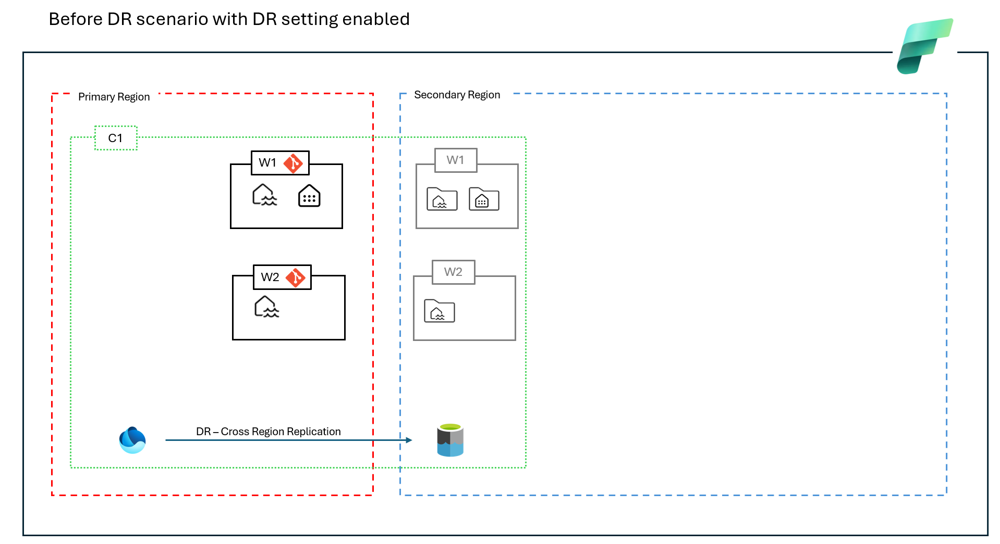
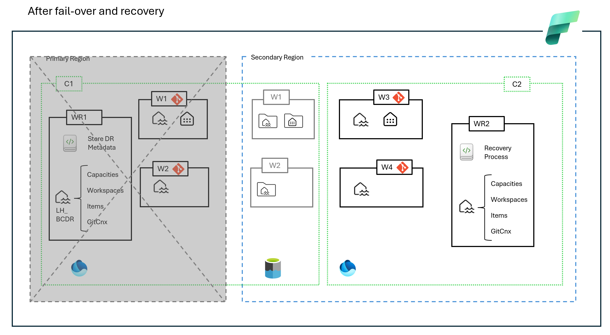

## Introduction

This set of notebooks demonstrates an automated end-to-end business continuity disaster recovery (BCDR) process to recover supported git items, lakehouses and warehouses data.

The accelerator consists of three notebooks, one which is run in the primary region (01 – Run in Primary) and another which is run in the DR/secondary region (02 – Run in DR). The third notebook (workspaceutils) contains utility functions utilised in both notebooks.

<b>01 – Run in Primary.ipynb</b>

Gathers metadata about the current primary environment and stores this as tables in OneLake. This metadata forms part of the replicated DR data and will be recovered in the DR environment in subsequent stages.

<b>02 – Run in DR.ipynb</b>

Performs the recovery steps such as recreating workspaces, connecting them to Git, syncing and restoring items (lakehouses, warehouses, pipelines etc) and applying workspaces roles.

<b>workspaceutils.ipynb</b>

A utility notebook with many useful supporting functions such as extracting and storing metadata, copying data, and more, which is included (using %run) in the other two notebooks to reduce the amount of code in each main notebook and for code re-use.

<b>Note the contents of this repository should be used for demonstration purposes only.</b>

## Overview
Please read the disaster recovery guidance found in <a href="https://learn.microsoft.com/en-us/fabric/security/experience-specific-guidance">the documentation</a> to obtain a general understanding of how to recover lakehouse and warehouse data for BCDR purposes.
When the DR setting is enabled at capacity level, all OneLake data (lakehouse and warehouse data) within the workspaces associated to that capacity will be replicated to another region. 
In a DR scenario, Fabric items (such as lakehouse and warehouse definitions) and associated data will need to be recovered into new workspaces in the secondary region. The initial goal of the notebooks in this repository was to automate this recovery process but their functionality can be used for backup purposes also if run on a periodic basis. 
The following images represents the conceptual state of your Fabric deployment before and after a DR scenario when using the notebooks in this repo.

&nbsp;

## Prerequisites for testing the scripts in a non-DR scenario
Create two workspaces and assign them to an F capacity (existing or new). Create a lakehouse in each of them. Make note of the workspace and lakehouse names as these will be needed as parameters in the second notebook. 
Workspace 1 - used to store metadata about your Fabric deployment (such as capacities, workspaces & items but will be extended with more metadata later) in the primary region which will be used in the recovery process. 
Workspace 2 - used in the recovery process to restore metadata captured in Workspace 1 to 1.) recreate workspace, 2.) re-link to git and recreate items and 3.) recover lakehouse and warehouse data.   

## Limitations
Currently the notebooks only support recovering workspaces [git supported items](https://learn.microsoft.com/en-us/fabric/cicd/git-integration/intro-to-git-integration#supported-items), lakehouses and warehouses data.
The notebooks do not recreate capacities, shortcuts, apply permissions and roles, setup data gateways (etc) in the secondary. Currently lakehouse schemas are not supported. There is a a long list of [items on the backlog](https://dev.azure.com/nihurt/FabricBCDR/_workitems/recentlyupdated/). 

## Instructions
Please review the guidance in the [associated pdf](./Fabric%20BCDR%20Accelerator%20User%20Guide.pdf)

## Contributing

Please check [CONTRIBUTING.md](./CONTRIBUTING.md) for more info about contributing to this repository.

## Governance

### Code of Conduct

This project adheres to the [Microsoft Open Source Code of Conduct](https://opensource.microsoft.com/codeofconduct/). For more information, refer to the [Code of Conduct FAQ](https://opensource.microsoft.com/codeofconduct/faq/) or contact us via email at [opencode@microsoft.com](mailto:opencode@microsoft.com).

### License

All samples and templates in this repository are licensed under the MIT License. For full license text, please see the [LICENSE](./LICENSE.md) page in the repository's root.

### Trademarks

This project may include trademarks or logos for projects, products, or services. Use of Microsoft trademarks or logos must follow [Microsoft's Trademark & Brand Guidelines](https://www.microsoft.com/en-us/legal/intellectualproperty/trademarks/usage/general) and not cause confusion or imply Microsoft sponsorship. Third-party trademarks or logos are subject to their respective policies.
