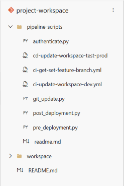
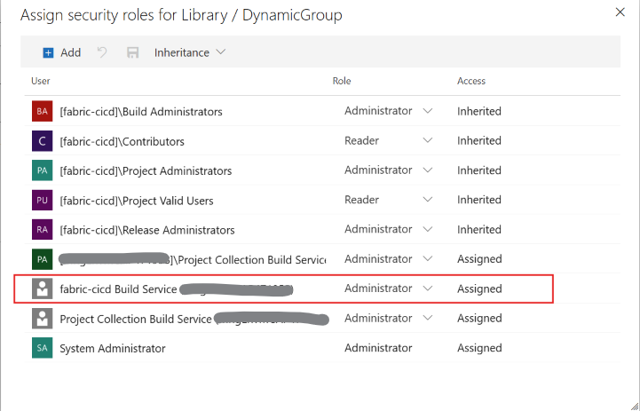
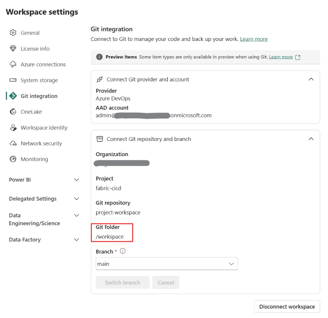
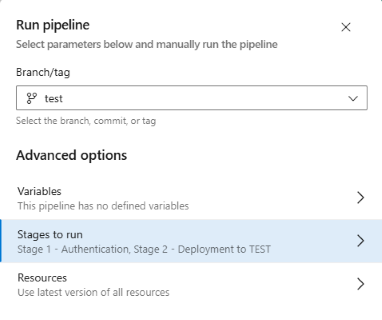

# Microsoft Fabric CI/CD - Option 1 : Git based deployments

With this option, all deployments originate from the Git repository. Each stage in the release pipeline has a dedicated primary branch (in the diagram, these stages are Dev, Test, and Prod), which feeds the appropriate workspace in Fabric.

Once a PR to the Dev branch is approved and merged:

1. A release pipeline is triggered to update the content of the Dev workspace. This process also can include a Build pipeline to run unit tests, but the actual upload of files is done directly from the repo into the workspace, using Fabric Git APIs. You might need to call other Fabric APIs for post-deployment operations that set specific configurations for this workspace, or ingest data.
2. A PR is then created to the Test branch. In most cases, the PR is created using a release branch that can cherry pick the content to move into the next stage. The PR should include the same review and approval processes as any other in your team or organization.
3. Another Build and release pipeline is triggered to update the Test workspace, using a process similar to the one described in the first step.
4. A PR is created to Prod branch, using a process similar to the one described in step 2.
5. Another Build and release pipeline is triggered to update the Prod workspace, using a process similar to the one described in the first step.

 

When should you consider using option #1?
 

- When you want to use your Git repo as the single source of truth, and the origin of all deployments.

- When your team follows Gitflow as the branching strategy, including multiple primary branches.

- The upload from the repo goes directly into the workspace, as we don’t need build environments to alter the files before deployments. You can change this by calling APIs or running items in the workspace after deployment.

For more information about Microsoft Fabric CI/CD workflow options, please visit the official documentation at this page: 
https://learn.microsoft.com/en-us/fabric/cicd/manage-deployment#option-1---git--based-deployments

## <u>Setup</u>

 

### <u>Prerequisites</u>

 

1. Create 3 Microsoft Fabric workspaces, one for each environment: DEV, TEST, PROD. Minor adjustments to the setup and scripts are necessary if additional environments are introduced.

    The workspace identifiers will be required in the setup. To find a workspace id, check the url and extract the guid after "groups/" as shown in the picture below:

    

2. Create a Microsoft Fabric workspace for controling the CI/CD process. It will contain the pre and post deployment notebook. For more information about this workspace, see the documenation in the **cicd-workspace** folder. The user running the CI/CD process should be an Admin or Member of the workspaces 

3. Create an azure devops project and a repository.

    3.1 In this project, create the following structure:

    

    3.2 From the folder **project-workspace** in this **git repo**, download the .py and .yml files and import them in the **pipeline-scripts** folder of your devops project/repository. In the screenshot above, the repository name is also called **project-workspace**.

    3.3 Keep the workspace folder empty. It will be used to git enable the Microsoft Fabric DEV workspace.

    3.4 Create 3 Variable Groups and their respective variables.

     

    | Variable Group name    | Variable Names | Variable Value | Comment |
    | -------- | ------- | ------- | ------- |
    | DynamicGroup  | FeatureBranch    |  <empty>    |      | 
    | GroupDevOps  | ConflictResolutionPolicy    |  PreferRemote    |     | 
    | GroupDevOps  | InitializationStrategy    |  PreferRemote    |      | 
    | GroupDevOps  | MappingConnectionsFileName    |  mapping_connections.json    |  This json file will hold the mapping of connections between different stages    | 
    | GroupDevOps  | OnelakeRolesFileName    |  onelake_roles.json    |  This json file will hold the list of roles you wish to create in the target lakehouses   | 
    | GroupDevOps  | OnelakeRulesFileName    |  onelake_rules.json    |  This json file will hold the rules applied to the lakehouse tables/shortcut/folders defined for a role    | 
    | GroupDevOps  | OnelakeEntraMembersFileName    |  onelake_entra_members.json    | This json file will hold the Entra ID principles assigned to a role    | 
    | GroupDevOps  | OnelakeItemMembersFileName    |  onelake_item_members.json    |  This json file will hold the the lakehouse tables/shortcut/folders defined for a role  | 
    | GroupDevOps  | OrganizationName    |  <name of your organization>    |      | 
    | GroupDevOps  | ProjectName    |  <name of your project>    |      | 
    | GroupDevOps  | RepositoryName    |  <name of your repository>    |      | 
    | GroupDevOps  | Stage1BrancheName    |  main    |      | 
    | GroupDevOps  | Stage2BrancheName    |  <name of your test branch>    |      | 
    | GroupDevOps  | Stage3BrancheName    |  <name of your prod branch>    |      | 
    | GroupFabricWorkspaces  | CiCdLakehouseId    |  <lakehouse id in your ci/cd workspace>    |      | 
    | GroupFabricWorkspaces  | CiCdWorkspaceId    |  <ci/cd workspace id>    |      | 
    | GroupFabricWorkspaces  | Stage1WorkspaceId    |  <dev workspace id>    |      | 
    | GroupFabricWorkspaces  | Stage2WorkspaceId    |  <test workspace id>    |      | 
    | GroupFabricWorkspaces  | Stage3WorkspaceId    |  <prod workspace id>    |      | 

     

    The files **mapping_connections.json**, **onelake_roles.json**, **onelake_rules.json**, **onelake_entra_members.json** and **onelake_item_members.json** are all secure files uploaded in your project, at this location: Pipeline/Library/Secure Files.
    A helper notebook called **nb_extract_lakehouse_access.ipynb**  helps you extract the onelake roles defined in your lakehouses and generate the json files in your cicd lakehouse (see CI CD Workspace - Read me). Using your Onelake explorer, you can download the files and make the required modifications.
    The Yaml Pipelines expects the presence of these files even if empty (when you do not wish to change the connections in your Fabric items or create custom onelake roles in your target lakehouses).

     

    The variable group **DynamicGroup** requires additional permission as the variable **FeatureBranch** it contains will be updated by a pipeline execution.
    Grant the "Administrator" permission to the Build Service as show in the following screenshot:

    

 

### <u>Git enable the DEV workspace</u>

 

In the settings of your DEV workspace, tab Git Integration, connect your workspace to the main branch of your Azure DevOps repository. Make sure to use a folder as shown in the following screenshot.

 

 

### <u>Create a branch policy on the **main** branch</u>

 

This policy is required to block commits on the main branch. It is also required to get the name of source branch used in a PR. 

This policy is required to get the feature branch name during the automatic trigger of the **ci-get-set-feature-branch** pipeline.

The following screenshot shows the branch policy setup:

 

### <u>Create the required yaml pipelines</u>

From the Pipeline tab in Azure DevOps, create the following pipelines by selecting an existing yml file.

 

<u>ci-get-set-feature-branch</u>

To create this pipeline, select the **ci-get-set-feature-branch.yml** file located in <your-repository-name>/main/pipeline-scripts.
This pipeline is automatically triggered during the PR request (and before completing the PR) to merge from the feature branch to the main branch, to identify on the fly the feature branch name used by a Fabric developer. 
The feature branch name is then stored in the variable **FeatureBranch** in the variable group **DynamicGroup**. The feature branch name is required as part of the **ci-update-workspace-dev** pipeline pre and post deployment steps.

PS: it is mandatory as part of this solution that the developer gives the branch a name that matches the FEATURE workspace name, as shown in the following screenshot:

 

For a programmatical branch out experience, please check the **amazing work** done by [Nick Hurt](https://www.linkedin.com/in/nick-hurt/) here: 
 
https://github.com/microsoft/fabric-toolbox/tree/main/accelerators/CICD/Branch-out-to-new-workspace

 

<u>ci-update-workspace-dev</u>

To create this pipeline, select the **ci-update-workspace-dev.yml** file located in <your-repository-name>/main/pipeline-scripts.
This pipeline is automatically triggered when the PR is completed. It will promote the content of the FEATURE workspace to the DEV workspace, and will apply a similar logic to the **cd-update-workspace-test-prod** pipeline, meaning it will run pre and post deployment steps before and after the Git update of the DEV workspace.

 

<u>cd-update-workspace-test-prod</u>

To create this pipeline, select the **cd-update-workspace-test-prod.yml** file located in <your-repository-name>/main/pipeline-scripts.
This pipeline is manually triggered after a PR is made between a source and a target branch.

 

To deploy DEV to TEST, proceed like the following:
- Make a PR between the **main** and **test** branch
- Manually run the pipeline by selecting the test branch as source and uncheck the **PROD** stage.

 

To deploy TEST to PROD, proceed like the following:
- Make a PR between the **test** and **prod** branch
- Manually run the pipeline by selecting the prod branch as source and uncheck the **TEST** stage.

The following screenshot shows the selection to deploy to TEST:

 

