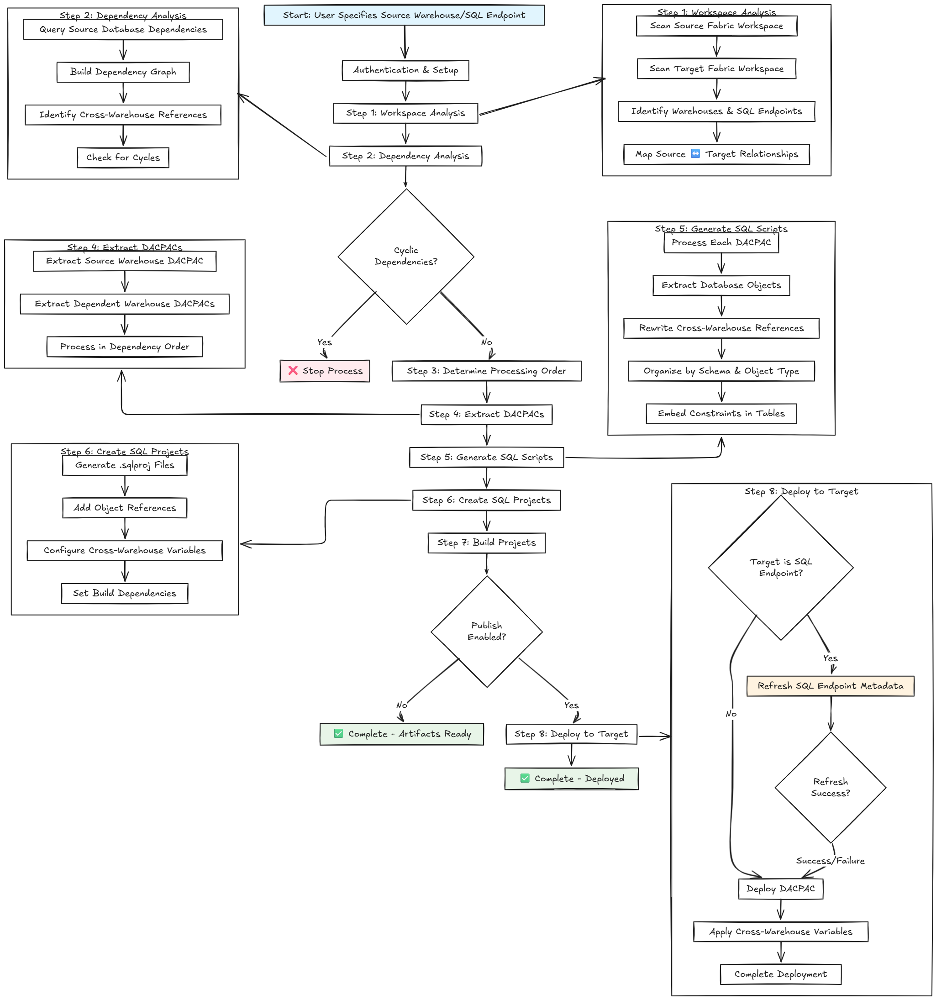

# Microsoft Fabric Warehouse Automation Tool

## Overview

This .NET application is a comprehensive automation tool designed for Microsoft Fabric Data Warehouses and SQL Analytics Endpoints (Lakehouses) deployment and management. It processes the warehouse or SQL endpoint specified by the user along with all its dependent items (warehouses or SQL endpoints), providing end-to-end processing capabilities including dependency analysis, DACPAC extraction, SQL project generation, cross-warehouse reference management, and automated deployment with SQL endpoint metadata refresh support.

**Important:** 
- The publish action ensures that SQL endpoints are refreshed before applying changes to the target. However, ensuring that required tables are available in the target Lakehouse should be managed by the user before starting this process.
- SQL endpoint refresh failures do not stop the publish action - the deployment will continue even if the refresh fails.
- Permissions are not carried over during the deployment process. It is the user's responsibility to apply appropriate permissions after running this process.


### Key Capabilities

**Workspace Analysis & Item Discovery**
- Scans both source and target Fabric workspaces using REST APIs
- Identifies and catalogs warehouses and SQL endpoints across workspaces
- Maps relationships between source and target workspace items
- Provides comprehensive item type classification and ID tracking

**Intelligent Dependency Management**  
- Performs deep dependency analysis across multiple warehouses and SQL endpoints
- Detects and resolves cross-warehouse/cross-endpoint object references
- Determines optimal processing order to handle dependency chains for the specified warehouse/SQL endpoint and all its dependencies
- Prevents deployment failures due to missing dependencies
- Identifies and reports cyclic dependency issues across warehouses and SQL endpoints

**DACPAC Extraction & Processing**
- Extracts Data-tier Application Packages (DACPACs) from source warehouses and SQL endpoints
- Processes SQL Server objects with full metadata preservation for the target item and all its dependencies
- Handles complex object types including tables, views, procedures, functions, and constraints


**Cross-Warehouse/SQL Endpoint Reference Resolution**
- Automatically detects references to external warehouses and SQL endpoints in SQL code
- Converts warehouse references to SQLCMD variables for deployment flexibility
- Supports all SQL identifier bracketing combinations ([Warehouse], Warehouse.[Schema], etc.)
- Generates parameterized deployment scripts for multi-warehouse scenarios

**SQL Project Generation & Build Management**
- Creates MSBuild-compatible SQL Server Database Projects (.sqlproj)
- Organizes database objects into logical folder structures by schema and type
- Embeds constraints directly into table definitions with proper GO statement formatting
- Generates project references for dependent warehouses
- Produces deployable DACPAC files through automated builds

**Fabric SQL Endpoint Integration**
- Refreshes SQL endpoint metadata before deployment using Fabric REST APIs
- Handles both synchronous (200) and asynchronous (202) refresh operations with polling
- Verifies item types before attempting refresh operations
- Provides comprehensive error handling and retry logic

**Automated Deployment Pipeline**
- Publishes built DACPACs to target warehouses with customizable deployment options
- Manages SQLCMD variables for cross-warehouse references during deployment
- Supports both traditional warehouses and SQL endpoints with appropriate handling
- Includes deployment validation and error reporting

## Prerequisites

### For Running the Application

**Required Software:**
1. **.NET 8.0 Runtime** - [Download](https://dotnet.microsoft.com/download/dotnet/8.0)
2. **Azure CLI** - [Download](https://docs.microsoft.com/en-us/cli/azure/install-azure-cli)
3. **SqlPackage** - Install via [SQL Server Management Studio (SSMS)](https://docs.microsoft.com/en-us/sql/ssms/download-sql-server-management-studio-ssms) or [standalone download](https://docs.microsoft.com/en-us/sql/tools/sqlpackage-download)

**Azure & Fabric Access:**

1. Fabric workspace contributor role on source workspaces with access to all items
2. Fabric workspace contributor role on target workspaces with access to all items


**Setup Steps:**
1. Install required software listed above
2. Run `az login` to authenticate with Azure
3. Verify access: `az account show` to confirm correct subscription
4. Test Fabric access by navigating to your Fabric workspace in browser
5. Ensure SqlPackage is in PATH or note its installation location


## Authentication & Authorization

This tool uses the Azure CLI (`az`) to authenticate with Azure and Microsoft Fabric resources. When you run `az login`, you authenticate your user account and obtain access tokens that the application uses to make REST API calls to Fabric workspaces, warehouses, and SQL endpoints.

**How Authentication Works:**
- The application relies on the Azure CLI to provide access tokens for REST API requests.
- You must run `az login` before using the tool. This command authenticates your account and caches tokens locally.
- The tool uses these tokens to access both source and target Fabric workspaces and their items.
- You can verify your current subscription and account with `az account show`.

**Required Azure Roles & Permissions:**
- You must have the **Fabric workspace contributor** role on both the source and target workspaces.
- This role grants permission to read workspace metadata, list items, and perform deployments.
- If you do not have sufficient permissions, REST API calls will fail with authorization errors.
- For more information on Fabric roles, see [Fabric workspace roles documentation](https://learn.microsoft.com/en-us/fabric/service-admin/service-admin-roles).

**Multi-Tenant & Service Principal Use:**
- If you are using a service principal or automating deployments in CI/CD, use `az login --service-principal` and ensure the service principal has the required roles assigned.
- For multi-tenant scenarios, ensure you are logged into the correct tenant and subscription.

**Troubleshooting:**
- If you encounter authentication errors, re-run `az login` and verify your account and subscription.
- Ensure your user or service principal has the required permissions on all relevant Fabric workspaces.
### For Development & Contributing

**Additional Development Requirements:**
1. **.NET 8.0 SDK** - [Download](https://dotnet.microsoft.com/download/dotnet/8.0)
2. **Visual Studio 2022** or **Visual Studio Code** with C# extension
3. **Git** - [Download](https://git-scm.com/downloads)

**Development Setup:**
1. Clone the repository: `git clone <repository-url>`
2. Open solution in Visual Studio or VS Code
3. Restore NuGet packages: `dotnet restore`
4. Build solution: `dotnet build`

### Building and Running the Automation

**Building from Source**
```bash
git clone <repository-url>
cd AutomateWarehouseProject
dotnet build
```

**To run the automation:**
- Navigate to the executable location or add it to your PATH
- Run with required parameters (see Usage section below)
- Alternatively, run directly without building executable: `dotnet run -- [parameters]`

**Example:**
```bash
# Build and run from executable
cd bin\Release\AutomateWarehouseProject.exe --server "your-server" --database "your-db" --working-dir "C:\Output" [other-parameters]

# Or run directly without building executable
dotnet run -- --server "your-server" --database "your-db" --working-dir "C:\Output" [other-parameters]
```

## How It Works

### Process Flow



### Key Decision Points

1. **Cyclic Dependency Check**: If circular dependencies are detected between warehouses/SQL endpoints, the process stops before extracting dacpacs to prevent deployment issues.

2. **SQL Endpoint Refresh**: For SQL endpoint targets, metadata refresh is attempted but failures don't block deployment.

3. **Cross-Warehouse References**: Automatically converted to SQLCMD variables for flexible deployment across environments.

4. **Processing Order**: All dependent warehouses/SQL endpoints are processed in the correct order to ensure successful deployment.

## Usage

### Basic Usage
```bash
AutomateWarehouseProject.exe \
  --source-fabric-workspace-id "dd56cce8-94f4-4365-b34b-0eb72163a18b" \
  --server "your-workspace-id-1.datawarehouse.fabric.microsoft.com" \
  --database "test_lh" \
  --working-dir "C:\Users\pvenkat\source\repos\Automate_deployment_FabricDW\working_dir" \
  --target-fabric-workspace-id "9c022a04-8cc4-4b52-b28e-3ae6794f63e6" \
  --target-server "your-workspace-id-2.datawarehouse.fabric.microsoft.com" \
  --base-url "https://msitapi.fabric.microsoft.com/v1" \
  --force-extract \
  --publish
```

### Command Line Parameters

| Parameter | Required | Description | Example |
|-----------|----------|-------------|---------|
| `--server` | ✅ | Fabric Data Warehouse server endpoint | `myworkspace-abc123.datawarehouse.fabric.microsoft.com` |
| `--database` | ✅ | Source warehouse/database name | `SalesWarehouse` |
| `--working-dir` | ✅ | Output directory for all generated artifacts | `C:\FabricProjects\Output` |
| `--source-fabric-workspace-id` | ✅ | Source Fabric workspace GUID for REST API operations | `d86e8406-5891-491c-b237-5d027f82589d` |
| `--target-fabric-workspace-id` | ✅ | Target Fabric workspace GUID for deployment | `a12b3456-7890-1234-5678-9abcdef01234` |
| `--target-server` | ✅ | Target warehouse server for deployment | `targetworkspace.datawarehouse.fabric.microsoft.com` |
| `--base-url` | ✅ | Fabric API base URL for your environment | `https://msitapi.fabric.microsoft.com/v1` |
| `--force-extract` | ✅ | Force re-extraction even if DACPAC exists | (flag only) |
| `--publish` | ✅ | Deploy to target after building projects | (flag only) |

### Parameter Setup Instructions

**Finding Your Fabric Workspace IDs:**
1. Navigate to your Fabric workspace in the browser
2. Copy the workspace GUID from the URL: `https://app.fabric.microsoft.com/groups/{workspace-id}/`
3. Use this GUID for `--source-fabric-workspace-id` and `--target-fabric-workspace-id`

**Finding Your Warehouse Server Names:**
1. In Fabric workspace, navigate to your warehouse
2. Go to Settings > Connection strings
3. Copy the server name portion (exclude database name)
4. Format: `workspacename-uniqueid.datawarehouse.fabric.microsoft.com`

**Setting Up Base URL (Optional):**
- Production (default): `https://api.fabric.microsoft.com/v1`
- Government Cloud: `https://api.fabric.microsoft.us/v1`
- Custom/Preview environments: Contact your Fabric administrator

### Example Commands

**Basic extraction:**
```bash
AutomateWarehouseProject.exe --server "contoso.datawarehouse.fabric.microsoft.com" --database "SalesWarehouse" --working-dir "C:\Projects"
```

**With custom project name:**
```bash
AutomateWarehouseProject.exe --server "contoso.datawarehouse.fabric.microsoft.com" --database "SalesWarehouse" --working-dir "C:\Projects" --project-name "SalesDataModel"
```

**Force re-extraction:**
```bash
AutomateWarehouseProject.exe --server "contoso.datawarehouse.fabric.microsoft.com" --database "SalesWarehouse" --working-dir "C:\Projects" --force-extract
```

## Application Output & Generated Content

### Runtime Process & Artifacts Created

**Phase 1: Workspace Analysis**
- Scans source and target Fabric workspaces via REST API
- Creates item inventory with mapping between source and target IDs
- Generates warehouse type classification (Warehouse vs SQLEndpoint)
- Output: Console logging of discovered items and workspace analysis results

**Phase 2: Dependency Analysis** 
- Performs SQL query-based dependency analysis across warehouses
- Creates dependency chain mapping and processing order determination
- Identifies cyclic dependencies and cross-warehouse references
- Output: Dependency analysis report with processing order

**Phase 3: DACPAC Extraction**
- Extracts DACPAC files from each warehouse in dependency order
- Creates one DACPAC per warehouse in the run folder
- Output: `{WarehouseName}.dacpac` files in `Run_{timestamp}` folder

**Phase 4: Script Generation**
- Processes each DACPAC to extract individual database objects
- Generates organized SQL scripts with cross-warehouse reference resolution
- Creates one SQL project per warehouse with proper folder structure
- Output: Complete SQL project hierarchy for each warehouse

**Phase 5: Build Process**
- Compiles each SQL project using MSBuild
- Produces deployable DACPAC files with resolved dependencies
- Validates SQL syntax and object references
- Output: Built DACPAC files in each project's `bin\Release` folder

**Phase 6: Deployment (Optional)**
- Refreshes SQL endpoint metadata using Fabric REST API (if applicable)
- Deploys built DACPACs to target warehouses using SqlPackage
- Handles SQLCMD variable substitution for cross-warehouse references
- Output: Deployed warehouse objects and deployment logs

### Complete Output Structure

```
Working Directory/
└── Run_20241121_143022/          # Timestamped run folder
    ├── WarehouseA.dacpac          # Extracted source DACPACs
    ├── WarehouseB.dacpac
    ├── WarehouseC.dacpac
    ├── WarehouseA/                # Individual warehouse projects
    │   ├── WarehouseA.sqlproj     # MSBuild SQL Server project
    │   ├── bin/
    │   │   └── Release/
    │   │       └── WarehouseA.dacpac  # Built deployable DACPAC
    │   ├── Security/              # Security objects (schemas, roles)
    │   │   ├── SalesSchema.sql
    │   │   ├── ReportsRole.sql
    │   │   └── AnalyticsSchema.sql
    │   ├── dbo/                   # Default schema objects
    │   │   ├── Tables/
    │   │   │   ├── Customer.sql   # Table with embedded constraints + GO statements
    │   │   │   ├── Orders.sql
    │   │   │   └── Products.sql
    │   │   ├── Views/
    │   │   │   ├── CustomerSummary.sql
    │   │   │   └── SalesReport.sql
    │   │   ├── StoredProcedures/
    │   │   │   ├── GetCustomerOrders.sql
    │   │   │   └── ProcessSales.sql
    │   │   └── Functions/
    │   │       ├── CalculateDiscount.sql
    │   │       └── FormatCurrency.sql
    │   └── Sales/                 # Custom schema objects
    │       ├── Tables/
    │       │   └── Transactions.sql
    │       ├── Views/
    │       │   └── MonthlySales.sql
    │       └── StoredProcedures/
    │           └── GenerateReport.sql
    ├── WarehouseB/                # Second warehouse project
    │   ├── WarehouseB.sqlproj
    │   ├── bin/Release/WarehouseB.dacpac
    │   └── [similar folder structure]
    └── WarehouseC/                # Third warehouse project
        ├── WarehouseC.sqlproj
        ├── bin/Release/WarehouseC.dacpac
        └── [similar folder structure]
```

## Features

### Object Organization
- **Tables**: Organized by schema with embedded constraints
- **Views**: Grouped by schema in Views folders
- **Stored Procedures**: Grouped by schema in StoredProcedures folders
- **Functions**: Grouped by schema in Functions folders
- **Security Objects**: Schemas and roles in dedicated Security folder

### Cross-Warehouse References
- Automatically detects references to other warehouses
- Converts references to SQLCMD variables: `[$(WarehouseName)]`
- Generates project references and variables in .sqlproj file

### Excluded Objects
- User accounts (typically not needed in projects)
- Permission objects (handled at deployment level)

### Build Output
- Generates MSBuild-compatible SQL project
- Uses Microsoft.Build.Sql 2.0.0
- Produces deployable DACPAC files
- Compatible with Azure DevOps and GitHub Actions

## Troubleshooting

### Common Issues

**"sqlpackage not found"**
- Ensure SqlPackage is installed and in PATH
- Use `--sqlpackage-path` to specify custom location

**"Authentication failed"**
- Run `az login` and ensure you're authenticated
- Verify permissions to access the source warehouse

**"Build failed"**
- Ensure .NET SDK is installed and accessible
- Check build output for specific SQL compilation errors

**"DACPAC not found at expected location"**
- Check if build actually succeeded
- Verify no SQL syntax errors in generated scripts

### Debug Information
The application provides detailed logging for each step:
- DACPAC extraction progress
- Object script generation status
- Build process output
- Error details with context

