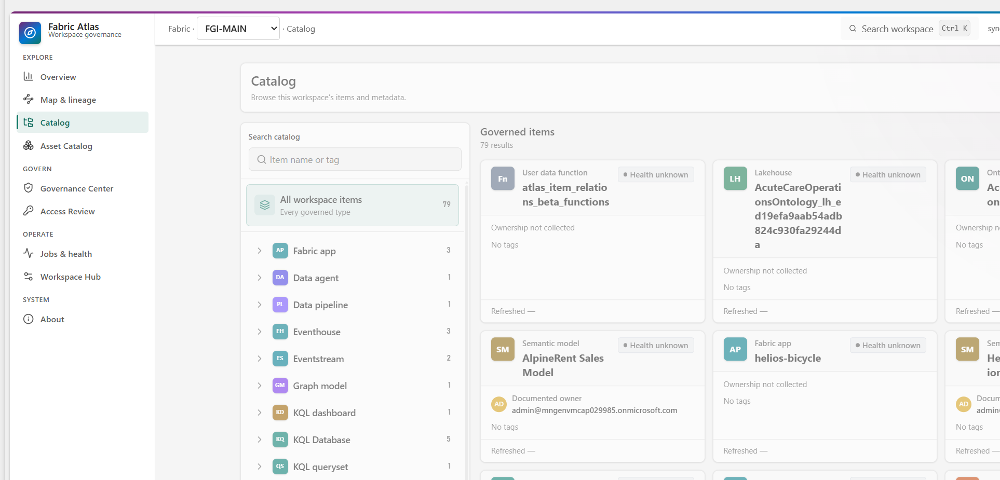
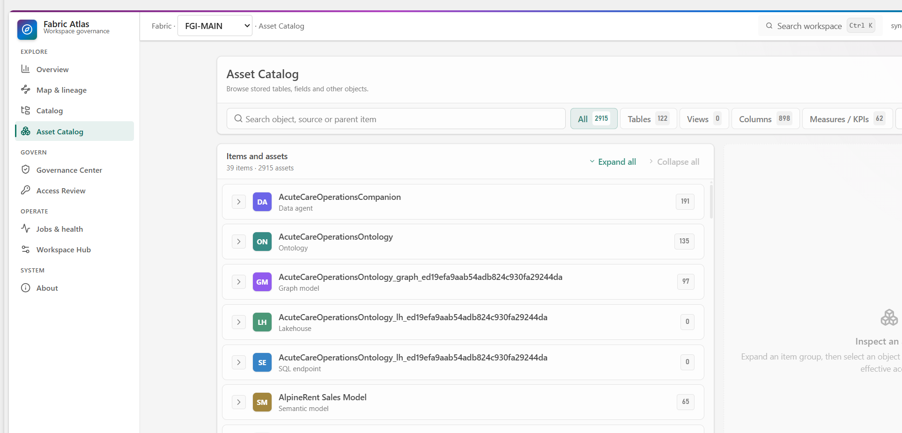
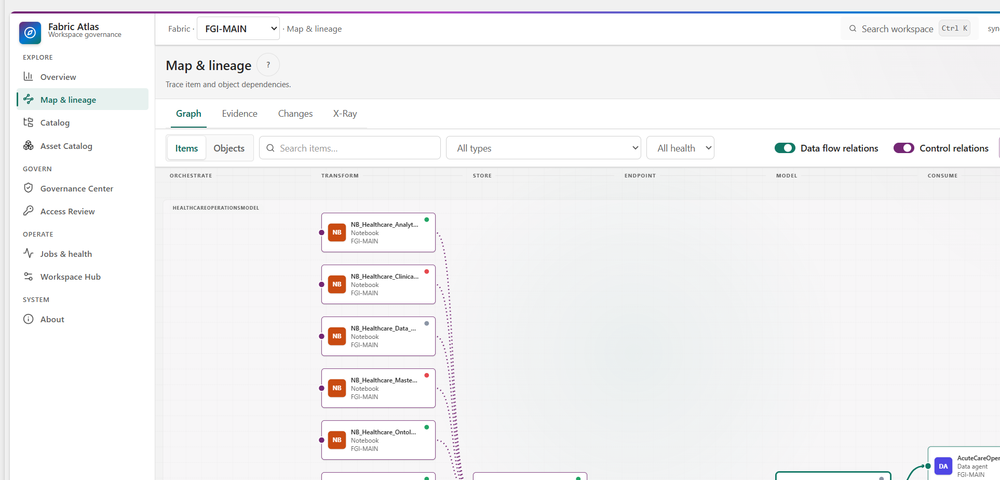
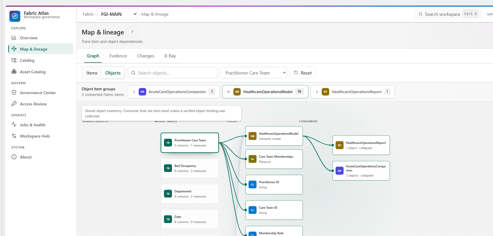
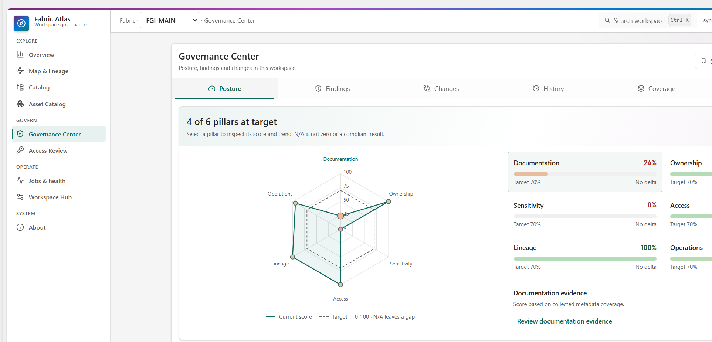
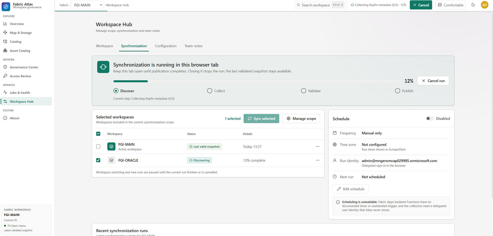
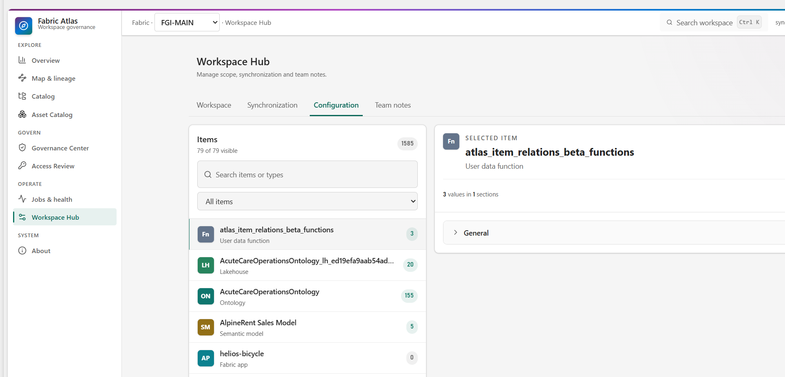
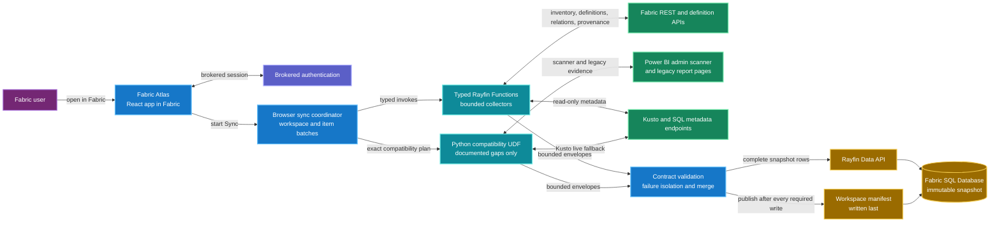

<div align="center">


Fabric Atlas gives a team one readable map of its selected Fabric workspaces. It brings
together lineage, item metadata, access, sensitivity and run history, then keeps
the last validated snapshot in Fabric so everyone sees the same state.

[](https://github.com/fredgis/FabricAtlas/releases/latest)
[](LICENSE)
[](https://react.dev/)
[](https://github.com/microsoft/rayfin)
[](https://www.microsoft.com/microsoft-fabric)

[Install](docs/installation.md) ·
[Architecture](docs/architecture.md) ·
[Whitepaper](https://github.com/fredgis/FabricAtlas/blob/6ee746b/docs/fabric-atlas-whitepaper.pdf) ·
[Technical presentation](https://github.com/fredgis/FabricAtlas/blob/6ee746b/prez/Fabric-Atlas-Dev-Architecture.pdf) ·
[Capabilities](#capabilities) ·
[Status legend](#status-legend) ·
[Roadmap](#current-limits-and-roadmap) ·
[Changelog](CHANGELOG.md) ·
[Contribute](https://github.com/fredgis/FabricAtlas/blob/6ee746b/.github/CONTRIBUTING.md)

</div>

This Fabric Toolbox copy tracks
[`fredgis/FabricAtlas@6ee746b`](https://github.com/fredgis/FabricAtlas/commit/6ee746b).

## Fabric Atlas 2.0 demo

https://github.com/user-attachments/assets/4f34a994-a130-4a74-bce7-d2d2bbab7d65

[Watch the Full HD demo on YouTube](https://youtu.be/dO5kG5tNpUo)

## Whitepaper

The [Fabric Atlas whitepaper](https://github.com/fredgis/FabricAtlas/blob/6ee746b/docs/fabric-atlas-whitepaper.pdf) explains how
the product collects and validates metadata, publishes immutable snapshots,
traces item and DAX dependencies, reviews effective access, and builds
principal-centred departure packs. It also covers governance, operations,
security boundaries, deployment and known API limits.

The screenshots use FGI-MAIN as one example deployment. Its counts and findings
are not product defaults or a reference architecture.

<a href="https://github.com/fredgis/FabricAtlas/blob/6ee746b/docs/fabric-atlas-whitepaper.pdf">
  
</a>

[Read the PDF](https://github.com/fredgis/FabricAtlas/blob/6ee746b/docs/fabric-atlas-whitepaper.pdf) ·
[Read the Markdown version](https://github.com/fredgis/FabricAtlas/blob/6ee746b/docs/fabric-atlas-whitepaper.md)

## Read-only Atlas MCP

Atlas includes an optional local stdio MCP server for deterministic, read-only
access to validated catalog, lineage, access, incident and snapshot evidence.
It runs on the MCP client machine and reads the same validated Rayfin
snapshots as the app. It does not run as a Rayfin Function or a permanent cloud
service.

Build it after generating the deployed Rayfin environment:

```powershell
npx rayfin env --framework vite
npm run build:mcp
```

Example `.vscode/mcp.json` configuration:

```json
{
  "servers": {
    "fabric-atlas": {
      "type": "stdio",
      "command": "node",
      "args": ["${workspaceFolder}/dist-mcp/atlas-mcp.mjs"],
      "env": {
        "ATLAS_MCP_ENABLED": "true",
        "ATLAS_MCP_CLIENT_ID": "<public-client-id>",
        "ATLAS_MCP_TENANT_ID": "<tenant-id>"
      }
    }
  }
}
```

The server is disabled by default. Activation requires a dedicated
single-tenant public client, delegated `Item.Execute.All`, a reviewed
`externalEntraExchange` setting and Conditional Access support for device code.
The signed-in user must belong to the Fabric app audience, and tools can read
only the administrator-selected Atlas workspace scope. No tool changes Fabric,
permissions or Atlas data. See [Atlas MCP](docs/atlas-mcp.md) for the remaining
identity gates, tool contracts and limitations.

## Technical presentation

The [Fabric Atlas development and architecture presentation](https://github.com/fredgis/FabricAtlas/blob/6ee746b/prez/Fabric-Atlas-Dev-Architecture.pdf)
documents the Rayfin-first collector path, manifest-last publication, current
entity groups, local MCP and the exact Rayfin platform gaps that keep Python
compatibility and browser-driven synchronization in place. The editable deck,
PDF and PlantUML sources are in the
[`prez/` directory](https://github.com/fredgis/FabricAtlas/tree/6ee746b/prez).

## What it does

Fabric workspaces spread operational metadata across many portal pages and APIs.
Fabric Atlas collects that metadata without copying business data.

- Select and synchronize multiple workspaces without mixing their snapshots.
- Browse Fabric items and inspect SQL, KQL, semantic, ontology, graph and Data
  Agent objects in one catalog.
- Search items, objects, principals, jobs, configuration and notes with
  `Ctrl+K`.
- Trace trusted item and object lineage, raw Item Relations Preview evidence
  and DAX dependencies through Semantic X-Ray.
- Compare validated snapshots, review changes and export impact evidence.
- Review effective recorded access, run local What-if scenarios and generate
  departure packs.
- Track findings, item-family Coverage, Policies & AI and six governance
  posture pillars.
- Inspect job failures, inferred downstream impact and portal-only monitoring
  boundaries.
- Keep configuration and append-only team notes beside the active workspace.
- Publish each workspace snapshot only after persistence and read-back
  validation succeed.

## Capabilities

| Area | Included in Fabric Atlas 2.0 |
|---|---|
| Workspaces and sync | Shared workspace scope, independent validated snapshots, active-workspace switching, staged progress and last-known-good fallback |
| Catalog and search | Item Catalog, alphabetized Asset Catalog, `Ctrl+K` search, SQL/KQL/semantic/ontology/graph/Data Agent inventory |
| Lineage and impact | Trusted Atlas graph, Item Relations Preview, Evidence, Changes, X-Ray, object lineage and exportable impact reports |
| Governance | Findings, Radar, snapshot comparison, history, item-family Coverage, posture targets and Policies & AI |
| Access | Effective recorded access, principal review, personal decisions, What-if simulation and departure packs |
| Operations | Job history, observed incidents, inferred downstream impact, monitoring boundaries, configuration and team notes |
| Security | Fabric brokered authentication, synchronizer-only publication, metadata-only storage and user-scoped personal state |
| Extensibility | Typed Rayfin Functions, minimal Python compatibility and an optional read-only local Atlas MCP |

Detailed feature and coverage notes are in the
[whitepaper](https://github.com/fredgis/FabricAtlas/blob/6ee746b/docs/fabric-atlas-whitepaper.pdf),
[architecture](docs/architecture.md) and
[item-family coverage](docs/item-families.md).

## Status legend

Atlas uses separate badge vocabularies for metadata coverage and access
evidence. A recorded grant does not prove unrestricted data access, and a
missing signal is never converted into a healthy result.

### Item-family coverage

| Status | Meaning |
|---|---|
|  **Collected** | Atlas published the dimension in the validated snapshot. |
|  **Partial** | Atlas published usable evidence, but the dimension is incomplete for this item family. |
|  **Adapter only** | A verified read-only adapter exists, but its evidence is not part of the published snapshot. |
|  **Deferred** | A documented contract exists, but Atlas does not project it into the snapshot yet. |
|  **Unsupported** | No verified public API or contract is available for this dimension. |
|  **Excluded by design** | The content is intentionally outside the Atlas metadata boundary, such as notebook source code and cells. |
|  **N/A** | The dimension does not apply to this item family. It is not counted as zero or treated as a gap. |

### Access evidence

These badges describe the evidence Atlas collected for a principal-item pair.
They are not an allow or deny decision.

| Status | Meaning |
|---|---|
|  **Granted** | Atlas recorded a grant and completed the relevant grant collection. This does not prove unrestricted data access. |
|  **Partial** | Atlas recorded a grant, but restrictions, group membership or another evidence layer remain incomplete or unevaluated. |
|  **Unknown** | Atlas did not collect the evidence, or Fabric exposes no verified public API for it. Unknown is not a negative result. |
|  **Denied** | Fabric denied Atlas permission to read the evidence. It does not mean the reviewed principal was denied access. |

### Access origin

| Origin | Meaning |
|---|---|
|  **Inherited** | The recorded access comes from the workspace scope only. |
|  **Direct** | The recorded access comes from an item-scoped grant only. |
|  **Mixed** | Workspace and item grant paths both exist for the same principal-item pair. |

### Recorded access level

| Level | Meaning |
|---|---|
|  **Owner permission** | Owner is the strongest recorded grant that remains. |
|  **Edit** | Edit is the strongest recorded grant that remains. |
|  **View** | View is the strongest recorded grant that remains. |
|  **No positive recorded grant** | No positive grant remains in the collected paths. This still does not prove that actual access has been removed. |

The read-only What-if simulator removes selected recorded paths in the browser
and recalculates the strongest remaining level. It never changes Fabric
permissions and does not evaluate group membership, RLS, OLS, OneLake
security, Purview DLP or actual data access.

## Product screenshots

These screens come from Fabric Atlas 2.0 and a live FGI-MAIN
metadata snapshot. Counts change when the workspace is synchronized again.

### Workspace overview

The overview uses the governance radar as its visual anchor, with current
health, priority signals, freshness and inventory reach beside it.


### Catalog

The Catalog keeps every Fabric item visible, grouped by type and available as
cards or a sortable table. Search, ownership, health and tags narrow the view.



### Asset Catalog

Items and their tables, views, columns, measures and metadata objects are sorted
alphabetically. Selecting an asset exposes its source, model context and
additive effective access.



### Interactive lineage

The Atlas graph follows verified snapshot relationships from orchestration to
consumption. Impact mode removes unrelated components while the inspector keeps
upstream, downstream, schema, access and run evidence in view.



### Item Relations Preview

Preview replaces the Atlas graph while enabled. It labels each line with the
raw API `relationType`, reports cross-workspace evidence and remains clearly
marked as Beta rather than authoritative lineage.


### Object lineage

Object mode expands a synchronized table into its columns and connected Fabric
items. The inspector keeps ownership, impact and related metadata visible while
objects are selected or rearranged. Selecting an object from another Fabric item
switches the active item and rebuilds the object graph. Deep-lineage tables can
be expanded or collapsed together. Connected Fabric items are grouped into
collapsible summary nodes. Hold the left mouse button on the canvas background
to pan. Item and Preview boxes can be moved freely, and Reset returns the graph
to its computed source-to-consumer layout.



### Governance Center

Governance Radar, findings, snapshot changes, history, coverage, posture and
Policies & AI evidence are grouped into one governance workspace.



### Policies & AI

Policies & AI lists semantic models, Data Agents, configured sources and
protection evidence. Unknown exposure and unavailable controls stay explicit
instead of being presented as compliant.


### Access Review

The review matrix combines inherited and direct permissions, shows which
restriction layers were evaluated, and includes a read-only What-if simulator.


### Jobs & health

Jobs & health separates observed failures from inferred downstream reach. The
monitoring panel also states which signals Atlas collected and which remain in
the Fabric portal.


### Multi-workspace synchronization

The synchronizer can run one selected workspace while another workspace keeps
its last validated snapshot. Here FGI-ORACLE is in discovery at 12%, FGI-MAIN
remains the active catalog, and workspace switching is paused until the browser
run finishes or is cancelled.



### Workspace Hub

Workspace Hub shows the selected synchronization scope, latest validated
snapshot and manual run history. Scheduling remains visibly disabled until
Fabric exposes a supported unattended trigger and identity contract.



### Impact reports

An item or schema object can produce an exportable report with verified
upstream, downstream and relationship evidence.


## How it works



### Collector ownership

| Evidence | Primary path | Compatibility path |
|---|---|---|
| Workspaces, items, roles and jobs | `workspaceCollectCore` | Explicit Python rollback only |
| Definitions and structural metadata | Rayfin definition, Power BI, KQL and SQL collectors | Semantic-model scanner fallback when a definition is unavailable |
| Lakehouse, Warehouse, SQL Database and Mirrored Database objects | `workspaceCollectSqlMetadata` plus Lakehouse REST | None; unavailable application-identity coverage stays explicit |
| Shortcuts, mirroring and MLV provenance | `workspaceCollectSourceProvenance` | None |
| Item Relations evidence | `workspaceCollectItemRelations` | None; the API remains Beta and non-authoritative |
| Access-policy context | `workspaceCollectAccessPolicyEvidence` | Portal-only layers remain marked unavailable |
| Power BI admin scanner and authoritative scanner lineage | Python UDF | Retained because Rayfin Functions have no documented Power BI audience |
| Kusto live schema | Python UDF | Retained because Rayfin Functions have no documented Kusto audience |

### Why synchronization can take several minutes

Atlas splits one synchronization into bounded calls. Rayfin Functions keep
headroom below the Fabric runtime limit, and the Python compatibility UDF uses
a 180-second budget. The browser sends small item batches, validates every
response and continues only the remaining work.

The browser publishes nothing until every required collector has completed.
One optional failure can leave an item partially covered, but it cannot erase a
valid schema from another item or replace the last validated snapshot. The
manifest is written after all snapshot rows.

The current flow still needs an open browser because Fabric Apps Functions do
not expose a supported unattended trigger or distributed task-claim primitive.
Scheduled refresh stays disabled rather than storing or replaying a user's
access token.

See [Architecture](docs/architecture.md) for the full data flow.

## Current limits and roadmap

The multi-workspace catalog, independent snapshots and stored cross-workspace
Preview evidence are implemented. The remaining work is tied to platform
contracts or a separate product decision.

| Area | Current state | Next gate |
|---|---|---|
| Scheduled synchronization | Disabled. Sync still needs a browser-held delegated identity | A supported unattended trigger and identity for every required API |
| Durable server execution | Additive commands and checkpoints are implemented as a fail-closed probe | Distributed claim or transaction primitive plus live browser-closure recovery |
| Python compatibility | Limited to Power BI scanner, PBIR-Legacy pages, Kusto live metadata and rollback | Documented Power BI and Kusto audiences for Rayfin Functions |
| Atlas MCP | Read-only stdio server implemented and disabled by default | Public client, `Item.Execute.All`, reviewed token exchange and live validation |
| OneLake security and Purview DLP | Portal links and explicit unavailable states | Public read APIs for role membership and restriction evidence |
| Report visual usage | Not collected | A supported report definition path with sensitivity and permission handling |
| Shared action plans and notifications | Not implemented | Reviewed team workflow, ownership model and delivery channel |
| 2.0 maintenance | Version 2.0.0 is the current release line | Patch releases for verified fixes; larger workflows depend on the contracts above |

## Quickstart

### Local preview

Clone directly, or scaffold a reusable copy with
`npx rayfin init my-atlas -t https://github.com/fredgis/FabricAtlas`.

```powershell
git clone https://github.com/fredgis/FabricAtlas.git
Set-Location FabricAtlas
$env:VITE_RAYFIN_ATLAS_DEMO_MODE = "true"
npm ci
npm run dev
```

The local app uses the included AlpineRent preview estate.

### Deploy to Fabric

```powershell
npx rayfin login --tenant <tenant-id> --select
$env:RAYFIN_PUBLIC_ATLAS_SYNC_ADMIN_EMAIL = "<authorized-sync-user>"
$env:RAYFIN_PUBLIC_ATLAS_SYNC_ADMIN_SUBJECT = "<authorized-sync-subject>"
npx rayfin up --tenant <tenant-id> --workspace-id <workspace-id> --item-name fabric-atlas --yes
```

`rayfin up` applies the MSSQL schema, static app, runtime settings and typed
Functions. Publish the compatibility UDF in
[`fabric/udf/atlas_sync_functions/`](fabric/udf/atlas_sync_functions/) by
round-tripping its complete Fabric definition, then add these public values to
the git-ignored `rayfin/.env` file:

```dotenv
RAYFIN_PUBLIC_ATLAS_SPA_CLIENT_ID=<entra-client-id>
RAYFIN_PUBLIC_ATLAS_UDF_URL=https://<host>/functions/sync_all/invoke
RAYFIN_PUBLIC_ATLAS_WORKSPACE_NAME=<workspace-display-name>
RAYFIN_PUBLIC_ATLAS_SYNC_ADMIN_EMAIL=<authorized-sync-user>
RAYFIN_PUBLIC_ATLAS_SYNC_ADMIN_SUBJECT=<authorized-sync-subject>
RAYFIN_PUBLIC_ATLAS_SNAPSHOT_RETENTION_COUNT=12
# Optional collector rollback during incident recovery:
VITE_ATLAS_COLLECTOR_ROLLBACK=false
# Optional during synchronizer rotation:
RAYFIN_PUBLIC_ATLAS_PREVIOUS_SYNC_WRITERS=<former-user@example.com>
RAYFIN_PUBLIC_ATLAS_SENSITIVITY_RANKS='{"<label-id>":3,"<lower-label-id>":1}'
```

Keep the configured synchronizer available in the CLI process environment when
running `npx rayfin up`: its immutable Rayfin subject is needed to compile the
database policies, while the email remains the visible contact and historical
snapshot identifier. A new deployment opens on the guided synchronization
screen. After the first snapshot, the synchronizer can add other workspaces in
Workspace Hub and refresh each workspace independently.

The complete Entra, UDF and deployment steps are in
[docs/installation.md](docs/installation.md).

## Development

```powershell
npm test
npm run lint
npm run build
```

`npm run typecheck` runs `tsc -b --force` with strict checking and `noEmit`.
The project does not enable TypeScript's `noCheck` option.

The production build still reports large application and radar chunks. Vite
also reports that the dynamic Rayfin client import cannot form a separate chunk
because several persistence modules import the same client statically. Bundle
splitting remains a measured performance task, not a release claim.

| Path | Purpose |
|---|---|
| `src/atlas/views/` | Application pages |
| `src/atlas/store.tsx` | Hydration, synchronization and comments |
| `src/atlas/history.ts` | Validated snapshot comparison and governance trends |
| `src/atlas/governance.ts` | Effective access, findings and metadata coverage |
| `src/atlas/search.ts` | Global workspace search index |
| `src/atlas/lineage.ts` | Lineage normalization, traversal and layout |
| `src/atlas/backend.ts` | Workspace snapshots and Rayfin persistence |
| `src/atlas/browser-collector-sync.ts` | Browser-serialized Rayfin collector composition and exact compatibility planning |
| `src/atlas/live-sync.ts` | Snapshot contracts, compatibility UDF invocation and merge logic |
| `src/atlas/item-relations-evidence.ts` | Item Relations API contract, relation semantics and stored Beta graph |
| `src/atlas/source-provenance-snapshot.ts` | Shortcut, mirroring and MLV projection into snapshot metadata |
| `src/mcp/` and `src/atlas/mcp/` | Local read-only Atlas MCP transport and evidence tools |
| `rayfin/data/` | Persisted entity model |
| `rayfin/functions/` | Typed Rayfin collectors, search and durable-execution probes |
| `fabric/udf/atlas_sync_functions/` | Minimal Python compatibility collector and rollback path |

## Access and collaboration scope

Fabric Atlas stores an administrator-selected workspace scope with an
independent validated manifest for each synchronized workspace. One workspace
is active in the UI at a time. Every authenticated user who can open the
deployed app can read the complete synchronized metadata graph for every
selected workspace, including items, object inventory, lineage, principals,
access grants, jobs, configuration, snapshot history and team notes. Catalog
reads are not filtered per user. Control this audience through the Fabric app
and workspace access settings.

Saved views, access-review decisions and Governance Radar acknowledgements are
different: Rayfin policies bind those records to the authenticated subject, so
each user sees only their own personal state.

Access decisions are now append-only events. Older decisions remain in the
history but require a new review because they do not contain a permission
fingerprint. Clearing a decision appends an event rather than deleting history.

Governance targets and exceptions are shared workspace settings. Only the
configured synchronization administrator can change them. All six targets
default to 70%; the same current targets apply to Overview and historical
posture comparisons. Historical versions of the target policy are not stored.
An exception needs a reason and a future expiry. It annotates the finding
without hiding it or improving the underlying score, and it remains separate
from a user's personal mute.

Team notes are append-only. Creation is bound to the authenticated
email and subject. Atlas stores the authenticated session email as the author
label, and that label remains stable after reload. Client-selected catalog
labels cannot impersonate another note author. Notes cannot currently be edited
or deleted.

Only the configured synchronization administrator can publish or prune
snapshots. When another user reaches the first-sync gate, Atlas displays the
configured account to contact.

## Security

Fabric Atlas stores workspace metadata and team notes. It does not persist
workspace business data. Tokens and deployment values stay outside Git in
`rayfin/.env`.

The synchronization boundary excludes scanner rows, datasource and connection
details, and Power Query or source expressions. Measure DAX is retained only as
explicit Semantic Model metadata.

The project has been reviewed against OWASP Top 10:2025 and ASVS 5.0. Security
hardening is part of the release process.

The shared authenticated read scope and append-only note behavior are described
above so deployments can set the app audience deliberately.

Report vulnerabilities through
[GitHub private vulnerability reporting](https://github.com/fredgis/FabricAtlas/security/advisories/new).

## Contributing

Found a bug, a missing Fabric object type or a useful governance workflow?
[Open an issue](https://github.com/fredgis/FabricAtlas/issues/new/choose).

Pull requests are welcome. Read
[the contribution guide](https://github.com/fredgis/FabricAtlas/blob/6ee746b/.github/CONTRIBUTING.md)
before starting.

## Project links

- [Releases](https://github.com/fredgis/FabricAtlas/releases)
- [Changelog](CHANGELOG.md)
- [Installation](docs/installation.md)
- [Architecture](docs/architecture.md)
- [Data model](docs/data-model.md)
- [Power BI metadata replacement and blocker](docs/powerbi-scanner-replacement.md)
- [Optional Power BI scanner Secret Store setup](docs/powerbi-scanner-secret-store.md)
- [Security policy](https://github.com/fredgis/FabricAtlas/blob/6ee746b/.github/SECURITY.md)
- [Code of conduct](https://github.com/fredgis/FabricAtlas/blob/6ee746b/.github/CODE_OF_CONDUCT.md)

## Coverage

Atlas always indexes top-level Fabric items. Deeper object, lineage, access and
operations coverage depends on the item family, tenant settings and the public
contracts Fabric exposes. Missing or unsupported evidence stays explicit and
is never converted into a healthy result.

- [Item-family coverage](docs/item-families.md)
- [Source provenance](docs/source-provenance.md)
- [Power BI scanner replacement gaps](docs/powerbi-scanner-replacement.md)
- [Rayfin platform gaps](docs/rayfin-platform-gaps.md)
<div align="center">

MIT licensed. Built with React, Rayfin and Microsoft Fabric.

Security and reliability findings were audited with Fable 5.1 and GPT-6 Astra,
then reviewed and prioritized for the accelerator scope.

</div>
