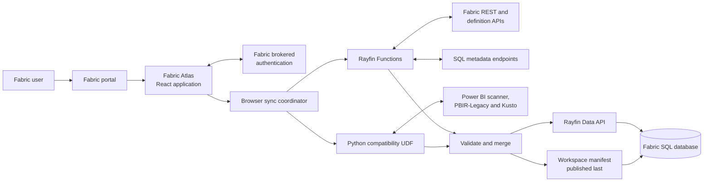
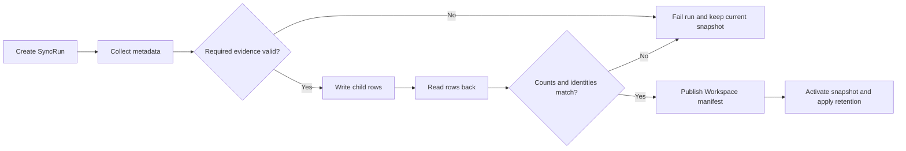

# Architecture

Fabric Atlas is a React and Rayfin Data App that indexes governance metadata
from selected Microsoft Fabric workspaces. It stores validated metadata
snapshots in a Fabric SQL database. It never stores workspace business rows.

## System overview



## Runtime components

| Component | Responsibility |
|---|---|
| React application | Navigation, workspace switching, synchronization, catalog, lineage, governance and access review |
| Fabric brokered authentication | Signs the user into the app inside the Fabric portal |
| Rayfin Functions | Collect core Fabric metadata with application identity and bounded contracts |
| Python compatibility UDF | Collect only the remaining Power BI, PBIR-Legacy and Kusto gaps |
| Rayfin Data API | Exposes the persisted Atlas schema with row policies |
| Fabric SQL database | Stores workspace-scoped snapshots, history, notes and personal state |
| Local Atlas MCP | Optional read-only stdio access to validated snapshots |

## Workspace scope

`WorkspaceScope` stores the synchronizer-selected workspaces shared with the
complete authenticated app audience.

Each workspace has:

- its own validated manifest;
- its own items, lineage, access, jobs and configuration rows;
- its own synchronization history;
- one active snapshot at a time.

Only one workspace is active in the UI. Switching workspaces reloads that
workspace's latest trusted snapshot without mixing rows from another
workspace.

The configured synchronizer is the only identity allowed to:

- change the shared workspace scope;
- publish or prune snapshots;
- update shared governance targets and exceptions.

## Synchronization flow

Synchronization is serialized in the synchronizer's browser tab.

1. Discover the selected workspace scope.
2. Create a correlated `SyncRun`.
3. Invoke bounded Rayfin collectors.
4. Build the exact Python compatibility plan.
5. Validate every collector envelope and item identity.
6. Merge required and optional evidence.
7. Write snapshot child rows.
8. Read the rows back through production pagination.
9. Publish the workspace manifest last.
10. Apply retention after publication.

A failed or cancelled run preserves the previous validated snapshot.
A failed workspace does not stop another selected workspace from
synchronizing.

### Collector ownership

| Evidence | Primary collector | Compatibility path |
|---|---|---|
| Workspaces, items, roles and jobs | `workspaceCollectCore` | Explicit rollback only |
| Ontology, Graph Model and Data Agent definitions | `workspaceCollectDefinitions` | None |
| Power BI model and PBIR structure | `workspaceCollectPowerBi` | Scanner fallback where definition evidence is unsupported |
| Item Relations Preview | `workspaceCollectItemRelations` | None; remains Beta and non-authoritative |
| KQL structural metadata | `workspaceCollectKqlMetadata` | Kusto live schema where required |
| SQL Database, Warehouse, Lakehouse and Mirrored Database catalogs | `workspaceCollectSqlMetadata` | None |
| Shortcuts, mirroring and materialized lake view provenance | `workspaceCollectSourceProvenance` | None |
| Fabric Policies context | `workspaceCollectAccessPolicyEvidence` | Portal-only evidence stays unavailable |
| Power BI admin scanner and scanner lineage | Python `sync_compatibility` | Retained until Rayfin exposes a documented Power BI audience |
| PBIR-Legacy pages | Python `sync_compatibility` | Retained until the supported definition path covers legacy reports |
| Kusto live metadata | Python `sync_compatibility` | Retained until Rayfin exposes a documented Kusto audience |

Rayfin collector output is not published directly. The browser accepts a
snapshot only after the complete required contract passes validation.

## Rayfin Function contracts

Functions are synchronizer-gated and accept strict workspace, item and
correlation identifiers. They do not accept browser tokens, arbitrary URLs or
arbitrary queries.

Shared protections include:

- fixed Fabric API routes;
- redirect rejection;
- continuation origin and path validation;
- page, record and response-size limits;
- bounded retries and `Retry-After` handling;
- execution deadlines and cancellation;
- fixed error codes without upstream response bodies;
- metadata-only allowlists.

The generated Function schema and runtime metadata live in
`rayfin/functions/src/types.ts` and
`rayfin/functions/runtimemetadata.json`. Regenerate them through the Rayfin
CLI. Do not edit them by hand.

## Python compatibility boundary

The Python UDF exposes:

- `sync_compatibility` for the exact retained collector plan;
- `sync_all` and `sync_items` for explicit rollback;
- `ping` for basic validation.

The normal 2.0 path uses `sync_compatibility`. It cannot rediscover the
workspace or run an unrequested collector.

The UDF keeps its existing execution deadline, retry bounds, payload limits and
metadata allowlists. It never returns table rows, credentials, connection
strings, prompts, few-shot examples or query text.

See [Rayfin platform gaps](rayfin-platform-gaps.md) for the contracts required
to remove this compatibility layer.

## Snapshot publication

The workspace manifest is the visibility marker.



Rows without a complete manifest remain invisible to normal hydration.

Snapshot retention defaults to 12 and can be configured from 2 to 50. Child
rows are removed before a stale manifest. Cleanup failure does not invalidate
the newly published snapshot.

## Persisted model

| Entity | Purpose |
|---|---|
| `Workspace` | Workspace-scoped snapshot manifest and compact governance summary |
| `FabricItem` | Top-level Fabric item |
| `LineageEdge` | Trusted source-to-consumer relationship |
| `Principal` | User, group, service principal or guest |
| `AccessGrant` | Workspace or item grant evidence |
| `JobRun` | Recent Fabric job evidence |
| `ConfigEntry` | Bounded configuration, schema chunks and provenance |
| `Comment` | Shared append-only workspace or item note |
| `SyncRun` | Running, completed or failed synchronization attempt |
| `WorkspaceScope` | Shared selected workspace IDs |
| `ItemRelationsEvidenceSnapshot` | Chunked Beta relationship evidence |
| `OperationalIncident` | Sanitized observed job-failure incident |
| `SavedView` | User-scoped navigation preset |
| `AccessReview` and `AccessReviewEvent` | User-scoped review state and history |
| `FindingAck` | User-scoped acknowledgement or mute |
| `GovernancePolicy` | Shared posture targets |
| `GovernanceException` | Shared time-bounded exception |

The complete entity definitions and policies are in `rayfin/data/`.

## Read scopes

The selected catalog and shared notes are readable by every authenticated user
admitted to the Fabric App.

The following state is user-scoped:

- saved views;
- access-review decisions;
- Radar acknowledgements and mutes;
- browser-local display preferences.

The Fabric App audience is therefore the catalog disclosure boundary.

## Catalog and object inventory

Atlas indexes every top-level Fabric item returned by the Items API. Deeper
inventory depends on the item family and verified collection contract.

Supported object projections include:

- Lakehouse tables and SQL analytics endpoint columns;
- Warehouse, SQL Database and Mirrored Database tables, views and columns;
- Semantic Model tables, columns, measures and selected DAX;
- KQL tables, columns, functions, parameters and materialized views;
- Ontology entities, properties, bindings and relationships;
- Graph Model node types, edge types and mappings;
- Data Agent source references and selected elements;
- shortcuts, mirroring and materialized lake view provenance.

The item-family registry in `src/atlas/item-families.ts` records catalog,
object, lineage, access and operations coverage independently.

## Lineage

### Trusted Atlas lineage

`LineageEdge` contains validated snapshot relationships normalized from source
to consumer. The initial graph layout is stable and staged from orchestration
through storage, endpoints, models and consumers.

Impact mode filters the graph to the selected upstream and downstream
component. Reset restores the computed layout and clears selection, focus,
drag state and Preview expansion.

### Item Relations Preview

Item Relations evidence is stored separately from `LineageEdge`.

The Preview switch replaces the trusted graph while active. It preserves raw
`relationType`, composite `workspaceId:itemId` identities, collection status
and cross-workspace evidence.

Preview evidence never becomes trusted lineage automatically.

### Object lineage and X-Ray

Object lineage combines synchronized objects with trusted item relationships.
DAX edges are emitted only when a reference resolves to one real synchronized
column or measure.

Semantic X-Ray provides:

- model selection;
- measure and column search;
- Depends on and Used by direction;
- direct and transitive traversal;
- ambiguity and cycle evidence.

Atlas does not claim report visual field usage because the current collection
path does not expose it reliably.

## Governance and access

Governance Center reads the same validated snapshot through:

- Posture;
- Findings;
- Changes;
- History;
- Coverage;
- Policies & AI.

Access Review combines recorded workspace and item grant paths. It keeps
restriction layers separate from grant evidence.

What-if removes recorded grant paths in memory only. It does not call a Fabric
write API and does not claim to model unavailable OneLake security, Purview DLP
or group membership.

## Operations

Jobs & health stores recent job metadata and sanitized operational incidents.
Observed failures remain separate from downstream impact inferred through
lineage.

Atlas currently collects Fabric job history. Workspace monitoring, Monitor Hub
alerts and Fabric App Metrics remain portal-only.

## Scheduling boundary

Synchronization still requires an open browser because:

- Fabric Apps backend Functions expose no documented unattended timer or
  trigger;
- the remaining compatibility collectors require a delegated identity;
- Atlas never stores or replays browser access or refresh tokens;
- Rayfin exposes no distributed claim and transactional fencing contract for
  an unattended multi-host workflow.

Scheduled refresh remains disabled.

## Read-only Atlas MCP

The optional local stdio MCP server reads the same validated snapshots as the
app. It runs on the MCP client machine, not inside a Rayfin Function.

The MCP is read-only and limited to the selected workspace scope. It exposes
catalog, impact, lineage, access, incident and snapshot evidence without
personal review state.

Activation remains gated by a dedicated public client, delegated
`Item.Execute.All`, reviewed external Entra exchange and live Conditional
Access validation.

## Security boundary

Atlas stores governance metadata, not business content.

Excluded content includes:

- table and event rows;
- credentials and connection payloads;
- Power Query and source expressions;
- notebook source and cells;
- pipeline activities and expressions;
- Data Agent prompts, instructions and few-shots;
- graph instances and filter values;
- KQL rows, query text and policy bodies;
- mirrored source rows and source database names.

Unexpected collector fields are not persisted by default.

## Deployment

The canonical Fabric deployment command is:

```powershell
npx rayfin up `
  --tenant <tenant-id> `
  --workspace-id <workspace-id> `
  --item-name fabric-atlas `
  --yes
```

Rayfin deploys the AppBackend, SQL schema, typed Functions and static app.
Publish the Python compatibility UDF separately by round-tripping its complete
Fabric definition and replacing only `function_app.py`.

See [Installation and deployment](installation.md) for the complete workflow.

## Source map

| Path | Responsibility |
|---|---|
| `src/App.tsx` | Application shell and active-workspace navigation |
| `src/atlas/store.tsx` | Hydration, switching, synchronization and comments |
| `src/atlas/browser-collector-sync.ts` | Rayfin collector composition and compatibility planning |
| `src/atlas/live-sync.ts` | Snapshot contracts and Python compatibility invocation |
| `src/atlas/backend.ts` | Persistence and trusted snapshot loading |
| `src/atlas/lineage.ts` | Lineage normalization, traversal and layout |
| `src/atlas/item-relations-evidence.ts` | Beta relation contract and semantics |
| `src/atlas/source-provenance-snapshot.ts` | Shortcut, mirroring and materialized lake view projection |
| `src/atlas/views/` | Product screens |
| `src/mcp/` and `src/atlas/mcp/` | Local read-only MCP |
| `rayfin/data/` | Entities and row policies |
| `rayfin/functions/` | Typed Rayfin Functions |
| `fabric/udf/atlas_sync_functions/` | Python compatibility collector |

## Related documentation

- [Data model](data-model.md)
- [Item-family coverage](item-families.md)
- [Lineage depth](lineage-depth.md)
- [Item Relations evidence](item-relations-evidence.md)
- [Source provenance](source-provenance.md)
- [Access policy evidence](access-policy-evidence.md)
- [Observability](observability.md)
- [Rayfin platform gaps](rayfin-platform-gaps.md)
- [Atlas MCP](atlas-mcp.md)
