# Fabric Workspace Monitoring Report templates (preview)

## Introduction

### Workspace Monitoring (preview)
Large data solutions typically generate disparate and complicated data that can be difficult to converge into a single view. Workspace Monitoring provides a seamless, consistent experience with end-to-end visibility across Fabric workloads. Fabric Workspace Monitoring enables users to correlate events from origination to subsequent operations and queries across Fabric experiences and services.

Workspace Monitoring is a built-in solution that enables users to:

- drive root-cause analysis
- analyze historical logs
- detect anomalies

When Workspace Monitoring is enabled at the workspace level, the workspace will start sending the selected diagnostics to a KQL database within Fabric that can be queried using KQL or SQL.

----------- 

### Report templates (preview)
**for Workspace Monitoring**

This module of the Fabric toolbox provides a set of pre-built reports (Real-Time Dashboard and Power BI Report) on top of the Fabric Workspace Monitoring feature to be able to easily monitor your workspace from day one.

There are two monitoring template options available:

###### Real-Time Dashboard: 
This template allows users to track workspace activities in real-time. It provides an operational tool for users to analyze issues within seconds, and zoom in to exact time periods that an event occured.

###### Power BI Report: 
This template allows users to configure connections to the Monitoring Eventhouse to retain detailed historical activity data.

### It is real. In Real-Time Dashboard

This template, in combination with Workspace Monitoring features, allows users to track workspace activities in real-time. It connects directly to the underlying monitoring Eventhouse KQL database, providing an overview of items, operations, and users. Users can also compare DAX improvements between semantic models. Users can deep dive an analyze the Query and Ingestion patterns of Eventhouses. 

The Real Time Dashboard template is structured on the following way:
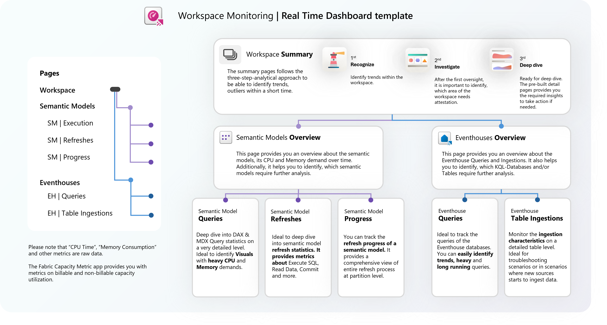

##### Screenshots | Real Time Dashboard template

Workspace Overview

Eventhouse logs
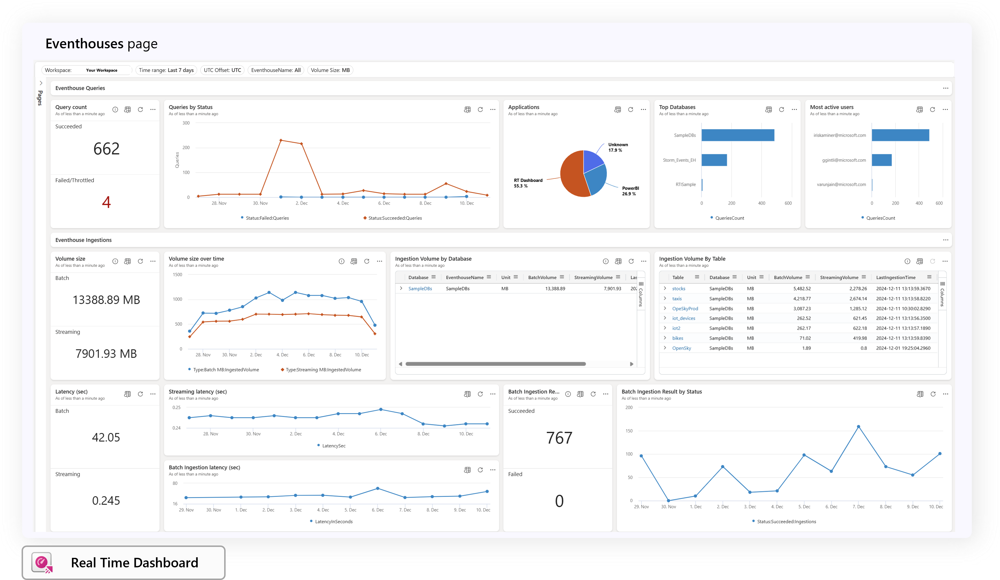

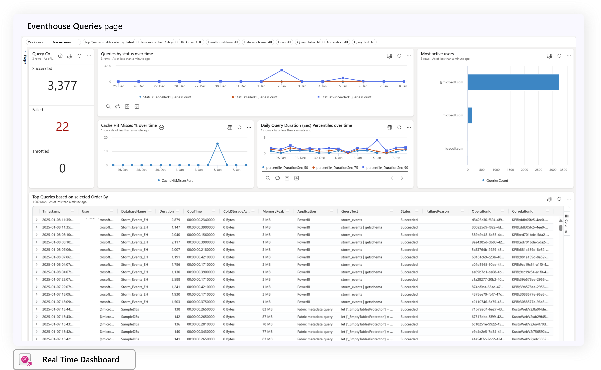

Semantic Model logs
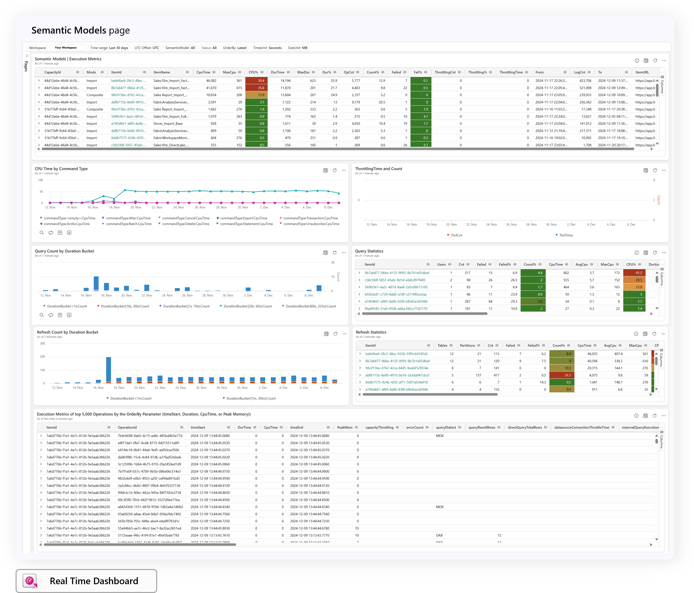

**Recommendation:** We recommend to filter the detail pages for a subset of semantic models for a short time period to avoid the 50.000 row result set soft limit.
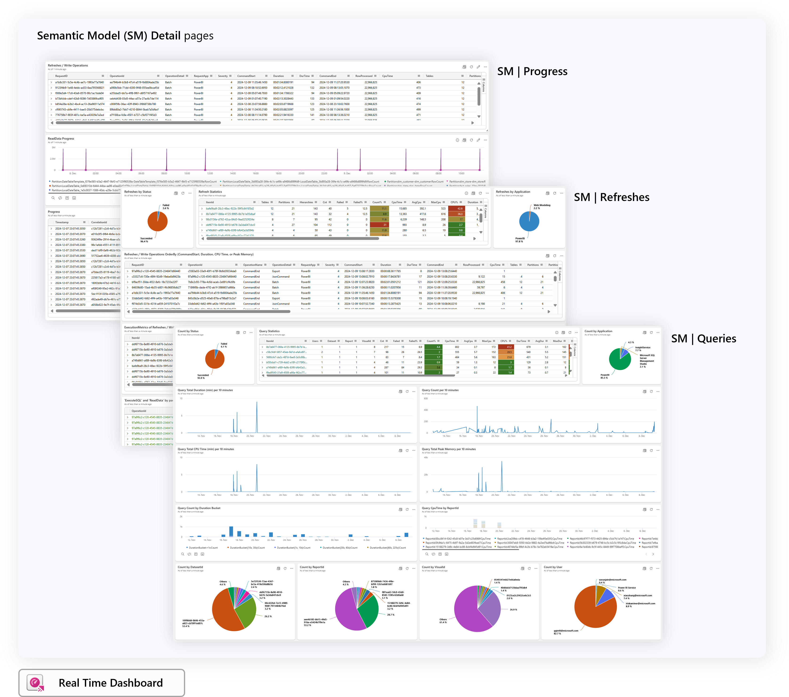

##### Additional information | Real Time Dashboard template

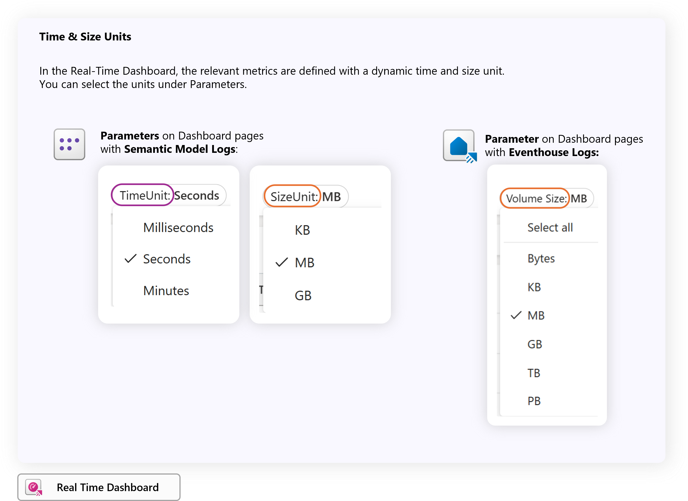

### Log Insights in Power BI Report

The Power BI allows users to configure connections to Monitoring Eventhouse where they can retain detailed historical activity data. This repo hosts **Power BI report** templates (.pbit) that you can point to your Monitoring Eventhouse databases to load data and get insights.

We have ported and enhanced the 'Fabric Log Analytics for Analysis Service Engine report template', which retrieved the data with the BYOLA approach.

Now, you can seamlessy connect and track your workspace items, operations, visuals etc. without leaving the SaaS experience from Microsoft Fabric.

The Power BI Report template is structured on the following way:
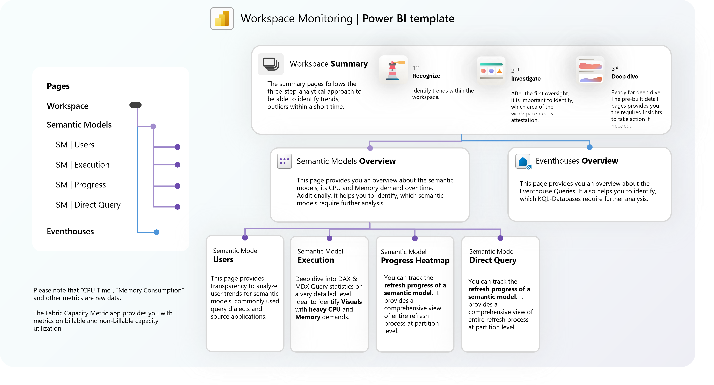

##### Screenshots | Power BI template

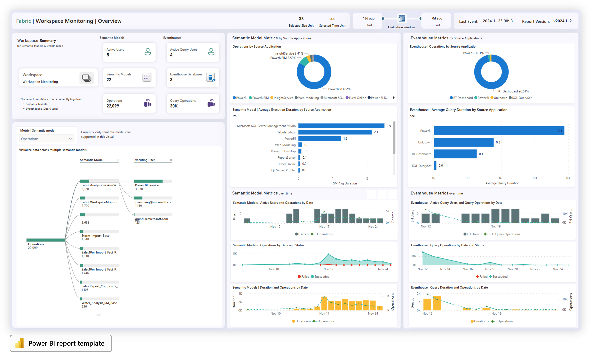

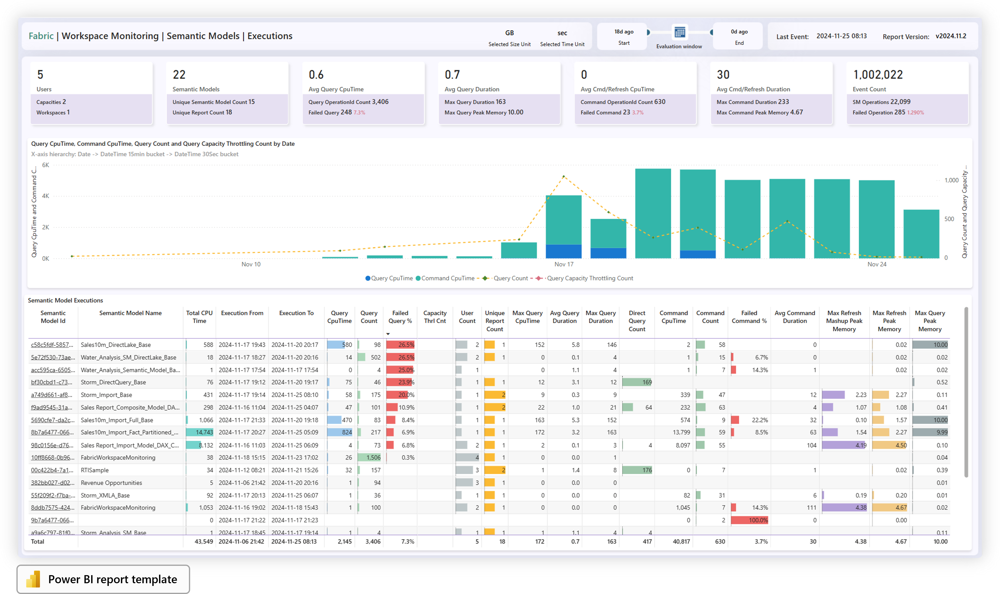

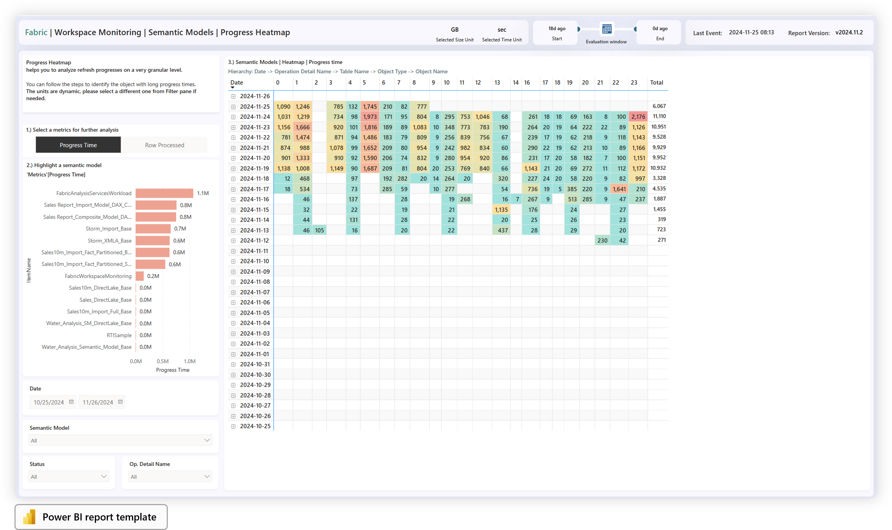

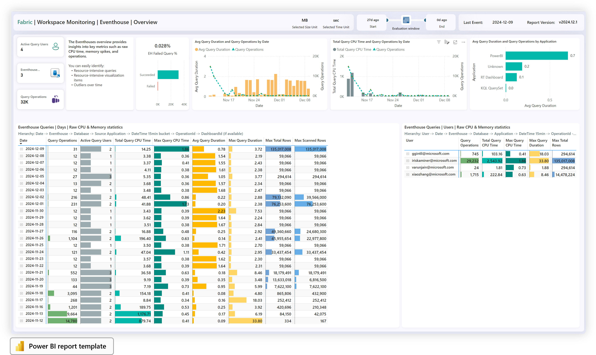

##### Screenshots | AI & ML based analysis | Power BI template

The Q&A report pages provides difference approaches to analyze the 'SemanticModelLogs' and 'EventhouseQueryLogs' with AI & ML.

We have prepared three approaches, which helps you in ad-hoc analysis scenarios:

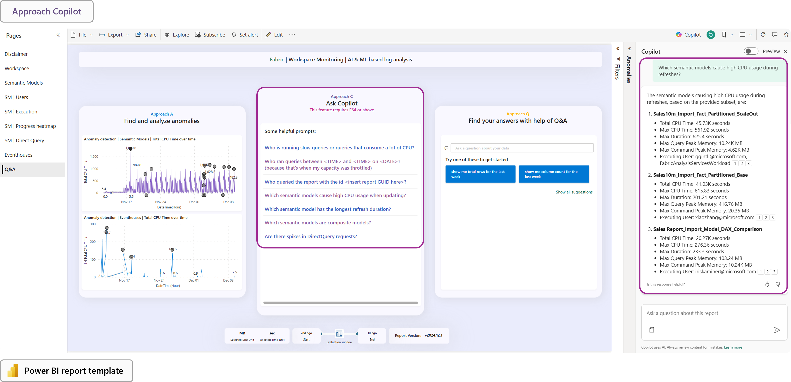

##### Additional information | Power BI template

The **SM Query Diagnostic** is a drill-through analyzer page, which focuses on the details of a given query (one OperationId).

### Migrate from BYOLA
We recommend to use the Power BI report template for the new Workspace Monitoring feature in Microsoft Fabric, whenever you are migrating your workspace monitoring solution from (BYOLA) Log Analytics Workspace monitoring.

-----------
## Setup

**Before you begin:** 
Workspace Monitoring features must be enabled for the Workspace under the Workspace settings.

The following step-by-step guide describes the initial configuration step of the **dashboard/report template**.

### Setup | Real Time Dashboard template

#### Steps
###### Preparation
- Download the '**Workspace Monitoring Dashboard.json**' template file from the repository
- Navigate to your workpace

###### Main steps
1. Click on '**New item**'
2. Create a new '**Real-Time Dashboard**' item
3. Provide a dashboard name 
4. Click on '**Create**'
4. Navigate to the Dashboard and select the '**Manage**' tab
6. Click on '**Replace from file**'
7. Select the downloaded '**Workspace Monitoring Dashboard.json**' template

8. Click on '**Data sources**'
9. Click on '**Add**' on the side bar
10. Select the **OneLake data hub**
11. Select the preferred Monitoring KQL database from OneLake catalog
12. Click on '**Connect**'

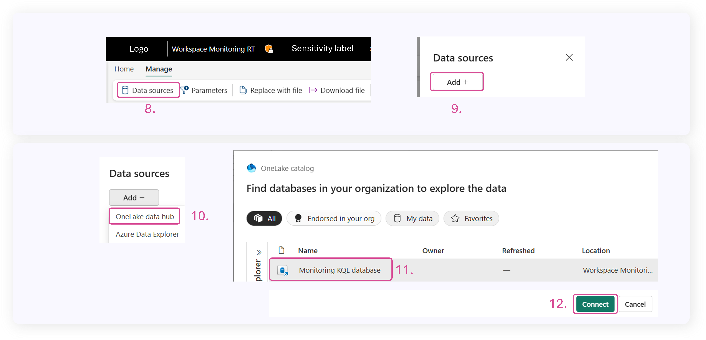

13. Provide a data source name
14. The data source shall be connected to several tiles, parameters and base queries
15. Select the initial value of the **Workspace** parameter on the menu bar
16. '**Save**' the Dashboard
17. '**Refresh**' the Dashboard
18. Switch the UI experience to **Viewing**

Congratulations! You are ready to go!

### Setup | Power BI template

The following parameters are defined in the template:

|**Parameter**  |**Description**  |
|---------|---------|
| **Query URI** * | Globally unique identifier uri of the Eventhouse Monitoring database containing the Semantic model logs. |
| **Days Ago To Start** * | Load data from the specified day to the time the call was initiated. The maximum value you can select is 30 days. However, your Premium capacity/Fabric SKU memory limits apply to this parameter. If those limits are exceeded, the template might fail to refresh. |
| **Days Ago To Finish** * | Load data up to the specified number of days ago. Use 0 for today. |
| **UTC Offset Hours** * | An hourly offset used to convert the data from Coordinate Universal Time (UTC) to a local time zone. |
| **Fabric Item Id**  | Optionally enter a fabric artifact (semantic model) Id. |
| **RangeStart** | Optionally enter the start date for incremental refreshes |
| **RangeEnd** | Optionally enter the end date for incremental refreshes |

#### Steps
1. Download the '**Fabric Workspace Monitoring.pbit**' file from the repository
2. **Open** the report in Power BI Desktop
3. **Paste** the **URI** of the Monitoring Database to the first parameter
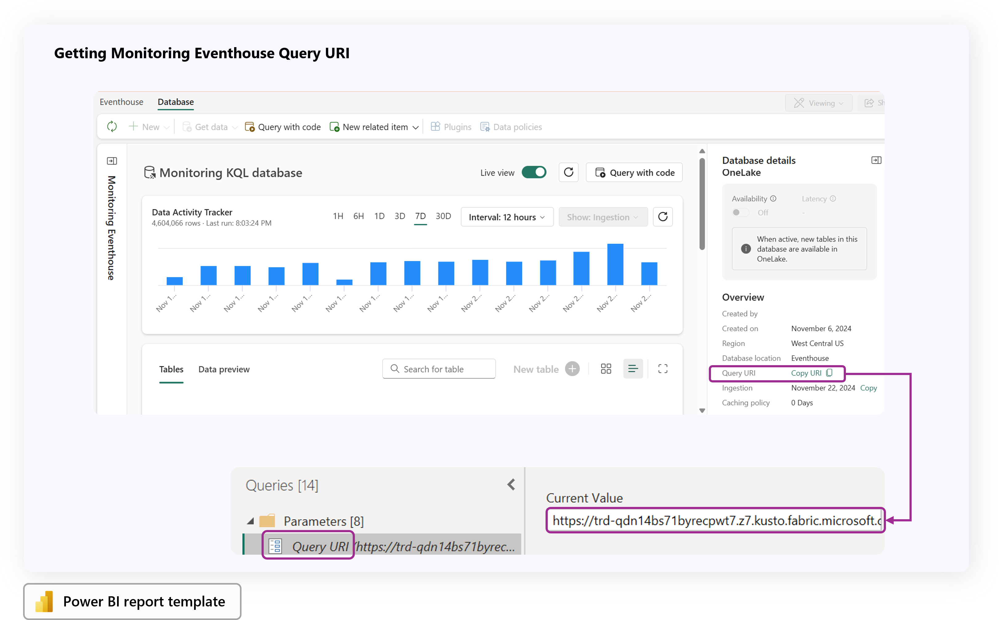
4. **Sign-in** with your Microsoft Account
5. Click on '**Load**'
6. **Save** the report (for instance as a '.pbix' file)
7. **Publish** the report in a preferred workspace
8. **Navigate** to the settings of the semantic model
9. **Edit** the credentials of the data source in Fabric
10. Trigger the first initial refresh in Fabric
    - Optionally - Schedule the semantic model refresh, if preferred
11. Once the refresh has been succedeed, open the report

**Optimize Power BI refreshes for the template**
Additionally, you can optimize the Power BI report template usage, you can configure the incremental refresh for each table.

## Considerations and limitations

**Power BI report template**
- **Eventhouse Query Limits**
    - If the template refresh fails due to the data volume, you can filter the data by configuring the Fabric Item Id parameter.

## Remarks

**Capacity utilization:**
Please note that the **report templates** and the items of the  Workspace Monitoring **are utilizing CU of your capacity.**

**CPU & Memory metrics in Monitoring Eventhouse and templates:**
Please note that the CPU and Memory related metrics are **not aggregated, smoothed or bursted, like the operations in the Microsoft Fabric Capacity Metrics App**. A one-to-one comparison is for different reasons not possible. Billable capacity utilization and storage information are shown in the Microsoft Fabric Capacity Metrics App. https://learn.microsoft.com/en-us/fabric/enterprise/metrics-app

Please test the solution on a non-production Fabric SKU first without impacting other workloads on your tenant.

## Support
These templates (Real Time Dashboard template and Power BI template) **are not official Microsoft services**. 

**Ideas/Suggestions:**
Submit your ideas and suggestions as an issue in this repository.

**Bug Reports:** 
We maintain a backlog in the project issues page. Let us know if you run into any problems or share your suggestions by adding an entry into the issues section.

**Important**
Please, **do not** open a support ticket in case of an issue regarding the templates.
In case of any questions, issues regarding the templates, please **create an issue in this repository.**

For more information, please visit the main page of this repository or the learn.microsoft.com website.

## Trademarks
This project may contain trademarks or logos for projects, products, or services. Authorized use of Microsoft trademarks or logos is subject to and must follow Microsoft's Trademark & Brand Guidelines. Use of Microsoft trademarks or logos in modified versions of this project must not cause confusion or imply Microsoft sponsorship. Any use of third-party trademarks or logos are subject to those third-party's policies.
