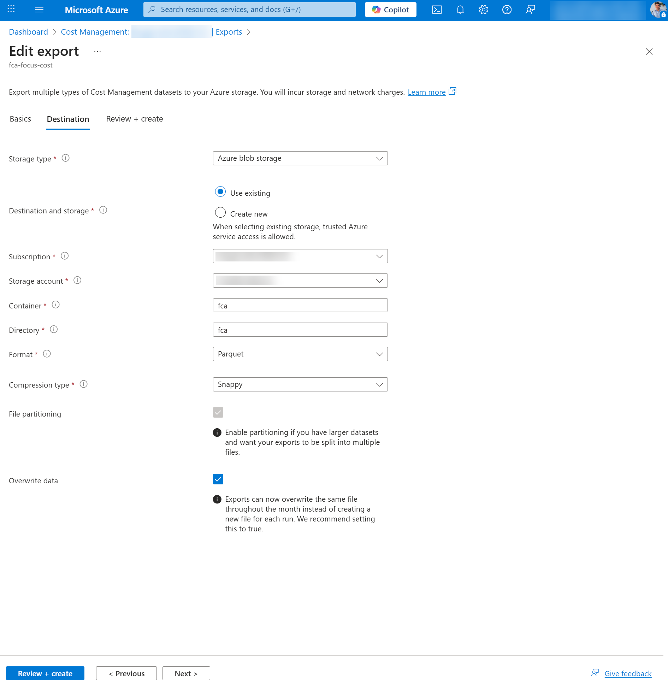
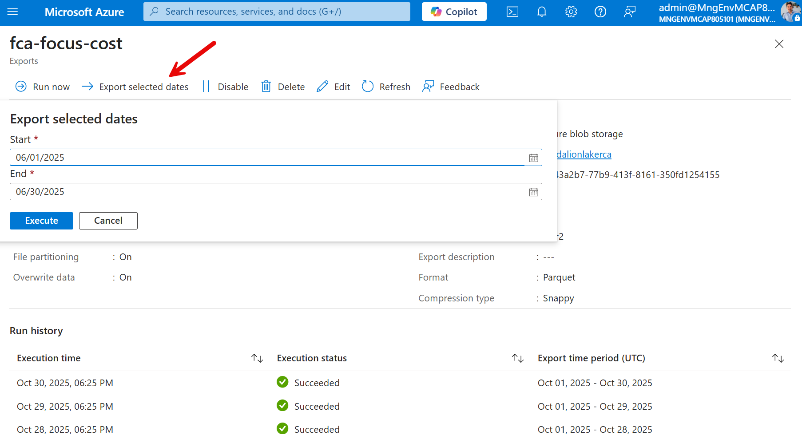
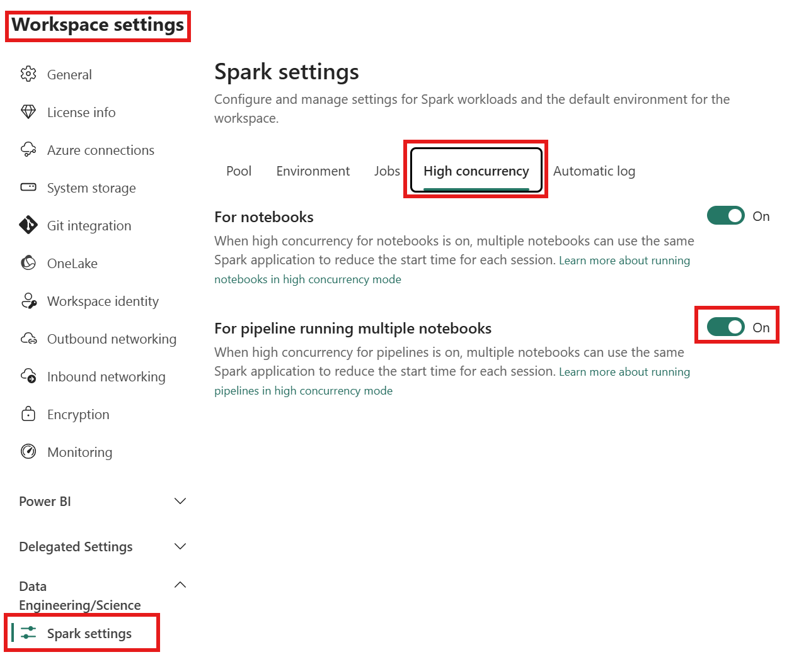
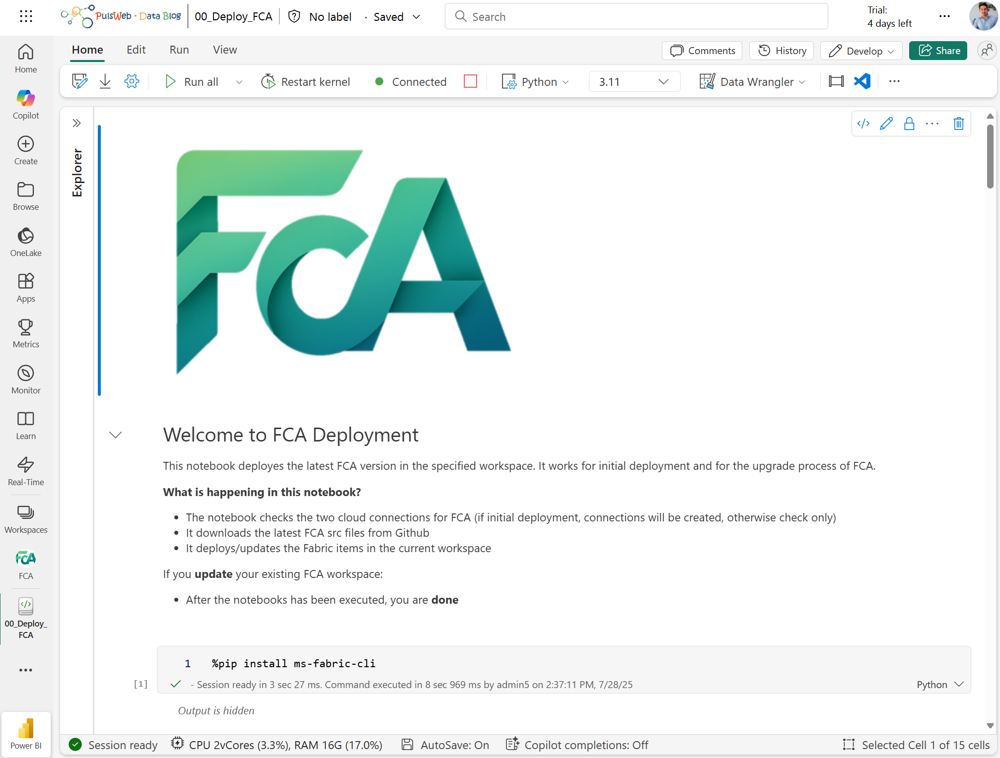
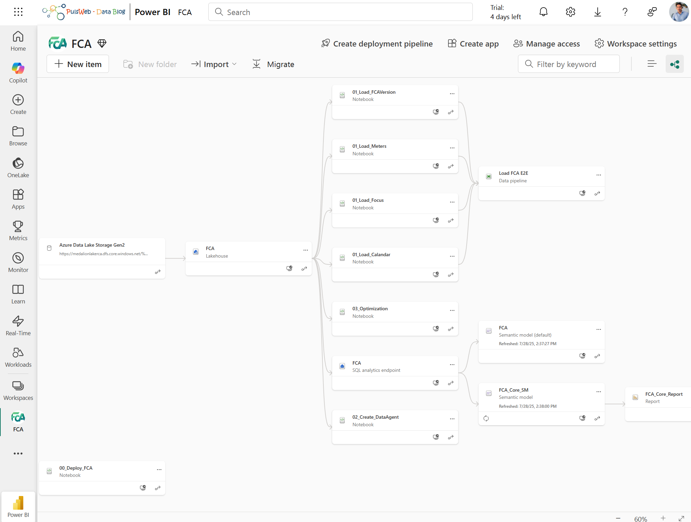
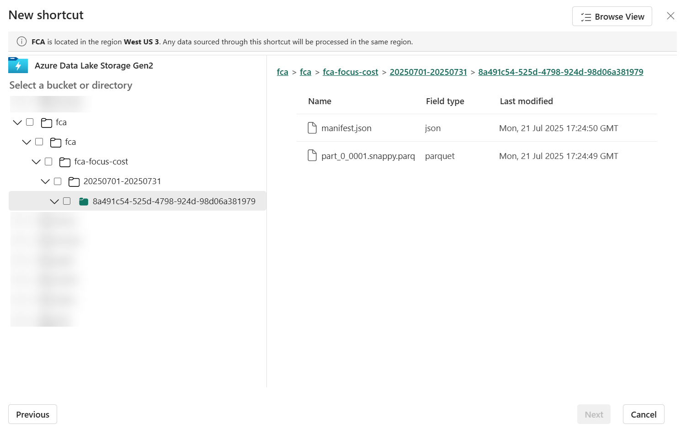
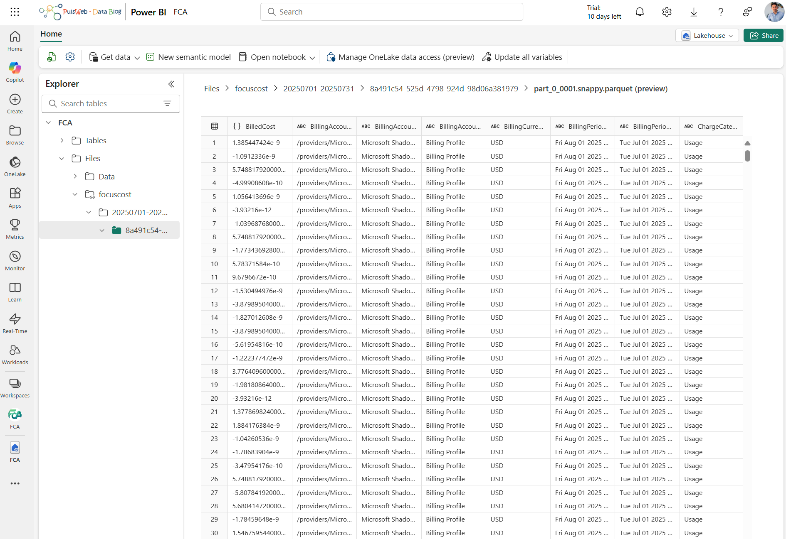
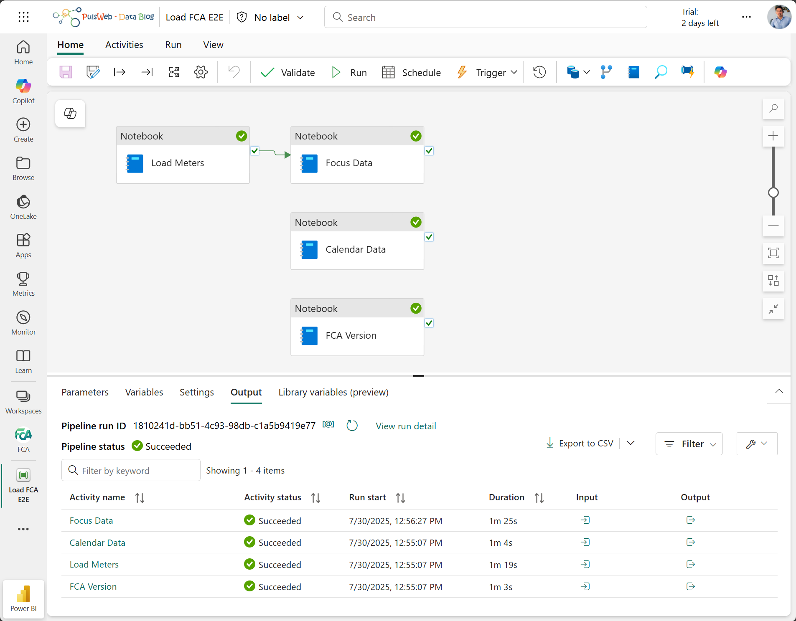

# Deploy

🎬 Setup demo available on YouTube: [Fabric Cost Analysis - Deployment](https://youtu.be/ehxiauTPvkA)

> Since not all users will be interested in analyzing reservations or quotas, nor in using a Data Agent on top of the FCA, we have added additional optional steps that can be followed during the initial deployment or added later.

🏃‍♂️‍➡️ Are you ready to try FCA? Let's follow these simple steps:

## 1 - Configure export

### 1.1 - Cost FOCUS Data

🚩 If you've already deployed [FinOps hubs](https://learn.microsoft.com/en-us/cloud-computing/finops/toolkit/hubs/finops-hubs-overview), you can plug the FCA on top and so you can skip this 1.1 steps.

To create an export (Create [Cost Management exports](https://learn.microsoft.com/en-us/azure/cost-management-billing/costs/tutorial-improved-exports#create-exports)) the [Cost Management Contributor role](https://learn.microsoft.com/en-us/azure/cost-management-billing/costs/understand-work-scopes#roles-used-in-cost-management-on-rbac-scopes) will be required.

>ℹ️ Azure Cost export is available for various Azure account types, including Enterprise Agreement (EA) and Microsoft Customer Agreement (MCA) customers. To view the full list of supported account types, see [Understand Cost Management data](https://learn.microsoft.com/en-us/azure/cost-management-billing/costs/understand-cost-mgt-data).

An Azure Data Lake Storage Gen2 is necessary for saving exported data, the following steps outline how to create a storage account: [Create a storage account](https://learn.microsoft.com/en-us/azure/storage/blobs/create-data-lake-storage-account).

Once Data Lake Gen 2 storage account created here are the high levels steps to create an export:
- Sign into the Azure portal at [https://portal.azure.com](https://portal.azure.com/), search for **Cost Management**
- Select the required scope and select **Exports** in the left navigation menu
- Select **+ Create**
- On the Basics tab, select the template = **Cost and usage (FOCUS)**

- On the Datasets tab, fill in **Export prefix** with "fca"
- On the Destination tab, select:
  - Storage type = **Azure blob storage**
  - Destination and storage = **Use existing**
  - Subscription = Your subscription
  - Storage account = Your storage account
  - Container = **fca**
  - Directory = **fca**
  - Format = **Parquet**
  - Compression type = **Snappy**
  - Overwrite data = **Enabled**

- On the Review + Create tab, select **Create**
- Run the export by selecting **Run now** on the export page

>ℹ️ When performing the export, you have the option to retrieve one year of historical data in one-month chunks:
>
> 

## 2 - Configure Fabric items

- In Microsoft Fabric portal, create a new workspace "FCA" (name can be changed), which is backed by a capacity (Trial, P# or F#)
- Download the ([Workspace logo](./media/FCA%20Logo%20Small.png)) and add the logo to the workspace
- You can configure the Workspace to allow the share of a high concurrency session during the pipeline execution to limit the Spark vCore needs during the execution of parallel notebooks
  
- Download and import the **[00_Deploy_FCA.ipynb](./script/00_Deploy_FCA.ipynb)** Notebook into your FCA workspace ([Import existing notebooks](https://learn.microsoft.com/en-us/fabric/data-engineering/how-to-use-notebook#import-existing-notebooks))
- Click "Run All" in the Notebook

- Navigate to your FCA Workspace and refresh the browser to view the newly created artifacts

- Create a new File Shortcut on the FCA Lakehouse ([Create an Azure Data Lake Storage Gen2 shortcut](https://learn.microsoft.com/en-us/fabric/onelake/create-adls-shortcut))
  - Select the ellipsis (**...**) next to **Files**
  - Select **New shortcut**
  - Select Azure Data Lake Storage Gen 2 and provide the following settings:
    - URL = **Data Lake Storage** URL of the Data Lake storage account. To get the Data Lake Storage URL, view the storage account where the export created a directory and the FOCUS cost file (If your're using **FinOps Hub**, use the existing storage account with the ingestion container). Under **Settings**, select **Endpoints**. Copy the URL marked as **Data Lake Storage** it should look like this: *https://###.dfs.core.windows.net*
    - Connection = **Create a new connection**
    - Connection name = <*Any name of your choice*>
    - Authentication kind = **Organizational account**
    - Sign in when prompted
    - Select the Shortcut target sub path:
      -  For <u>Focus export configured previously</u>: **fca-focus-cost** and click on Next (⚠️ Ensure the selected hierarchy is correct)
      -  For <u>FinOps Hub</u>: **Costs** in the ingestion container and click on Next

- Rename the Shortcut to **focuscost** and click on Create

- Verify access to the data

### 📍 Optional Steps

Azure Quota Data : [Click here to configure quota analysis](./Quota.md)

Reservation : [Click here to configure reservation analysis](./Reservation.md)

## 3 - Run the Pipeline

- Open the **Load FCA E2E** Data pipeline and Run the Pipeline once (Optional activities are deactivated by default and can be enabled if needed)

>ℹ️ The parameters "FromMonth" and "ToMonth" in the Data pipeline can be configured to specify the historical time frame of data processing. For example, setting FromMonth = -3 and ToMonth = 0 will load data from the previous three months.

The pipeline can be scheduled for daily loads ([Scheduled data pipeline runs](https://learn.microsoft.com/en-us/fabric/data-factory/pipeline-runs#scheduled-data-pipeline-runs)).
We recommend configuring "FromMonth" = -1 and "ToMonth" = 0 to manage the FOCUS updates of the previous month that occurred during the first week of the current month.

## 4 - Open the report

- Navigate to your FCA workspace

- Search for the item FCA_Core_Report

- Open the FCA_Core_Report Power BI report

- Feel free to explore the report pages

ℹ️ Refresh the SQL Endpoint of the Lakehouse and update the semantic model in case of errors.

## 5 - (Optional) Create the Data Agent

Since it's required additional prerequisites, the creation of the Data Agent is optional ([Data Agent prerequisites](https://learn.microsoft.com/en-us/fabric/data-science/how-to-create-data-agent#prerequisites)).

Steps to create the Data Agent:
- Open the **02_Create_DataAgent** Notebook
- Click "Run All" in the Notebook
- Navigate to your FCA Workspace and refresh the browser to view the newly created artifact *FCA_Agent* and open it to chat with your data
- Enhance custom agents in Microsoft Copilot Studio by leveraging insights from FCA Fabric Data Agent and chat in Teams, as demonstrated in following video: https://www.youtube.com/watch?v=GCtk2HPxZi8

# Update

To update FCA (Fabric Cost Analysis) to the latest version, follow the documented steps below.

☑️ Review FCA release notes for the roadmap and updates: [FCA Release notes](https://github.com/microsoft/fabric-toolbox/blob/main/monitoring/fabric-cost-analysis/changelog/README.md)

🚩 Important:

- Updates overwrite all FCA provided items based on the item’s name
- Updates do not affect your collected data within the Lakehouse only the metadata will be overwritten
- If you have made custom changes to pipelines, notebooks, semantic models, and reports, please create a backup or rename your custom items
- Use the same user to update FCA as you used during the initial deployment. It is important to do so because this user is the owner of all the related items

Steps to update:

- 1 - Download the latest version of the **[00_Deploy_FCA.ipynb](./script/00_Deploy_FCA.ipynb)** Notebook
- 2 - Remove the old "00_Deploy_FCA" Notebook from your workspace
- 3 - Import the updated notebook into your FCA workspace
- 4 - Run the 00_Deploy_FCA.ipynb Notebook
- 5 - Update Pipeline parameters
- 6 - Open PBI report

>ℹ️ This notebook is designed to initially deploy or update all the items in your FCA workspace. You do not need to manually run the Load FCA E2E pipeline after an update. During the next pipeline run, FCA will also check and update the status of your FCA version on the first page of the FCA_Core_Report:

