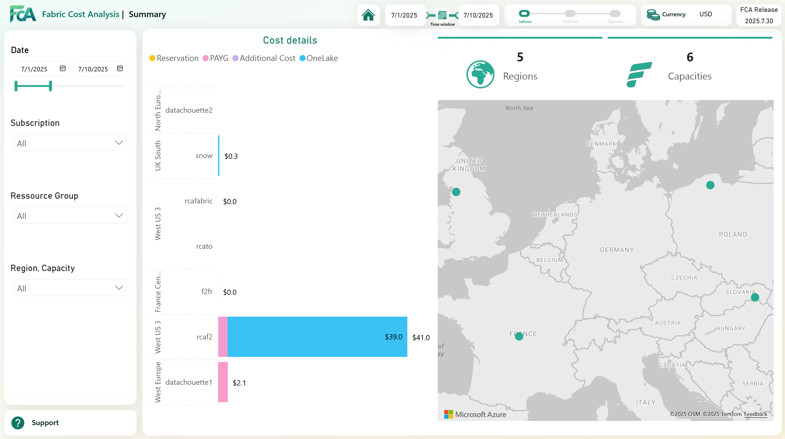
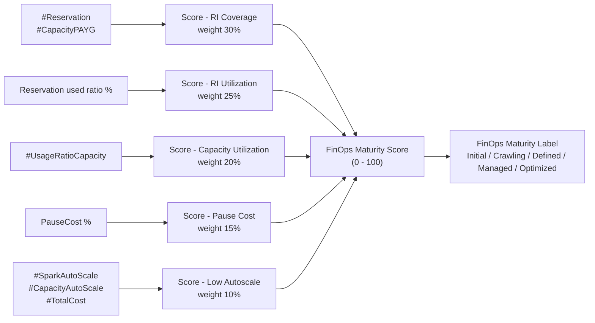

# Fabric Maturity Score

The **Fabric Maturity Score** (also referred to as the **FinOps Maturity Score** in the semantic model) is a composite indicator, on a **0 to 100 scale**, that summarises how well a Microsoft Fabric capacity estate is being managed against FinOps best practices.

It is exposed on the **Summary** page of the FCA report as a gauge with a colour-coded label, and is available in the semantic model so it can be reused in custom reports, Data Agents or alerts.



>ℹ️ All measures referenced below live in the `fca` table of the **FCA_Core_SM** semantic model and are grouped in the `maturity score` display folder. The 5 sub-scores are hidden by default; only the composite **FinOps Maturity Score** and **FinOps Maturity Label** are visible.

---

## 🎯 Why a maturity score?

Microsoft Fabric cost depends on many levers (SKU sizing, reservations, pause/resume strategy, Spark autoscale, capacity overage, ...). Looking at a single KPI is rarely enough to know if a tenant is well-managed.

The Fabric Maturity Score addresses this by:

- **Aggregating** 5 independent FinOps dimensions into one easy-to-communicate KPI
- **Highlighting** the weakest dimension so that optimisation efforts are prioritised where they have the most impact
- **Tracking progress** over time, across capacities, regions, subscriptions or business units
- **Aligning** the conversation with the [FinOps Foundation maturity model](https://learn.microsoft.com/en-us/cloud-computing/finops/framework/finops-framework#lifecycle) (Crawl / Walk / Run)

---

## 🧮 The 5 dimensions

The score is built as a **weighted average** of 5 sub-scores. Each sub-score is normalised to a 0 to 100 scale where **100 = best practice fully achieved** and **0 = worst case**.

| # | Dimension                | Weight | Best-practice target                                 | DAX measure                  |
|---|--------------------------|:------:|------------------------------------------------------|------------------------------|
| 1 | RI Coverage              | 30 %   | 100 % of provisioned capacity backed by a reservation| `Score - RI Coverage`        |
| 2 | RI Utilization           | 25 %   | ≥ 95 % of reserved hours actually consumed           | `Score - RI Utilization`     |
| 3 | Capacity Utilization     | 20 %   | ≥ 70 % of provisioned capacity actively used         | `Score - Capacity Utilization` |
| 4 | Low Pause Cost           | 15 %   | Pause/Delete surcharges ≤ 0 % of capacity spend      | `Score - Pause Cost`         |
| 5 | Low Autoscale & Overage  | 10 %   | Autoscale + Overage ≤ 0 % of total spend             | `Score - Low Autoscale`      |

### Dimension 1 — RI Coverage (weight 30 %)

Measures the share of provisioned Fabric capacity cost that is backed by a **Reserved Instance (RI)** versus **Pay-As-You-Go (PAYG)**.

```DAX
Score - RI Coverage =
VAR RI_Coverage = DIVIDE([#Reservation], [#Reservation] + [#CapacityPAYG])
VAR Score       = MIN(1, DIVIDE(RI_Coverage, 1.0)) * 100
RETURN ROUND(Score, 1)
```

- **100** = all provisioned capacity is RI-backed (best practice)
- **0**   = all provisioned capacity is PAYG (worst case)

| Score   | Interpretation         |
|---------|------------------------|
| ≥ 90    | Excellent              |
| 70–89   | Good                   |
| 50–69   | Needs improvement      |
| < 50    | Critical action required |

**To improve:** purchase or extend RI reservations to cover more of the provisioned Fabric capacity. See [Reservation.md](./Reservation.md) for setup.

### Dimension 2 — RI Utilization (weight 25 %)

Measures the share of **purchased reserved hours** that are actually consumed across all active reservations. A reservation that is paid but unused is pure waste.

```DAX
Score - RI Utilization =
VAR RI_Used = [Reservation used ratio %]
VAR Score   = MIN(1, DIVIDE(RI_Used, 0.95)) * 100
RETURN ROUND(Score, 1)
```

- The target threshold is **95 %** of reserved hours consumed.
- `Reservation used ratio %` is defined in the `reservation_usage` table as the average of `UsedHours / ReservedHours` by `UsageDate` and `ReservationOrderKey`.

| Score   | Interpretation              |
|---------|-----------------------------|
| ≥ 95    | Excellent                   |
| 80–94   | Acceptable                  |
| 60–79   | Review needed               |
| < 60    | RI is largely wasted        |

**To improve:** right-size or consolidate RIs to match actual usage, or increase workload throughput to consume more reserved capacity.

### Dimension 3 — Capacity Utilization (weight 20 %)

Measures how efficiently the provisioned Fabric capacity is being **consumed by workloads**.

```DAX
Score - Capacity Utilization =
VAR Usage = [#UsageRatioCapacity]
VAR Score = MIN(1, DIVIDE(Usage, 0.70)) * 100
RETURN ROUND(Score, 1)
```

- `#UsageRatioCapacity = #UsedCapacity / #ProvisionedCapacity`
- The target threshold is **70 %** average utilisation.

| Score   | Interpretation       |
|---------|----------------------|
| ≥ 90    | Excellent            |
| 70–89   | Good                 |
| 50–69   | Over-provisioned     |
| < 50    | Significant waste    |

**To improve:** right-size the Fabric capacity SKU downward, or increase workload scheduling to fill available CUs.

### Dimension 4 — Low Pause Cost (weight 15 %)

Measures whether **Fabric capacity Pause/Delete surcharges** are kept to a minimum relative to total provisioned capacity spend. These surcharges arise when a capacity is paused before the minimum billing period expires; frequent pause/resume cycles amplify this cost.

```DAX
Score - Pause Cost =
VAR PauseRatio = [PauseCost %]
VAR Score      = MAX(0, (1 - DIVIDE(PauseRatio, 0.10)) * 100)
RETURN ROUND(Score, 1)
```

- `PauseCost % = #PauseCost / (#CapacityPAYG + #Reservation)`
- The score decays linearly to **0** when pause cost reaches **10 %** of provisioned capacity cost.

| Score   | Interpretation         |
|---------|------------------------|
| ≥ 90    | Excellent              |
| 70–89   | Acceptable             |
| 50–69   | Review pause schedules |
| < 50    | High pause waste       |

**To improve:** align pause schedules to respect minimum billing windows, or prefer scaling down over pausing for short periods.

### Dimension 5 — Low Autoscale and Overage (weight 10 %)

Measures whether costly **Spark autoscale bursts** and **capacity overage** charges are kept under control relative to total Fabric spend.

```DAX
Score - Low Autoscale =
VAR AutoscaleRatio = DIVIDE([#SparkAutoScale] + [#CapacityAutoScale], [#TotalCost])
VAR Score          = MAX(0, (1 - DIVIDE(AutoscaleRatio, 0.15)) * 100)
RETURN ROUND(Score, 1)
```

- `#SparkAutoScale` = cost from the meter *"autoscale for Spark Capacity Usage CU"*
- `#CapacityAutoScale` = cost from the meter *"Capacity Overage Capacity Usage CU"*
- The score decays linearly to **0** when these costs reach **15 %** of total spend.

| Score   | Interpretation              |
|---------|-----------------------------|
| ≥ 90    | Excellent                   |
| 70–89   | Monitored                   |
| 50–69   | Capacity may need upsizing  |
| < 50    | Persistent bursting issue   |

**To improve:** upgrade the Fabric capacity SKU to match peak demand, or optimise Spark job scheduling to reduce burst spikes.

---

## 🧩 Composite score

The five sub-scores are combined into a single weighted score:

```DAX
FinOps Maturity Score =
VAR S1 = [Score - RI Coverage]          * 0.30
VAR S2 = [Score - RI Utilization]       * 0.25
VAR S3 = [Score - Capacity Utilization] * 0.20
VAR S4 = [Score - Pause Cost]           * 0.15
VAR S5 = [Score - Low Autoscale]        * 0.10
RETURN ROUND(S1 + S2 + S3 + S4 + S5, 1)
```

$$
\text{Score} = 0.30 \cdot S_{RI\,Cov} + 0.25 \cdot S_{RI\,Util} + 0.20 \cdot S_{Cap\,Util} + 0.15 \cdot S_{Pause} + 0.10 \cdot S_{Autoscale}
$$

A score of **100** represents full FinOps maturity: all capacity RI-backed, fully utilised, no pause waste, no autoscale bursts. A score **below 50** indicates significant cost optimisation opportunities exist.

>💡 To know **where to start**, compare the 5 sub-scores: the lowest-scoring dimension offers the greatest improvement opportunity, weighted by its share of the composite.

---

## 🏷️ Maturity label

The composite score is mapped to a human-readable label aligned with the FinOps Foundation maturity model:

```DAX
FinOps Maturity Label =
VAR Score = [FinOps Maturity Score]
RETURN
    SWITCH(TRUE(),
        Score >= 85, "Optimized",
        Score >= 65, "Managed",
        Score >= 45, "Defined",
        Score >= 25, "Crawling",
        "Initial"
    )
```

| Score range | Label        | Colour    | Meaning                                                         |
|-------------|--------------|-----------|-----------------------------------------------------------------|
| 85 – 100    | **Optimized**| 🟢 `#2AAA92` | Best-in-class cost efficiency                                  |
| 65 – 84     | **Managed**  | 🟩 `#8FD4C7` | Strong practices with minor gaps                               |
| 45 – 64     | **Defined**  | 🟧 `#FFA342` | Processes in place but opportunities remain                    |
| 25 – 44     | **Crawling** | 🟥 `#F6465A` | Early adoption                                                 |
| 0 – 24      | **Initial**  | 🟥 `#F6465A` | Little to no FinOps practice in place                          |

---

## 📐 Putting it all together



---

## 🧪 How to use it

- **Executive reporting** — surface the gauge and label on a one-page summary for stakeholders.
- **Capacity benchmarking** — slice the score by `CapacityName`, `ResourceLocation` or `SubscriptionName` to compare capacities and identify outliers.
- **Trend tracking** — add the `calendar` table to the score over months/quarters to monitor FinOps programme progress.
- **Action prioritisation** — display the 5 sub-scores side by side; act first on the lowest one (weighted by its share of the composite).
- **Data Agent** — ask the FCA Data Agent questions like *"What is my Fabric Maturity score and which dimension is the weakest?"* — the descriptions on each measure are surfaced to the agent to ground the answer.

---

## ⚠️ Caveats

- Scores require **enriched meter data** and, for dimensions 1 & 2, **reservation data**. Without the reservation export configured (see [Reservation.md](./Reservation.md)), `Score - RI Coverage` and `Score - RI Utilization` will be `0`, which mechanically lowers the composite.
- The thresholds (95 % RI utilisation, 70 % capacity utilisation, 10 % pause, 15 % autoscale) are **opinionated defaults** based on observed best practices; they can be adjusted by editing the relevant DAX measures in `src/FCA_Core_SM.SemanticModel/definition/tables/fca.tmdl`.
- The score is computed in the **filter context** of the visual; filtering on a single capacity, subscription or period will recompute all 5 sub-scores accordingly.

---

⬅️ Back to the [FCA documentation](./README.md)
