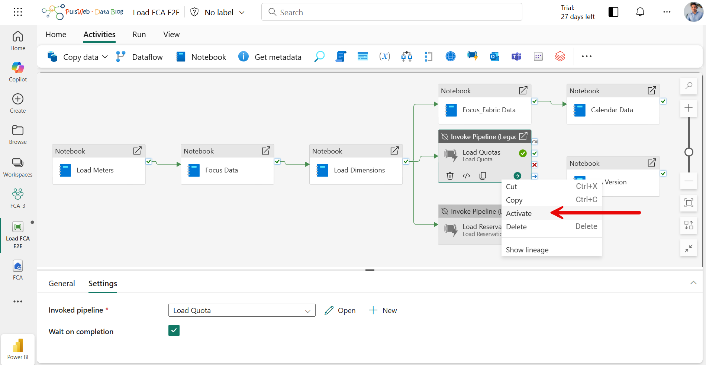

# Quota

🎬 Quota setup demo available on YouTube: [Fabric Cost Analysis - Azure Quotas deployment](https://youtu.be/ZVzkk7rq9u0)

## 1 - Configure the data connexion

Configure the data connexion

The installation notebook (00_Deploy_FCA) **automatically created** the following cloud connections :

| | Connection  |
|-------------| ------------- |
|Connection Name| fca azure management  |
|Connection Type| Web v2  |
|Base Url| https://management.azure.com  |
|Token Audience Url| https://management.azure.com|
|Authentification|Oauth2 or SPN|

Add credentials to connections :

- Navigate under Settings to 'Manage connections and gateways' in Fabric
- Set the credentials of the connections with your Oauth2 account or a service principal:

> ℹ️ This connection is used in FCA pipeline to retrieve Quota data from Azure Management REST APIs. If the credentials are incorrect or the secret has expired, the pipeline will fail. In case of an error, you'll be able to run the notebook again. It has an update mechanism, which will act as an item update. To view your Fabric quota, you need an Azure account with the contributor role, or another role that includes contributor access ([Microsoft Fabric quotas](https://learn.microsoft.com/en-us/fabric/enterprise/fabric-quotas?tabs=Azure)).

## 2 - Enable activity and run the Pipeline

- Open the **Load FCA E2E** Data pipeline
- Activate the **Load Quotas** activity

- Save and go back to deployment documentation : [Deployment documentation](./Deploy.md#-optional-steps)