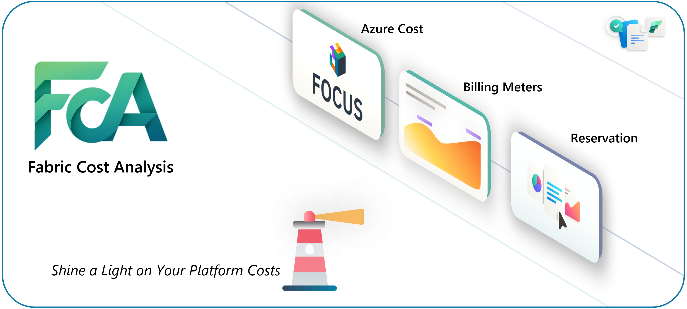
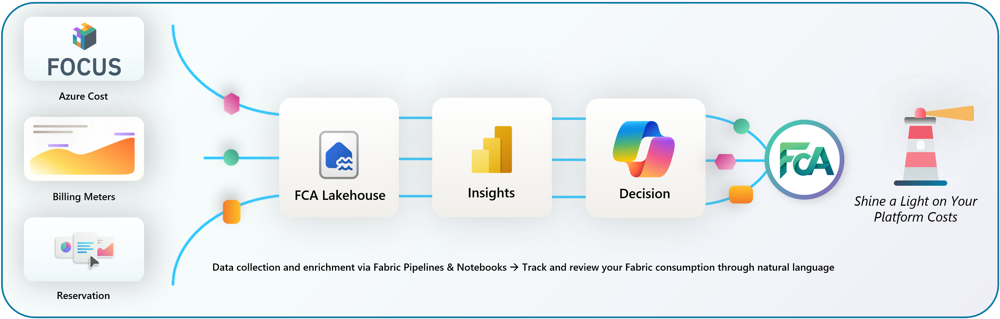
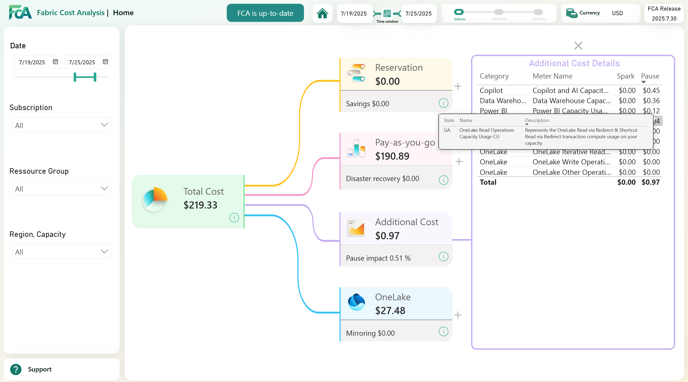
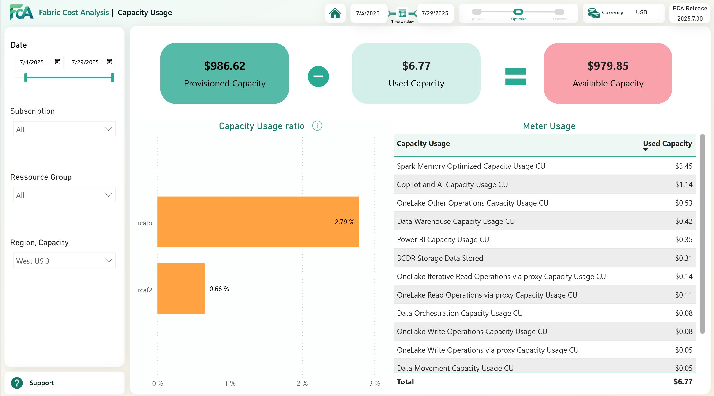
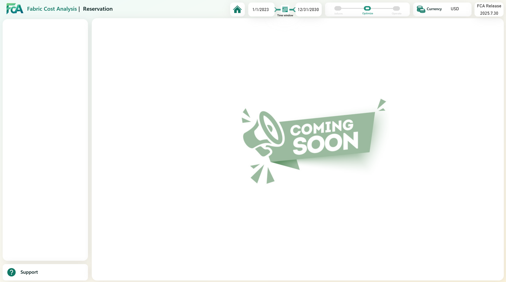
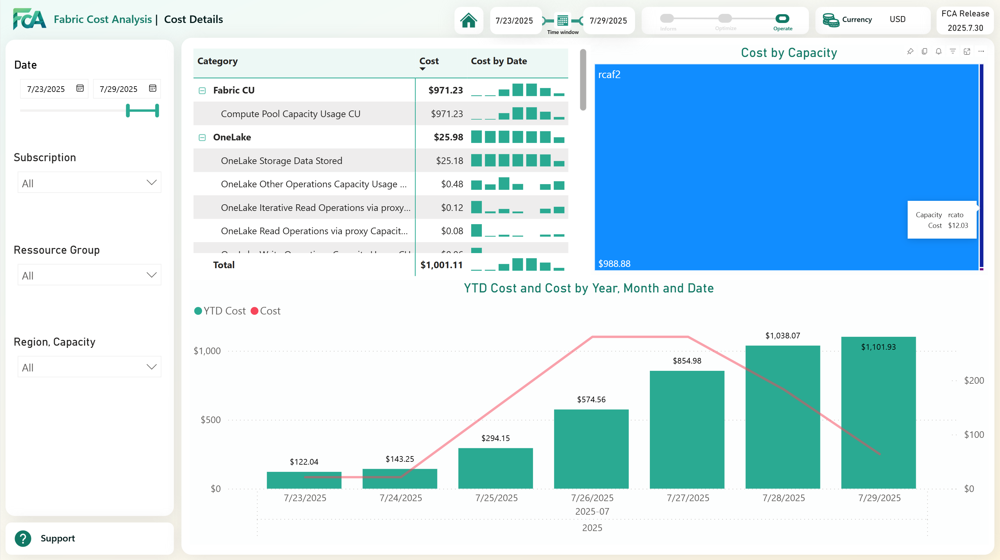
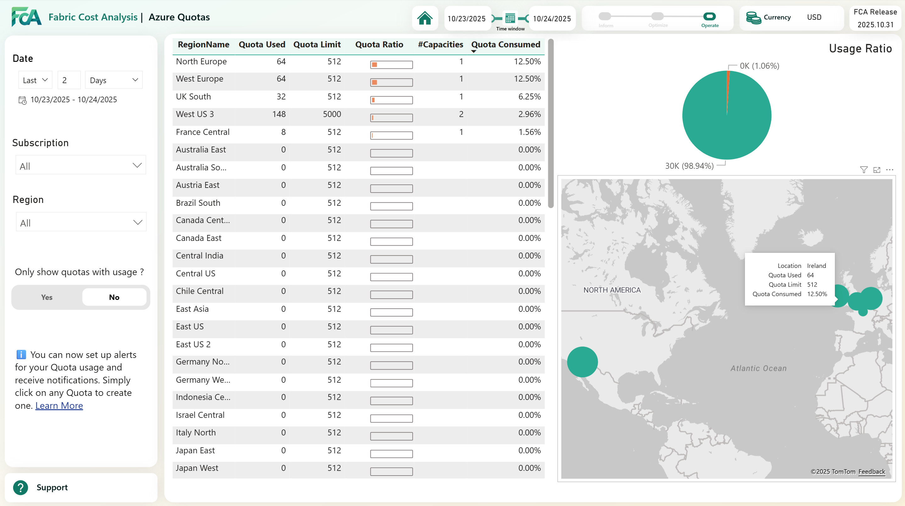
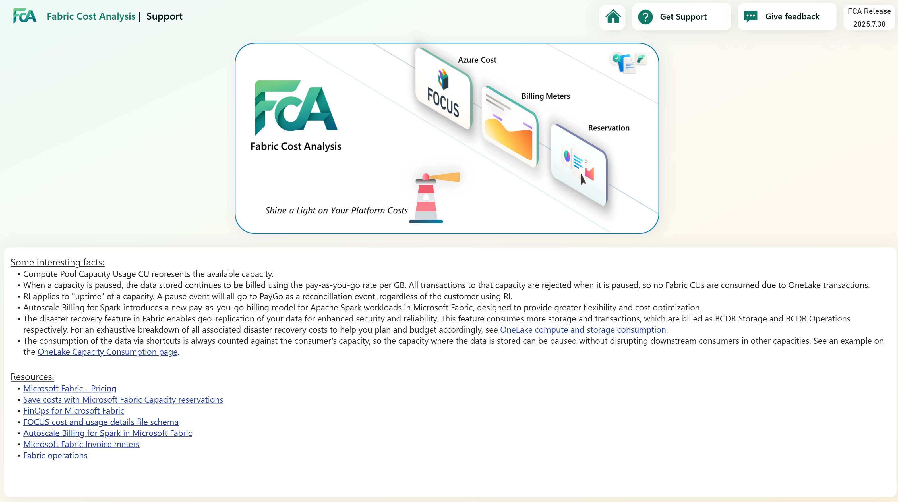
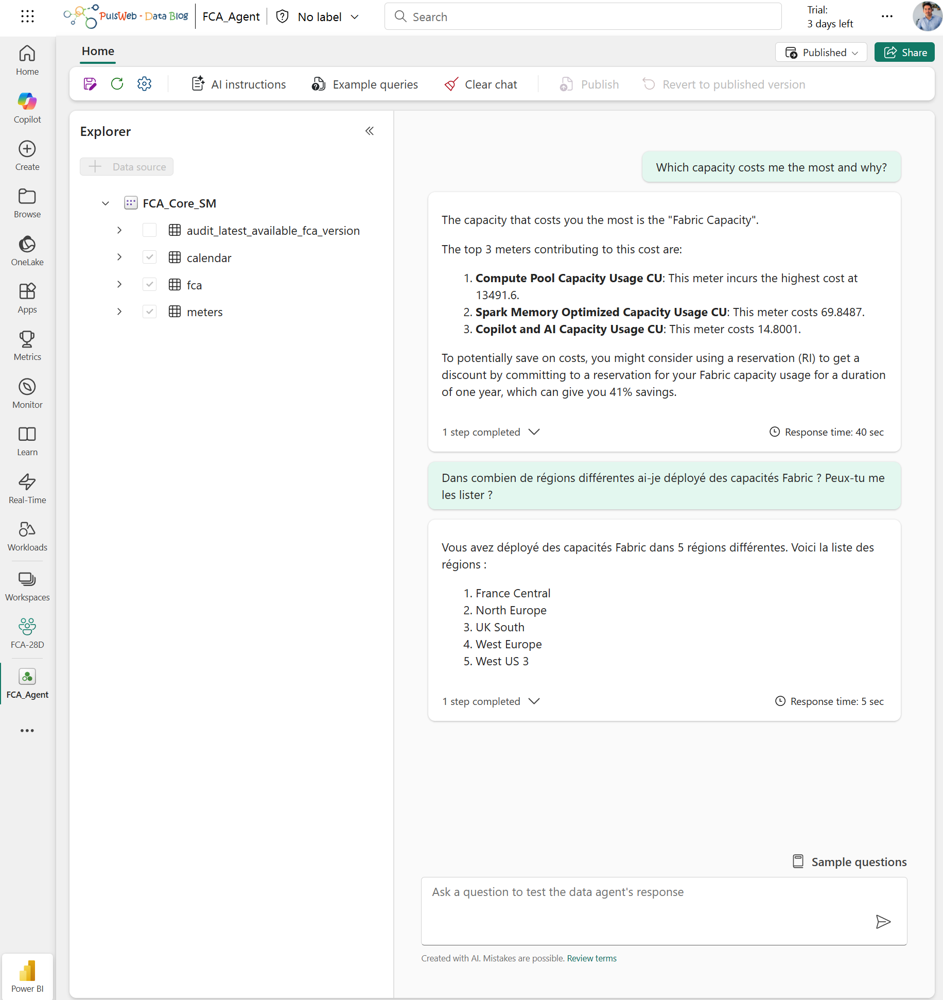
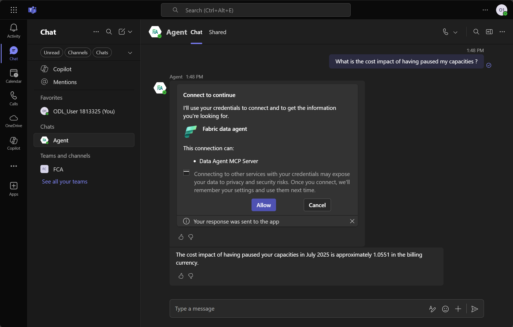

# **Solution accelerator for Fabric platform to monitor cost**

The solution aims to facilitate the understanding and monitoring of the Microsoft Fabric Cost.

Customers may not always clearly distinguish between costs that are included or excluded within the Data Platform, the handling of reservations (particularly those not rationalized within a defined scope), or their capacity usage. They may also need guidance on strategies for optimizing resources and implementing effective FinOps practices, including chargeback and show back to stakeholders. This free solution was developed in France by several passionate CSA experts in FinOps and Data: [Cedric Dupui](https://www.linkedin.com/in/cdupui/), [Manel Omani](https://www.linkedin.com/in/mlomani/), [Antoine Richet](https://www.linkedin.com/in/antoine-richet-22a44021/), and led by [Romain Casteres](https://www.linkedin.com/in/casteres/) inspired by his Blog article [FinOps for Microsoft Fabric](https://www.linkedin.com/pulse/finops-microsoft-fabric-romain-casteres-hc6ee/?trackingId=xFSs0xHqR0OheUQ7Tqn9mw%3D%3D).

## Introduction

Fabric Cost Analysis (short: FCA) is a solution to enable holistic monitoring of Microsoft Fabric Cost with the help of Microsoft Fabric.

FCA has the goal to provide a holistic view specified on Microsoft Fabric aspects and particularities (joining Financial and Operational forces) on top of the various information, which can be extracted from Azure Cost Management, personal enriched source of information, … allowing its users to analyze at a very high level, but also to deep dive into specific usage, Azure quotas, reservations and particularity of the platform for a more finer data analysis.

FCA is fully developed utilizing Fabric capabilities, with Pipelines and Notebooks serving as key tools for data extraction and transformation. Data is maintained both in its raw format and as Delta Parquet, allowing users to access it directly through Power BI Direct Lake. FCA includes standard reports that provide an overview of data and allow users to customize or create their own reports using the data model. Fabric's open platform enables integration with external data sources for further analysis as needed.

>⚠️ Caution: The FCA solution accelerator is not an official Microsoft product! It is a solution accelerator, which can help you implement a cost monitoring solution within and for Fabric. Consequently, there is no official support provided, and there remains a potential risk of failures.

🎬 Demo presentation available on YouTube : [Fabric Cost Analysis](https://youtu.be/ZRtxJgFGfi4)

## Content

### Architecture

### FCA Inputs

FCA gathers diverse data in Lakehouse to provide cost insights:
- FCA extracts Azure Cost in [FOCUS](https://focus.finops.org/) format (a Unified Standard for Cloud Billing Data)
- FCA extracts enriched Microsoft Learn documentation data
- (optional) FCA extracts Azure Reservations details
- (optional) FCA extracts Azure Quotas

>ℹ️ FCA will display only data related to Fabric costs, no other Azure cost will be prepare for analyze.

### FCA Outputs

#### Report

| **Page Name** | FinOps Phase [🔗](https://learn.microsoft.com/en-us/cloud-computing/finops/framework/finops-framework#lifecycle) | **Purpose**                                                     | **Sample**                                                     |
| ----- | ------------------------------------------------------------ | ------------------------------------------------------------ | ------------------------------------------------------------ |
| **Home** | Inform | The page presents a summary of key financial metrics, some of which are already included in the cost of capacity, while others are not | Savings Benefits due to RI  Effect of pausing a capacity having throttling  |
| **Summary** | Inform | The page provides an overview of cost per capacities across different regions, helping stakeholders to understand cost distributions and resource allocations within a specified timeframe |  |
| **Capacity Usage** | Optimize | The page is designed to enhance efficiency by illustrating how capacity is being utilized, enabling stakeholders to monitor and optimize resource allocation effectively |  |
| **Reservation** | Optimize | The page aims to reduce cloud waste by providing a comprehensive view of reservation-related data to verify the total usage of the reservation across the different capacities and a specified timeframe |  |
| **Cost Detail** | Operate | The page offers a detailed view of cost distributions across different categories and resources and includes Year-to-Date calculations to help stakeholders to define, track, and monitor expenses effectively |  |
| **Quota** | Operate | The page offers a detailed view of Azure Quotas per subscriptions |  |
| **Support** |                                                              | This page is designed to facilitate the learning and comprehension of the specific aspects of fabric costs and the contents of this report |  |

#### Data Agent

With a Data Agent on top of the FCA semantic model you can query in natural language Fabric Cost.

The following provides an example of communication in both English and French.

And from Teams:

## Setup

🏃‍♂️‍➡️ Are you ready to try FCA?

➡️ [Click here to deploy or update FCA](./Deploy.md)

## Support

The FCA solution accelerator template is not an official Microsoft service.

Ideas/Suggestions: Submit ideas and suggestions as issues in this repository.

Bug Reports: A backlog is maintained on the project issues page. If you encounter problems or have suggestions, add an entry to the issues section.

Important: Support tickets should not be opened for issues related to these templates. For any questions or concerns about the templates, create an issue in this repository.
