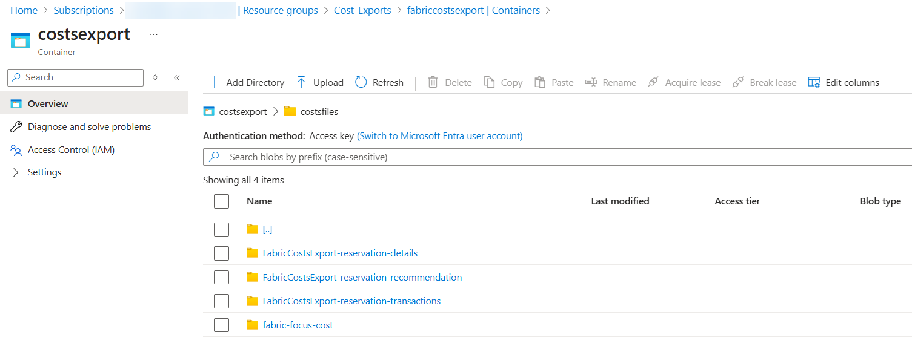
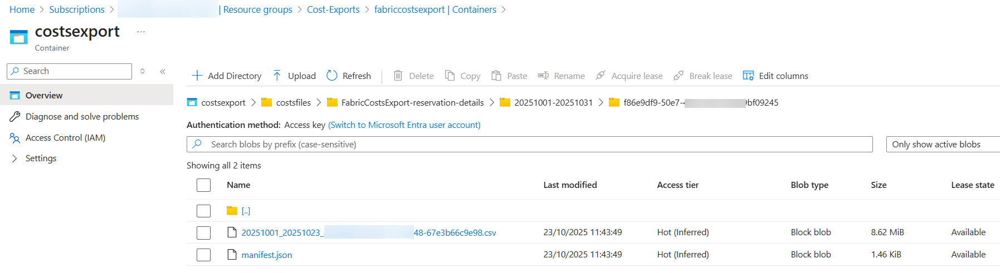
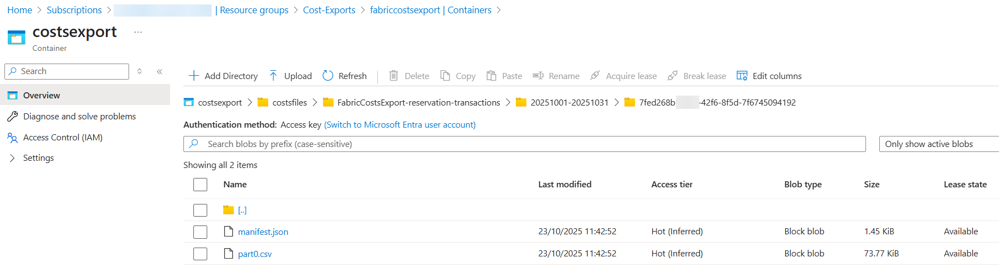
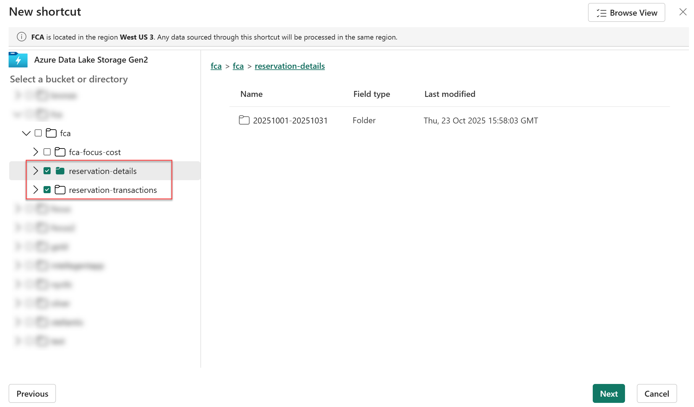
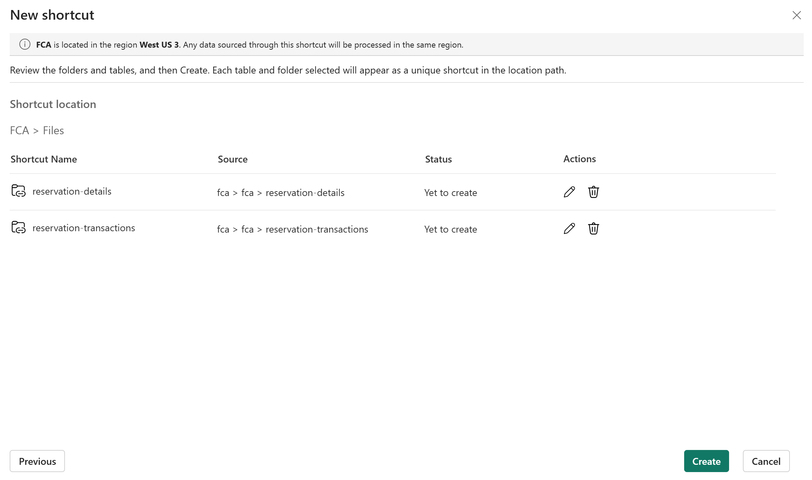
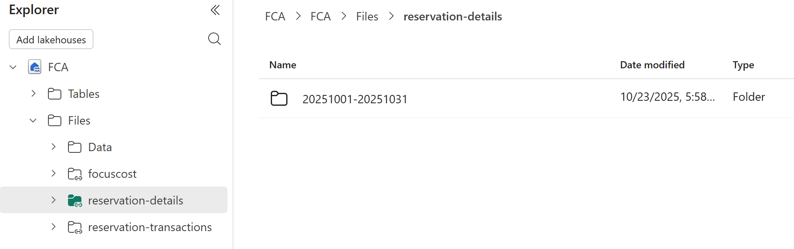
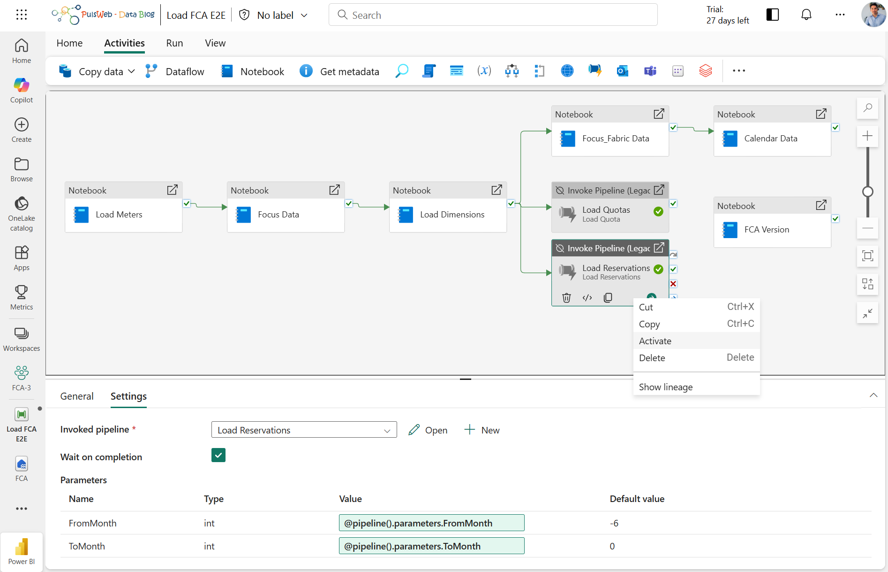

# Reservation

🎬 Reservation setup demo available on YouTube : [Fabric Cost Analysis](https://youtu.be/ZRtxJgFGfi4)

## 1 - Configure reservation export

To create reservation export, on the Azure portal , search for **Cost Management**
- Select the required scope and select **Exports** in the left navigation menu
- Select **+ Create**
- On the Basics tab, select the template = **All reservation data**
- On the Datasets tab, fill in **Export prefix** with "fca"
- On the Destination tab, select:
  - Storage type = **Azure blob storage**
  - Destination and storage = **Use existing**
  - Subscription = Your subscription
  - Storage account = Your storage account
  - Container = **fca**
  - Directory = **reservation**
  - Format = **csv**
  - Compression type = **none**
  - Overwrite data = **Enabled**
- On the Review + Create tab, select **Create**
- Run the export by selecting **Run now** on the export page
- Verify the export

>ℹ️ When performing the export, you have the option to retrieve one year of historical data in one-month chunks.

## 2 - [Configure Fabric items](./Deploy.md)

## 3 - Create Shortcut

- Create a new File Shortcut on the FCA Lakehouse ([Create an Azure Data Lake Storage Gen2 shortcut](https://learn.microsoft.com/en-us/fabric/onelake/create-adls-shortcut))
- Select the ellipsis (**...**) next to **Files**
- Select **New shortcut**
- Select Azure Data Lake Storage Gen 2 and provide the following settings:
  - Connection = Reuse **Existing connection** or create a new one specifying **Data Lake Storage** URL of the Data Lake storage account
  - Select the Shortcuts target sub path: **reservation-details** and **reservation-transactions**
  
  - Click on Next
  
  - Verify and rename if required the Shortcuts and click on Create

- Verify access to the data

## 4 - Enable activity in the Pipeline

- Open the **Load FCA E2E** Data pipeline
- Activate the **...** activity

- Run the Pipeline

## 5 - Open the report

- Navigate to your FCA workspace
- Search for the item FCA_Core_Report
- Open the FCA_Core_Report Power BI report
- Open the Reservation page and begin your analysis
