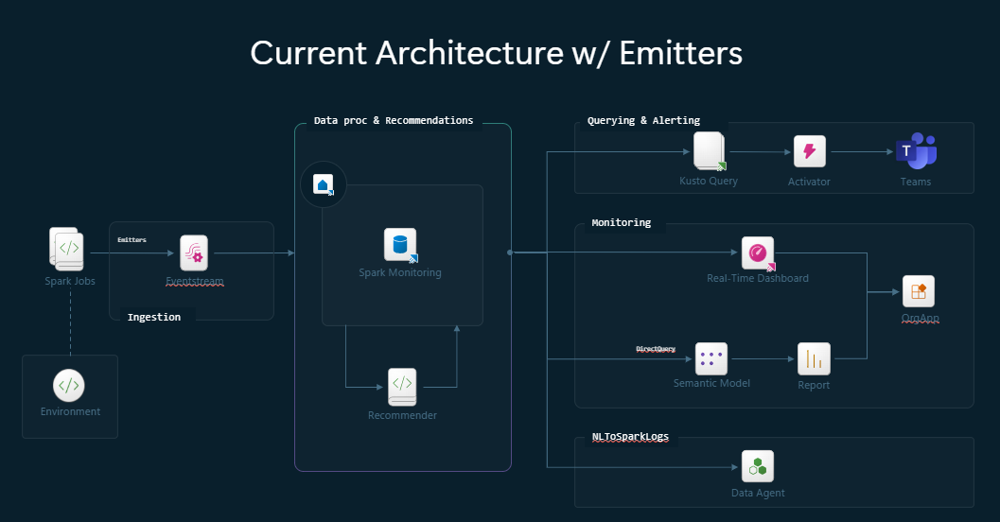
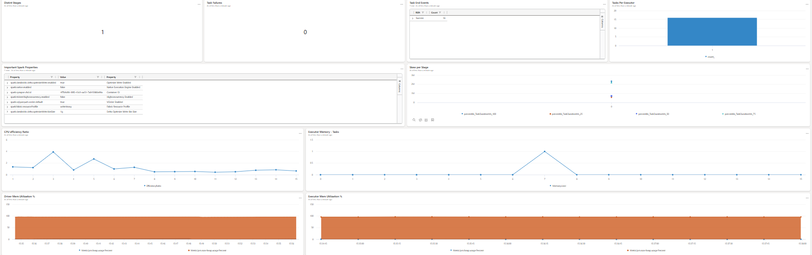
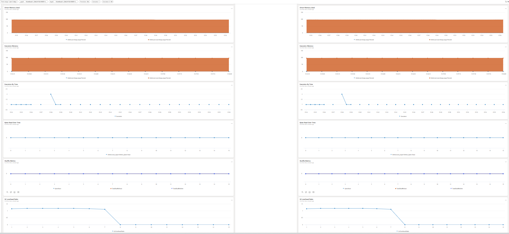
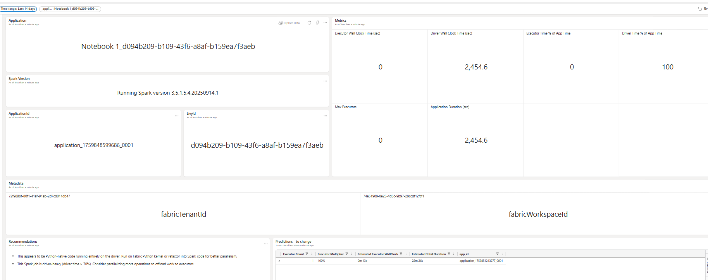

# ⚡ Fabric Spark Monitoring

A project designed to accelerate the deployment and experience of the Spark Monitoring solution in Microsoft Fabric. It provides a visual overview of cluster health, resource constraints, enables comparison between two Spark applications and recommedations like if increasing resources will improve the performance.

---

> [!CAUTION]  
> The SparkMonitoring solution accelerator is not an official Microsoft product! It is a solution accelerator, which can help you implement a monitoring solution within Fabric. As such there is no offical support available and there is a risk that things might break. 

> [!CAUTION]  
> This solution does not work with spark starter pools as it is not possible to configure the emitters on those. As part of the setup configuration we add the spark property spark.fabric.pools.skipStarterPools - true. The reason is that the diagnostic library requires specific configurations to be applied at Spark session startup a process only supported by On-Demand Pools, as they are dynamically created during startup.

---

## 📋 Description

This accelerator provisions a workspace pre-configured with all necessary resources and settings to monitor Spark workloads in Fabric. It helps users:

- View cluster health and performance metrics
- Identify resource bottlenecks like memory, CPU, Shuffling, Spilling etc.
- Compare two Spark applications side-by-side in terms of resource allocation

Please be aware that we added a few visuals from the KQL dashboard perspective but there is nothing preventing you from developing your own reports of top of the data that is available in the eventhouse.

---

## 📦 Installation

### 1. Download the Setup Notebook
Download the setup notebook which is located under setup/fabric-spark-monitoring-setup.ipynb

### 2. Update Configuration Settings
Open the notebook and **update the settings at the top**.
   In **Cell #2**, update the following parameters to update the following settings to match the environments where you want the emitters’ configuration to be applied:
   - **`workspace_id`** — Workspace ID (1 or more)
   - **`environment_id`** — Environment ID (1 or more)
   ~~~
   environments = [
    {"workspace_id": "<workspace_id>", "environment_id": "<environment_id>"},]
   ~~~
   - **`workspace_name`** — Workspace name where Spark monitoring artifacts will be created  
   - **`capacity_name`** — Capacity name to link the target workspace
### 3. Run the Setup Notebook
Run the notebook fabric-spark-monitoring-setup.ipynb
   
Once executed, this will:

- Create a workspace with the required resources
- Attach the necessary properties to the environments that you choose.

---

## ⚠️ Manual Steps

After running the notebook, complete the following **manual configuration steps**:

1. Setup the trigger on the sparkLens Pipeline on the most appropriate timing for your use-case
---

## 📐 Architecture

The architecture is composed by:

1. Spark configurations that are added to the environments and that start emitting data to a newly created eventhouse.
2. Eventhouse outputs data as it comes to an eventhouse
3. Eventhouse has update policies which divide the logs into more granular tables
4. KQL dashboard reads from the eventhouse and presents the data.

---

##🖼️📸💻✨Screenshots:

1.Application meters (Memory, CPU, Shuffling, Spilling)

2.Side by Side application comparison

3.SparkLens optimizations/Reccomendations

---

## 🤝 Contributing

We welcome contributions! Please follow these guidelines:

- Make your changes to the relevant artifact(s)
- Update `deployment_order1.json` with any new IDs for proper dependency resolution
- Submit a pull request for review
---

