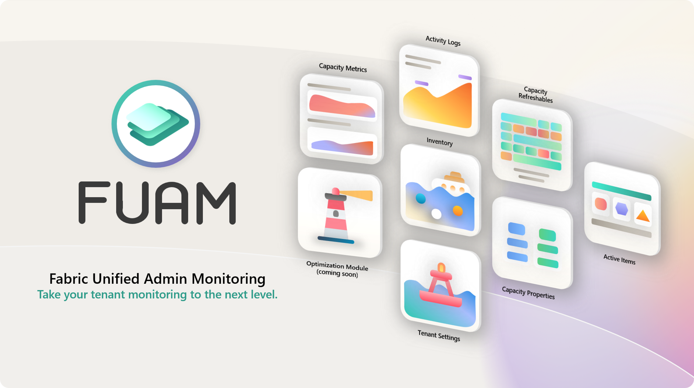
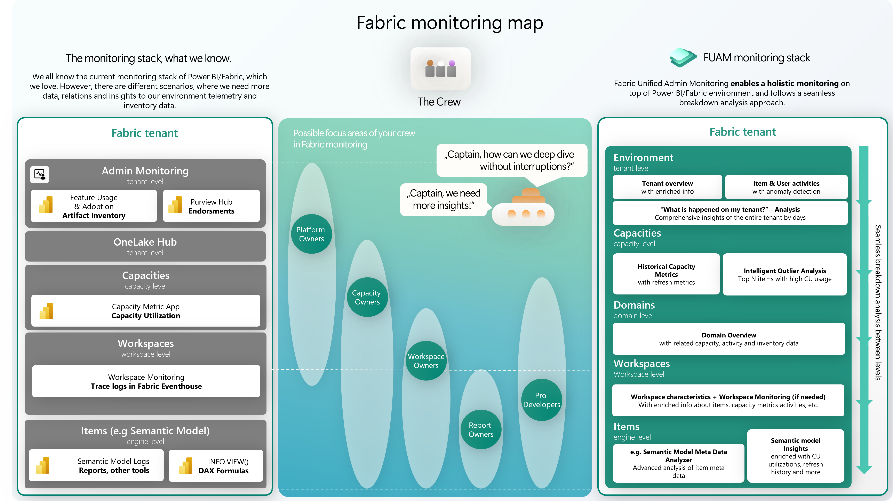
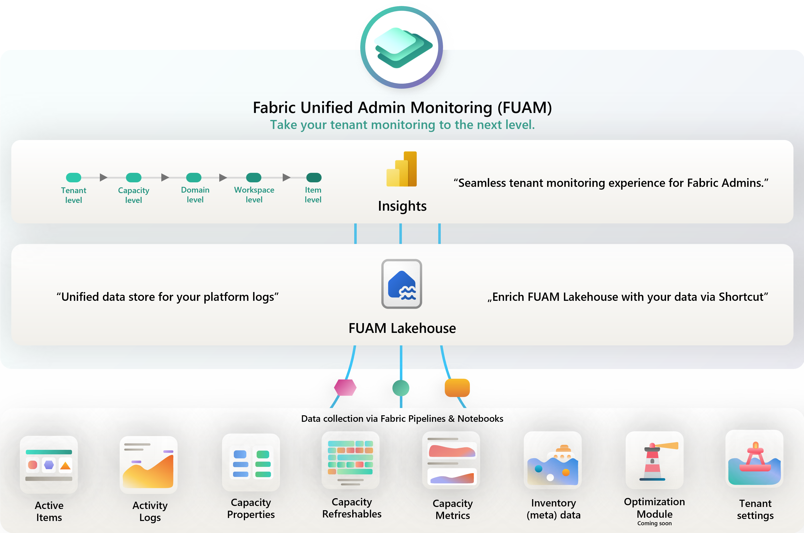
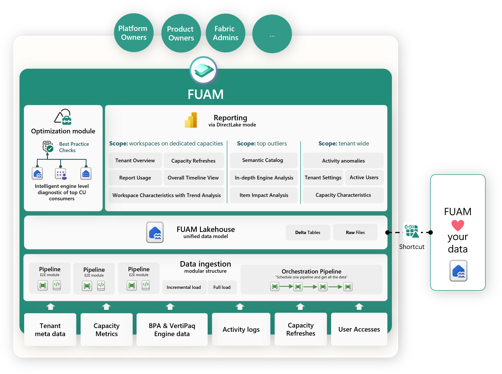

# Fabric Unified Admin Monitoring (FUAM)

**Solution accelerator for Fabric platform admin monitoring**

[Want to get a brief introduction on FUAM? - Watch the video](https://youtu.be/CmHMOsQcMGI)

> [!CAUTION]  
> The FUAM solution accelerator is not an official Microsoft product! It is a solution accelerator, which can help you implement a monitoring solution within Fabric. As such there is no offical support available and there is a risk that things might break. E.g. the extraction of Capacity Metrics data. This is based on the Capacity Metrics App and elements of that App could change without notice and impact FUAM.

## Introduction

Fabric Unified Admin Monitoring (short: FUAM) is a solution to enable holistic monitoring on top of Microsoft Fabric. Today monitoring for Fabric can be done through different reports, apps and tools. 

FUAM has the goal to provide a more holistic view on top of the various information, which can be extracted from Fabric, allowing its users to analyze at a very high level, but also to deep dive into specific artifacts for a more fine granular data analysis.

FUAM is completely build with Fabric capabilities with Pipelines and Notebooks as the main tool to extract and transform data. All the data is stored in its raw format, but also in Delta Parquet, enabling the user to directly use it through Power BI Direct Lake or the Lakehouse SQL Endpoint via SQL. FUAM comes with a set of standard reports enabling a quick overview on the data, but it's intended to give the users all tools to customize or build their own reports on top of the data model. Through the openness of Fabric it's of course also possible to combine it with your own data, enabling you to do the analysis you wish.

## FUAM Content

FUAM extracts the following data from the tenant:

- Tenant Settings
- Delegated Tenant Settings
- Activities
- Workspaces
- Capacities
- Capacity Metrics
- Tenant meta data (Scanner API)
- Capacity Refreshables
- Git Connections
- Engine level insights (coming soon in optimization module)

### Architecture
The architecture of FUAM is built on Fabric items like Pipelines, Notebooks, Lakehouses, Semantic Models and Power BI reports. We have built the component in a modular structure, which helps you to extend FUAM with your own modules. This architecture design helps to maintain the solution also with ease.

The data ingestion logic is orchestrated and parameterizable, which allows us to use the main orchestration pipeline for initial and incremental data loads. FUAM Lakehouse is one of the core components in architecture. All the data is transformed and persisted in a way, which opens amazing capabilities by analyzing the collected data in a semantic model with DirectLake mode.

### Benefits
- Modular building blocks
- One-source-of-truth approach
- End-to-end report experience
- Intelligent optimization module (coming soon)
- Long term CU utilization analysis
- Bring your own data & enrich FUAM with your data

## Setup

Are you ready to try FUAM out? We have prepared two step-by-step documentations, which support you to deploy FUAM in your workspace on your tenant:

#### [Click here to **deploy** FUAM](/monitoring/fabric-unified-admin-monitoring/how-to/How_to_deploy_FUAM.md)

#### [Click here to **update** FUAM](/monitoring/fabric-unified-admin-monitoring/how-to/How_to_update_FUAM.md)

## Support
The FUAM solution accelerator template **is not an official Microsoft service**.

**Ideas/Suggestions:** Submit your ideas and suggestions as an issue in this repository.

**Bug Reports:** We maintain a backlog in the project issues page. Let us know if you run into any problems or share your suggestions by adding an entry into the issues section.

**Important:** Please, do not open a support ticket in case of an issue regarding the templates. In case of any questions, issues regarding the templates, please create an issue in this repository.

----------------

## Other helpful resources
- [Video - Brief introduction to FUAM](https://youtu.be/CmHMOsQcMGI)
- [Documentation - FUAM's Authorization & Authentication](/monitoring/fabric-unified-admin-monitoring/media/documentation/FUAM_Authorization.md)
- [Documentation - FUAM Architecture](/monitoring/fabric-unified-admin-monitoring/media/documentation/FUAM_Architecture.md)
- [Documentation - FUAM Lakehouse table lineage](/monitoring/fabric-unified-admin-monitoring/media/documentation/FUAM_Documentation_Lakehouse_table_lineage.pdf)

----------------
