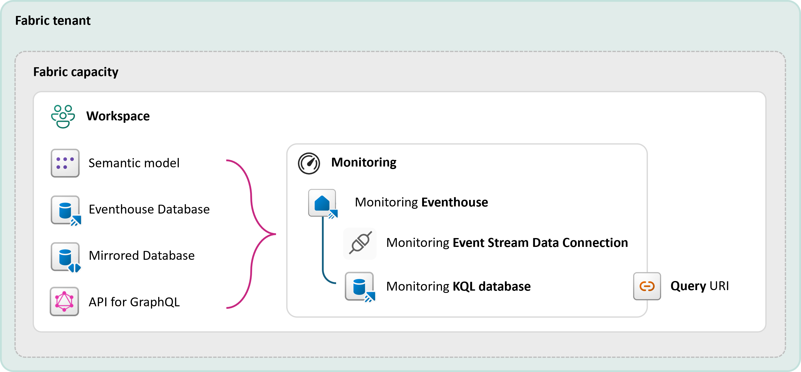
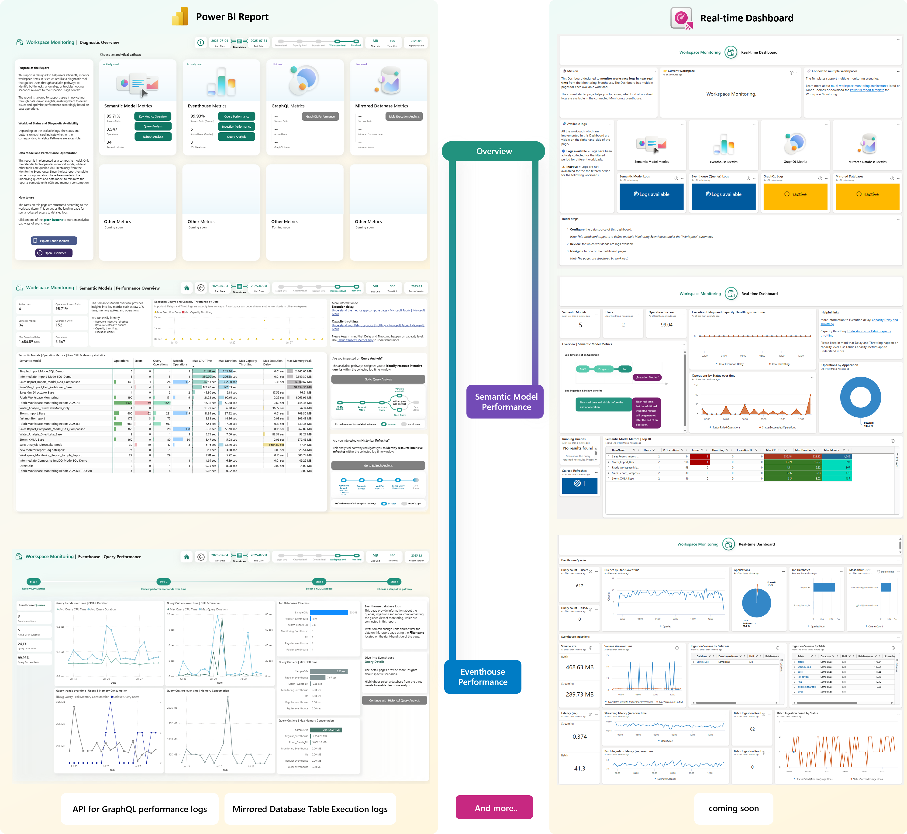
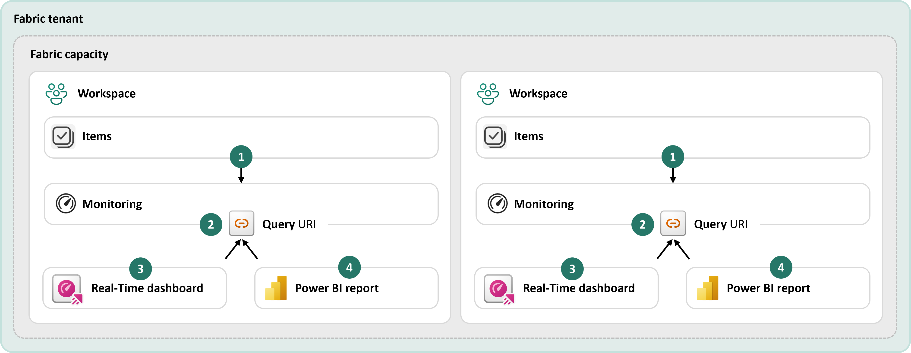
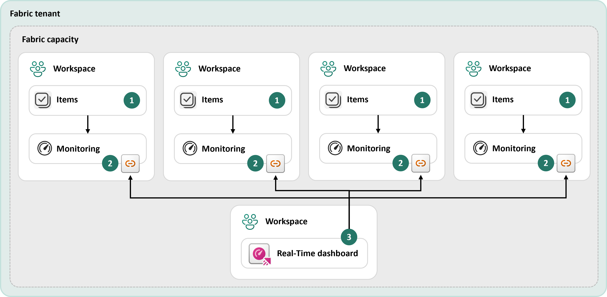
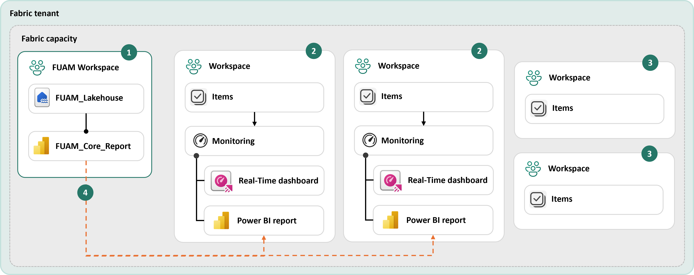

# Fabric Workspace Monitoring Report Templates

Current template version: **2025.8.2**

## Introduction

### Workspace Monitoring
Large data solutions typically generate disparate and complex data that can be difficult to converge into a single view. Workspace Monitoring provides a seamless, consistent experience with end-to-end visibility across Fabric workloads.

Fabric Workspace Monitoring enables users to correlate events from origination to subsequent operations and queries across Fabric experiences and services.

Workspace Monitoring is a built-in solution that enables users to:

- drive root-cause analysis
- analyze historical logs
- detect anomalies

When Workspace Monitoring is enabled at the workspace level, the workspace will start sending the selected diagnostics to a KQL database within Fabric that can be queried using KQL or SQL.

##### Microsoft Fabric feature links
- [Workspace monitoring overview](https://learn.microsoft.com/en-us/fabric/fundamentals/workspace-monitoring-overview)
- [Enable workspace monitoring](https://learn.microsoft.com/en-us/fabric/fundamentals/enable-workspace-monitoring)

----------- 

## Templates
**for Workspace Monitoring**

This module of the Fabric toolbox provides a set of pre-built reports (Real-Time Dashboard and Power BI Report) built on top of the Fabric Workspace Monitoring feature, enabling you to easily monitor your workspace from day one.

There are two monitoring template options available:

| Power BI Report template | Real-Time Dashboard template |
| ------ | ------ | 
| This template is designed as a diagnostic tool. The UI helps you navigate through a top-down analytical approach to get detailed historical trace logs from supported Fabric items. | This template allows users to track workspace activities in real time. It provides an operational tool for users to analyze issues within seconds and zoom in to exact time periods when an event occurred. |
| [How to deploy **PBI Report**](./how-to/How_to_deploy_Workspace_Monitoring_PBI_Report.md) | [How to deploy **RTI Dashboard**](./how-to/How_to_deploy_Workspace_Monitoring_RTI_Dashboard.md) |
| [Documentation for **PBI Report**](./documentation/Workspace_Monitoring_PBI_Report.md) | [Documentation for **RTI Dashboard**](./documentation/Workspace_Monitoring_RTI_Dashboard.md)  |
|[Metric Glossary](/monitoring/workspace-monitoring-dashboards/documentation/Workspace_Monitoring_Templates_Metrics.md)|[Metric Glossary](/monitoring/workspace-monitoring-dashboards/documentation/Workspace_Monitoring_Templates_Metrics.md)|
|**Included trace logs:** Semantic Models, Eventhouse Databases, Mirrored Databases, API for GraphQL | **Included trace logs:** Semantic Models, Eventhouse Databases | 
|**Connectivity mode:** Composite mode (helper tables are imported; other trace logs use DirectQuery) | **Connectivity mode:** Each visual queries the Monitoring Eventhouse data individually; base queries keep the core logic. |
| **Main benefits:** Analyzing performance trends over time, deep-dive investigations into historical operations, queries, etc. | **Main benefits:** Tracking current/running operations, enabling proactive alerting based on predefined scenarios. |

------------------------

### Deployment Scenarios

In the current version of Workspace Monitoring, the feature can be enabled at the workspace level. However, the templates are designed to support multiple workspaces.

| Scenario | Primary Audience | Recommended templates & features |
| ------ | ------ | ------ |
| [A) **Single Workspace** deployment (one-to-one)](#a-single-workspace-deployment-one-to-one)       |    Workspace Administrators, Pro developers focusing on one single workspace.    |   Real-Time Dashboard, Power BI Report     |
| [B) **Multiple Workspace** deployment (one-to-many)](#b-multiple-workspace-deployment-one-to-many)       |    Workspace Administrators, Capacity Owners, Domain Administrators focusing on a subset of workspaces.    |    Real-Time Dashboard    |
| [C) Deployment for **critical workloads**](#c-deployment-for-critical-workloads)       |    Data Product Owners, Workspace Owners    |    Real-Time Dashboard + Data Activator    |
| [D) **Integration with FUAM**](#d-integration-with-fuam)       |    Fabric Administrators, Capacity Owners    |    Power BI Report    |

#### A) Single Workspace deployment (one-to-one)

In this scenario, the templates can be published in the same workspace alongside the customer workload.

**Primary audience:** 
- Workspace Administrators
- Fabric Citizen Developers
- Fabric Pro Developers
_focusing on one single workspace_

**Recommended templates:**
- Real-Time Dashboard
- Power BI Report

We recommend this scenario for **Workspace Administrators** who want to have advanced monitoring capabilities for different workload engines within a workspace.

|Item|Description|
|--|--|
|1.|Once the Workspace Monitoring feature has been enabled for the workspace, the feature will stream the collected trace logs to the Monitoring Eventhouse KQL database.|
|2.|The Monitoring Eventhouse KQL database provides a Query URI endpoint, which will be used by the templates. The user can configure the Query URI endpoint manually by changing the parameters in the template. |
|3.| The Real-Time Dashboard template can be published into the given workspace by the user.|
|4.| The Power BI report template can be imported into the given workspace by the user.|

-------- 

#### B) Multiple Workspace deployment (one-to-many)

In this scenario, the templates can be published in one "central" workspace, which helps to isolate the customer workload from the monitoring templates.

**Primary audience:** 
- Workspace Administrators
- Capacity Owners
- Domain Administrators
_focusing on a subset of workspaces_

**Recommended templates:**
- Real-Time Dashboard

We recommend this scenario whenever **your team has to monitor multiple workspaces**, e.g., for a project, or **your team owns a data domain** based on the established data mesh concept in your organization.

|Item|Description|
|--|--|
|1.|Once the Workspace Monitoring feature has been enabled for the workspace, the feature will stream the collected trace logs to the Monitoring Eventhouse KQL database.|
|2.|The Monitoring Eventhouse KQL database provides a Query URI endpoint, which will be used by the templates. The user can configure the Query URI endpoint manually by changing the parameters in the template. |
|3.| The Real-Time Dashboard template can be published into the given workspace by the user. We recommend using this template because changing the parameters (QueryURI) can happen directly in the dashboard UI.|

-------- 
#### C) Deployment for critical workloads

In this scenario, the template will be deployed in a separate workspace (attached to an F-SKU) for monitoring purposes.
These workspaces can contain the Real-Time Dashboard with multiple data sources (Monitoring Eventhouses from multiple workspaces), and a proactive alerting solution can be configured. 

**Primary audience:** 
- Data Product Owners
- Workspace Owners

**Recommended templates & features:**
- Real-Time Dashboard
- Data Activator

We recommend this deployment scenario whenever a **highly critical workload must be monitored in near-real-time for one or multiple workspaces**.

|Item|Description|
|--|--|
|1.|Let's assume you have identified workspaces with high criticality in your organization, which require continuous monitoring. In this scenario, these subsets of your workspaces will be configured and extended with the Workspace Monitoring feature and the templates.|
|2.|Let's assume you have other workspaces, which are out of scope in this scenario.|
|3.|Once the Workspace Monitoring feature has been enabled for the workspace, the feature will stream the collected trace logs to the Monitoring Eventhouse KQL database.|
|4.|The Monitoring Eventhouse KQL database provides a Query URI endpoint, which will be used by the templates. The user can configure the Query URI endpoint manually by changing the parameters in the template.|
|5.|In this scenario, there is a separate workspace, which the user creates to store the monitoring templates only.|
|6.|The Real-Time Dashboard template can be published into this separate workspace by the user. We recommend using this template because changing the parameters (QueryURI) can happen directly in the dashboard UI.|
|7.|Optionally, a set of rules can be configured based on the Real-Time Dashboard within a Data Activator item, which sends proactive notifications about peaks, anomalies, or long-running operations with high CPU or memory consumption.|
|8.|A user or team will be notified in near-real-time to be able to take action on the alerted items.|

-------- 
#### D) Integration with FUAM
Another solution accelerator within the Fabric toolbox is [FUAM (Fabric Unified Admin Monitoring)](/monitoring/fabric-unified-admin-monitoring/README.md), which aims to expand the built-in monitoring experience to tenant-level monitoring of your environment.

**Primary audience:** 
- Fabric Administrators
- Capacity Owners

**Recommended templates:**
- Power BI Report

>**Note**: FUAM requires Fabric Administrator EntraID rights and other prerequisites.

We recommend this scenario for **Platform Owners, Fabric Administrators, and teams** who are already using FUAM for tenant-level observability and monitoring.

|Item|Description|
|--|--|
|1.|Let's assume that FUAM has already been deployed for your organization. In this case, FUAM (version 2025.9.2 or above) tracks workspaces with deployed Eventhouse.|
|2.|Let's assume there are workspaces where the workspace monitoring feature has been or will be deployed with the workspace monitoring report templates. These are candidates to extend the monitoring experience within FUAM with advanced workload engine-level performance insights.|
|3.|Let's assume there are other workspaces which do not have the workspace monitoring feature enabled yet. Those are out of scope in this scenario.|
|4.|Once other workspaces have enabled the workspace monitoring feature and deployed the workspace monitoring templates, [FUAM](/monitoring/fabric-unified-admin-monitoring/README.md) will detect all those workspaces and will show a link in the [FUAM_Core_Report](/monitoring/fabric-unified-admin-monitoring/how-to/FUAM_Architecture.md#reports) pointing to the configured workspace monitoring report template. In other words, a link will be automatically created by [FUAM](/monitoring/fabric-unified-admin-monitoring/README.md) to the workspace monitoring reports. This opens another level of seamless monitoring and troubleshooting possibilities on your tenant. |

Read more about the FUAM report-level integration [here](/monitoring/fabric-unified-admin-monitoring/how-to/FUAM_Architecture.md#reports).

------------------------

## Considerations and Limitations

#### Support of the templates

- The Workspace Monitoring feature itself is a Microsoft Fabric feature.
- The templates from this repository are solution accelerators and are not official Microsoft assets/services.

#### Capacity consumption of Workspace Monitoring feature with templates
As before, the end-to-end solution should be considered in two parts:
1) **Workspace Monitoring feature**
2) **Templates** for Workspace Monitoring 

The CU consumption of the **feature (1)** can be evaluated based on the following operations by item kind:
- **Eventhouse:**
    - Eventhouse UpTime
- **Eventstream:**
    - Eventstream Per Hour
    - Eventstream Data Traffic Per GB
    - Eventstream Connector Per vCore-hour
    - Eventstream Processor Per Hour

The CU consumption of the **templates (2)** can be evaluated based on the following operations by item kind:
- **Real-Time Dashboard:**
    - OneLake Write via Proxy
    - OneLake Read via Proxy
    - OneLake Other Operations
- **Semantic Model:**
    - Query
    - Dataset Scheduled Refresh

#### Power BI report template
- The Power BI report template has been optimized and refactored since the last version. It now uses DirectQuery for large transactional tables like 'SemanticModelLogs' or 'EventhouseMetrics', which enables users to analyze large workspaces.
- If you are facing issues with the template, please raise an issue in this GitHub repository.

------------------------

## Remarks

**Capacity utilization:**
Please note that the **report templates** and the items of Workspace Monitoring **utilize CUs from your capacity.**
The Workspace Monitoring feature is not charged during public preview.

**CPU & Memory metrics in Monitoring Eventhouse and templates:**
Please note that the CPU and memory-related metrics are **not aggregated, smoothed, or burst, like the operations in the Microsoft Fabric Capacity Metrics App**. A one-to-one comparison is not possible for various reasons. Billable capacity utilization and storage information are shown in the Microsoft Fabric Capacity Metrics App. https://learn.microsoft.com/en-us/fabric/enterprise/metrics-app

Please test the solution on a non-production Fabric SKU first to avoid impacting other workloads on your tenant.

------------------------

## Support
These templates (Real-Time Dashboard template and Power BI template) **are not official Microsoft services**. 

**Ideas/Suggestions:**
Submit your ideas and suggestions as an issue in this repository.

**Bug Reports:** 
We maintain a backlog on the project issues page. Let us know if you run into any problems or share your suggestions by adding an entry into the issues section.

**Important:**
Please **do not** open a support ticket for issues regarding the templates.
In case of any questions or issues regarding the templates, please **create an issue in this repository.**

For more information, please visit the main page of this repository or the learn.microsoft.com website.

------------------------
## Trademarks
This project may contain trademarks or logos for projects, products, or services. Authorized use of Microsoft trademarks or logos is subject to and must follow Microsoft's Trademark & Brand Guidelines. Use of Microsoft trademarks or logos in modified versions of this project must not cause confusion or imply Microsoft sponsorship. Any use of third-party trademarks or logos are subject to those third-party's policies.

----------------

## Other helpful resources

##### Microsoft Fabric features
- [Workspace monitoring overview](https://learn.microsoft.com/en-us/fabric/fundamentals/workspace-monitoring-overview)
- [Enable workspace monitoring](https://learn.microsoft.com/en-us/fabric/fundamentals/enable-workspace-monitoring)

##### Workspace Monitoring Templates
- [Documentation - Real-Time Dashboard template for Workspace Monitoring](/monitoring/workspace-monitoring-dashboards/documentation/Workspace_Monitoring_RTI_Dashboard.md)
- [Documentation - Power BI template for Workspace Monitoring](/monitoring/workspace-monitoring-dashboards/documentation/Workspace_Monitoring_PBI_Report.md)

##### Some other Fabric Toolbox assets
- [Overview - Fabric Cost Analysis](/monitoring/fabric-cost-analysis/README.md)
- [Overview - FUAM solution accelerator for tenant level monitoring](/monitoring/fabric-unified-admin-monitoring/README.md)
- [Overview - Semantic Model MCP Server](https://github.com/microsoft/fabric-toolbox/tree/main/tools/SemanticModelMCPServer)
- [Overview - Semantic Model Audit tool](/tools/SemanticModelAudit/README.md)

##### Semantic Link & Semantic Link Lab
- [What is semantic link?](https://learn.microsoft.com/en-us/fabric/data-science/semantic-link-overview)
- [Overview - Semantic Link Labs](https://github.com/microsoft/semantic-link-labs/blob/main/README.md)

----------------