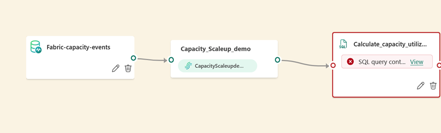
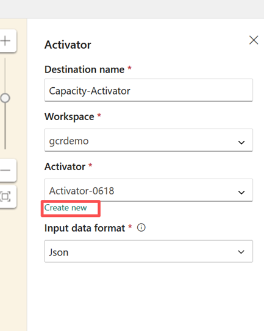
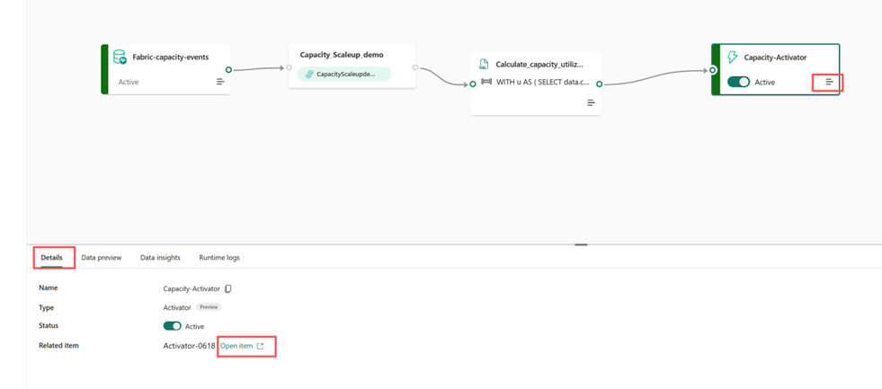
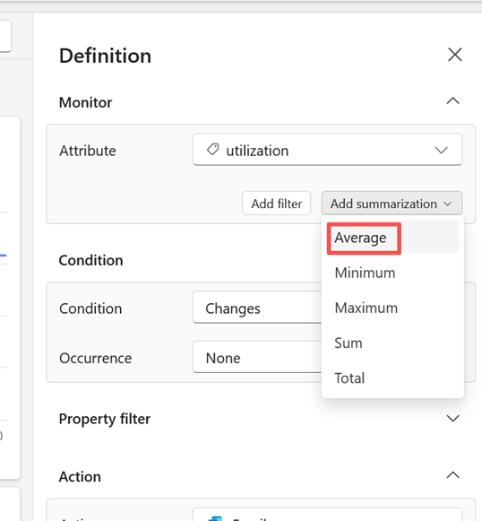

# Auto-scale Fabric capacity based on utilization

Organizations often face unpredictable, spiky analytics workloads that can lead to throttling and degraded performance when capacity becomes saturated. Since Microsoft Fabric does not provide built-in autoscale functionality today, this demo introduces an approach to dynamically scale capacity on demand—ensuring consistent performance while controlling costs and avoiding permanent over‑provisioning

The sample demonstrates how to monitor real-time capacity usage and automatically trigger a scale-up action when utilization exceeds defined thresholds. It also calls a notebook to execute additional logic. The accompanying diagram illustrates how the solution ingests capacity signals, processes them, and launches a notebook via Activator within an Eventstream in Real-Time Intelligence (RTI).


## Utilization Formula
The concept is to calculate utilization using the following formula. Users can then define an alert rule based on this utilization value to trigger a notebook that scales up capacity:
```
utilization = capacityUnitMs / (baseCapacityUnits * windowDurationMs)
```
For more information about event schema, refer to [Explore Capacity overview events](https://learn.microsoft.com/en-us/fabric/real-time-hub/explore-fabric-capacity-overview-events).

## Key Components
- Capture capacity data - 
    Retrieve capacity metrics from Fabric Capacity Overview events.
    Reference: https://learn.microsoft.com/fabric/real-time-hub/capacity-overview-events 
- Process events via SQL - 
    Use a SQL operator to process incoming events and calculate capacity utilization, then output the result to Activator.
    Reference: https://learn.microsoft.com/fabric/real-time-hub/sql-operator 
- Trigger actions via Activator - 
    Configure Activator to monitor incoming utilization events and launch a notebook to scale up capacity when the defined rule is triggered.
    Reference: https://learn.microsoft.com/fabric/real-time-hub/activator 

## Step‑by‑Step Implementation

### 1. Create Eventstream  
Set up an event stream named appropriately for your scenario.
Guide: https://learn.microsoft.com/fabric/real-time-hub/create-eventstream


### 2. Add Capacity Overview Event Source
Configure the event stream to include capacity overview data.
For detailed steps, refer to: https://learn.microsoft.com/fabric/real-time-hub/add-capacity-overview-event-source

#### Steps:

1. Select **Capacity Overview Events** → **Connect**  

2. To capture capacity utilization, select the event type `Microsoft.Fabric.Capacity.Summary` and choose the specific capacity you want to monitor.

    

3. Rename the source to **Fabric-capacity-events**

    

4. Add the SQL transformation code to the event stream and name it Calculate_capacity_utilization. For detailed guidance, refer to: https://learn.microsoft.com/fabric/real-time-hub/sql-operator


### 3. Add Capacity Overview Event Source
Add an Activator as a destination in the event stream and name it Capacity-Activator. Create a new Activator if one does not already exist. For detailed steps, refer to: https://learn.microsoft.com/fabric/real-time-hub/add-activator-destination
    
### 4. Edit SQL transformation code

The stream now flows as shown below. Since the event type Microsoft.Fabric.Capacity.Summary does not include a utilization metric, we need to generate a new metric and output the result to the Activator


Click the edit icon for the SQL code and enter the following SQL script

## SQL Script
```
WITH u AS (
  SELECT
    data.capacityId AS capacityId,
    data.capacityName AS capacityName,
    data.capacitySku AS capacitySku,
    data.windowStartTime AS windowStartTime,
    data.windowEndTime AS windowEndTime,
    CAST(data.baseCapacityUnits AS float) AS baseCapacityUnits,
    CAST(data.capacityUnitMs AS float) AS capacityUnitMs,
    CAST(
      CAST(data.capacityUnitMs AS float) /
      NULLIF(
        CAST(data.baseCapacityUnits AS float) *
        DATEDIFF(millisecond, data.windowStartTime, data.windowEndTime),
        0
      ) AS float
    ) AS utilization
  FROM [CapacityScaleupdemo-stream]
)
SELECT
  u.capacityId,
  u.capacityName,
  u.capacitySku,
  u.windowStartTime,
  u.windowEndTime,
  u.baseCapacityUnits,
  u.capacityUnitMs,
  u.utilization
INTO [Capacity-Activator]
FROM u;
```


This script performs the following actions:
- Reads capacity telemetry from [CapacityScaleupdemo-stream].
- Calculates utilization for each time window using the formula: 
```
utilization = capacityUnitMs / (baseCapacityUnits * windowDurationMs)
```
- Writes the computed results to [Capacity-Activator], which is used to trigger automation actions.

### 5. Publish the Eventstream
After saving the query, the stream flow will appear as shown below. At this point, we are ready to publish the Eventstream


Once the Eventstream is published, both the source and destination will display the status as “Active.”


### 6. Configure the Activator
Next, navigate to the Activator details page and click Open item to configure the activation settings. Typically, we avoid scaling up capacity immediately when utilization exceeds the threshold. Instead, best practice is to allow a time window—such as 10 minutes—to confirm whether utilization remains above the threshold. To achieve this, define a summarization rule on the utilization property



- Create a new object - Click New Object and provide the following details:
    - **Object Name**: Fabric Capacity
    - **Unique Identifier**: capacityName
    - **Properties**: utilization

    

- Create a new rule based on the property utilization

    

- In the rule’s Definition panel, click Add Summarization → Average

    

- Configure the rule for the utilization property:
    - **Summarization**: Average over a 10-minute window
    - **Condition**: Trigger when utilization remains greater than 0.8 for 10 minutes
    - **Action**: Execute the notebook scale_up_by_api to scale Fabric capacity to the next SKU
  
    
- Click Save and Start to activate the rule. Once enabled, the rule will continuously monitor Fabric capacity utilization and, when the alert condition is met, automatically scale the capacity to the next SKU by running the designated notebook
### 7. Use Fabric REST API to Scale Up the SKU
Below is a sample approach for using the Fabric REST API to scale a Fabric capacity to the next SKU.
Note on actions: Each Activator rule supports one action type per rule.
- If you need extra actions (e.g., send a Teams message or email when the scale up completes), either: 
    - Use Power Automate as the custom action to orchestrate multiple downstream actions from a single trigger, or
    - Send the notification from your Python notebook via email or teams message after the capacity is successfully scaled.

Note: This sample does not include a scale-down operation because excess capacity has no immediate impact on Fabric performance, so scaling down can typically be managed manually. If you want to implement scale-down using this approach, you’ll need to:
   - Create a separate rule to trigger the scale down action.
   - Develop a dedicated notebook for executing the scale-down process

### Full Notebook Code
```
# Fabric Notebook - Scale Fabric capacity via ARM using SP secret from Key Vault
import os
import time
import requests
from notebookutils import mssparkutils
from azure.identity import ClientSecretCredential
API_VERSION = "2023-11-01"
ARM_SCOPE = "https://management.azure.com/.default"
ARM_BASE  = "https://management.azure.com"
TENANT_ID = os.getenv("TENANT_ID", "<Your_TENANT_ID>")
CLIENT_ID = os.getenv("CLIENT_ID", "<Your_CLIENT_ID>")
SUB_ID   = os.getenv("AZ_SUBSCRIPTION_ID", "<YOUR_SUBSCRIPTION_ID>")
RG       = os.getenv("AZ_RESOURCE_GROUP", "<YOUR_RESOURCE_GROUP>")
CAPACITY = os.getenv("FABRIC_CAPACITY_NAME", "<YOUR_CAPACITY_NAME>")
KEYVAULT_URL   = os.getenv("KEYVAULT_URL", "https://<KEYVAULT_NAME>.vault.azure.net/")
KV_SECRET_NAME = os.getenv("KV_SECRET_NAME", "<YOUR_SECRET_NAME>")

def get_sp_secret_from_kv():
    return mssparkutils.credentials.getSecret(KEYVAULT_URL, KV_SECRET_NAME)

client_secret = get_sp_secret_from_kv()
cred = ClientSecretCredential(tenant_id=TENANT_ID, client_id=CLIENT_ID, client_secret=client_secret)

def bearer_token_arm():
    return cred.get_token(ARM_SCOPE).token

def headers_arm():
    return {"Authorization": f"Bearer {bearer_token_arm()}",
            "Content-Type": "application/json"}

def get_current_capacity_sku(subscription_id, resource_group, capacity_name):
    url = (
        f"{ARM_BASE}/subscriptions/{subscription_id}"
        f"/resourceGroups/{resource_group}"
        f"/providers/Microsoft.Fabric/capacities/{capacity_name}"
        f"?api-version={API_VERSION}"
    )
    r = requests.get(url, headers=headers_arm(), timeout=60)
    r.raise_for_status()
    return r.json().get("sku", {}).get("name")

def get_next_fsku(current_sku: str) -> str:
    if not current_sku or not current_sku.startswith("F") or not current_sku[1:].isdigit():
        raise ValueError(f"Invalid SKU format: {current_sku}")
    v = int(current_sku[1:])
    if v >= 2048:
        raise ValueError("Already at maximum SKU F2048. Cannot scale higher.")
    return f"F{v * 2}"

def scale_capacity(subscription_id, resource_group, capacity_name, target_sku):
    url = (
        f"{ARM_BASE}/subscriptions/{subscription_id}"
        f"/resourceGroups/{resource_group}"
        f"/providers/Microsoft.Fabric/capacities/{capacity_name}"
        f"?api-version={API_VERSION}"
    )
    body = {"sku": {"name": target_sku, "tier": "Fabric"}}
    resp = requests.patch(url, headers=headers_arm(), json=body, timeout=60)
    if resp.status_code in (200, 201):
        return resp.json()
    if resp.status_code == 202:
        async_url = resp.headers.get("Azure-AsyncOperation") or resp.headers.get("Location")
        if not async_url:
            raise RuntimeError("202 Accepted but no Azure-AsyncOperation/Location header to poll.")
        for _ in range(120):
            time.sleep(5)
            poll = requests.get(async_url, headers=headers_arm(), timeout=60)
            if poll.status_code == 200:
                data = poll.json()
                status = (data.get("status") or data.get("properties", {}).get("provisioningState") or "")
                if status.lower() in ("succeeded", "updated", "preparing"):
                    res = requests.get(url, headers=headers_arm(), timeout=60)
                    res.raise_for_status()
                    return res.json()
                if status.lower() in ("failed", "canceled"):
                    raise RuntimeError(f"Scaling failed: {data}")
        raise TimeoutError(f"Scaling did not finish. Poll: {async_url}")
    raise RuntimeError(f"Unexpected response: {resp.status_code} {resp.text}")

if __name__ == "__main__":
    try:
        sku = get_current_capacity_sku(SUB_ID, RG, CAPACITY)
        print("Current SKU:", sku)
        target = get_next_fsku(sku)
        print(f"Scale up {sku} → {target}")
    except Exception as e:
        print("Could not list SKUs:", e)
    try:
        result = scale_capacity(SUB_ID, RG, CAPACITY, target)
        print("Final capacity state:", result)
    except Exception as e:
        print("Scale failed:", e)
```
