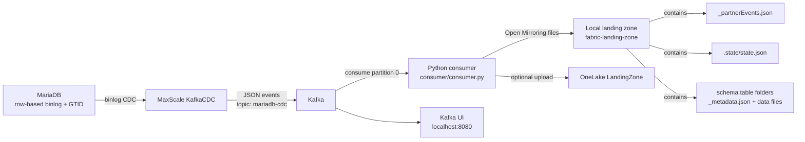

# MariaDB Mirroring (Kafka CDC -> Fabric Open Mirroring)

This sample runs a local CDC pipeline that captures MariaDB changes, publishes them to Kafka via MaxScale KafkaCDC, and writes Open Mirroring-compatible files to a Fabric Landing Zone.

## What this repository contains

- **MariaDB** with row-based binary logging and GTID enabled.
- **MaxScale KafkaCDC** to stream binlog events to Kafka (`mariadb-cdc` topic).
- **Kafka (KRaft mode)** and **Kafka UI** for transport and inspection.
- **Python consumer** (`consumer/consumer.py`) that:
  - optionally snapshots source tables,
  - consumes CDC events from Kafka,
  - writes incremental files to the local landing zone,
  - and optionally uploads to OneLake Landing Zone.

## High-level flow

1. `mariadb` starts with seeded sample data (`sampledb.customers`, `sampledb.orders`).
2. `maxscale` reads MariaDB binlog changes and publishes JSON events to Kafka topic `mariadb-cdc`.
3. `mariadb-fabric-mirror` consumes Kafka partition 0 and produces Open Mirroring file layout under `/landing-zone`.
4. If enabled, the same files are uploaded to OneLake `LandingZone` using service principal credentials.

## Architecture diagram



## Folder layout

- `docker-compose.yml` – orchestrates all services.
- `config/mariadb/custom.cnf` – enables required MariaDB binlog/GTID settings.
- `config/mariadb/init.sql` – creates users, tables, and sample rows.
- `config/maxscale/maxscale.cnf` – configures KafkaCDC publisher.
- `consumer/config.yaml` – runtime config used by the Python consumer.
- `consumer/config.example.yaml` – safe template for configuration.
- `consumer/consumer.py` – snapshot + CDC processing logic.
- `consumer/openmirroring_operations.py` – OneLake upload/status helper.
- `fabric-landing-zone/` – local output landing zone mounted into the consumer container.

## Prerequisites

- Docker Desktop (with Compose v2).
- Network access to Fabric OneLake endpoint (only if remote upload enabled).
- A service principal with required access to the target Fabric Landing Zone (only if remote upload enabled).

## Configuration

The consumer reads `/app/config.yaml` (mounted from `consumer/config.yaml`).

### Recommended setup

1. Start from `consumer/config.example.yaml`.
2. Copy values into `consumer/config.yaml`.
3. Choose one mode:
   - **Local-only mode**: set `consumer.localOnly: true`.
   - **Remote upload mode**: set `consumer.localOnly: false` and provide:
     - `onelake.landingZoneUrl`
     - `onelake.tenantId`
     - `onelake.clientId`
     - `onelake.clientSecret`
4. Confirm `tables.include` and `tables.keyColumns` match source tables.

### Important behavior flags

- `consumer.snapshotTablesOnStart`
  - `true`: take a consistent MariaDB snapshot first, then continue from latest Kafka offset.
- `consumer.bootstrapOnceFromBeginning`
  - `true`: if no snapshot path is used, read Kafka from beginning once.
- `consumer.resetBootstrapState`
  - `true`: clears saved offsets/bootstrap/snapshot markers for the next run.

State is persisted at: `fabric-landing-zone/.state/state.json`.

## How to run

Clone the **Fabric Toolbox** repository:

```powershell
git clone https://github.com/microsoft/fabric-toolbox
```

Move to the MariaDBMirroring folder

```powershell
cd samples/open-mirroring/MariaDBMirroring
```

From this folder:

```powershell
docker compose up -d --build
```

Check service health/logs:

```powershell
docker compose ps
docker compose logs -f mariadb-fabric-mirror
```

Open Kafka UI:

- http://localhost:8080

## Generate test changes

Run sample writes in MariaDB:

```powershell
docker compose exec mariadb mariadb -uroot -pMyRootP@ssw0rd! -e "USE sampledb; INSERT INTO customers(first_name,last_name,email) VALUES('Dora','Miller','dora@example.com');"

docker compose exec mariadb mariadb -uroot -pMyRootP@ssw0rd! -e "USE sampledb; UPDATE orders SET quantity = quantity + 1 WHERE id = 1;"

docker compose exec mariadb mariadb -uroot -pMyRootP@ssw0rd! -e "USE sampledb; DELETE FROM orders WHERE id = 2;"
```

Then re-check consumer logs and landing zone output.

## Expected output

Under `fabric-landing-zone/` you should see:

- `_partnerEvents.json`
- `.state/state.json`
- per-table folders like:
  - `sampledb.schema/customers/_metadata.json`
  - `sampledb.schema/customers/00000000000000000001.parquet` (or `.csv` depending on row shape)

The consumer increments file sequence numbers and tracks offsets/checkpoints in `.state/state.json`.

## Stop and reset

Stop stack:

```powershell
docker compose down
```

Full reset (containers + volumes):

```powershell
docker compose down -v
```

If you need a clean re-bootstrap, also clear local state/output:

```powershell
Remove-Item -Recurse -Force .\fabric-landing-zone\*
```

## Troubleshooting

- **Consumer exits with config validation error**
  - Check required keys in `consumer/config.yaml`.
  - If `consumer.localOnly: false`, OneLake credentials and URL must be populated.

- **No new files in landing zone**
  - Confirm Kafka has messages in topic `mariadb-cdc`.
  - Confirm `tables.include` contains fully qualified names (`schema.table`).

- **Remote upload disabled at runtime**
  - The consumer automatically falls back to local-only writing when OneLake landing zone validation fails.
  - Check `mariadb-fabric-mirror` logs for validation/upload warnings.

- **Reprocessing doesn’t happen after config changes**
  - Remove or reset `fabric-landing-zone/.state/state.json` (or set `consumer.resetBootstrapState: true` for one run).

## Security note

Do not commit real credentials in `consumer/config.yaml`. Prefer storing secrets outside source control and injecting them during deployment.
