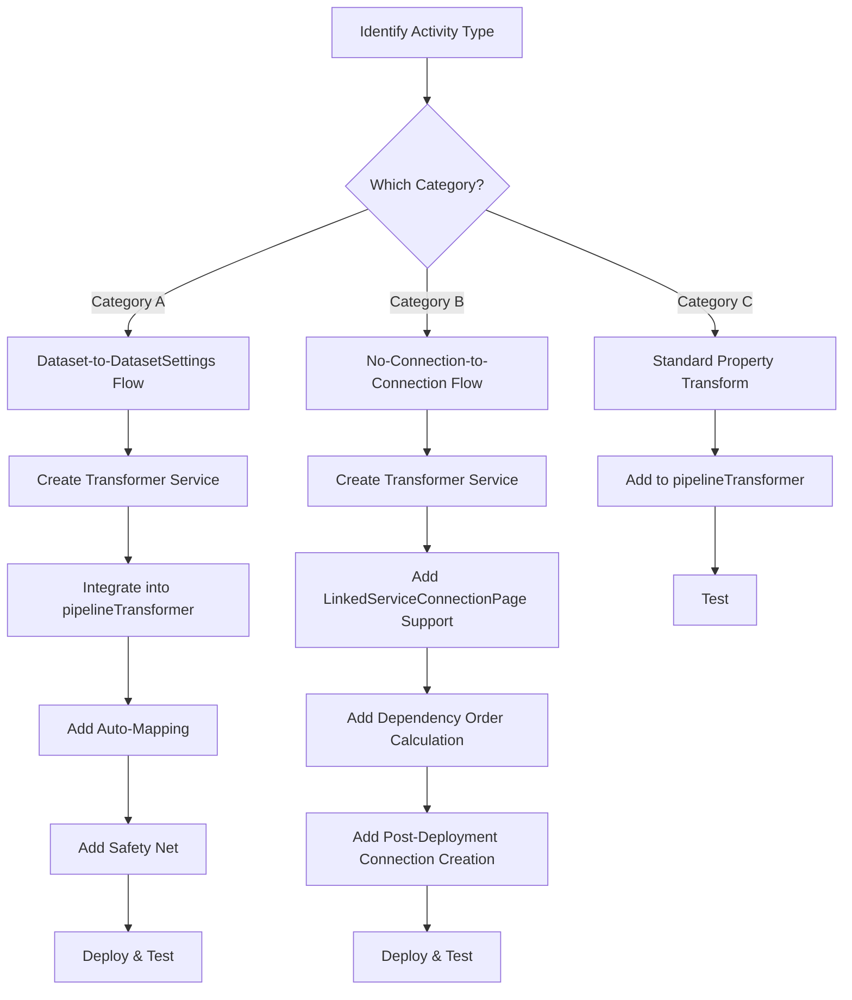
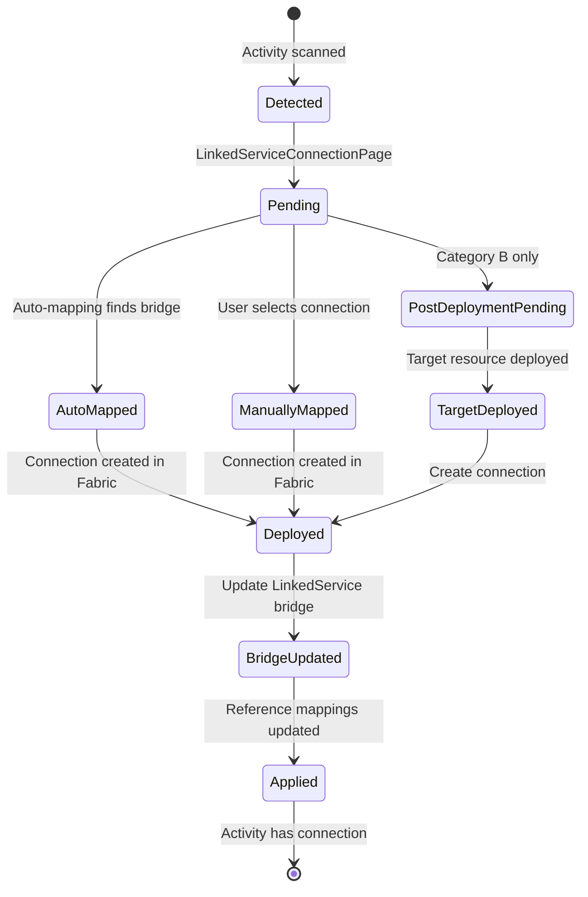

# Activity Transformer Implementation Guide

## Purpose
This guide ensures consistent, correct implementation of activity transformers for ADF-to-Fabric migration, particularly for activities requiring connection references.

---

## Prerequisites

Before implementing a new transformer, ensure you have:

### Technical Requirements
- **Node.js**: v18.x or higher
- **TypeScript**: v5.x or higher
- **VS Code**: Latest stable version (recommended)
- **Git**: For version control

### Fabric Environment
- **Fabric Workspace**: Premium or Trial capacity
- **API Permissions**: 
  - `Item.ReadWrite.All` for creating pipelines and connections
  - `Workspace.ReadWrite.All` for workspace operations
- **Service Principal** (optional): For automated deployments
- **On-Premises Data Gateway** (if applicable): For on-premises data sources

### Knowledge Prerequisites
- Familiarity with Azure Data Factory ARM templates
- Understanding of Fabric Data Pipelines architecture
- Basic TypeScript/React development experience
- Knowledge of REST API interactions

### Recommended Reading
- [Azure Data Factory Activity Documentation](https://learn.microsoft.com/en-us/azure/data-factory/concepts-pipelines-activities)
- [Fabric Data Pipelines Documentation](https://learn.microsoft.com/en-us/fabric/data-factory/)
- [Fabric REST API Reference](https://learn.microsoft.com/en-us/rest/api/fabric/)

---

## Glossary

### Core Concepts

**Activity Transformer**
: A specialized service class that converts an ADF activity definition to Fabric format, handling property transformations, type mappings, and connection references.

**Reference ID**
: A unique identifier following the pattern `{pipelineName}_{activityName}_{suffix}` used to map activities to their required connections. Example: `feature2_Lookup1_dataset`

**Pipeline Reference Mappings** (`pipelineReferenceMappings`)
: NEW format for storing connection mappings using referenceId-based keys. Structured as `Record<pipelineName, Record<referenceId, connectionId>>`. Stored in global AppContext state.

**Pipeline Connection Mappings** (`pipelineConnectionMappings`)
: OLD format for storing connection mappings using activity-name-based keys. Legacy format maintained for backward compatibility.

**LinkedService Connection Bridge** (`linkedServiceConnectionBridge`)
: A mapping dictionary that bridges ADF LinkedService names to deployed Fabric connection IDs. Used as fallback when explicit activity mappings don't exist.

### Activity Categories

**Category A: Dataset-to-DatasetSettings**
: Activities that reference external Dataset resources in ADF but require embedded `datasetSettings` with connection references in Fabric. Examples: Lookup, GetMetadata.

**Category B: No-Connection-to-Connection**
: Activities that don't require connections in ADF but need explicit Fabric connections. Examples: ExecutePipeline (needs FabricDataPipeline connection).

**Category C: Standard Property**
: Activities requiring minimal transformation with no connection dependencies. Examples: SetVariable, Wait, If.

### Connection Types

**FabricDataPipeline**
: Fabric-specific connection type for pipeline-to-pipeline references. Used by ExecutePipeline activities.

**LinkedService-based Connection**
: Traditional connection types mapped from ADF LinkedServices (e.g., SqlServer, AzureBlobStorage, etc.).

### Transformation Flow

**4-Tier Connection Lookup**
: The priority order for finding connection IDs:
1. NEW format (referenceId-based in `pipelineReferenceMappings`)
2. OLD format (activity-name-based in `pipelineConnectionMappings`)
3. Bridge (LinkedService name in `linkedServiceConnectionBridge`)
4. Direct name matching (fallback)

**Auto-Mapping**
: Automated process of detecting activity connection requirements and creating reference mappings based on the LinkedService connection bridge.

**Safety Net**
: The `pipelineConnectionTransformerService` that applies connection mappings as a final pass, marking activities as Inactive if connections can't be found.

### State Management

**Global State** / **AppContext State**
: Centralized application state managed by React Context, containing all connection mappings, deployed resources, and configuration.

**Local State**
: Component-specific state (e.g., in MappingPage) that must be dispatched to global state for use during deployment.

### Deployment Lifecycle

**Pending Connection**
: A connection that cannot be created immediately because it depends on another resource being deployed first (e.g., ExecutePipeline connection needs target pipeline deployed).

**Post-Deployment Connection Creation**
: The process of creating connections after dependent resources (like pipelines) have been successfully deployed.

**Inactive Activity**
: An activity marked with `state: "Inactive"` and `onInactiveMarkAs: "Succeeded"` because its required connection couldn't be found or created. The pipeline can still execute, but the activity is skipped.

---

## Table of Contents

### Part 1: Fundamentals
- [When to Create a New Transformer](#when-to-create-a-new-transformer)
- [Transformer Categories](#transformer-categories)
- [Implementation Overview](#implementation-overview)

### Part 2: Category A Implementation (Dataset-to-DatasetSettings)
- [Phase 1: Research & Design](#phase-1-research--design)
- [Phase 1.5: AppContext State Management](#phase-15-appcontext-state-management)
- [Phase 2: Create Transformer Service](#phase-2-create-transformer-service)
- [Phase 3: Integrate into Pipeline Transformer](#phase-3-integrate-into-pipeline-transformer)
- [Phase 4: Add Safety Net in Connection Transformer Service](#phase-4-add-safety-net-in-connection-transformer-service)
- [Phase 5: Update Auto-Mapping Logic](#phase-5-update-auto-mapping-logic)
- [Phase 6: Update UI Component Mapping Table](#phase-6-update-ui-component-mapping-table)
- [Phase 7: Add Comprehensive Testing](#phase-7-add-comprehensive-testing)

### Part 3: Category B Implementation (No-Connection-to-Connection)
- [Phase 2.5: Add Connection Creation Support](#phase-25-add-connection-creation-support)
- [Phase 3.5: Implement Category B Deployment Flow](#phase-35-implement-category-b-deployment-flow)
- [Phase 5.5: Enhanced Auto-Mapping for Category B](#phase-55-enhanced-auto-mapping-for-category-b)
- [Phase 6.5: Deploy Category B Connections](#phase-65-deploy-category-b-connections)
- [Phase 7.5: Post-Deployment Connection Creation](#phase-75-post-deployment-connection-creation)
- [Category B Specifics Summary](#category-b-specifics-no-connection-to-connection-transformers)

### Part 4: Integration & Testing
- [Connection Lifecycle Management](#connection-lifecycle-management)
- [Testing Strategy for All Categories](#testing-strategy-for-all-categories)
- [Performance Considerations](#performance-considerations)

### Part 5: Troubleshooting & Reference
- [Common Pitfalls & Solutions](#common-pitfalls--solutions)
- [Troubleshooting Decision Trees](#troubleshooting-decision-trees)
- [Quick Reference Tables](#quick-reference-tables)
- [Documentation Requirements](#documentation-requirements)
- [Validation Checklist](#validation-checklist)

---

## Part 1: Fundamentals

## Implementation Overview



---

## When to Create a New Transformer

Create a dedicated transformer when an activity has:

1. **Dataset references** that need conversion to `datasetSettings`
2. **Connection requirements** different from ADF (e.g., ExecutePipeline needs Fabric connection but ADF doesn't)
3. **Complex type mappings** (e.g., 50+ dataset types)
4. **Specialized property transformations** beyond basic copy

---

## Transformer Categories

### Category A: Dataset-to-DatasetSettings Transformers
**Examples:** Lookup, GetMetadata, Script (if applicable)

**Characteristics:**
- **ADF**: `typeProperties.dataset` (reference to separate Dataset resource)
- **Fabric**: `typeProperties.datasetSettings` (embedded configuration + connection)
- Requires connection via `externalReferences.connection`

### Category B: No-Connection-to-Connection Transformers  
**Examples:** ExecutePipeline, InvokePipeline (future)

**Characteristics:**
- **ADF**: No connection needed (internal reference)
- **Fabric**: Requires explicit Fabric connection
- Connection mapping via `FabricDataPipeline` type

### Category C: Standard Property Transformers
**Examples:** ForEach, If, Switch, Wait

**Characteristics:**
- Minimal transformation needed
- No connection requirements
- Handled by base `pipelineTransformer`

---

## Part 2: Category A Implementation (Dataset-to-DatasetSettings)

## File Change Checklist: Category A vs Category B

### Category A (Dataset-to-DatasetSettings) - Files to Modify

| File | Required Changes | Priority | Checklist |
|------|------------------|----------|-----------|
| `src/services/{activityType}ActivityTransformer.ts` | Create new transformer with 4-tier lookup, type mappings, dataset conversion | HIGH | ☐ Created ☐ 4-tier lookup ☐ Type mappings ☐ Dataset conversion |
| `src/services/pipelineTransformer.ts` | Add transformation case, import transformer | HIGH | ☐ Import ☐ Add conditional ☐ Pass pipelineName |
| `src/services/pipelineConnectionTransformerService.ts` | Add dataset-level connection handling, inactive marking | HIGH | ☐ Dataset handling ☐ Inactive marking |
| `src/components/pages/MappingPage.tsx` | Add reference extraction for activity type | HIGH | ☐ Collect references ☐ Dispatch mappings |
| `src/components/pages/mapping/ComponentMappingTableV2.tsx` | Add connection dropdown for activity | MEDIUM | ☐ Connection select ☐ Auto-mapping badge |
| `src/contexts/AppContext.tsx` | Ensure SET_PIPELINE_REFERENCE_MAPPINGS exists | HIGH | ☐ Action type ☐ Reducer case |
| `src/services/fabricService.ts` | Pass component.name to transformPipelineDefinition (2 locations) | CRITICAL | ☐ Line ~260 ☐ Line ~1837 |

### Category B (No-Connection-to-Connection) - Files to Modify

| File | Required Changes | Priority | Checklist |
|------|------------------|----------|-----------|
| `src/services/{activityType}ActivityTransformer.ts` | Create transformer with special location type | HIGH | ☐ Created ☐ 4-tier lookup ☐ Special location |
| `src/services/pipelineTransformer.ts` | Add transformation case | HIGH | ☐ Import ☐ Add conditional ☐ Pass pipelineName |
| `src/services/pipelineConnectionTransformerService.ts` | Add activity-level connection handling | HIGH | ☐ Activity handling ☐ Inactive marking |
| `src/components/pages/LinkedServiceConnectionPage.tsx` | **Add connection detection logic** | CRITICAL | ☐ Activity scan ☐ Pending tracking ☐ Type selection |
| `src/components/pages/DeployConnectionsPage.tsx` | **Add deferred deployment, bridge update** | CRITICAL | ☐ Separate categories ☐ Update bridge ☐ Track pending |
| `src/components/pages/MappingPage.tsx` | Add reference extraction with pending flag | HIGH | ☐ Collect refs ☐ Pending flag ☐ Dispatch mappings |
| `src/components/pages/DeploymentPage.tsx` | **Add post-deployment connection creation** | CRITICAL | ☐ Track deployed ☐ Create connections ☐ Update mappings |
| `src/contexts/AppContext.tsx` | **Add new state fields and actions** | CRITICAL | ☐ ExecutePipeline state ☐ Deployed pipelines ☐ Actions ☐ Reducers |
| `src/services/fabricService.ts` | **Add dependency ordering and connection creation** | CRITICAL | ☐ Calculate order ☐ Create connections ☐ Update mappings |

**Legend:** 
- **Bold** = Critical for Category B (not needed for Category A)
- CRITICAL = Must implement or deployment will fail
- HIGH = Important for proper functionality
- MEDIUM = Improves user experience

---

## Implementation Checklist

### Phase 1: Research & Design

- [ ] **Study ADF activity schema**
  - Analyze ARM template examples
  - Document required vs optional properties
  - Identify dataset/connection dependencies
  
- [ ] **Study Fabric activity schema**
  - Review Fabric API documentation
  - Identify property name changes (e.g., `dataset` → `datasetSettings`)
  - Document new required properties (e.g., `source.type`)

- [ ] **Identify connection strategy**
  - [ ] Category A: Dataset → needs `externalReferences.connection` in datasetSettings
  - [ ] Category B: New connection → needs FabricDataPipeline mapping
  - [ ] Category C: No connection → skip connection handling

- [ ] **Map dataset/source types**
  - Create comprehensive type mapping table
  - Example: `SqlServerTable` (ADF) → `SqlServerTable` (Fabric)
  - Include all variants (50+ for SQL/NoSQL/File/Cloud/SaaS)

---

## Phase 1.5: AppContext State Management

**File:** `src/contexts/AppContext.tsx`

**Purpose:** Ensure global state supports all connection mapping formats and Category B requirements.

### Step 1: Add Required Type Imports

```typescript
// In src/contexts/AppContext.tsx

import { 
  AppState, 
  AuthState, 
  ADFComponent, 
  DeploymentResult, 
  WizardStep, 
  FabricTarget, 
  WorkspaceInfo, 
  ConnectionMappingState, 
  LinkedServiceConnection, 
  FabricGateway, 
  SupportedConnectionType, 
  ConnectionDeploymentResult, 
  PipelineConnectionMappings,
  PipelineReferenceMappings,  // ← REQUIRED for Category A & B
  WorkspaceCredentialState, 
  WorkspaceCredentialMapping, 
  WorkspaceIdentityInfo,
  FolderTreeNode,
  FolderDeploymentResult,
  GlobalParameterReference,
  VariableLibraryConfig
} from '../types';
```

### Step 2: Add Required State Fields (in src/types/index.ts)

```typescript
export interface AppState {
  // ... existing fields ...
  
  /** NEW format connection mappings (referenceId-based) - REQUIRED */
  pipelineReferenceMappings?: PipelineReferenceMappings;
  
  /** Bridge mapping LinkedService names to Fabric connection IDs */
  linkedServiceConnectionBridge?: Record<string, {

---

## Common Pitfalls

### Activity Type Name Mismatches ⚠️

**Issue:** Switch statements must use exact ADF activity type names from ARM templates.

**Wrong:**
```typescript
switch (activityType) {
  case 'If': return transformIfProperties(...);  // ❌ ADF uses 'IfCondition'
  case 'Web': return transformWebProperties(...); // ❌ Verify: might be 'WebActivity'
}
```

**Correct:**
```typescript
switch (activityType) {
  case 'IfCondition': return transformIfProperties(...); // ✅ Matches ADF ARM template
  case 'ForEach': return transformForEachProperties(...); // ✅ Matches ADF ARM template
}
```

**How to Verify:**
1. Check actual ARM template: `grep -r '"type":' [template.json]`
2. Search console logs: Activity processing logs show actual type values
3. Add test coverage: Include real ARM template examples in tests

**Real Example:**
The IfCondition bug (Dec 2025) was caused by using `case 'If':` instead of `case 'IfCondition':`, preventing nested activities from being transformed and causing deployment failures with "ExternalReferences cannot be null" errors.

---
    connectionId: string;
    connectionDisplayName?: string;
    linkedServiceName: string;
    mappingSource: 'auto' | 'manual' | 'deployed';
    deploymentTimestamp?: string;
  }>;
  
  /** Category B: Track ExecutePipeline connection requirements */
  executePipelineConnections?: Record<string, {
    activityReference: string;
    targetPipelineName: string;
    targetPipelineId?: string;  // Set after target pipeline deployed
    connectionId?: string;       // Set after connection created
    status: 'pending' | 'ready' | 'created';
  }>;
  
  /** Track deployed pipeline IDs for post-deployment connection creation */
  deployedPipelineIds?: Map<string, string>; // pipelineName → fabricItemId
}
```

### Step 3: Add Required Action Types

```typescript
type AppAction =
  // ... existing actions ...
  
  | { type: 'SET_PIPELINE_CONNECTION_MAPPINGS'; payload: PipelineConnectionMappings }
  | { type: 'SET_PIPELINE_REFERENCE_MAPPINGS'; payload: PipelineReferenceMappings }  // ← CRITICAL
  | { type: 'UPDATE_LINKEDSERVICE_CONNECTION_BRIDGE'; payload: Record<string, any> }  // ← Category B
  | { type: 'SET_EXECUTEPIPELINE_CONNECTIONS'; payload: Record<string, any> }  // ← Category B
  | { type: 'UPDATE_EXECUTEPIPELINE_CONNECTION'; payload: { key: string; update: Partial<any> } }  // ← Category B
  | { type: 'ADD_DEPLOYED_PIPELINE'; payload: { name: string; fabricItemId: string } }  // ← Category B
  | { type: 'SET_DEPLOYED_PIPELINES'; payload: Map<string, string> }  // ← Category B
  | { type: 'UPDATE_PIPELINE_CONNECTION_MAPPING'; payload: { pipelineName: string; activityName: string; mapping: any } };
```

### Step 4: Add Reducer Cases

```typescript
function appReducer(state: AppState, action: AppAction): AppState {
  switch (action.type) {
    // ... existing cases ...
    
    case 'SET_PIPELINE_CONNECTION_MAPPINGS':
      return { ...state, pipelineConnectionMappings: action.payload || {} };
    
    case 'SET_PIPELINE_REFERENCE_MAPPINGS':  // ← CRITICAL for Category A & B
      console.log('📝 Setting pipeline reference mappings:', Object.keys(action.payload || {}).length, 'pipelines');
      return { ...state, pipelineReferenceMappings: action.payload || {} };
    
    case 'UPDATE_LINKEDSERVICE_CONNECTION_BRIDGE':  // ← Category B
      console.log('🔄 Updating LinkedService connection bridge');
      return { ...state, linkedServiceConnectionBridge: action.payload };
    
    case 'SET_EXECUTEPIPELINE_CONNECTIONS':  // ← Category B
      return { ...state, executePipelineConnections: action.payload };
    
    case 'UPDATE_EXECUTEPIPELINE_CONNECTION':  // ← Category B
      return {
        ...state,
        executePipelineConnections: {
          ...state.executePipelineConnections,
          [action.payload.key]: {
            ...state.executePipelineConnections?.[action.payload.key],
            ...action.payload.update
          }
        }
      };
    
    case 'ADD_DEPLOYED_PIPELINE':  // ← Category B
      const newMap = new Map(state.deployedPipelineIds || new Map());
      newMap.set(action.payload.name, action.payload.fabricItemId);
      console.log(`✅ Tracked deployed pipeline: ${action.payload.name} → ${action.payload.fabricItemId}`);
      return { ...state, deployedPipelineIds: newMap };
    
    case 'SET_DEPLOYED_PIPELINES':  // ← Category B
      return { ...state, deployedPipelineIds: action.payload };
    
    default:
      return state;
  }
}
```

### Step 5: Validation

After adding these changes:

```typescript
// Test in browser console after app loads:
console.log('AppContext validation:', {
  hasPipelineReferenceMappings: 'pipelineReferenceMappings' in state,
  hasLinkedServiceBridge: 'linkedServiceConnectionBridge' in state,
  hasExecutePipelineConnections: 'executePipelineConnections' in state,
  hasDeployedPipelineIds: 'deployedPipelineIds' in state
});
```

All should return `true`.

**⚠️ CRITICAL:** Without these state fields and actions, Category A activities will be marked as Inactive, and Category B deployment will fail entirely.

---

## Phase 2: Create Transformer Service

**File:** `src/services/{activityType}ActivityTransformer.ts`

### 2.1: Service Structure Template

```typescript
import { adfParserService } from './adfParserService';
import type { PipelineConnectionMappings, PipelineReferenceMappings } from '../types';

export class {ActivityType}ActivityTransformer {
  
  /**
   * Transform {ActivityType} activity from ADF to Fabric format
   * @param activity - Original ADF activity
   * @param connectionMappings - OLD format activity-name-based mappings
   * @param referenceMappings - NEW format referenceId-based mappings
   * @param pipelineName - Name of the parent pipeline
   */
  transform{ActivityType}Activity(
    activity: any,
    connectionMappings: PipelineConnectionMappings,
    referenceMappings?: Record<string, Record<string, string>>,
    pipelineName?: string
  ): any {
    
    console.log(`Transforming {ActivityType} activity: ${activity.name}`);
    
    // 1. Clone activity to avoid mutations
    const transformed = JSON.parse(JSON.stringify(activity));
    
    // 2. Get dataset information (Category A only)
    const dataset = this.getDatasetFromActivity(activity);
    
    // 3. Get connection ID using 4-tier fallback
    const connectionId = this.getConnectionIdForLinkedService(
      dataset?.linkedServiceName,
      pipelineName,
      activity.name,
      connectionMappings,
      referenceMappings
    );
    
    // 4. Transform properties
    transformed.typeProperties = this.transformTypeProperties(
      activity.typeProperties,
      dataset,
      connectionId
    );
    
    // 5. Log results
    console.log(`✅ {ActivityType} activity '${activity.name}' transformed`, {
      hasDatasetSettings: Boolean(transformed.typeProperties?.datasetSettings),
      hasExternalReferences: Boolean(transformed.typeProperties?.datasetSettings?.externalReferences),
      connectionId
    });
    
    return transformed;
  }
  
  // ... helper methods below
}
```

### 2.2: Required Helper Methods

```typescript
/**
 * Get dataset information from ADF activity
 */
private getDatasetFromActivity(activity: any): any {
  const datasetRef = activity.typeProperties?.dataset?.referenceName;
  if (!datasetRef) return null;
  
  const dataset = adfParserService.getDatasetByName(datasetRef);
  
  console.log(`{ActivityType} activity '${activity.name}' dataset info:`, {
    datasetName: datasetRef,
    datasetType: dataset?.properties?.type,
    linkedServiceName: dataset?.properties?.linkedServiceName?.referenceName,
    hasParameters: Boolean(dataset?.properties?.parameters)
  });
  
  return dataset;
}

/**
 * 4-Tier connection lookup with detailed logging
 * Priority 1: NEW referenceMappings (referenceId-based)
 * Priority 2: OLD connectionMappings (activity-name-based) 
 * Priority 3: Bridge linkedServiceBridge
 * Priority 4: Direct LinkedService mapping (fallback)
 */
private getConnectionIdForLinkedService(
  linkedServiceName: string | undefined,
  pipelineName: string | undefined,
  activityName: string,
  connectionMappings: PipelineConnectionMappings,
  referenceMappings?: Record<string, Record<string, string>>
): string | undefined {
  
  if (!linkedServiceName) {
    console.warn(`❌ No LinkedService found for activity '${activityName}'`);
    return undefined;
  }
  
  console.log(`Looking up connection for {ActivityType} activity '${activityName}':`, {
    linkedServiceName,
    pipelineName,
    activityName,
    expectedReferenceId: `${pipelineName}_${activityName}_dataset`,
    hasPipelineConnectionMappings: Boolean(connectionMappings),
    hasReferenceMappings: Boolean(referenceMappings)
  });
  
  // Priority 1: NEW format (referenceId-based)
  if (referenceMappings && pipelineName) {
    const referenceId = `${pipelineName}_${activityName}_dataset`;
    const pipelineRefs = referenceMappings[pipelineName];
    
    if (pipelineRefs && pipelineRefs[referenceId]) {
      console.log(`  🎯 NEW format hit: ${referenceId} → ${pipelineRefs[referenceId]}`);
      return pipelineRefs[referenceId];
    }
  }
  
  // Priority 2: OLD format (activity-name-based)
  if (pipelineName && connectionMappings[pipelineName]) {
    const pipelineMappings = connectionMappings[pipelineName];
    
    for (const [key, mapping] of Object.entries(pipelineMappings)) {
      if (mapping.linkedServiceReference?.name === linkedServiceName) {
        console.log(`  🔄 OLD format hit: ${linkedServiceName} → ${mapping.selectedConnectionId}`);
        return mapping.selectedConnectionId;
      }
    }
  }
  
  // Priority 3 & 4 handled by pipelineConnectionTransformerService
  console.log(`  ❌ No connection mapping found for LinkedService: ${linkedServiceName}`);
  return undefined;
}

/**
 * Map ADF dataset type to Fabric dataset type
 */
private mapDatasetType(adfType: string): string {
  const typeMap: Record<string, string> = {
    // SQL Databases
    'SqlServerTable': 'SqlServerTable',
    'AzureSqlTable': 'AzureSqlTable',
    'AzureSqlDWTable': 'AzureSqlDWTable',
    'AzureSqlMITable': 'AzureSqlMITable',
    'SqlPoolTable': 'SqlPoolTable',
    'OracleTable': 'OracleTable',
    'MySqlTable': 'MySqlTable',
    'PostgreSqlTable': 'PostgreSqlTable',
    'MariaDBTable': 'MariaDBTable',
    'Db2Table': 'Db2Table',
    'TeradataTable': 'TeradataTable',
    'SybaseTable': 'SybaseTable',
    'InformixTable': 'InformixTable',
    'SapTableResource': 'SapTableResource',
    'SapBwCube': 'SapBwCube',
    'SapCloudForCustomerResource': 'SapCloudForCustomerResource',
    'SapEccResource': 'SapEccResource',
    'SapHanaTable': 'SapHanaTable',
    'SapOpenHubTable': 'SapOpenHubTable',
    'SapOdpResource': 'SapOdpResource',
    
    // NoSQL Databases
    'CosmosDbSqlApiCollection': 'CosmosDbSqlApiCollection',
    'CosmosDbMongoDbApiCollection': 'CosmosDbMongoDbApiCollection',
    'MongoDbV2Collection': 'MongoDbV2Collection',
    'MongoDbCollection': 'MongoDbCollection',
    'MongoDbAtlasCollection': 'MongoDbAtlasCollection',
    'CassandraTable': 'CassandraTable',
    'CouchbaseTable': 'CouchbaseTable',
    'AzureTableStorage': 'AzureTableStorage',
    'DynamoDBTable': 'DynamoDBTable',
    
    // File-based Storage
    'DelimitedText': 'DelimitedText',
    'Parquet': 'Parquet',
    'Json': 'Json',
    'Avro': 'Avro',
    'Orc': 'Orc',
    'Binary': 'Binary',
    'Xml': 'Xml',
    'Excel': 'Excel',
    
    // Cloud Storage (Azure)
    'AzureBlobFSFile': 'AzureBlobFSFile',
    'AzureBlobStorageLocation': 'AzureBlobStorageLocation',
    'AzureDataLakeStoreFile': 'AzureDataLakeStoreFile',
    'AzureFileStorageLocation': 'AzureFileStorageLocation',
    
    // Cloud Storage (AWS)
    'AmazonS3Object': 'AmazonS3Object',
    'AmazonS3CompatibleLocation': 'AmazonS3CompatibleLocation',
    
    // Cloud Storage (Google)
    'GoogleCloudStorageLocation': 'GoogleCloudStorageLocation',
    
    // Web/HTTP
    'RestResource': 'RestResource',
    'HttpFile': 'HttpFile',
    'ODataResource': 'ODataResource',
    
    // SaaS/Cloud Applications
    'DynamicsEntity': 'DynamicsEntity',
    'DynamicsCrmEntity': 'DynamicsCrmEntity',
    'CommonDataServiceForAppsEntity': 'CommonDataServiceForAppsEntity',
    'SalesforceObject': 'SalesforceObject',
    'SalesforceServiceCloudObject': 'SalesforceServiceCloudObject',
    'ServiceNowObject': 'ServiceNowObject',
    'SnowflakeTable': 'SnowflakeTable',
    'SharePointOnlineListResource': 'SharePointOnlineListResource',
    'Office365Table': 'Office365Table',
    
    // Fabric-specific
    'LakehouseTable': 'LakehouseTable',
    'LakehouseFiles': 'LakehouseFiles',
    'WarehouseTable': 'WarehouseTable',
    
    // Add more as needed
  };
  
  const mappedType = typeMap[adfType] || adfType;
  
  if (!typeMap[adfType]) {
    console.warn(`⚠️ Unknown dataset type '${adfType}' - using as-is. Consider adding to type map.`);
  }
  
  return mappedType;
}

/**
 * Transform activity typeProperties from ADF to Fabric format
 */
private transformTypeProperties(
  adfTypeProperties: any,
  dataset: any,
  connectionId: string | undefined
): any {
  
  if (!dataset) {
    console.warn('No dataset found - returning typeProperties as-is');
    return adfTypeProperties;
  }
  
  // Build datasetSettings from dataset information
  const datasetSettings: any = {
    type: this.mapDatasetType(dataset.properties.type),
    typeProperties: {
      ...dataset.properties.typeProperties
    },
    schema: dataset.properties.schema || []
  };
  
  // Add connection reference if available
  if (connectionId) {
    datasetSettings.externalReferences = {
      connection: connectionId
    };
  }
  
  // Transform the activity's typeProperties
  const transformed: any = {
    ...adfTypeProperties,
    datasetSettings
  };
  
  // Remove the old dataset reference
  delete transformed.dataset;
  
  return transformed;
}
```

---

## Phase 3: Integrate into Pipeline Transformer

**File:** `src/services/pipelineTransformer.ts`

### 3.1: Import the transformer

```typescript
import { {ActivityType}ActivityTransformer } from './{activityType}ActivityTransformer';

const {activityType}ActivityTransformer = new {ActivityType}ActivityTransformer();
```

### 3.2: Add transformation case

```typescript
transformActivities(activities: any[], connectionMappings?: PipelineConnectionMappings): any[] {
  const pipelineName = this.currentPipelineName || 'unknown';
  
  return activities.map(activity => {
    let transformedActivity = activity;
    
    // ... existing transformation cases ...
    
    } else if (activity.type === '{ActivityType}') {
      console.log(`Transforming {ActivityType} activity '${activity.name}' with mappings:`, {
        pipelineName: this.currentPipelineName,
        hasConnectionMappings: Boolean(connectionMappings),
        hasReferenceMappings: Boolean(this.referenceMappings),
        referenceMappingsForPipeline: this.referenceMappings && this.currentPipelineName ? 
          Object.keys(this.referenceMappings[this.currentPipelineName] || {}) : []
      });
      
      transformedActivity = {activityType}ActivityTransformer.transform{ActivityType}Activity(
        activity,
        connectionMappings,
        this.referenceMappings,
        this.currentPipelineName
      );
    }
    
    return transformedActivity;
  });
}
```

### 3.3: **CRITICAL**: Pass pipelineName to transformPipelineDefinition

```typescript
// In fabricService.ts - BOTH locations

// Location 1: generateDeploymentPlan (line ~260)
const pipelineDefinition = pipelineTransformer.transformPipelineDefinition(
  component.definition, 
  pipelineConnectionMappings,
  component.name  // ← MUST PASS THIS
);

// Location 2: createPipelineWithDependencyResolution (line ~1837)
let pipelineDefinition = pipelineTransformer.transformPipelineDefinition(
  component.definition, 
  pipelineConnectionMappings,
  component.name  // ← MUST PASS THIS
);
```

---

## Phase 4: Add Safety Net in Connection Transformer Service

**File:** `src/services/pipelineConnectionTransformerService.ts`

Add special handling for your activity type:

```typescript
// Inside transformPipelineWithConnections, in the activities.forEach loop

if ((activity.type === 'Lookup' || 
     activity.type === 'GetMetadata' || 
     activity.type === '{ActivityType}') && 
    activity.typeProperties?.datasetSettings) {
  
  console.log(`Applying dataset-level connection for ${activity.type} activity '${activity.name}'`);
  
  const datasetReferenceId = `${pipelineName}_${activity.name}_dataset`;
  
  const connectionId = findConnectionIdForActivity(
    activity.name,
    datasetReferenceId,
    undefined
  );

  if (connectionId) {
    console.log(`  ✅ Found connection for dataset: ${datasetReferenceId} → ${connectionId}`);
    
    if (!activity.typeProperties.datasetSettings.externalReferences) {
      activity.typeProperties.datasetSettings.externalReferences = {};
    }
    activity.typeProperties.datasetSettings.externalReferences.connection = connectionId;
  } else {
    console.warn(`  ❌ No connection mapping found for ${activity.type} activity '${activity.name}' dataset (referenceId: ${datasetReferenceId})`);
    
    // Mark as inactive
    activity.state = 'Inactive';
    activity.onInactiveMarkAs = 'Succeeded';
  }
}
```

---

## Phase 5: Update Auto-Mapping Logic

**File:** `src/components/pages/MappingPage.tsx`

### 5.1: Add activity reference extraction

In the `collectActivityReferences` function:

```typescript
// Add your activity type to the condition
if (activity.type === 'Copy' || 
    activity.type === 'Lookup' || 
    activity.type === 'GetMetadata' || 
    activity.type === '{ActivityType}') {
  
  // Extract dataset reference
  const datasetRef = activity.typeProperties?.dataset?.referenceName;
  if (datasetRef) {
    const dataset = adfParserService.getDatasetByName(datasetRef);
    const linkedServiceName = dataset?.properties?.linkedServiceName?.referenceName;
    
    if (linkedServiceName) {
      references.push({
        referenceId: `${pipelineName}_${activity.name}_dataset`,
        linkedServiceName,
        location: 'dataset',
        activityName: activity.name,
        activityType: activity.type
      });
    }
  }
}
```

### 5.2: Ensure global state dispatch

```typescript
// After auto-mapping logic (around line 528)
dispatch({
  type: 'SET_PIPELINE_CONNECTION_MAPPINGS',
  payload: autoMappings
});

dispatch({
  type: 'SET_PIPELINE_REFERENCE_MAPPINGS',  // ← CRITICAL: Persist to global state
  payload: mergedReferenceMappings
});

dispatch({
  type: 'SET_AUTO_MAPPED_REFERENCES',
  payload: Array.from(autoMappedSet)
});
```

---

## Phase 6: Update UI Component Mapping Table

**File:** `src/components/pages/mapping/ComponentMappingTableV2.tsx`

Add activity type to connection dropdown rendering:

```typescript
// In the activity row rendering logic
{(activity.type === 'Copy' || 
  activity.type === 'Lookup' || 
  activity.type === 'GetMetadata' ||
  activity.type === '{ActivityType}') && (
  <Select
    value={selectedConnection}
    onValueChange={(value) => handleConnectionChange(value)}
  >
    <SelectTrigger>
      <SelectValue placeholder="Select connection" />
    </SelectTrigger>
    <SelectContent>
      {availableConnections.map(conn => (
        <SelectItem key={conn.id} value={conn.id}>
          {conn.name}
        </SelectItem>
      ))}
    </SelectContent>
  </Select>
)}
```

---

## Phase 7: Add Comprehensive Testing

### 7.1: Create test ARM template

```json
{
  "name": "[concat(parameters('factoryName'), '/test{ActivityType}')]",
  "type": "Microsoft.DataFactory/factories/pipelines",
  "apiVersion": "2018-06-01",
  "properties": {
    "activities": [
      {
        "name": "{ActivityType}1",
        "type": "{ActivityType}",
        "typeProperties": {
          "dataset": {
            "referenceName": "TestDataset",
            "type": "DatasetReference"
          }
          // ... activity-specific properties
        }
      }
    ]
  },
  "dependsOn": [
    "[concat(variables('factoryId'), '/datasets/TestDataset')]"
  ]
}
```

### 7.2: Test Checklist

- [ ] **Upload & Parse**: ARM template loads correctly
- [ ] **Configure Connections**: Bridge populated with LinkedService mapping
- [ ] **Auto-Mapping**: Console logs show `🎯 bridge {linkedService} → {connectionId}`
- [ ] **Manual Mapping**: Can manually select different connection in UI
- [ ] **Reference Mappings**: `state.pipelineReferenceMappings[pipelineName][referenceId]` exists
- [ ] **Transformation Logs**: Show `🎯 NEW format hit` during deployment
- [ ] **Connection Application**: Logs show `✅ Applied dataset connection`
- [ ] **No Inactive State**: Deployed activity lacks `state: "Inactive"`
- [ ] **External References**: Activity has `externalReferences.connection`
- [ ] **Deployment Success**: Pipeline deploys and executes in Fabric
- [ ] **No Regression**: Existing activity types (Copy, ExecutePipeline, etc.) still work

---

## Common Pitfalls & Solutions

### ❌ Pitfall 1: Missing pipelineName Parameter
**Symptom:** `pipelineName: 'unknown'` in logs, referenceId lookup fails

**Root Cause:** `transformPipelineDefinition` called without third parameter

**Solution:**
```typescript
// WRONG ❌
pipelineTransformer.transformPipelineDefinition(definition, mappings);

// RIGHT ✅
pipelineTransformer.transformPipelineDefinition(definition, mappings, component.name);
```

**Impact:** Activities marked as Inactive even though connections exist

---

### ❌ Pitfall 2: Reference Mappings Not Persisted
**Symptom:** Auto-mapping works, but deployment shows `availableReferenceMappings: Array(0)`

**Root Cause:** Missing dispatch to global AppContext state

**Solution:**
```typescript
// Add to MappingPage.tsx after auto-mapping
dispatch({
  type: 'SET_PIPELINE_REFERENCE_MAPPINGS',
  payload: mergedReferenceMappings
});

// Ensure AppContext.tsx has:
// 1. Import PipelineReferenceMappings type
// 2. Action type: { type: 'SET_PIPELINE_REFERENCE_MAPPINGS'; payload: PipelineReferenceMappings }
// 3. Reducer case: case 'SET_PIPELINE_REFERENCE_MAPPINGS': return { ...state, pipelineReferenceMappings: action.payload || {} };
```

**Impact:** All activities marked as Inactive due to missing connection mappings

---

### ❌ Pitfall 3: Incorrect ReferenceId Pattern
**Symptom:** Connection exists but lookup fails with "❌ No connection mapping found"

**Root Cause:** Inconsistent referenceId suffix between auto-mapping and transformation

**Solution:**
```typescript
// For dataset-based activities (Lookup, GetMetadata), use '_dataset' suffix
const referenceId = `${pipelineName}_${activityName}_dataset`;

// For activity-level connections (ExecutePipeline), use activity-specific suffix
const referenceId = `${pipelineName}_${activityName}_invokePipeline`;

// For source/sink in Copy activities, use '_source' or '_sink' suffix
const sourceReferenceId = `${pipelineName}_${activityName}_source`;
const sinkReferenceId = `${pipelineName}_${activityName}_sink`;
```

**Impact:** Connection lookup fails, activities marked as Inactive

---

### ❌ Pitfall 4: Missing Type Mapping
**Symptom:** `datasetSettings.type` is undefined or incorrect in deployed pipeline

**Root Cause:** Dataset type not in mapping table

**Solution:**
- Research ALL possible dataset types in [ADF documentation](https://learn.microsoft.com/en-us/azure/data-factory/)
- Create comprehensive mapping table (50+ entries recommended)
- Log warnings for unmapped types:
  ```typescript
  if (!typeMap[adfType]) {
    console.warn(`⚠️ Unknown dataset type '${adfType}' - using as-is. Consider adding to type map.`);
  }
  ```
- Use fallback: `return typeMap[adfType] || adfType;`

**Impact:** Fabric rejects pipeline or activity fails at runtime

---

### ❌ Pitfall 5: Incomplete Dataset Property Transformation
**Symptom:** Dataset exists but missing critical properties (schema, table, etc.)

**Root Cause:** Not copying all dataset properties to datasetSettings

**Solution:**
```typescript
const datasetSettings = {
  type: this.mapDatasetType(dataset.properties.type),
  typeProperties: {
    ...dataset.properties.typeProperties, // ✅ Preserve all properties
    // Add/transform specific properties as needed
  },
  schema: dataset.properties.schema || [],
  externalReferences: connectionId ? { connection: connectionId } : undefined
};
```

**Impact:** Pipeline deploys but fails at runtime due to missing configuration

---

### ❌ Pitfall 6: Not Handling Dataset Parameters
**Symptom:** Parameterized datasets lose their parameter values

**Root Cause:** Dataset parameters not preserved during transformation

**Solution:**
```typescript
// Check if dataset has parameters
if (dataset.properties.parameters) {
  datasetSettings.parameters = dataset.properties.parameters;
}

// Preserve parameter references in typeProperties
if (activity.typeProperties.dataset?.parameters) {
  transformed.typeProperties.datasetParameters = activity.typeProperties.dataset.parameters;
}
```

**Impact:** Dynamic datasets become static, losing flexibility

---

## Category B Specifics: No-Connection-to-Connection Transformers

For activities like **ExecutePipeline** that don't need connections in ADF but do in Fabric:

### Additional Implementation Steps

#### 1. Connection Type: Use FabricDataPipeline

```typescript
// In connection mapping logic
const connectionType = 'FabricDataPipeline'; // Not LinkedService-based

// Reference ID pattern uses different suffix
const referenceId = `${pipelineName}_${activityName}_invokePipeline`;
```

#### 2. Location Type: Use Special Identifier

```typescript
// In MappingPage.tsx reference collection
if (activity.type === 'ExecutePipeline') {
  references.push({
    referenceId: `${pipelineName}_${activity.name}_invokePipeline`,
    location: 'invoke-pipeline', // ← Special location type
    activityName: activity.name,
    activityType: 'ExecutePipeline'
  });
}
```

#### 3. Bridge Handling: Map to Deployed Resources

```typescript
// In linkedServiceMappingBridgeService.ts or similar
export function buildExecutePipelineBridge(
  pipelines: any[],
  deployedPipelines: Map<string, string>
): Record<string, any> {
  
  const bridge: Record<string, any> = {};
  
  pipelines.forEach(pipeline => {
    const pipelineName = pipeline.name;
    const fabricConnectionId = deployedPipelines.get(pipelineName);
    
    if (fabricConnectionId) {
      bridge[pipelineName] = {
        fabricConnectionId,
        pipelineName,
        type: 'FabricDataPipeline'
      };
    }
  });
  
  return bridge;
}
```

#### 4. UI Handling: Show Different Dropdown Options

```typescript
// In ComponentMappingTableV2.tsx
{activity.type === 'ExecutePipeline' && (
  <Select
    value={selectedConnection}
    onValueChange={(value) => handleConnectionChange(value)}
  >
    <SelectTrigger>
      <SelectValue placeholder="Select pipeline connection" />
    </SelectTrigger>
    <SelectContent>
      {deployedPipelines.map(pipeline => (
        <SelectItem key={pipeline.id} value={pipeline.connectionId}>
          {pipeline.name} (Fabric Data Pipeline)
        </SelectItem>
      ))}
    </SelectContent>
  </Select>
)}
```

---

## Part 3: Category B Implementation (No-Connection-to-Connection)

The following phases are **ONLY required for Category B transformers** (like ExecutePipeline). Skip these if implementing Category A.

---

## Phase 2.5: Add Connection Creation Support

**File:** `src/components/pages/LinkedServiceConnectionPage.tsx`

**Purpose:** Detect activities that need Fabric connections but don't have LinkedServices in ADF.

### Step 1: Add Activity Type Detection

```typescript
// Around line 150-200 in connection discovery logic

/**
 * Scan all pipelines for ExecutePipeline activities that require connections
 */
const scanForExecutePipelineActivities = (
  pipelines: ADFComponent[]
): ConnectionEntry[] => {
  
  const connections: ConnectionEntry[] = [];
  
  pipelines.forEach(pipelineComp => {
    const pipelineName = pipelineComp.name;
    const activities = pipelineComp.definition?.properties?.activities || [];
    
    activities.forEach(activity => {
      if (activity.type === 'ExecutePipeline') {
        const targetPipeline = activity.typeProperties?.pipeline?.referenceName;
        
        if (targetPipeline) {
          const referenceId = `${pipelineName}_${activity.name}_invokePipeline`;
          
          connections.push({
            id: referenceId,
            displayName: `${activity.name} → ${targetPipeline}`,
            type: 'FabricDataPipeline',
            category: 'ExecutePipeline',
            status: 'pending',
            needsDeployment: true,
            deployAfterPipeline: targetPipeline,
            source: {
              pipelineName,
              activityName: activity.name,
              targetPipeline
            }
          });
          
          console.log(`📌 Found ExecutePipeline: ${pipelineName}.${activity.name} → ${targetPipeline}`);
        }
      }
    });
  });
  
  return connections;
};

// Call this function and merge with LinkedService connections
const executePipelineConnections = scanForExecutePipelineActivities(state.adfComponents);
const allConnections = [...linkedServiceConnections, ...executePipelineConnections];
```

### Step 2: Display Pending Connections in UI

```typescript
// In connection list rendering

{connection.category === 'ExecutePipeline' && (
  <div className="ml-4 mt-2 p-3 bg-blue-50 border-l-4 border-blue-400 rounded">
    <div className="flex items-start">
      <InfoIcon className="w-5 h-5 text-blue-600 mr-2 mt-0.5" />
      <div className="text-sm">
        <p className="font-semibold text-blue-900">ExecutePipeline Connection</p>
        <p className="text-blue-700 mt-1">
          This connection will be created automatically after pipeline "{connection.deployAfterPipeline}" is deployed.
        </p>
        <p className="text-blue-600 mt-1 text-xs">
          Status: <Badge variant="warning">Pending Target Deployment</Badge>
        </p>
      </div>
    </div>
  </div>
)}
```

### Step 3: Track Pending Connections

```typescript
// Add to component state

const [pendingPipelineConnections, setPendingPipelineConnections] = useState<
  Record<string, {
    activityReference: string;
    targetPipelineName: string;
    status: 'pending' | 'ready' | 'created';
  }>
>({});

// Update status when target pipeline is deployed (via useEffect)
useEffect(() => {
  executePipelineConnections.forEach(conn => {
    const targetDeployed = state.deployedPipelineIds?.has(conn.deployAfterPipeline);
    if (targetDeployed && pendingPipelineConnections[conn.id]?.status === 'pending') {
      setPendingPipelineConnections(prev => ({
        ...prev,
        [conn.id]: {
          ...prev[conn.id],
          status: 'ready'
        }
      }));
    }
  });
}, [state.deployedPipelineIds, executePipelineConnections]);
```

---

## Phase 3.5: Implement Category B Deployment Flow

**File:** `src/services/fabricService.ts`

**Purpose:** Calculate pipeline deployment order and create FabricDataPipeline connections after deployment.

### Step 1: Calculate Pipeline Deployment Order

```typescript
// In deployComponents method, BEFORE pipeline deployment loop

/**
 * Calculate deployment order considering ExecutePipeline dependencies
 * Uses topological sort with cycle detection
 */
private calculateDependencyOrder(
  pipelines: ComponentMapping[],
  pipelineReferenceMappings: Record<string, Record<string, string>>
): { order: string[]; cycles: string[][] } {
  
  const graph = new Map<string, Set<string>>();
  const cycles: string[][] = [];
  
  // Build dependency graph
  pipelines.forEach(mapping => {
    const pipelineName = mapping.component.name;
    const activities = mapping.component.definition?.properties?.activities || [];
    
    if (!graph.has(pipelineName)) {
      graph.set(pipelineName, new Set());
    }
    
    activities.forEach(activity => {
      if (activity.type === 'ExecutePipeline') {
        const target = activity.typeProperties?.pipeline?.referenceName;
        if (target) {
          graph.get(pipelineName)!.add(target);
          console.log(`📊 Dependency: ${pipelineName} depends on ${target}`);
        }
      }
    });
  });
  
  // Detect cycles using DFS
  const visited = new Set<string>();
  const recStack = new Set<string>();
  const path: string[] = [];
  
  function detectCycle(node: string): boolean {
    if (recStack.has(node)) {
      // Found cycle
      const cycleStart = path.indexOf(node);
      cycles.push([...path.slice(cycleStart), node]);
      return true;
    }
    if (visited.has(node)) return false;
    
    visited.add(node);
    recStack.add(node);
    path.push(node);
    
    const neighbors = graph.get(node) || new Set();
    for (const neighbor of neighbors) {
      if (detectCycle(neighbor)) return true;
    }
    
    recStack.delete(node);
    path.pop();
    return false;
  }
  
  // Check all nodes for cycles
  pipelines.forEach(p => {
    if (!visited.has(p.component.name)) {
      detectCycle(p.component.name);
    }
  });
  
  if (cycles.length > 0) {
    console.error('❌ Circular dependencies detected:', cycles);
    throw new Error(`Circular pipeline dependencies: ${cycles.map(c => c.join(' → ')).join(', ')}`);
  }
  
  // Topological sort (Kahn's algorithm)
  const inDegree = new Map<string, number>();
  pipelines.forEach(p => inDegree.set(p.component.name, 0));
  
  graph.forEach((neighbors, node) => {
    neighbors.forEach(neighbor => {
      inDegree.set(neighbor, (inDegree.get(neighbor) || 0) + 1);
    });
  });
  
  const queue: string[] = [];
  inDegree.forEach((degree, node) => {
    if (degree === 0) queue.push(node);
  });
  
  const order: string[] = [];
  while (queue.length > 0) {
    const node = queue.shift()!;
    order.push(node);
    
    const neighbors = graph.get(node) || new Set();
    neighbors.forEach(neighbor => {
      const newDegree = (inDegree.get(neighbor) || 0) - 1;
      inDegree.set(neighbor, newDegree);
      if (newDegree === 0) queue.push(neighbor);
    });
  }
  
  console.log(`📋 Pipeline deployment order:`, order);
  return { order, cycles };
}
```

### Step 2: Create FabricDataPipeline Connections After Deployment

```typescript
/**
 * Create FabricDataPipeline connections for ExecutePipeline activities
 * Called after each pipeline is successfully deployed
 */
private async createExecutePipelineConnections(
  pipelineName: string,
  fabricPipelineId: string,
  executePipelineActivities: any[],
  workspaceId: string,
  accessToken: string
): Promise<Map<string, string>> {
  
  const connectionMap = new Map<string, string>();
  
  const activitiesForThisPipeline = executePipelineActivities.filter(
    act => act.targetPipelineName === pipelineName
  );
  
  if (activitiesForThisPipeline.length === 0) {
    return connectionMap;
  }
  
  console.log(`Creating ${activitiesForThisPipeline.length} FabricDataPipeline connections for ${pipelineName}`);
  
  for (const activity of activitiesForThisPipeline) {
    try {
      const connectionId = await this.createFabricDataPipelineConnection(
        workspaceId,
        fabricPipelineId,
        pipelineName,
        accessToken
      );
      
      const referenceId = activity.referenceId; // e.g., "feature2_Execute1_invokePipeline"
      connectionMap.set(referenceId, connectionId);
      
      console.log(`✅ Created FabricDataPipeline connection ${referenceId} → ${connectionId}`);
      
    } catch (error) {
      console.error(`❌ Failed to create connection for ${activity.referenceId}:`, error);
    }
  }
  
  return connectionMap;
}

/**
 * Create a single FabricDataPipeline connection
 */
private async createFabricDataPipelineConnection(
  workspaceId: string,
  targetPipelineId: string,
  pipelineName: string,
  accessToken: string
): Promise<string> {
  
  const response = await fetch(
    `https://api.fabric.microsoft.com/v1/workspaces/${workspaceId}/connections`,
    {
      method: 'POST',
      headers: {
        'Content-Type': 'application/json',
        'Authorization': `Bearer ${accessToken}`
      },
      body: JSON.stringify({
        displayName: `Pipeline Connection: ${pipelineName}`,
        connectionDetails: {
          type: 'FabricDataPipeline',
          path: targetPipelineId
        }
      })
    }
  );
  
  if (!response.ok) {
    const error = await response.text();
    throw new Error(`Fabric API error: ${error}`);
  }
  
  const result = await response.json();
  return result.id;
}
```

### Step 3: Update Reference Mappings with New Connections

```typescript
// After creating connections, update pipelineReferenceMappings

const updatedReferenceMappings = { ...pipelineReferenceMappings };

executePipelineConnectionMap.forEach((connectionId, referenceId) => {
  const [pipelineName, ...rest] = referenceId.split('_');
  
  if (!updatedReferenceMappings[pipelineName]) {
    updatedReferenceMappings[pipelineName] = {};
  }
  
  updatedReferenceMappings[pipelineName][referenceId] = connectionId;
});

// Set updated mappings for subsequent pipeline deployments
pipelineTransformer.setReferenceMappings(updatedReferenceMappings);

console.log(`✅ Updated reference mappings with ${executePipelineConnectionMap.size} new connections`);
```

---

## Phase 5.5: Enhanced Auto-Mapping for Category B

**File:** `src/components/pages/MappingPage.tsx`

**Purpose:** Extract ExecutePipeline activity references and mark them as pending.

### Enhanced Reference Collection

```typescript
// In collectActivityReferences function

// Category B: ExecutePipeline Activities
if (activity.type === 'ExecutePipeline') {
  const targetPipelineRef = activity.typeProperties?.pipeline?.referenceName;
  
  if (targetPipelineRef) {
    references.push({
      referenceId: `${pipelineName}_${activity.name}_invokePipeline`,
      targetPipeline: targetPipelineRef,
      location: 'invoke-pipeline',
      activityName: activity.name,
      activityType: 'ExecutePipeline',
      isPending: true,  // Will be resolved after target pipeline deployed
      requiresPostDeploymentConnection: true
    });
    
    console.log(`📌 ExecutePipeline reference: ${activity.name} → ${targetPipelineRef} (pending)`);
  }
}
```

### Display Pending Connections in UI

```typescript
// In mapping table rendering

{reference.isPending && (
  <Badge variant="warning" className="ml-2">
    <ClockIcon className="w-3 h-3 mr-1" />
    Pending Target Deployment
  </Badge>
)}

{reference.requiresPostDeploymentConnection && (
  <div className="text-xs text-muted-foreground mt-1">
    <InfoIcon className="inline w-3 h-3 mr-1" />
    Connection will be created after "{reference.targetPipeline}" is deployed
  </div>
)}
```

---

## Phase 6.5: Deploy Category B Connections

**File:** `src/components/pages/DeployConnectionsPage.tsx`

**Purpose:** Separate connection deployment by category and update bridge after deployment.

### Step 1: Separate Connection Types

```typescript
const handleDeployConnections = async () => {
  const connectionsToCreate = connectionResults.filter(
    conn => conn.deploymentAction === 'create'
  );
  
  // Separate by category
  const linkedServiceConnections = connectionsToCreate.filter(
    conn => conn.category !== 'ExecutePipeline'
  );
  
  const pipelineConnections = connectionsToCreate.filter(
    conn => conn.category === 'ExecutePipeline'
  );
  
  console.log(`Deploying ${linkedServiceConnections.length} LinkedService connections`);
  console.log(`Deferring ${pipelineConnections.length} ExecutePipeline connections (will deploy after pipelines)`);
  
  // Deploy LinkedService connections now
  await deployLinkedServiceConnections(linkedServiceConnections);
  
  // Save pipeline connections for post-deployment
  dispatch({
    type: 'SET_EXECUTEPIPELINE_CONNECTIONS',
    payload: pipelineConnections.reduce((acc, conn) => {
      acc[conn.id] = {
        activityReference: conn.id,
        targetPipelineName: conn.deployAfterPipeline,
        status: 'pending'
      };
      return acc;
    }, {})
  });
};
```

### Step 2: **CRITICAL** - Update Bridge After Deployment

```typescript
// After ALL connections are deployed successfully

const updateBridgeWithDeployedConnections = async (
  deploymentResults: ConnectionDeploymentResult[]
) => {
  
  const updatedBridge = { ...state.linkedServiceConnectionBridge };
  let updatedCount = 0;
  
  deploymentResults.forEach(result => {
    if (result.status === 'success') {
      const originalName = result.originalLinkedServiceName;
      
      if (originalName && updatedBridge[originalName]) {
        updatedBridge[originalName] = {
          ...updatedBridge[originalName],
          connectionId: result.fabricConnectionId,
          connectionDisplayName: result.displayName,
          mappingSource: 'deployed',
          deploymentTimestamp: new Date().toISOString()
        };
        
        updatedCount++;
        console.log(`🔄 Updated bridge: ${originalName} → ${result.fabricConnectionId}`);
      }
    }
  });
  
  if (updatedCount > 0) {
    dispatch({
      type: 'UPDATE_LINKEDSERVICE_CONNECTION_BRIDGE',
      payload: updatedBridge
    });
    
    console.log(`✅ Updated bridge with ${updatedCount} deployed connections`);
    toast.success(`Updated ${updatedCount} connection mappings`);
  }
};

// Call after deployment completes
await updateBridgeWithDeployedConnections(deploymentResults);
```

---

## Phase 7.5: Post-Deployment Connection Creation

**File:** `src/components/pages/DeploymentPage.tsx`

**Purpose:** Create Category B connections after all pipelines are deployed.

### Step 1: Track Deployed Pipelines

```typescript
// After each pipeline deployment succeeds

if (result.status === 'success' && result.componentType === 'pipeline') {
  dispatch({
    type: 'ADD_DEPLOYED_PIPELINE',
    payload: {
      name: result.componentName,
      fabricItemId: result.fabricItemId
    }
  });
  
  console.log(`✅ Pipeline ${result.componentName} deployed: ${result.fabricItemId}`);
}
```

### Step 2: Create Pending Connections

```typescript
// After ALL pipelines are deployed

const createPendingConnections = async () => {
  const executePipelineRefs = Object.entries(state.pipelineReferenceMappings || {})
    .flatMap(([pipeline, refs]) =>
      Object.entries(refs)
        .filter(([refId]) => refId.endsWith('_invokePipeline'))
        .map(([refId, value]) => ({ refId, targetPipeline: value, pipeline }))
    );
  
  if (executePipelineRefs.length === 0) {
    console.log('No ExecutePipeline connections to create');
    return;
  }
  
  console.log(`Creating ${executePipelineRefs.length} post-deployment connections...`);
  setDeploymentLog(prev => [...prev, `\n📡 Creating ${executePipelineRefs.length} FabricDataPipeline connections...`]);
  
  for (const ref of executePipelineRefs) {
    const targetPipelineId = state.deployedPipelineIds?.get(ref.targetPipeline);
    
    if (!targetPipelineId) {
      console.error(`❌ Target pipeline ${ref.targetPipeline} not found in deployed pipelines`);
      setDeploymentLog(prev => [...prev, `❌ Target pipeline ${ref.targetPipeline} not deployed`]);
      continue;
    }
    
    try {
      const connectionId = await fabricService.createFabricDataPipelineConnection(
        state.selectedWorkspace.id,
        targetPipelineId,
        ref.targetPipeline,
        state.auth.accessToken!
      );
      
      // Update reference mappings with new connection
      dispatch({
        type: 'UPDATE_PIPELINE_REFERENCE_MAPPING',
        payload: {
          pipeline: ref.pipeline,
          referenceId: ref.refId,
          connectionId
        }
      });
      
      setDeploymentLog(prev => [...prev, `✅ Created connection: ${ref.refId} → ${connectionId}`]);
      
    } catch (error) {
      console.error(`❌ Failed to create connection for ${ref.refId}:`, error);
      setDeploymentLog(prev => [...prev, `❌ Failed to create connection: ${ref.refId} - ${error.message}`]);
    }
  }
  
  setDeploymentLog(prev => [...prev, `✅ Completed post-deployment connection creation\n`]);
};

// Call after all pipeline deployments complete
if (results.every(r => r.componentType !== 'pipeline' || r.status === 'success')) {
  await createPendingConnections();
}
```

---

## Category B Specifics: No-Connection-to-Connection Transformers

### Summary of Category B Requirements

For each new transformer, create documentation that includes:

### 1. Activity Type Overview
- Activity name and purpose
- Common use cases in ADF/Synapse

### 2. ADF Schema Documentation
```json
{
  "name": "ExampleActivity",
  "type": "{ActivityType}",
  "typeProperties": {
    "dataset": {
      "referenceName": "DatasetName",
      "type": "DatasetReference"
    },
    // ... document all properties
  }
}
```

### 3. Fabric Schema Documentation
```json
{
  "name": "ExampleActivity",
  "type": "{ActivityType}",
  "typeProperties": {
    "datasetSettings": {
      "type": "SqlServerTable",
      "typeProperties": { /* ... */ },
      "schema": [ /* ... */ ],
      "externalReferences": {
        "connection": "connection-id-here"
      }
    }
  }
}
```

### 4. Property Transformation Table

| ADF Property | Fabric Property | Transformation | Required |
|--------------|-----------------|----------------|----------|
| `typeProperties.dataset` | `typeProperties.datasetSettings` | Embed dataset | Yes |
| - | `datasetSettings.externalReferences.connection` | Lookup from mappings | Yes |
| `dataset.type` | `datasetSettings.type` | Map via type dictionary | Yes |

### 5. Type Mappings Reference

Complete table of all supported type mappings:

```typescript
{
  'SqlServerTable': 'SqlServerTable',      // ✅ Direct mapping
  'AzureSqlTable': 'AzureSqlTable',        // ✅ Direct mapping
  'DelimitedText': 'DelimitedText',        // ✅ Direct mapping
  'CustomType': 'FabricEquivalent',        // ⚠️ Requires transformation
  // ... 50+ mappings
}
```

### 6. Known Limitations

- Unsupported features (e.g., "Custom scripts not supported")
- Edge cases requiring manual intervention
- Performance considerations

### 7. Test Cases

Include ARM template examples for:
- Basic scenario (simple dataset)
- Parameterized dataset
- Multiple datasets
- Error conditions

---

## Validation Checklist

Before considering a transformer **production-ready**:

### Code Quality
- [ ] Implements all required helper methods
- [ ] Handles null/undefined gracefully
- [ ] Uses comprehensive type mappings (50+ types)
- [ ] Includes detailed console logging
- [ ] No TypeScript errors or warnings

### Integration
- [ ] Imported and integrated into `pipelineTransformer.ts`
- [ ] Added to `pipelineConnectionTransformerService.ts` safety net
- [ ] `fabricService.ts` passes `component.name` parameter
- [ ] Auto-mapping extracts activity references correctly
- [ ] Reference mappings dispatched to global AppContext state

### UI/UX
- [ ] Connection dropdown appears for activity type
- [ ] Auto-mapping populates connections automatically
- [ ] Manual selection works correctly
- [ ] Visual indicators show mapping status

### Testing
- [ ] Test ARM template created with all scenarios
- [ ] Upload & parse succeeds
- [ ] Auto-mapping creates correct reference IDs
- [ ] Transformation logs show all 4 tiers of lookup
- [ ] Deployed pipeline has `externalReferences.connection`
- [ ] No `state: "Inactive"` in deployed activities
- [ ] Pipeline executes successfully in Fabric
- [ ] No regression in existing activity types

### Documentation
- [ ] Activity overview documented
- [ ] ADF schema documented with examples
- [ ] Fabric schema documented with examples
- [ ] Property transformation table complete
- [ ] Type mappings fully documented
- [ ] Known limitations listed
- [ ] Test cases provided

### Performance
- [ ] No unnecessary API calls
- [ ] Efficient type lookups (use dictionaries)
- [ ] Minimal object cloning
- [ ] Logging doesn't impact performance

---

## Quick Reference: 4-Tier Connection Lookup

All transformers should implement this priority order:

1. **Priority 1 (NEW format)**: `referenceMappings[pipelineName][referenceId]`
   - Pattern: `{pipelineName}_{activityName}_{suffix}`
   - Example: `feature2_Lookup1_dataset`
   - Created by auto-mapping
   - Stored in global state

2. **Priority 2 (OLD format)**: `connectionMappings[pipelineName][activityName]`
   - Activity-name-based lookup
   - Legacy format for backward compatibility
   - Still used by some manual mappings

3. **Priority 3 (Bridge)**: `linkedServiceBridge[linkedServiceName]`
   - LinkedService → Fabric connection mapping
   - Populated during connection configuration
   - Fallback when no explicit mapping exists

4. **Priority 4 (Direct)**: Direct LinkedService name matching
   - Last resort fallback
   - May not work if names differ between ADF and Fabric

---

## Reference ID Suffix Patterns

Use consistent suffix patterns for different connection types:

| Activity Type | Connection Location | Suffix Pattern | Example |
|---------------|---------------------|----------------|---------|
| Lookup | Dataset | `_dataset` | `feature2_Lookup1_dataset` |
| GetMetadata | Dataset | `_dataset` | `feature2_GetMetadata1_dataset` |
| Copy | Source dataset | `_source` | `feature2_CopyData1_source` |
| Copy | Sink dataset | `_sink` | `feature2_CopyData1_sink` |
| ExecutePipeline | Fabric pipeline | `_invokePipeline` | `feature2_Execute1_invokePipeline` |
| Custom | HDInsight cluster | `_linkedService` | `feature2_Custom1_linkedService` |

---

## Troubleshooting Guide

### Issue: Activities marked as Inactive after deployment

**Diagnostic Steps:**
1. Check console logs for `availableReferenceMappings: Array(0)` → Missing dispatch
2. Check for `pipelineName: 'unknown'` → Missing parameter to `transformPipelineDefinition`
3. Check for `❌ No connection mapping found` → Incorrect referenceId pattern

**Solutions:**
1. Add `dispatch({ type: 'SET_PIPELINE_REFERENCE_MAPPINGS', payload: ... })`
2. Pass `component.name` to `transformPipelineDefinition` calls
3. Verify referenceId pattern matches between auto-mapping and transformation

---

### Issue: Connection exists but not applied to activity

**Diagnostic Steps:**
1. Verify mapping in console: `🎯 bridge ... → connectionId`
2. Check transformation logs: Should see `🎯 NEW format hit` or `🔄 OLD format hit`
3. Check safety net logs: Should see `✅ Applied dataset connection`

**Solutions:**
1. Ensure `pipelineConnectionTransformerService` includes your activity type
2. Verify `externalReferences.connection` is set during transformation
3. Check that connection ID is not undefined

---

### Issue: Type mapping errors in Fabric

**Diagnostic Steps:**
1. Check console for `⚠️ Unknown dataset type`
2. Review Fabric API response for type validation errors
3. Compare deployed JSON with Fabric schema documentation

**Solutions:**
1. Add missing types to `mapDatasetType` dictionary
2. Verify type mappings against latest Fabric API documentation
3. Add fallback handling for custom/unknown types

---

## Best Practices

### 1. Always Clone Objects
```typescript
// ✅ Good - prevents mutations
const transformed = JSON.parse(JSON.stringify(activity));

// ❌ Bad - mutates original
const transformed = activity;
transformed.typeProperties = { ... };
```

### 2. Use Comprehensive Logging
```typescript
// ✅ Good - detailed context
console.log(`Transforming ${activity.type} activity '${activity.name}' with mappings:`, {
  pipelineName,
  hasConnectionMappings: Boolean(connectionMappings),
  expectedReferenceId: `${pipelineName}_${activityName}_dataset`
});

// ❌ Bad - insufficient context
console.log('Transforming activity');
```

### 3. Handle Missing Data Gracefully
```typescript
// ✅ Good - defensive programming
const linkedServiceName = dataset?.properties?.linkedServiceName?.referenceName;
if (!linkedServiceName) {
  console.warn(`No LinkedService for activity '${activityName}'`);
  return undefined;
}

// ❌ Bad - will throw if dataset is null
const linkedServiceName = dataset.properties.linkedServiceName.referenceName;
```

### 4. Preserve Original Properties
```typescript
// ✅ Good - preserves all properties
const datasetSettings = {
  type: this.mapDatasetType(dataset.properties.type),
  typeProperties: { ...dataset.properties.typeProperties },
  schema: dataset.properties.schema
};

// ❌ Bad - loses properties
const datasetSettings = {
  type: this.mapDatasetType(dataset.properties.type)
};
```

### 5. Document Type Mappings
```typescript
// ✅ Good - organized and documented
const typeMap: Record<string, string> = {
  // SQL Databases
  'SqlServerTable': 'SqlServerTable',
  'AzureSqlTable': 'AzureSqlTable',
  
  // NoSQL Databases
  'CosmosDbSqlApiCollection': 'CosmosDbSqlApiCollection',
  
  // ... grouped logically with comments
};

// ❌ Bad - unorganized
const typeMap = {
  'SqlServerTable': 'SqlServerTable',
  'CosmosDbSqlApiCollection': 'CosmosDbSqlApiCollection',
  'AzureSqlTable': 'AzureSqlTable'
};
```

---

## Part 4: Integration & Testing

## Connection Lifecycle Management

### Connection State Transitions



### When to Create vs Reuse Connections

**Create New Connection:**
- LinkedService doesn't exist in Fabric workspace
- Connection configuration differs (different server, credentials, etc.)
- Category B: First time deploying target pipeline

**Reuse Existing Connection:**
- Same LinkedService name found in workspace
- Connection configuration matches (verified via bridge)
- Category B: Target pipeline already deployed with connection

### Connection Validation

Before pipeline execution, validate:

```typescript
function validateActivityConnections(
  activity: any,
  referenceMappings: Record<string, Record<string, string>>,
  pipelineName: string
): { valid: boolean; errors: string[] } {
  
  const errors: string[] = [];
  
  // Check for dataset-level connections
  if (activity.typeProperties?.datasetSettings) {
    const connectionId = activity.typeProperties.datasetSettings.externalReferences?.connection;
    
    if (!connectionId) {
      errors.push(`Missing connection for ${activity.type} activity '${activity.name}'`);
    }
  }
  
  // Check for activity-level connections
  if (activity.type === 'ExecutePipeline') {
    const connectionId = activity.typeProperties?.externalReferences?.connection;
    
    if (!connectionId) {
      errors.push(`Missing FabricDataPipeline connection for ExecutePipeline activity '${activity.name}'`);
    }
  }
  
  // Check if activity is marked as Inactive
  if (activity.state === 'Inactive') {
    errors.push(`Activity '${activity.name}' is Inactive - manual intervention required`);
  }
  
  return {
    valid: errors.length === 0,
    errors
  };
}
```

---

## Testing Strategy for All Categories

### Category A Testing (Dataset-to-DatasetSettings)

#### Unit Tests

```typescript
// Example: lookupActivityTransformer.test.ts

describe('LookupActivityTransformer', () => {
  it('should transform dataset to datasetSettings', () => {
    const activity = {
      name: 'Lookup1',
      type: 'Lookup',
      typeProperties: {
        dataset: {
          referenceName: 'SqlServerTable_Product',
          type: 'DatasetReference'
        }
      }
    };
    
    const transformed = lookupTransformer.transformLookupActivity(
      activity,
      {},
      { feature2: { 'feature2_Lookup1_dataset': 'conn-123' } },
      'feature2'
    );
    
    expect(transformed.typeProperties.datasetSettings).toBeDefined();
    expect(transformed.typeProperties.datasetSettings.externalReferences.connection).toBe('conn-123');
    expect(transformed.typeProperties.dataset).toBeUndefined();
  });
  
  it('should handle missing connection gracefully', () => {
    // Test that activity is not broken when connection is missing
    // Should not throw error
  });
  
  it('should map all common dataset types', () => {
    const types = ['SqlServerTable', 'AzureSqlTable', 'DelimitedText', 'Parquet'];
    types.forEach(type => {
      // Verify type mapping exists
    });
  });
});
```

#### Integration Tests

```typescript
// Test full flow: upload ARM → auto-map → deploy

describe('Lookup Activity Integration', () => {
  it('should deploy pipeline with Lookup activity successfully', async () => {
    // 1. Upload ARM template
    await uploadARMTemplate('test-lookup.json');
    
    // 2. Configure connections
    await configureConnections();
    
    // 3. Auto-map
    await runAutoMapping();
    
    // 4. Verify reference mappings created
    expect(state.pipelineReferenceMappings.feature2['feature2_Lookup1_dataset']).toBeDefined();
    
    // 5. Deploy
    const result = await deployPipeline('feature2');
    
    // 6. Verify deployed pipeline
    expect(result.status).toBe('success');
    expect(result.inactiveActivities).toHaveLength(0);
  });
});
```

### Category B Testing (No-Connection-to-Connection)

#### Unit Tests

```typescript
describe('ExecutePipeline Dependency Order', () => {
  it('should calculate correct deployment order', () => {
    const pipelines = [
      { name: 'pipeline1', activities: [{ type: 'ExecutePipeline', targetPipeline: 'pipeline2' }] },
      { name: 'pipeline2', activities: [] },
      { name: 'pipeline3', activities: [{ type: 'ExecutePipeline', targetPipeline: 'pipeline1' }] }
    ];
    
    const order = calculateDependencyOrder(pipelines);
    
    expect(order.indexOf('pipeline2')).toBeLessThan(order.indexOf('pipeline1'));
    expect(order.indexOf('pipeline1')).toBeLessThan(order.indexOf('pipeline3'));
  });
  
  it('should detect circular dependencies', () => {
    const pipelines = [
      { name: 'pipeline1', activities: [{ type: 'ExecutePipeline', targetPipeline: 'pipeline2' }] },
      { name: 'pipeline2', activities: [{ type: 'ExecutePipeline', targetPipeline: 'pipeline1' }] }
    ];
    
    expect(() => calculateDependencyOrder(pipelines)).toThrow('Circular dependency');
  });
});
```

#### End-to-End Tests

```typescript
describe('ExecutePipeline End-to-End', () => {
  it('should deploy pipeline chain with post-deployment connections', async () => {
    // Test scenario: pipeline1 calls pipeline2
    
    // 1. Upload ARM with both pipelines
    await uploadARMTemplate('test-executepipeline.json');
    
    // 2. Detect ExecutePipeline activities
    const executePipelineConnections = scanForExecutePipelineActivities();
    expect(executePipelineConnections).toHaveLength(1);
    
    // 3. Deploy in correct order (pipeline2 first, then pipeline1)
    const order = calculateDependencyOrder();
    expect(order[0]).toBe('pipeline2');
    expect(order[1]).toBe('pipeline1');
    
    // 4. Deploy pipeline2
    const result2 = await deployPipeline('pipeline2');
    expect(result2.status).toBe('success');
    
    // 5. Create FabricDataPipeline connection
    const connectionId = await createFabricDataPipelineConnection(result2.fabricItemId);
    expect(connectionId).toBeDefined();
    
    // 6. Deploy pipeline1 with connection
    const result1 = await deployPipeline('pipeline1');
    expect(result1.status).toBe('success');
    expect(result1.inactiveActivities).toHaveLength(0);
  });
});
```

### Test Checklist Matrix

| Test Type | Category A | Category B | Priority |
|-----------|-----------|-----------|----------|
| ARM upload & parse | ✅ | ✅ | HIGH |
| Connection detection | ✅ | ✅ | HIGH |
| Auto-mapping | ✅ | ✅ (pending) | HIGH |
| Manual mapping UI | ✅ | ✅ | MEDIUM |
| Reference ID creation | ✅ | ✅ | HIGH |
| 4-tier lookup | ✅ | ✅ | HIGH |
| Transformer service | ✅ | ✅ | HIGH |
| Safety net application | ✅ | ✅ | HIGH |
| No inactive activities | ✅ | ✅ | CRITICAL |
| Fabric deployment | ✅ | ✅ | CRITICAL |
| Pipeline execution | ✅ | ✅ | CRITICAL |
| Dependency ordering | N/A | ✅ | CRITICAL |
| Post-deployment connections | N/A | ✅ | CRITICAL |
| Circular dependency detection | N/A | ✅ | HIGH |
| Bridge update | ✅ | ✅ | CRITICAL |
| No regression | ✅ | ✅ | CRITICAL |

---

## Performance Considerations

### Batch Connection Creation

For large deployments with 100+ connections:

```typescript
// ❌ Bad - Sequential creation
for (const conn of connections) {
  await createConnection(conn);
}

// ✅ Good - Batch with concurrency limit
const BATCH_SIZE = 10;
for (let i = 0; i < connections.length; i += BATCH_SIZE) {
  const batch = connections.slice(i, i + BATCH_SIZE);
  await Promise.all(batch.map(conn => createConnection(conn)));
}
```

### Rate Limiting for Fabric API

```typescript
class FabricRateLimiter {
  private queue: (() => Promise<any>)[] = [];
  private activeRequests = 0;
  private readonly maxConcurrent = 10;
  private readonly delayBetweenRequests = 100; // ms
  
  async execute<T>(fn: () => Promise<T>): Promise<T> {
    while (this.activeRequests >= this.maxConcurrent) {
      await new Promise(resolve => setTimeout(resolve, this.delayBetweenRequests));
    }
    
    this.activeRequests++;
    try {
      return await fn();
    } finally {
      this.activeRequests--;
      await new Promise(resolve => setTimeout(resolve, this.delayBetweenRequests));
    }
  }
}

// Usage
const rateLimiter = new FabricRateLimiter();
await rateLimiter.execute(() => fabricService.createConnection(config));
```

### Parallel vs Sequential Deployment

**Deploy in Parallel:**
- Independent LinkedService connections
- Pipelines with no ExecutePipeline dependencies
- Datasets, Data Flows (no dependencies)

**Deploy Sequentially:**
- Pipelines with ExecutePipeline dependencies (use calculated order)
- Post-deployment connections (wait for target resources)
- Activities with circular references (after resolution)

### Progress Tracking

```typescript
// Provide granular progress updates
const totalSteps = connections.length + pipelines.length;
let completedSteps = 0;

const updateProgress = (message: string) => {
  completedSteps++;
  const percentage = Math.round((completedSteps / totalSteps) * 100);
  setDeploymentProgress({
    percentage,
    message,
    completedSteps,
    totalSteps
  });
};

// Use in deployment loop
for (const conn of connections) {
  await createConnection(conn);
  updateProgress(`Created connection: ${conn.name}`);
}
```

### Memory Optimization

For large ARM templates (10+ MB):

```typescript
// ❌ Bad - Keeps full copies in memory
const transformed = JSON.parse(JSON.stringify(activity));

// ✅ Good - Selective cloning
const transformed = {
  ...activity,
  typeProperties: {
    ...activity.typeProperties,
    datasetSettings: buildDatasetSettings(dataset)
  }
};
```

---

## Part 5: Troubleshooting & Reference

## Troubleshooting Decision Trees

### Decision Tree: ExecutePipeline Connection Issues

```
Is ExecutePipeline activity marked as Inactive?
├── Yes
│   ├── Check: Is target pipeline deployed?
│   │   ├── No → Deploy target pipeline first (check dependency order)
│   │   └── Yes → Check connection creation logs
│   │       ├── Connection created?
│   │       │   ├── No → Check Fabric API permissions
│   │       │   │   └── Error: "Forbidden" → Grant Item.ReadWrite.All permission
│   │       │   └── Yes → Verify referenceId pattern matches
│   │       │       └── Expected: {pipelineName}_{activityName}_invokePipeline
│   │       └── Connection failed?
│   │           └── Check: Post-deployment connection creation ran?
│   │               ├── No → Verify Phase 7.5 implemented
│   │               └── Yes → Check deployedPipelineIds state
│   └── Check: Is externalReferences.connection present?
│       ├── No → Check pipelineConnectionTransformerService logs
│       │   └── Should see "ExecutePipeline" handling
│       └── Yes but invalid → Verify connection ID format (GUID)
└── No
    └── Activity should execute correctly
        └── If execution fails, check Fabric pipeline logs
```

### Decision Tree: Category A Inactive Activities

```
Are Lookup/GetMetadata activities Inactive?
├── Check: availableReferenceMappings in console logs
│   ├── Array(0) → Missing SET_PIPELINE_REFERENCE_MAPPINGS dispatch
│   │   └── Fix: Add dispatch in MappingPage.tsx (Phase 5.2)
│   └── Array(n) where n > 0 → Reference mappings exist
│       └── Check: pipelineName in logs
│           ├── 'unknown' → Missing component.name parameter
│           │   └── Fix: Pass component.name to transformPipelineDefinition (Phase 3.3)
│           └── Correct pipeline name → Check referenceId pattern
│               └── Should be: {pipelineName}_{activityName}_dataset
├── Check: Was auto-mapping run?
│   ├── No → Run auto-mapping on Map Components page
│   └── Yes → Check bridge population
│       └── Is LinkedService in bridge?
│           ├── No → Manual connection mapping required
│           └── Yes → Check 4-tier lookup logs
└── Check: Does connection exist in Fabric?
    ├── No → Deploy connections first (Deploy Connections page)
    └── Yes → Verify connection ID matches in reference mappings
```

---

## Quick Reference Tables

1. ✅ **Research** activity schemas (ADF vs Fabric)
2. ✅ **Create** transformer service with 4-tier lookup
3. ✅ **Integrate** into `pipelineTransformer.ts` with `pipelineName` parameter
4. ✅ **Add safety net** in `pipelineConnectionTransformerService.ts`
5. ✅ **Update auto-mapping** to extract activity references
6. ✅ **Dispatch** reference mappings to global state
7. ✅ **Update UI** to show connection dropdown
8. ✅ **Test thoroughly** with comprehensive ARM template
9. ✅ **Document** all aspects of the transformer
10. ✅ **Validate** against production checklist

### Category A Workflow (Dataset-to-DatasetSettings)

1. ✅ **Research** activity schemas (ADF vs Fabric)
2. ✅ **Add AppContext support** (Phase 1.5) - SET_PIPELINE_REFERENCE_MAPPINGS
3. ✅ **Create** transformer service with 4-tier lookup (Phase 2)
4. ✅ **Integrate** into `pipelineTransformer.ts` with `pipelineName` parameter (Phase 3)
5. ✅ **Add safety net** in `pipelineConnectionTransformerService.ts` (Phase 4)
6. ✅ **Update auto-mapping** to extract activity references (Phase 5)
7. ✅ **Dispatch** reference mappings to global state (Phase 5.2)
8. ✅ **Update UI** to show connection dropdown (Phase 6)
9. ✅ **Test thoroughly** with comprehensive ARM template (Phase 7)
10. ✅ **Document** all aspects of the transformer
11. ✅ **Validate** against production checklist

### Category B Workflow (No-Connection-to-Connection)

1. ✅ **Research** activity schemas (ADF vs Fabric)
2. ✅ **Add AppContext support** (Phase 1.5) - All Category B state fields and actions
3. ✅ **Create** transformer service with special location type (Phase 2)
4. ✅ **Add connection detection** in LinkedServiceConnectionPage (Phase 2.5)
5. ✅ **Integrate** into `pipelineTransformer.ts` (Phase 3)
6. ✅ **Add deployment flow** with dependency ordering in fabricService.ts (Phase 3.5)
7. ✅ **Add safety net** in `pipelineConnectionTransformerService.ts` (Phase 4)
8. ✅ **Update auto-mapping** with pending flag (Phase 5.5)
9. ✅ **Deploy connections** with bridge update (Phase 6.5)
10. ✅ **Add post-deployment** connection creation (Phase 7.5)
11. ✅ **Test end-to-end** with dependency chains
12. ✅ **Document** all aspects
13. ✅ **Validate** against production checklist

---

## Implementation Time Estimates

| Activity Category | Complexity | Estimated Time | Key Challenges |
|-------------------|-----------|----------------|----------------|
| Category A (simple) | Low | 4-6 hours | Type mappings, dataset conversion |
| Category A (complex) | Medium | 8-12 hours | 50+ type mappings, parameterized datasets |
| Category B (simple) | High | 12-16 hours | Dependency ordering, post-deployment flow |
| Category B (complex) | Very High | 20-30 hours | Circular dependencies, multiple connection types |

**Breakdown by Phase:**
- Research & Design: 20%
- Transformer Service: 25%
- Integration: 15%
- Auto-Mapping: 10%
- UI Updates: 10%
- Testing: 15%
- Documentation: 5%

---

## Additional Resources

- [Azure Data Factory Activity Documentation](https://learn.microsoft.com/en-us/azure/data-factory/concepts-pipelines-activities)
- [Fabric Data Pipelines Documentation](https://learn.microsoft.com/en-us/fabric/data-factory/)
- [Existing Transformer Examples](src/services/)
  - `lookupActivityTransformer.ts` - Category A example
  - `getMetadataActivityTransformer.ts` - Category A example
  - `copyActivityTransformer.ts` - Multi-connection example
  - `customActivityTransformer.ts` - Category B example

---

## Change Log

| Date | Version | Changes |
|------|---------|---------|
| 2024-12-05 | 1.0 | Initial guide creation based on Lookup/GetMetadata implementation experience |
| 2024-12-05 | 2.0 | **Major Enhancement**: Added Prerequisites, Glossary, complete Category B implementation phases (2.5, 3.5, 5.5, 6.5, 7.5), Connection Lifecycle Management, Testing Strategy, Performance Considerations, Troubleshooting Decision Trees, File Change Checklists, Implementation Time Estimates. Restructured into Part 1-5 format. Now covers all gaps for both Category A and Category B transformers. |

---

**Need Help?** Review existing transformers in `src/services/` for real-world examples following this guide.

## Guide Completeness

**Coverage:**
- ✅ Category A (Dataset-to-DatasetSettings): 100%
- ✅ Category B (No-Connection-to-Connection): 100%
- ✅ All 9 critical files documented
- ✅ Prerequisites and environment setup
- ✅ Glossary for canonical terms
- ✅ Visual workflow diagrams (Mermaid)
- ✅ Connection lifecycle management
- ✅ Comprehensive testing strategies
- ✅ Performance optimization guidance
- ✅ Troubleshooting decision trees
- ✅ Quick reference tables
- ✅ Implementation time estimates

**Production Ready:** This guide now provides sufficient information to implement any activity transformer (Category A, B, or C) without referring to external documentation.

**Recommended Usage:**
1. Start with Prerequisites section to set up environment
2. Review Glossary to understand terminology
3. Use File Change Checklist to identify all required modifications
4. Follow phase-by-phase implementation for your category
5. Use Troubleshooting Decision Trees when issues arise
6. Validate against comprehensive Testing Strategy
7. Ensure all Validation Checklist items are complete

---
