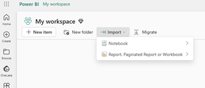
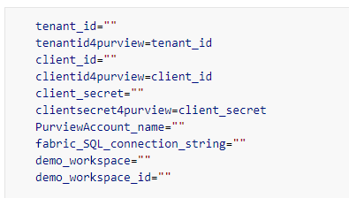
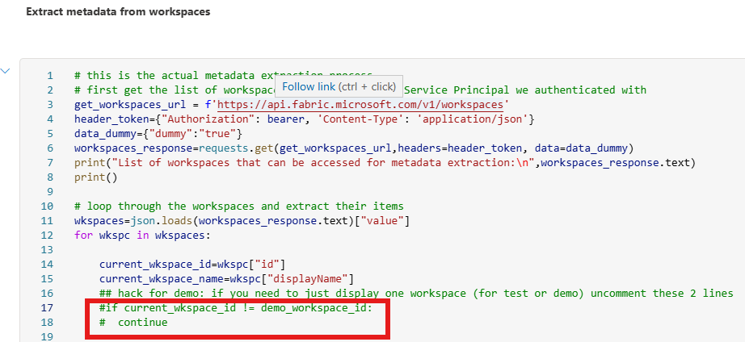
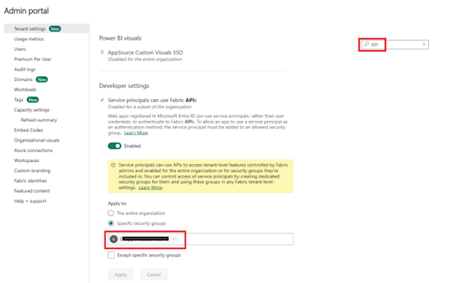
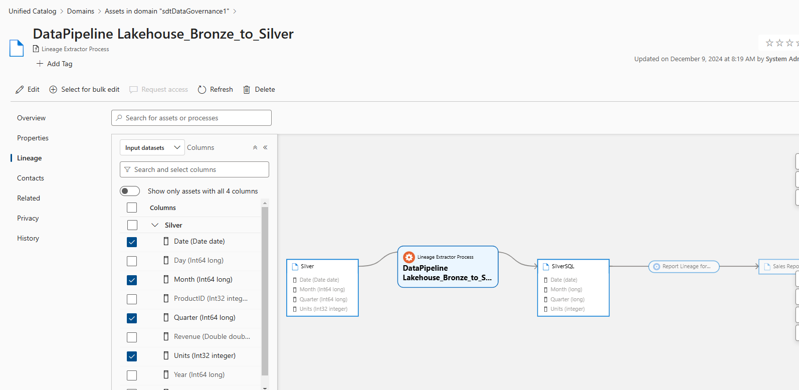
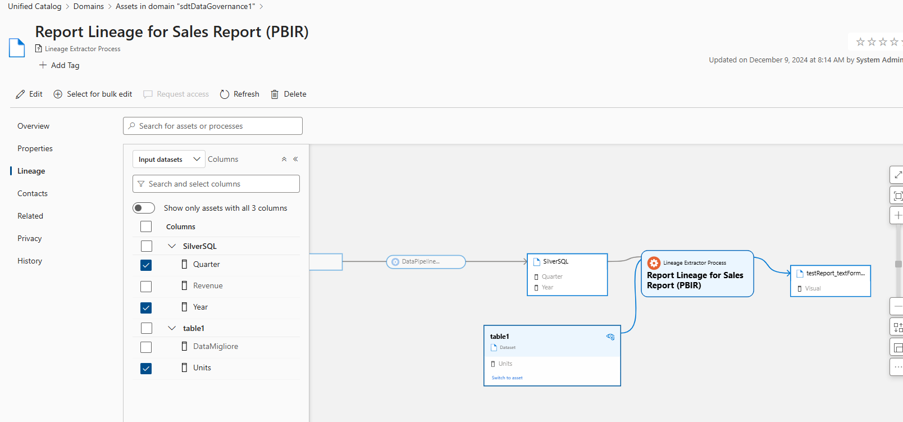

# Automatic Column-level Lineage Extraction from MS Fabric

 

This is an initial code implementation for automatic metadata and column-level lineage extraction from MS Fabric.

The notebook code provided in this  repo extracts from MS Fabric:
- Metadata of Lakehouses and Warehouses, as well as their Tables and Table Columns
- Attributes of PowerBI reports (saved in the new PBIP/PBIR format) with their source Lakehouse and Warehouse tables 
- Column mappings from Copy Activities in Fabric Data Factory pipelines. 

The code then uploads all metadata, which have been extracted, to MS Purview Data Governance and creates a graphical column-level lineage graph. You can find some example screeshots of the resulting lineage graph in the section [Some output examples](#some-output-examples) below. 

Extraction is obtained automatically using API calls, python libraries and SQL queries. The process does not require human intervention, apart from quick configuration of the code (namely the SVC Principal auth details, see Prerequisites below).

The column-level lineage information is also extracted and stored in the form of DataFrames, thus allowing easy reuse, for example for regulatory purposes (legal reporting on data analysis) and impact analysis (i.e. to answer the question "what business data is impacted if I change one step of the data transformation process?").

 

In more detail, the provided notebook code accomplishes the following four tasks in sequence:

1. it sets up authentication and data structures in memory (initially empty dataframes) to store results

2. it explores all workspaces accessible by the provided Fabric user/Service Principal, and it extracts:

    - Tables with their columns (this uses a SQL query, therefore it can be performed also from a SQL client application external to Fabric)

    - Reports with their source tables (using Semantic Labs lib, therefore this can only be performed within Fabric, unless you leverage the low-level APIs which are used by SemanticLink labs)

    - Details of Copy pipelines with their column-level mappings (the source json is extracted via Semantic Labs lib)

3. it eventually uploads all metadata into MS Purview Data Governance, and creates lineage links with column mappings for the discovered artifacts above

4. it provides some examples of use of Semantic Link Lab, Scanner APIs, etc. to illustrate ways for extracting Fabric metadata, also regarding reports with external data sources such as Azure Databricks

 

# Quickstart: How to run the code

Download the notebook in the [Fabric-notebook folder](./Fabric-notebook) to a PC or VM, then import it into an MS Fabric workspace.

If you already have Service Principal(s) created for MS Fabric and MS Purview,, and you already enabled API access in the Fabric Admin Portal, then you just need to fill their IDs and secrets in the first cell of the notebook code. Check the section [Prerequisites and Fabric configuration in more detail](#prerequisites-and-fabric-configuration-in-more-detail) below to make sure the Fabric/PowerBI Admin portal settings are ok.

Configure the second cell of the notebook with the following values (you can refer to the Prerequisites section for further details):

- **tenant_id** enter here the tenant_id of the Azure Tenant where Fabric is deployed

- **tenantid4purview** enter here the tenant_id of the Azure Tenant where MS Purview DataGovernance is deployed (it can be the same as the Fabric tenant, as in the screenshot above, or a different one, in any case provide a value for this parameter )

- **client_id** the Service Principal id that you want to use to extract metadata from Fabric

- **clientid4purview** the Service Principal that you want to use to upload metadata int MS Purview DG (it can be the same Service Principal as the Fabric one, as in the screenshot above, or a different one, in any case provide a value for this parameter )

- **client_secret** the secret for the Service Principal that you want to use to extract metadata from Fabric. Use this field only for test/evaluation of this source code, NEVER embed secrets in code for production.

- **clientsecret4purview** the secret for the Service Principal that you want to use to upload metadata and lineage into Purview DataGovernance. Use this field only for test/evaluation of this source code, NEVER embed secrets in code for production. (it can be the same Service Principal as the Fabric one, as in the screenshot above, or a different one, in any case provide a value for this parameter )

- **PurviewAccount_name** insert here the name (not the ID) of the MS Purview Data Governance account
fabric_SQL_connection_string get the value to be inserted here by clicking on the “ellipsis” (three dots icon) then “Copy SQL connection string” of either a Warehouse or the SQL analytics endpoint of a Lakehouse in the workspace that you want to extract metadata from.

- **optional: demo_workspace** fill the name of a test workspace here if you want to first try the notebook code on only one specific workspace (you might need to uncomment a couple of lines of code in the cell extracting the metadata)

- **optional: demo_workspace_id** the id of the demo_workspace where you want to give a first try of the code. Only this workspace will be explored for metadata extraction.

 

Run the cells in the notebook one at a time to understand the way they work: the code is provided as a guideline and an example to create your own complex extraction mechanisms.

e.g. the SQL queries used to extract table and column metadata can be run from an external client (ODBC or JDBC)

  

**IMPORTANT NOTE:** to extract table and column metadata for data sources of PowerBI reports, the reports must be saved/imported into Fabric using the new PBIP/PBIR format, which can be enabled in PowerBI Desktop as [explained here](https://learn.microsoft.com/en-us/power-bi/developer/embedded/projects-enhanced-report-format)

 

# Prerequisites and Fabric configuration in more detail

Here follows a more complete description of the configuration steps, for the general case:

1. Create an Azure Service Principal in MS Entra ID (i.e register a single tenant Enterprise Application) following instructions in [this Quickstart](https://learn.microsoft.com/en-us/entra/identity-platform/quickstart-register-app). You do not need to add a redirect URI, but you need to [add a Client Secret](https://learn.microsoft.com/en-us/entra/identity-platform/how-to-add-credentials?tabs=client-secret#add-a-credential-to-your-application). Take note of the Tenant ID, the Service Principal Client ID and the Client Secret. Of course, you can reuse a Service Principal you already have. The source code provided allows you to use two different Service Principals, one for extracting metadata and lineage from Fabric, and a second one for uploading them into Purview. Using two Service principals may come useful when MS Purview and MS Fabric are in different EntraID Tenants.

    **IMPORTANT NOTE:** it is NOT advisable to embed the Client Secret within source code. The source code in this repository uses such a practice for simplicity and test/development purposes, but it is strongly recommended to store the Client Secret in an Azure Key Vault for production, or use more sophisticated practices for keeping it safely.

2. Add the Service principal you created as a member to an MS Entra ID Security Group  as described [here.](https://learn.microsoft.com/en-us/entra/fundamentals/how-to-manage-groups#create-a-basic-group-and-add-members)

3. Configure the Service Principal(s) or the Security Group you created:

    - As a Contributor or Admin user for the Fabric workspaces for which you want to extract metadata and lineage

    - As at least a Data Source Admin within the MS Purview collections where you want to upload the metadata and lineage. Of course you can add it at the Root Domain level.

4. Configure the EntraID Security Group you created as a specific “enabled” Security Group in the  following settings of the PowerBI/Fabric Admin Portal (search for “API” in the top-right search textbox to easily find all the relevant settings):
	
    

    - in  “Service principals can use Fabric APIs” within “Developer Settings” (see screenshots)
    
    - in "Service principals can access read-only admin APIs" and "Enhance admin APIs responses with detailed metadata" within “Admin API settings”

 

# Some output examples

The first screenshot shows an example of the resulting column-level lineage display of Copy DataPipelines

 

The second screenshot shows column-level lineage display of Fabric/PowerBI reports in PBIR format.

 

# Credits
 
Version 1:

The Table and Colums metadata are extracted via SQL queries whose source can be found in the MS documentation [here](https://learn.microsoft.com/en-us/sql/relational-databases/system-catalog-views/querying-the-sql-server-system-catalog-faq?view=fabric#_FAQ31)
- Report sources metadata and pipeline json structures are extracted using the Semantic Link Labs library by Michael Kovalsky et al. [https://github.com/microsoft/semantic-link-labs](https://github.com/microsoft/semantic-link-labs)
- Upload to MS Purview is performed using examples of Pyapacheatlas by Will Johnson et al. [https://github.com/wjohnson/pyapacheatlas](https://github.com/wjohnson/pyapacheatlas)
