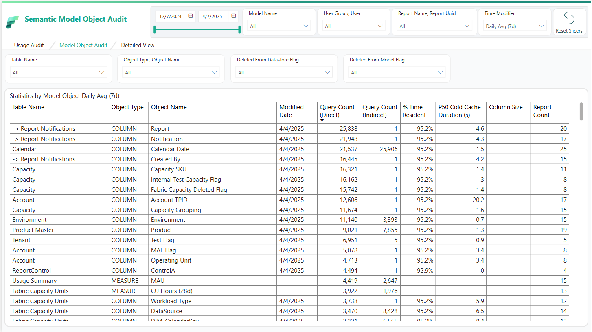

# Fabric Semantic Model Audit

## Overview

This tool is designed to provide a comprehensive audit of your Fabric semantic models. 

The tool consists of three main components:

1. **The Notebook:**  
   - Captures model metadata, query logs, dependencies, unused columns, cold cache performance, and resident statistics.
   - Generates star schema tables (DIM_ModelObject, DIM_Model, DIM_Report, DIM_User, FACT_ModelObjectQueryCount, FACT_ModelLogs, FACT_ModelObjectStatistics) stored in a lakehouse or warehouse.
   - Includes robust error handling, scheduling, and clean-up functions to support continuous monitoring.

1. **The Power BI Template (PBIT File):**  
   - Creates an interactive report from the star schema tables generated by the notebook.
   - Allows you to explore model performance, usage trends, and metadata changes through intuitive visuals.
   - Provides a ready-to-use template that you can customize further in Power BI Desktop.

1. **The PowerPoint File:**  
   - Contains the background images and design elements used in the Power BI template.

## Requirements

1. **Workspace Monitoring:**  
   - Ensure that Workspace Monitoring is enabled in your Fabric environment.  
   - Refer to [this blog post](https://blog.fabric.microsoft.com/blog/announcing-public-preview-of-workspace-monitoring) for setup guidance.

1. **Scheduled Execution:**  
   - Schedule the notebook to run several times a day (e.g., six times) for detailed historical tracking.
   - Update run parameters (model names, workspaces, logging settings) at the top of the notebook.

1. **Lakehouse Attachment:**  
   - Attach the appropriate Lakehouse in Fabric to store logs and historical data in Delta tables.

## Key Features

1. **Model Object & Metadata Capture:**  
   - Retrieves and standardizes the latest columns and measures using Semantic Link and Semantic Link Labs.
   - Captures dependencies among model objects to get a comprehensive view of object usage.

1. **Query Log Collection:**  
   - Captures both summary query counts and detailed DAX query logs.

1. **Unused Column Identification:**  
   - Compares lakehouse/warehouse and model metadata to identify unused columns in your model's source lakehouse/warehouse.
   - Removing unused columns will result in greater data compression and performance.

1. **Cold Cache & Resident Statistics:**  
   - Deploys a cloned model to measure cold cache performance.
   - Records detailed resident statistics (e.g., memory load, sizes) for each column.

1. **Star Schema Generation:**  
   - Produces a set of star schema tables, making it easy to integrate with reporting tools.

1. **Integrated Reporting Assets:**  
   - **Power BI Template (PBIT):** Quickly generate an interactive report from the captured data.
   - **PowerPoint File:** Provides background images and design elements used in the report.

## Why Use This Tool?

- **Comprehensive Auditing:**  
  Automates the collection of historical metadata, query logs, and performance data for your Fabric semantic models.

- **Actionable Insights:**  
  Identify obsolete columns, understand query performance trends, and monitor usage patterns to optimize your models.

- **Quickstart Reporting:**  
  The provided PBIT file allows you to quickly start to analyze model's audit data logs.

- **Scalability and Flexibility:**  
  The tool is designed to support multiple models and run at scheduled intervals, making it suitable for continuous monitoring in large-scale environments.

## Getting Started

1. Download the notebook from GitHub and upload to a Fabric workspace.

1. Attach a Lakehouse that will be used to save the logs.

1. Update the list of models you want to audit.

1. Configure the rest of the settings in the config cell. There are a lot of options, so read carefully. 🙂

1. Run the notebook and collect the logs. Under the collect_model_statistics() cell, you can track along with the testing if you want to understand what is happening.

1. After the first run has finished, download the PBIT file and connect to your lakehouse.

## Troubleshooting & Tips

- **Workspace Monitoring Setup:**  
  Verify that your Fabric environment is properly configured if you experience issues with monitoring data.

- **Capacity Considerations:**  
  Cold cache performance testing requires cloning and refreshing models. This feature is only recommended for Direct Lake or Import models. Ensure these operations do not impact production workloads.

- **Parameter Adjustments:**  
  Customize parameters like `max_workers` and date range checking based on your model size and available resources.

- **Run History Cleanup:**  
  Use the built-in functions to clean up incomplete runs or force-delete historical tables if necessary, but exercise caution as this will remove past data.