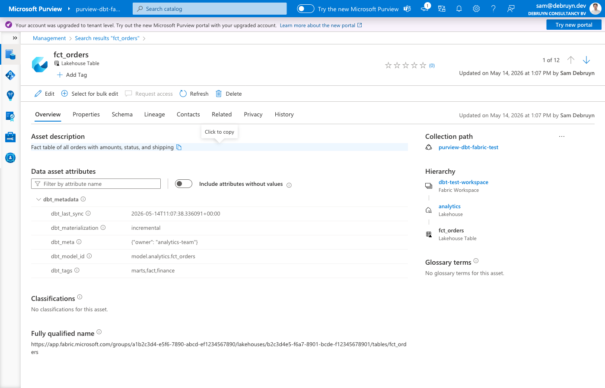
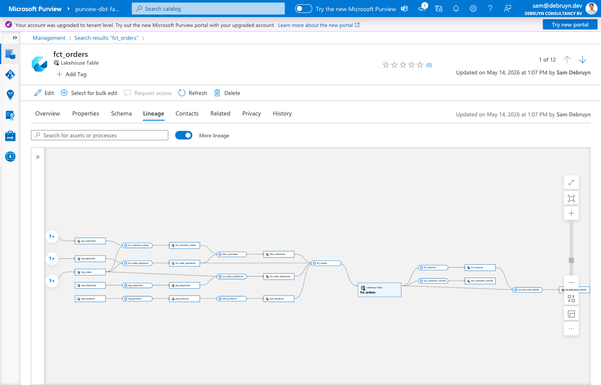

# Microsoft Purview integration

This adapter can sync dbt metadata to [Microsoft Purview Data Catalog](https://learn.microsoft.com/en-us/purview/), enriching your Fabric tables with descriptions, business metadata, and lineage from your dbt project.

## Why this integration

Microsoft Purview has a [built-in integration with Microsoft Fabric](https://learn.microsoft.com/en-us/fabric/governance/microsoft-purview-fabric) that scans your Fabric workspace and discovers items like Warehouses, Lakehouses, Notebooks, and Pipelines. However, this built-in scanner has significant limitations when it comes to the metadata that dbt users care about:

| Capability | Built-in Purview scanner | dbt Purview sync |
|---|---|---|
| **Table discovery** | Lakehouse tables only (preview). Data Warehouse tables are [not scanned as sub-items](https://learn.microsoft.com/en-us/purview/data-map-lineage-fabric). | Searches for existing entities first, creates them if missing. Works without live view or scanning. |
| **Column discovery** | Not populated for either Lakehouse or Data Warehouse tables. | Creates column entities for all physical columns (discovered from the database catalog), with data types and descriptions from dbt YAML where available. |
| **Table descriptions** | Not populated. Must be [manually entered](https://learn.microsoft.com/en-us/purview/data-gov-classic-metadata-curation) in the Purview portal per table. | Automatically pushed from dbt model YAML files after every run. |
| **Column descriptions** | Not populated. Must be manually entered per column. | Automatically pushed from dbt column YAML files after every run. |
| **Table-level lineage** | Not supported. The scanner only captures [item-level lineage](https://learn.microsoft.com/en-us/purview/data-map-lineage-fabric) (e.g., Lakehouse → Notebook → Lakehouse), not which specific table was derived from which other tables. | Full table-level lineage graph based on dbt's `ref()` and `source()` dependencies. |
| **Business metadata** | Not populated. No built-in mechanism to attach tags, test results, or custom metadata to table entities. | Automatically creates a `dbt_metadata` business metadata type with model ID, tags, materialization, test names, test results, custom meta, and sync timestamp. |
| **Automation** | Runs on a scan schedule configured in Purview. | Runs automatically after every `dbt run` via `on-run-end` hook, or on-demand via `dbt run-operation`. |

In short: the built-in Purview integration discovers _what exists_ in Fabric at the item level (Warehouses, Lakehouses). This dbt integration goes deeper: it registers individual tables and columns, adds _what each table means_ (descriptions), shows _how tables relate to each other_ (lineage), and documents _what guarantees are in place_ (tests, tags, metadata).

**No Purview scanning or live view configuration is required** — the adapter creates all necessary entities directly via the Purview Data Map API. This means you can skip configuring Fabric scans in Purview entirely, which saves [scan capacity costs](https://learn.microsoft.com/en-us/purview/concept-elastic-data-map) and removes the delay between table changes and catalog updates. If you do already have scans configured, the sync works alongside them — existing entities are enriched, not duplicated.



## How it works

The sync uses a "search first, create if missing" approach for all entity types. If a Purview entity already exists (from [live view](https://learn.microsoft.com/en-us/purview/data-gov-live-view) or a [scan](https://learn.microsoft.com/en-us/purview/register-scan-fabric-tenant)), the sync enriches it. If no entity exists, the sync creates it via the Purview Data Map API. This means users don't need to configure live view or run scans for the sync to work.

**Lakehouse tables** — the sync searches for existing `fabric_lakehouse_table` entities and creates them if missing. Column entities (`fabric_lakehouse_table_column`) are created for all physical columns discovered from the database catalog.

**Data Warehouse tables** — the sync creates the full entity hierarchy: `fabric_warehouse` → `fabric_warehouse_schema` → `fabric_warehouse_table` → `fabric_warehouse_table_column`. Custom Purview types are registered automatically (see [Custom Purview types](#custom-purview-types)). If a `fabric_warehouse` entity already exists from live view, the sync reuses it.

For both adapter types, the sync then:

1. **Pushes descriptions and business metadata** from dbt model and column YAML to the entities — model descriptions, column descriptions, tags, materialization type, test results, and custom meta are all synced in a single bulk update
2. **Creates column entities** for all physical columns (from database catalog), with data types and descriptions from dbt YAML where available
3. **Creates lineage** between tables using dbt's `ref()` and `source()` dependency graph

The sync writes to `userDescription` (not `description`), so it never overwrites metadata set by Purview scanners.

## Configuration

Add the `purview_endpoint` to your target in `profiles.yml`:

```yaml
my_project:
  target: dev
  outputs:
    dev:
      type: fabric  # or fabricspark
      # ... existing configuration ...
      purview_endpoint: "https://your-account.purview.azure.com"
```

You can find the endpoint URL in the Azure portal under your Purview account's Properties page (labeled "Atlas endpoint") or in the Purview governance portal settings.

!!! tip "Alias"
    You can also use `purview` as an alias for `purview_endpoint`.

### Authentication

The Purview integration reuses the same authentication method configured for your Fabric connection. No additional authentication setup is needed. The identity must have **Data Curator** and **Data Reader** roles in the Purview account's root collection.

All [authentication methods](authentication.md) supported by the adapter work with Purview.

## Usage

### Automatic sync after every run

Add the macro to your `dbt_project.yml` as an `on-run-end` hook:

```yaml
on-run-end:
  - "{{ purview_sync() }}"
```

This syncs metadata for all models that were part of the run.

### Manual sync

Run the sync manually as a dbt operation:

```shell
dbt run-operation purview_sync
```

This syncs metadata for all models in the project, regardless of whether they were recently run.

### Options

The `purview_sync` macro accepts these parameters:

| Parameter | Default | Description |
|---|---|---|
| `sync_descriptions` | `true` | Push model and column descriptions to Purview |
| `sync_lineage` | `true` | Create lineage relationships in Purview |
| `sync_metadata` | `true` | Push business metadata (tags, tests, materialization) |

Example with options:

```yaml
# Only sync descriptions, skip lineage and metadata
on-run-end:
  - "{{ purview_sync(sync_lineage=false, sync_metadata=false) }}"
```

Or via the CLI:

```shell
dbt run-operation purview_sync --args '{sync_lineage: false}'
```

## Controlling which models are synced

The sync respects dbt's [`persist_docs`](https://docs.getdbt.com/reference/resource-configs/persist_docs) configuration. Models where `persist_docs` is explicitly disabled are skipped entirely — no descriptions, no business metadata, and no lineage are pushed to Purview for those models.

| `persist_docs` setting | Purview behavior |
|---|---|
| Not configured (default) | Full sync: descriptions, metadata, and lineage |
| `relation: true` | Full sync |
| `relation: true, columns: true` | Full sync including column descriptions |
| `relation: true, columns: false` | Model description, metadata, and lineage — column descriptions skipped |
| `relation: false, columns: false` | **Skipped entirely** — nothing is synced to Purview |

Example — sync all models except a staging layer:

```yaml
# dbt_project.yml
models:
  my_project:
    staging:
      +persist_docs:
        relation: false
        columns: false
    marts:
      +persist_docs:
        relation: true
        columns: true
```

## What gets synced

### Descriptions

| Source | Target |
|---|---|
| Model `description` | `userDescription` on the table/view entity |
| Column `description` | `userDescription` on the column entity |

### Business metadata

A custom business metadata type called `dbt_metadata` is automatically created in Purview. It contains:

| Attribute | Source | Example |
|---|---|---|
| `dbt_model_id` | Model unique ID | `model.my_project.orders` |
| `dbt_tags` | Model tags | `finance,daily` |
| `dbt_materialization` | Materialization type | `incremental` |
| `dbt_meta` | Custom meta (JSON) | `{"owner": "data-team"}` |
| `dbt_tests` | Test names on model | `not_null_id,unique_id` |
| `dbt_test_status` | Test results from last run | `all_passed` or `2/3 passed` |
| `dbt_last_sync` | Sync timestamp | `2026-01-15T10:30:00+00:00` |

### Lineage

For each dbt model with upstream dependencies, the sync creates:

- A `dbt_transformation` entity representing the dbt transformation
- `dataset_process_inputs` relationships from upstream tables to the process
- `process_dataset_outputs` relationships from the process to the output table

This shows up in Purview's lineage view as a graph of how data flows through your dbt models.



## Entity matching

How dbt models are matched to Purview entities depends on the adapter type:

- **FabricSpark** (Lakehouse) — the sync searches for existing `fabric_lakehouse_table` entities by name and filters by the Fabric item GUID. If an existing entity is found (from a [scan](https://learn.microsoft.com/en-us/purview/register-scan-fabric-tenant) or live view), the sync enriches it. If no entity is found, the sync creates one via the Purview API.
- **Fabric** (Data Warehouse) — the sync creates `fabric_warehouse_table` entities via the Purview API, along with parent `fabric_warehouse` and `fabric_warehouse_schema` entities. If a `fabric_warehouse` entity already exists from [live view](https://learn.microsoft.com/en-us/purview/data-gov-live-view), the sync reuses it rather than creating a duplicate.

Ephemeral models are skipped in both cases since they don't produce physical tables.

!!! warning "Unique item names within a workspace"
    Lakehouses and Warehouses in the same workspace must have distinct display names. The sync resolves database names to Fabric items via the [Fabric REST API](https://learn.microsoft.com/en-us/rest/api/fabric/core/items/list-items) and checks Lakehouses first. If a Lakehouse and a Warehouse share the same name, the sync always matches the Lakehouse, which causes wrong entity types in Purview.

## Column entities

Neither Purview's live view nor its scanner creates column entities for Fabric items. The dbt sync creates column entities for **all physical columns** by querying the database catalog at sync time. This means every column in the table gets a Purview entity — not just columns documented in dbt YAML files.

Column data types come from the database catalog (the actual SQL types), and column descriptions from dbt YAML are overlaid where available. Columns without a dbt description still get a Purview entity with their data type.

- **Lakehouse** — creates `fabric_lakehouse_table_column` entities (Purview's native type) linked to `fabric_lakehouse_table` entities. Attributes: `dataType`.
- **Data Warehouse** — creates `fabric_warehouse_table_column` entities (custom type, see below) linked to `fabric_warehouse_table` entities. Attributes: `data_type`, `length`, `precision`, `scale`, `isNullable`.

## Custom Purview types

The adapter registers custom type definitions in Purview. These types are created automatically the first time the sync runs.

### dbt types

| Type | Kind | Supertypes | Purpose |
|---|---|---|---|
| `dbt_metadata` | Business metadata | — | Attaches dbt model metadata (tags, materialization, tests, meta, sync timestamp) to table entities |
| `dbt_transformation` | Entity | `Process` | Represents a dbt transformation in the lineage graph, linking upstream tables to the output table |

### Data Warehouse types

| Type | Kind | Supertypes | Relationship to parent |
|---|---|---|---|
| `fabric_warehouse_schema` | Entity | `Asset` | `warehouse` → `fabric_warehouse` |
| `fabric_warehouse_table` | Entity | `DataSet`, `Purview_Table` | `dbSchema` → `fabric_warehouse_schema` |
| `fabric_warehouse_table_column` | Entity | `DataSet` | `table` → `fabric_warehouse_table` |

The Data Warehouse hierarchy mirrors the native `azure_sql_dw` types (warehouse → schema → table → column) but uses Fabric-specific naming so the entities appear correctly in the Purview catalog alongside other Fabric items.

For Lakehouse tables, no custom types are needed — the adapter uses the native `fabric_lakehouse_table_column` type that Purview already defines.

## Supported adapters

The Purview integration works with both adapter types:

- **FabricSpark** (Lakehouse) — enriches `fabric_lakehouse_table` entities discovered by Purview's Fabric workspace scan, and creates column entities.
- **Fabric** (Data Warehouse) — creates the full entity hierarchy (schema, table, columns) via the Purview API, linked to the `fabric_warehouse` entity that the Fabric scanner creates.
