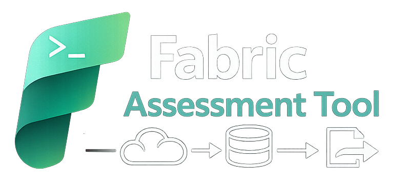

<p align="center">
	<h1 align="center">
		
	</h1>
	<p align="center">Migration Assessment Tool for Fabric DE/DW<br>Fabric Assessment Tool is a command-line tool for connecting, extracting, and exporting data from various cloud data platforms to help with migration planning and assessment</p>
</p>

<p align="center">
  <br>
  
  <br>
</p>

## Why?

In order to estimate how migrating your assets in Microsoft Fabric would look like, it is crucial to have a complete inventory of data assets and artifacts.
Even if you do not currently know the answers of all the questions, you should be able to go back and reuse previously gather information to answer your questions.

This tool allows to scan one or multiple workspaces in order to get all the information contained in them into a single well structured folder hierarchy, so you can leverage analytics tools to gather the insights you need.

## Requirements

- **Python** 3.10, 3.11, or 3.12
- **pip** (Python package installer)
- **Azure CLI** ([installation guide](https://learn.microsoft.com/en-us/cli/azure/install-azure-cli))

## Installation

You can use the [prebuilt wheel file](./resources/fabric_assessment_tool-0.0.1-py3-none-any.whl) in the resources folder.

```bash
pip install resources/fabric_assessment_tool-0.0.1-py3-none-any.whl
```

## Authentication

This cli tool leverages the use of Azure Command-Line Inteface (CLI) for authentication.

Before running this tool, just log in using:

```
az login
```

You can check [how to install](https://learn.microsoft.com/en-us/cli/azure/install-azure-cli?view=azure-cli-latest) and [authentication details](https://learn.microsoft.com/en-us/cli/azure/authenticate-azure-cli?view=azure-cli-latest) in the official documentation.


## CLI Commands

Fabric Assessment Tool provides a single main command for the moment:

### `fat assess` - Assess data sources for migration readiness

```bash
fat assess --source <synapse|databricks> \
          --mode <full> \
          --ws <workspace1_name,workspace2_name> \
          -o/--output <output_path>
```

**Required Parameters:**
- `--source`: Source platform (synapse, databricks, or others in the future)
- `-o/--output`: Output path for assessment results

**Optional Parameters:**
- `--mode`: Assessment mode (currently supports: full)
- `--ws`: Comma-separated list of workspace names to assess 
  - *For Databricks, use the **workspace name** (not the workspace ID)*
  - *If not provided, it will prompt the list of reachable workspaces to select*
- `--subscription-id`: Azure subscription ID (if not provided, will use default credentials)

**Examples:**
```bash
# Assess Synapse workspaces (interactive selection)
fat assess --source synapse -o ./results_folder

# Assess targeted Synapse workspaces 
fat assess --source synapse --mode full --ws workspace1,workspace2 -o /path/to/results_folder

# Assess Databricks workspace
fat assess --source databricks --ws my-workspace --output results_folder
```


## Sample Output

Assessment results are saved in JSON format with the following structure:

```json
{
  "metadata": {
    "source": "synapse",
    "mode": "full",
    "workspaces": ["workspace1", "workspace2"],
    "timestamp": "2025-10-03T14:15:07.047659",
    "version": "0.0.1"
  },
  "results": [
    {
      "workspace": "workspace1",
      "status": "success",
      "summary": {
        "workspace_info": {...},
        "counts": {
          "dedicated_sql_pools": 1,
          "serverless_sql_pools": 1,
          "spark_pools": 1,
          ...
        },
        "assessment_status": {
          "status": "completed|incompleted|failed",
          "description": ...
        }
      }
    }
  ],
  "summary": {
    "total_workspaces": 2,
    "assessed_workspaces": 2,
    "incomplete_workspaces": 0,
    "failed_workspaces": 0
  }
}
```

The details of each extracted resource is stored in a specific file, the list of all generated files can be found in the export summary:

```json
{
  "results": [
    {
      "format": "json",
      "workspace_directory": "/tmp/assessment/workspace1",
      "files_created": [
        "/tmp/assessment/workspace1/summary.json",
        "/tmp/assessment/workspace1/workspace.json",
        "/tmp/assessment/workspace1/resources/sql_pools/dedicated_pool_dw100c.json",
        "/tmp/assessment/workspace1/resources/sql_pools/serverless_pool_Built-in.json",
        "/tmp/assessment/workspace1/resources/spark_pools/smallpool.json",
        "/tmp/assessment/workspace1/resources/pipelines/L0_IndividualCustomer.json",
        ...
        "/tmp/assessment/workspace1/admin/integration_runtimes/AutoResolveIntegrationRuntime.json",
        "/tmp/assessment/workspace1/admin/integration_runtimes/SHIR-example.json",
        "/tmp/assessment/workspace1/admin/linked_services/workspace1-WorkspaceDefaultSqlServer.json",
        "/tmp/assessment/workspace1/admin/linked_services/workspace1-WorkspaceDefaultStorage.json",
        "/tmp/assessment/workspace1/admin/linked_services/us-employment-hours-earnings-state.json",
        "/tmp/assessment/workspace1/admin/libraries/my_library-0.1.10-py3-none-any.whl.json",
        ...
        "/tmp/assessment/workspace1/data/serverless_databases/example.json",
        "/tmp/assessment/workspace1/data/serverless_databases/LakeDatabase.json",
        "/tmp/assessment/workspace1/data/dedicated_databases/dw100c.json"
      ],
      "total_files": 53,
      "workspace_name": "workspace1",
      "export_timestamp": "2025-12-11T08:54:25.825936",
      "export_format": "json"
    }
  ]
}

```

## Querying Assessment Results

The Fabric Assessment Tool exports data in a structured hierarchical format that can be easily queried using tools like DuckDB. For comprehensive examples of how to query the exported data, see the [Query Results Guide](docs/query_results.md).


## Next Steps

* Include Synapse to Fabric Migration Spark scripts to be a single shop for your Synapse Spark Migrations.
* Enrich Synapse artifacts, adding helpful items like Spark Configrations from the API responses.
* Enhance documentation and resources with more ways to query data and add more meaningful examples.


## Development and Contributing

This repository contains a devcontainer file that will setup the environment ready for development and testing.

In order to install Fabric Assessment Tool in development mode:

```bash
pip install -e .
```

### Package generation

To generate the package files:

```bash
poetry build
```

After that sdist and wheel packages will be available in the ```dist``` folder. 
