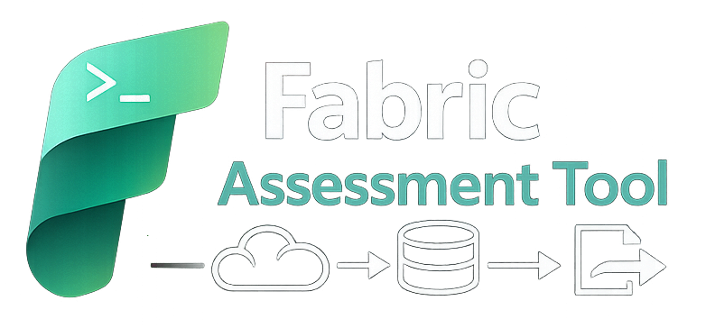
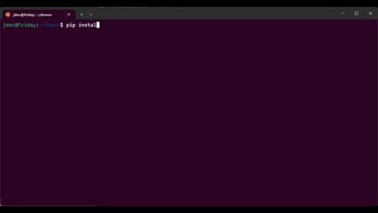
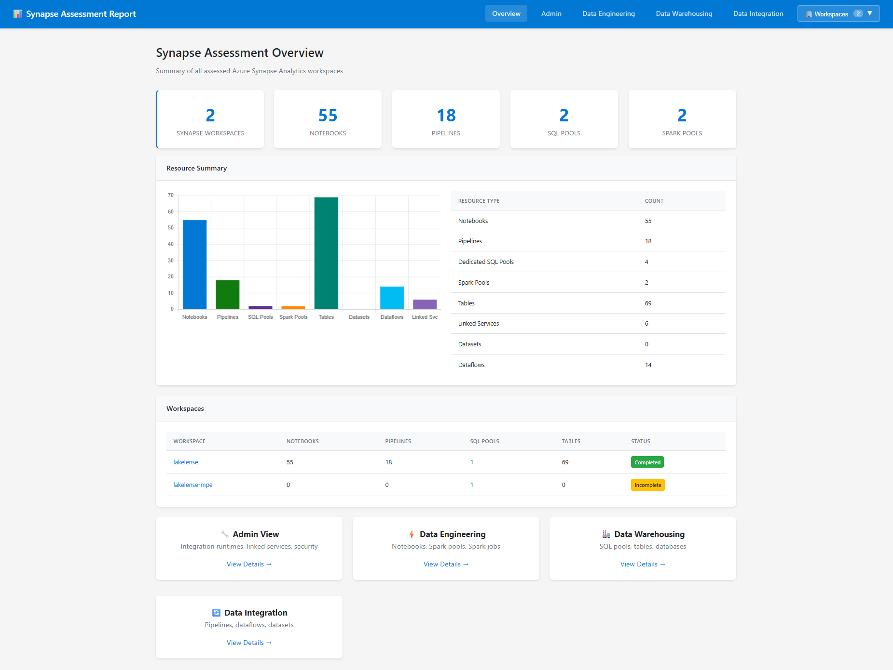
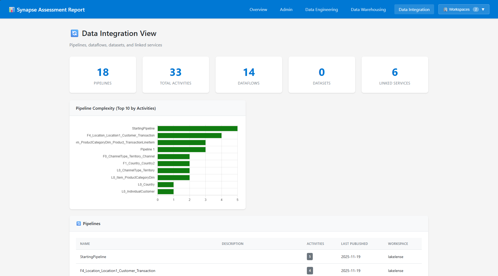

<p align="center">
	<h1 align="center">
		
	</h1>
	<p align="center">Migration Assessment Tool for Fabric DE/DW<br>Fabric Assessment Tool is a command-line tool for connecting, extracting, and exporting data from various cloud data platforms to help with migration planning and assessment</p>
</p>

<p align="center">
  <br>
  
  <br>
</p>

## Why?

In order to estimate how migrating your assets in Microsoft Fabric would look like, it is crucial to have a complete inventory of data assets and artifacts.
Even if you do not currently know the answers of all the questions, you should be able to go back and reuse previously gather information to answer your questions.

This tool allows to scan one or multiple workspaces in order to get all the information contained in them into a single well structured folder hierarchy, so you can leverage analytics tools to gather the insights you need.

## Requirements

- **Python** 3.10, 3.11, or 3.12
- **pip** (Python package installer)
- **Azure CLI** ([installation guide](https://learn.microsoft.com/en-us/cli/azure/install-azure-cli)) — *or* a **Microsoft Fabric Notebook** environment

## Installation

You can use the [prebuilt wheel file](./resources/fabric_assessment_tool-0.2.1-py3-none-any.whl) in the resources folder.

```bash
pip install resources/fabric_assessment_tool-0.2.1-py3-none-any.whl
```

## Authentication

This tool supports two authentication methods:

### Azure CLI (default)

This is the default method when running on a local machine or VM.

Before running this tool, log in using:

```
az login
```

You can check [how to install](https://learn.microsoft.com/en-us/cli/azure/install-azure-cli?view=azure-cli-latest) and [authentication details](https://learn.microsoft.com/en-us/cli/azure/authenticate-azure-cli?view=azure-cli-latest) in the official documentation.

### Fabric Notebook

When running inside a Microsoft Fabric Notebook, the tool can authenticate using `notebookutils.credentials.getToken()`. This is auto-detected when `notebookutils` is available, or can be explicitly set with `--auth-method fabric`.

> **Note:** When using Fabric authentication, `--subscription-id` is required since there is no equivalent to `az account show` in the Fabric Notebook environment.

#### CLI usage from a notebook cell

```bash
!fat assess --source synapse --auth-method fabric \
    --subscription-id <your-subscription-id> \
    --ws workspace1 \
    -o /lakehouse/default/Files/assessment \
    --sql-admin-password "your_password" \
    --create-dmv
```

#### Python API usage from a notebook cell

```python
from fabric_assessment_tool.services.assessment_service import AssessmentService

sql_admin_password = notebookutils.credentials.getSecret("akvName", "secret")

service = AssessmentService()
results = service.assess(
    source="synapse",
    mode="full",
    workspaces=["my-synapse-workspace"],
    output_path="/lakehouse/default/Files/assessment",
    subscription_id="<your-subscription-id>",
    auth_method="fabric",
    sql_admin_password=sql_admin_password,   # optional: bypasses password prompt
    create_dmv=True,                         # optional: auto-creates DMV without prompt
)
```

> **Tip:** The `--sql-admin-password` and `--create-dmv` parameters are optional. If you don't need dedicated SQL pool table statistics, you can omit them entirely.

### Dedicated SQL Pool Authentication

The tool supports multiple authentication methods for connecting to Synapse dedicated SQL pools to collect table statistics and metadata:

| Authentication Mode | CLI Option | Description |
|---------------------|------------|-------------|
| SQL Authentication | `--sql-auth-mode sql` | Traditional SQL Server authentication using username/password. This is the default. |
| Entra ID Interactive | `--sql-auth-mode entra-interactive` | Browser-based login with MFA support. Opens a browser popup for authentication. |
| Entra ID Service Principal | `--sql-auth-mode entra-spn` | Non-interactive authentication using a service principal (client ID + secret). |
| Entra ID Default | `--sql-auth-mode entra-default` | Uses Azure CLI credentials, managed identity, or environment variables. |

#### Required Database Permissions for Entra ID Authentication

When using Entra ID authentication modes (`entra-interactive`, `entra-spn`, or `entra-default`), the authenticated identity (user or service principal) must have the following permissions on each dedicated SQL pool database:

1. **Database User**: The identity must be added as a contained database user:
   ```sql
   -- For Entra ID user
   CREATE USER [user@yourdomain.com] FROM EXTERNAL PROVIDER;
   
   -- For Service Principal (use the app name or app ID)
   CREATE USER [your-app-name] FROM EXTERNAL PROVIDER;
   ```

2. **Read Permissions**: Grant access to read system views and table metadata:
   ```sql
   -- Option 1: Add to db_datareader role (recommended for read-only access)
   ALTER ROLE db_datareader ADD MEMBER [user@yourdomain.com];
   
   -- Option 2: Grant specific SELECT permissions on system DMVs
   GRANT SELECT ON sys.dm_pdw_nodes TO [user@yourdomain.com];
   GRANT SELECT ON sys.dm_pdw_nodes_db_partition_stats TO [user@yourdomain.com];
   GRANT VIEW DATABASE STATE TO [user@yourdomain.com];
   ```

3. **View Creation Permission** (Optional): If you want the tool to create the `vTableSizes` view:
   ```sql
   -- Option 1: Add to db_ddladmin role
   ALTER ROLE db_ddladmin ADD MEMBER [user@yourdomain.com];
   
   -- Option 2: Grant specific CREATE VIEW permission
   GRANT CREATE VIEW TO [user@yourdomain.com];
   ```

> **Note:** Ensure that the Azure Synapse workspace has Entra ID authentication enabled with an Entra ID admin configured. See [Microsoft documentation](https://learn.microsoft.com/en-us/azure/synapse-analytics/sql/active-directory-authentication) for details.


## CLI Commands

Fabric Assessment Tool provides two main commands:

### `fat assess` - Assess data sources for migration readiness

```bash
fat assess --source <synapse|databricks> \
          --mode <full> \
          --ws <workspace1_name,workspace2_name> \
          -o/--output <output_path>
```

**Required Parameters:**
- `--source`: Source platform (synapse, databricks, or others in the future)
- `-o/--output`: Output path for assessment results

**Optional Parameters:**
- `--mode`: Assessment mode (currently supports: full)
- `--ws`: Comma-separated list of workspace names to assess 
  - *For Databricks, use the **workspace name** (not the workspace ID)*
  - *If not provided, it will prompt the list of reachable workspaces to select*
- `--subscription-id`: Azure subscription ID (if not provided, will use default credentials). **Required** when using `--auth-method fabric`
- `--auth-method`: Authentication method (`azure-cli` or `fabric`). Default: auto-detect based on environment
- `--sql-admin-password`: SQL admin password for dedicated SQL pools (bypasses interactive prompt)
- `--create-dmv`: Auto-create vTableSizes DMV without confirmation prompt (for non-interactive execution)
- `--sql-auth-mode`: SQL pool authentication mode for dedicated SQL pools:
  - `sql` (default): Traditional SQL authentication with username/password
  - `entra-interactive`: Entra ID interactive authentication (browser popup with MFA support)
  - `entra-spn`: Entra ID Service Principal authentication
  - `entra-default`: Entra ID default (uses Azure CLI credentials, managed identity, etc.)
- `--sql-client-id`: Service principal client ID (required with `--sql-auth-mode entra-spn`)
- `--sql-client-secret`: Service principal client secret (required with `--sql-auth-mode entra-spn`)
- `--sql-tenant-id`: Azure tenant ID (optional, defaults to 'common')

**Examples:**
```bash
# Assess Synapse workspaces (interactive selection)
fat assess --source synapse -o ./results_folder

# Assess targeted Synapse workspaces 
fat assess --source synapse --mode full --ws workspace1,workspace2 -o /path/to/results_folder

# Assess with Entra ID interactive authentication (browser login)
fat assess --source synapse --ws workspace1 -o ./results --sql-auth-mode entra-interactive

# Assess with Entra ID Service Principal authentication (non-interactive)
fat assess --source synapse --ws workspace1 -o ./results \
    --sql-auth-mode entra-spn \
    --sql-client-id "your-client-id" \
    --sql-client-secret "your-client-secret" \
    --sql-tenant-id "your-tenant-id" \
    --create-dmv

# Assess with Entra ID default (uses Azure CLI credentials)
fat assess --source synapse --ws workspace1 -o ./results --sql-auth-mode entra-default

# Assess Databricks workspace
fat assess --source databricks --ws my-workspace --output results_folder
```

### `fat visualize` - Generate interactive HTML reports

Generate standalone HTML reports with charts and tables to visualize assessment data. Reports work offline and can be viewed in any browser. The tool automatically detects whether the assessment is from Synapse or Databricks and generates platform-specific views.

```bash
fat visualize -i <assessment_output_dir> \
             [-o <report_dir>] \
             [--view <view_type>] \
             [--workspace <workspace_name>] \
             [--open]
```

**Required Parameters:**
- `-i/--input`: Path to assessment output directory (from `fat assess` command)

**Optional Parameters:**
- `-o/--output`: Output directory for HTML reports (default: `<input>/visualization`)
- `--view`: Type of visualization view to generate:
  - `overview` (default): Global summary across all workspaces
  - `admin`: Integration runtimes, linked services, private endpoints
  - `data-engineering`: Notebooks, Spark pools, jobs, clusters
  - `data-warehousing`: SQL pools, tables, databases, code objects
  - `data-integration`: Pipelines, dataflows, datasets
- `--workspace/-ws`: Generate report for a specific workspace only
- `--open`: Open the generated report in default browser

**Features:**
- **Workspace Filtering**: Interactive checkbox selector to filter results by one or multiple workspaces
- **Platform Detection**: Automatically detects Synapse vs Databricks and shows relevant metrics
- **Navigation**: Browse between Overview, Admin, Data Engineering, Data Warehousing, and Data Integration views
- **Resource Details**: Drill down into individual workspaces for detailed artifact information
- **Charts**: Visual breakdowns of languages, activity types, pool sizes, and more

**Examples:**
```bash
# Generate all visualization views
fat visualize -i ./assessment_output -o ./reports

# Generate and immediately open in browser
fat visualize -i ./assessment_output --open

# Generate report for specific workspace
fat visualize -i ./assessment_output --workspace my-synapse-workspace

# Generate data engineering view to custom directory
fat visualize -i ./assessment_output --view data-engineering -o ./engineering_report
```

**Synapse-Specific Views:**
- **Admin**: Linked services, integration runtimes, managed private endpoints, Spark libraries, Spark configurations
- **Data Engineering**: Notebooks (with language, Spark config, MSSparkUtils usage), Spark pools, Spark job definitions
- **Data Warehousing**: Dedicated SQL pools (tables, size, stored procedures), serverless databases
- **Data Integration**: Pipelines (activity counts, complexity), dataflows, datasets

**Databricks-Specific Views:**
- **Data Engineering**: Notebooks (with language, dbutils usage), clusters, jobs
- **Data Warehousing**: SQL warehouses, Unity Catalog (catalogs, schemas, tables)

**Screenshots:**

<p align="center">
  
  <br>
  <em>Overview Dashboard - Global summary across all workspaces</em>
</p>

<p align="center">
  
  <br>
  <em>Data Integration View - Pipelines, activities, and complexity analysis</em>
</p>


## Sample Output

Assessment results are saved in JSON format with the following structure:

```json
{
  "metadata": {
    "source": "synapse",
    "mode": "full",
    "workspaces": ["workspace1", "workspace2"],
    "timestamp": "2025-10-03T14:15:07.047659",
    "version": "0.2.0"
  },
  "results": [
    {
      "workspace": "workspace1",
      "status": "success",
      "summary": {
        "workspace_info": {...},
        "counts": {
          "dedicated_sql_pools": 1,
          "serverless_sql_pools": 1,
          "spark_pools": 1,
          ...
        },
        "assessment_status": {
          "status": "completed|incompleted|failed",
          "description": ...
        }
      }
    }
  ],
  "summary": {
    "total_workspaces": 2,
    "assessed_workspaces": 2,
    "incomplete_workspaces": 0,
    "failed_workspaces": 0
  }
}
```

The details of each extracted resource is stored in a specific file, the list of all generated files can be found in the export summary:

```json
{
  "results": [
    {
      "format": "json",
      "workspace_directory": "/tmp/assessment/workspace1",
      "files_created": [
        "/tmp/assessment/workspace1/summary.json",
        "/tmp/assessment/workspace1/workspace.json",
        "/tmp/assessment/workspace1/resources/sql_pools/dedicated_pool_dw100c.json",
        "/tmp/assessment/workspace1/resources/sql_pools/serverless_pool_Built-in.json",
        "/tmp/assessment/workspace1/resources/spark_pools/smallpool.json",
        "/tmp/assessment/workspace1/resources/pipelines/L0_IndividualCustomer.json",
        ...
        "/tmp/assessment/workspace1/admin/integration_runtimes/AutoResolveIntegrationRuntime.json",
        "/tmp/assessment/workspace1/admin/integration_runtimes/SHIR-example.json",
        "/tmp/assessment/workspace1/admin/linked_services/workspace1-WorkspaceDefaultSqlServer.json",
        "/tmp/assessment/workspace1/admin/linked_services/workspace1-WorkspaceDefaultStorage.json",
        "/tmp/assessment/workspace1/admin/linked_services/us-employment-hours-earnings-state.json",
        "/tmp/assessment/workspace1/admin/libraries/my_library-0.1.10-py3-none-any.whl.json",
        ...
        "/tmp/assessment/workspace1/data/serverless_databases/example.json",
        "/tmp/assessment/workspace1/data/serverless_databases/LakeDatabase.json",
        "/tmp/assessment/workspace1/data/dedicated_databases/dw100c.json"
      ],
      "total_files": 53,
      "workspace_name": "workspace1",
      "export_timestamp": "2025-12-11T08:54:25.825936",
      "export_format": "json"
    }
  ]
}

```

## Querying Assessment Results

The Fabric Assessment Tool exports data in a structured hierarchical format that can be easily queried using tools like DuckDB. For comprehensive examples of how to query the exported data, see the [Query Results Guide](docs/query_results.md).


## Next Steps

* Include Synapse to Fabric Migration Spark scripts to be a single shop for your Synapse Spark Migrations.
* Enrich Synapse artifacts, adding helpful items like Spark Configrations from the API responses.
* Enhance documentation and resources with more ways to query data and add more meaningful examples.


## Development and Contributing

This repository contains a devcontainer file that will setup the environment ready for development and testing.

In order to install Fabric Assessment Tool in development mode:

```bash
pip install -e .
```

### Package generation

To generate the package files:

```bash
poetry build
```

After that sdist and wheel packages will be available in the ```dist``` folder. 
